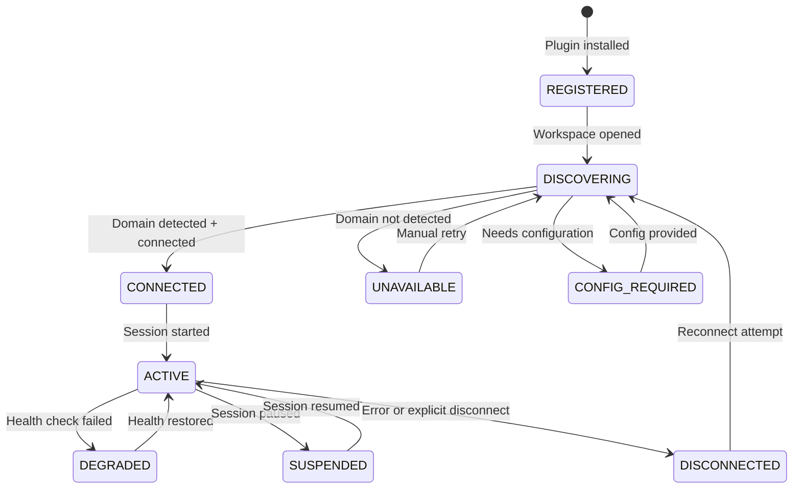
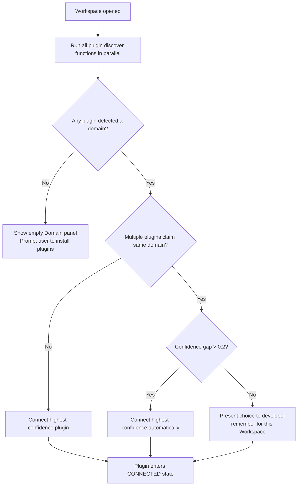
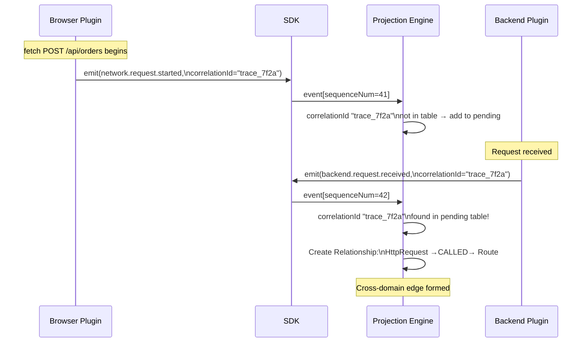
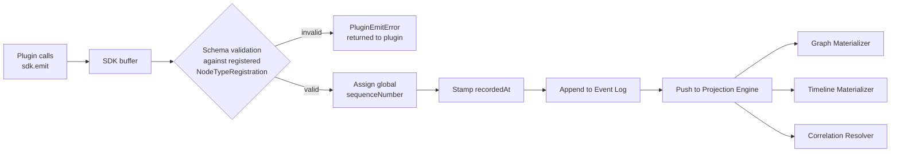

# Observer OS — Plugin System Architecture

> Every runtime Observer can observe is implemented as a plugin. The plugin system is the primary extension point of the platform.

See [RFC-0009](../rfcs/0009-plugin-sdk.md) for the full Plugin SDK specification. This document covers the architectural design of the plugin system — how plugins integrate, how they are isolated, and how they evolve.

---

## Overview

```
┌─────────────────────────────────────────────────────────────┐
│                    Observer OS Platform                      │
│                                                             │
│  Event Log ◄── Plugin SDK ◄────────────────────────────┐   │
│      │                                                  │   │
│  Projection Engine                                      │   │
│      │                                                  │   │
│  Runtime Graph (projection)                             │   │
└────────────────────────────────────────────────────────────-┘
                                                          │
              Plugin Boundary (SDK only)                  │
                                                          │
┌──────────────────┐  ┌──────────────────┐  ┌────────────┴───┐
│  Browser         │  │  PostgreSQL       │  │  Custom        │
│  Observer        │  │  Observer         │  │  Plugin        │
│                  │  │                   │  │                │
│  Browser API     │  │  pg_* views       │  │  Your Runtime  │
│  DevTools CDP    │  │  EXPLAIN output   │  │  API           │
└──────────────────┘  └──────────────────┘  └────────────────┘
```

**The fundamental rule**: Plugins produce events. The platform produces projections. A plugin never writes to the Runtime Graph.

---

## Plugin Architecture

### Domain Ownership

Each Domain has exactly one active plugin. The plugin is the authority on that Domain — it decides what events to emit, what node types exist, and which capabilities each node type supports.

```
Workspace
  │
  ├── Browser Domain ────────── Browser Observer plugin
  ├── React Domain ───────────── React Observer plugin
  ├── Node.js Domain ─────────── Node.js Observer plugin
  ├── PostgreSQL Domain ──────── PostgreSQL Observer plugin
  └── [future] Domain ─────────── [future] plugin
```

### Plugin Lifecycle State Machine



### Discovery Architecture

When a Workspace is opened, all installed plugins run their `discover()` function concurrently. Each returns a `DiscoveryResult` with a `confidence` score (0.0–1.0).



---

## Plugin Isolation

```
┌──────────────────────────────────────────────────────────────┐
│                    Observer Platform Core                     │
│                                                              │
│   Event Log   Projection Engine   Runtime Graph              │
│       ▲               │                                      │
│       │               ▼                                      │
│   [ validation & namespace enforcement ]                     │
│       ▲                                                      │
│       │  SDK boundary                                        │
├───────┼──────────────────────────────────────────────────────┤
│       │                                                      │
│  ┌────┴─────────┐         ┌──────────────────┐              │
│  │ Plugin A     │         │ Plugin B          │              │
│  │ namespace:   │         │ namespace:        │              │
│  │ "browser.*"  │   ✗     │ "postgresql.*"    │              │
│  │              │◄────────│                   │              │
│  │ Cannot read  │         │ Cannot read       │              │
│  │ Plugin B's   │         │ Plugin A's        │              │
│  │ nodes        │         │ nodes             │              │
│  └──────────────┘         └───────────────────┘              │
└──────────────────────────────────────────────────────────────┘
```

**Isolation guarantees:**

1. **Write namespace**: Events from Plugin A with a `browser.*` prefix can only create/update nodes in the `browser.*` namespace. The platform rejects events that violate namespace boundaries.

2. **Read isolation**: Plugins cannot read the Runtime Graph. They cannot see other plugins' nodes. They only see the SDK interface.

3. **Crash isolation**: If Plugin B throws an unhandled exception, the platform catches it, marks Plugin B's Domain as DEGRADED, and continues. Plugin A is unaffected.

4. **No inter-plugin communication**: Plugins do not know about each other. Cross-domain correlation happens via `correlationId` matching in the Projection Engine — not via direct plugin communication.

---

## Cross-Domain Correlation

The only mechanism for connecting Browser events to Backend events is the `correlationId` field. Each plugin independently emits its event with the same correlation ID; the Projection Engine matches them and creates the cross-domain `CORRELATED_WITH` or `CALLED` Relationship.



**No plugin needs to know about the other.** The Browser plugin doesn't import the Backend plugin. The Backend plugin doesn't know the Browser plugin exists. The correlation mechanism is entirely in the platform.

---

## Event Emission Flow



Invalid events are never silently dropped. A plugin that emits a malformed event receives a `PluginEmitError` immediately so the plugin author can diagnose and fix the instrumentation.

---

## Schema Evolution

Plugins version their metadata schemas. When a schema changes, old events in the Event Log are not deleted or modified — they are **upcasted at projection time** using the plugin-provided upcast functions.

```
Event Log: [v1 event] [v1 event] [v2 event] [v2 event]
                │           │
                ▼           ▼
          upcast(v1→v2)  upcast(v1→v2)
                │           │
                ▼           ▼
         Projection Engine processes all events as v2
```

**Schema versioning rules:**

| Change type | Version bump | Upcast required? |
|-------------|-------------|-----------------|
| Bug fix, no field change | Patch (1.0.x) | No |
| New optional field | Minor (1.x.0) | No (field defaults to absent) |
| Field rename or removal | Major (x.0.0) | Yes |
| Field type change | Major (x.0.0) | Yes |

---

## Plugin Distribution

### Package Structure

```
observer-plugin-myruntime/
├── package.json              # npm package manifest
├── observer.plugin.json      # Observer plugin manifest (required)
├── src/
│   ├── index.ts              # entry point; exports class implementing ObserverPlugin
│   ├── nodes/                # node type definitions and schemas
│   └── instrumentation/      # runtime-specific instrumentation code
├── dist/                     # compiled output
└── README.md
```

### observer.plugin.json

```json
{
  "id": "com.example.myruntime-observer",
  "name": "MyRuntime Observer",
  "version": "1.0.0",
  "sdkVersion": "^1.0.0",
  "runtimeType": "custom",
  "entryPoint": "./dist/index.js",
  "description": "Observes the MyRuntime environment",
  "homepage": "https://github.com/example/observer-plugin-myruntime"
}
```

### Naming Convention

| Plugin type | Package name format |
|-------------|-------------------|
| First-party (Observer team) | `@observer-os/plugin-browser`, `@observer-os/plugin-nodejs` |
| Third-party / community | `observer-plugin-{runtime}` |
| Enterprise / private | Internal naming, installed from private registry |

### Plugin Registry

**Open question** — whether Observer OS maintains a first-party registry or relies on npm/PyPI with naming conventions. See [RFC-0009 Open Questions](../rfcs/0009-plugin-sdk.md).

---

## First-Party Plugins

| Plugin | Domain | RFC | Status |
|--------|--------|-----|--------|
| Browser Observer | Browser (Network, Console, DOM, Exceptions, Storage, Performance) | [RFC-0010](../rfcs/0010-browser-observer.md) | Specified |
| React Observer | React Component Tree, State, Hooks | Planned | Planned |
| Node.js Observer | HTTP Server, Process, Workers, Events | Planned | Planned |
| Express Observer | Routes, Middleware, Request/Response | Planned | Planned |
| PostgreSQL Observer | Queries, Transactions, Connections | Planned | Planned |
| Redis Observer | Commands, Keyspace, Pub/Sub | Planned | Planned |
| Docker Observer | Containers, Images, Networks, Volumes | Planned | Planned |
| Terminal Observer | Processes, stdin/stdout, Exit codes | Planned | Planned |

---

## Building a Plugin

See [RFC-0009: Plugin SDK](../rfcs/0009-plugin-sdk.md) for the complete specification and TypeScript interfaces.

**Minimal steps to build a plugin:**

1. Implement `ObserverPlugin` interface
2. Implement `discover(workspace)` — return `confidence` based on auto-detection
3. Register node types at `connect()` time with schemas and capabilities
4. Instrument your runtime: on each observable event, call `sdk.emit()`
5. Implement `disconnect()` — remove all instrumentation hooks
6. Publish as `observer-plugin-{name}` npm package with `observer.plugin.json`

**Reference implementation**: [RFC-0010: Browser Observer](../rfcs/0010-browser-observer.md)

---

## References

- [RFC-0009: Plugin SDK](../rfcs/0009-plugin-sdk.md) — complete SDK specification
- [RFC-0010: Browser Observer](../rfcs/0010-browser-observer.md) — reference implementation
- [RFC-0006: Projection Engine](../rfcs/0006-projection-engine.md) — how events become graph projections
- [RFC-0003: Runtime Object Model](../rfcs/0003-runtime-object-model.md) — node types and schemas
