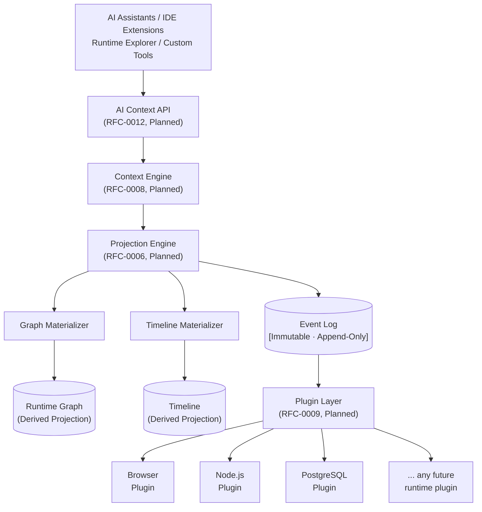
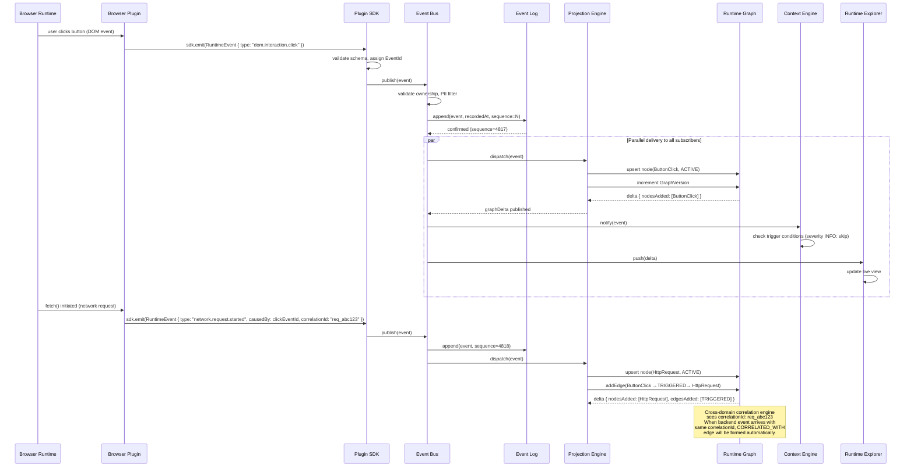
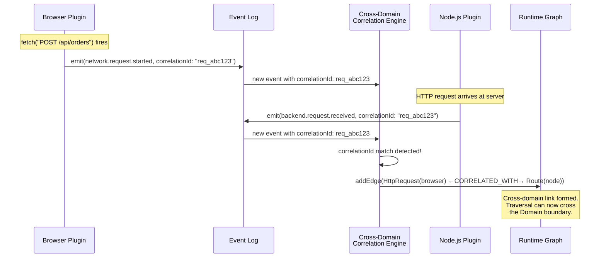
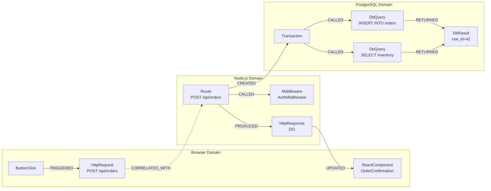
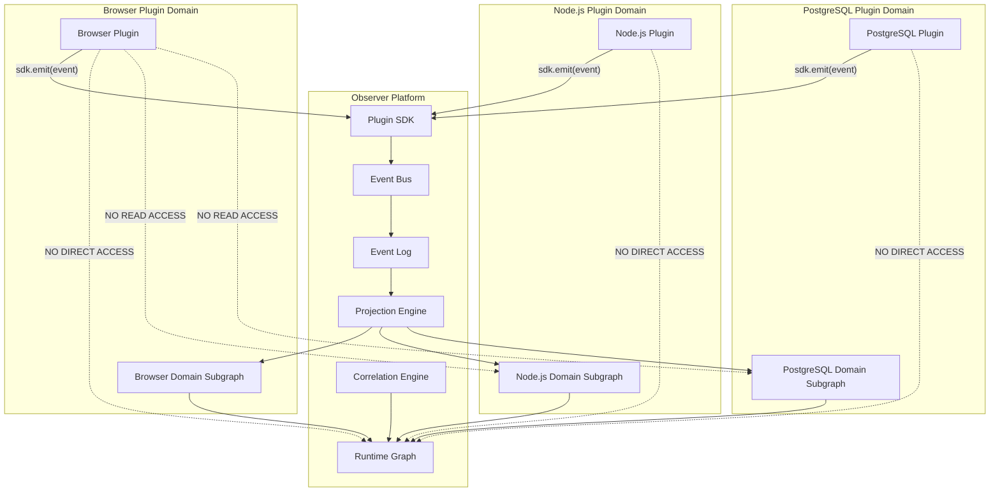
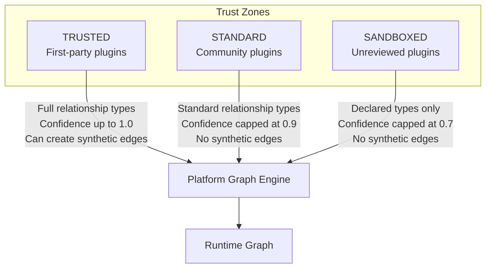

# Observer OS: Runtime Architecture

| Field    | Value                                        |
|----------|----------------------------------------------|
| Document | Runtime Architecture                         |
| Version  | 0.1                                          |
| Status   | Canonical                                    |
| Authors  | Founding Team                                |
| RFC Basis | RFC-0000, RFC-0003, RFC-0004, RFC-0005, Architecture Review 001 |

---

## Table of Contents

1. [System Overview](#1-system-overview)
2. [Architectural Philosophy](#2-architectural-philosophy)
3. [Core Data Flow](#3-core-data-flow)
4. [Component Descriptions](#4-component-descriptions)
5. [Data Model Summary](#5-data-model-summary)
6. [Cross-Domain Architecture](#6-cross-domain-architecture)
7. [Plugin Architecture](#7-plugin-architecture)
8. [Session Architecture](#8-session-architecture)
9. [Local-First Architecture](#9-local-first-architecture)
10. [API Surface](#10-api-surface)
11. [Security Model](#11-security-model)
12. [Performance Characteristics](#12-performance-characteristics)

---

## 1. System Overview

### What Observer OS Is

Observer OS is a **local-first, AI-agnostic Runtime Intelligence Platform**. It instruments running software — browsers, backends, databases, containers, and any other runtime — normalizes everything into a unified data model, and exposes structured runtime intelligence through stable APIs.

The core belief: **running software should be understandable by both humans and machines.**

Today, understanding what running software is doing requires a developer to manually collect fragments from browser DevTools, server logs, database explorers, and terminal output, then mentally assemble them into a picture of what happened. Observer makes this assembly automatic, structured, and queryable by both developer tools and AI agents.

### What Observer OS Is Not

| Observer is NOT | Reason |
|-----------------|--------|
| An AI model | Observer is infrastructure *consumed* by AI, not AI itself. |
| An IDE | IDEs are consumers of Observer, not its boundary. |
| A debugger | Debuggers require interactive attachment. Observer is passive instrumentation. |
| A production observability platform | Production monitoring (Datadog, Grafana) answers "is the system healthy?" Observer answers "what is this system doing and why?" |
| A logging platform | Logs are one fragmented view into runtime. Observer models the runtime itself. |
| A browser or runtime | Browsers execute software. Observer observes the software being executed. |

Observer intentionally solves one problem: **making running software understandable**.

### Where Observer Sits in the Developer Toolchain

Observer occupies a distinct layer between the development environment and production observability:

```
┌─────────────────────────────────────────────────────────────────┐
│  AI Assistants · IDE Extensions · Runtime Explorer · Scripts    │
│                     (Observer Consumers)                        │
└────────────────────────────┬────────────────────────────────────┘
                             │  structured runtime queries
                             ▼
┌────────────────────────────────────────────────────────────────┐
│                                                                │
│                        OBSERVER OS                            │
│                  Runtime Intelligence Layer                   │
│                                                                │
│     Normalizes all runtime environments into one model        │
│     Exposes structured queries and context packages           │
│                                                                │
└──┬──────────┬──────────┬──────────┬──────────┬───────────────┘
   │          │          │          │          │
   ▼          ▼          ▼          ▼          ▼
Browser    React     Node.js    Docker    PostgreSQL
DevTools   DevTools  Process    Daemon    pg_stat
```

Each tool below Observer continues to serve its existing purpose. Observer adds a unified Runtime Intelligence layer above them — a single model, a single query interface, a single context format.

### The Two Worlds

Software development operates across two worlds:

```
┌─────────────────────────────────────────────────────────────────┐
│                        STATIC WORLD                             │
│                                                                 │
│   Source code · Files · Functions · Classes · Interfaces       │
│   Repositories · Commits · Types · Documentation               │
│                                                                 │
│   State of tooling: ████████████████████████  EXCELLENT        │
│   AI understanding: ████████████████████████  EXCELLENT        │
└─────────────────────────────────────────────────────────────────┘

┌─────────────────────────────────────────────────────────────────┐
│                       RUNTIME WORLD                             │
│                                                                 │
│   Browser state · Network requests · Console messages          │
│   Backend requests · Database queries · React state            │
│   Terminal processes · Containers · Caches · Workers           │
│                                                                 │
│   State of tooling: ████░░░░░░░░░░░░░░░░░░░░  FRAGMENTED       │
│   AI understanding: █░░░░░░░░░░░░░░░░░░░░░░░  MINIMAL          │
└─────────────────────────────────────────────────────────────────┘
```

Observer owns the runtime world. The static world belongs to IDEs, version control systems, and AI coding assistants. Observer does not compete in the static world; it integrates with it by exposing runtime context through the same developer tooling that works with static code.

---

## 2. Architectural Philosophy

### Event-Sourced Design

**Architecture Review 001 established**: Runtime Events are the immutable source of truth. The Runtime Graph, Timeline, and all other derived views are projections built from events.

This is the event-sourcing pattern applied to the runtime observation domain, the same design used by systems like Apache Kafka, PostgreSQL WAL, and Datomic.

**Why event sourcing for Observer?**

| Property | Benefit in Observer |
|----------|---------------------|
| **Immutable log** | Sessions are replayable. A developer can give a colleague their exact event sequence and the colleague sees the identical graph. |
| **Derived views** | The Runtime Graph, Timeline, and Context packages are all projections of the same event log. No synchronization is needed between them. |
| **Time travel** | The graph state at any historical moment is reconstructable by replaying events to that timestamp. |
| **Correctness** | Every graph mutation has a corresponding event. There are no unexplained state changes. |
| **AI consumption** | An AI agent given a session's event sequence has the complete, lossless ground truth with no interpretive gaps. |

The alternative (Architecture A: graph as source of truth) was evaluated and rejected because it makes replay, time travel, and historical queries all significantly harder.

### Why Graph, Not Tree or Stream

#### Not a Tree

Trees are the natural first instinct for software structure — component trees, call stacks, directory trees. But the runtime is not a tree.

Consider: a single database query can be called by two different route handlers. A React component can be updated by two different network responses. An HTTP response can trigger three downstream state changes. The moment a node has two parents, a tree breaks.

```
                  RouteHandler A ──CALLED──┐
                                           ▼
                                    DatabaseQuery   ← two parents
                  RouteHandler B ──CALLED──┘         not a tree
```

A tree model requires either duplicating nodes (breaking stable identity) or dropping edges (losing causality). Both destroy understanding. The Runtime Graph is a **directed multigraph**.

#### Not a Flat Stream

Event streams are the foundation of modern observability. They are simple and universal. But:

- Streams do not model relationships. That event B followed event A does not tell you A *caused* B.
- Streams do not model current state. A consumer must replay the full stream to know what state anything is in.
- Answering "why did this fail?" against a flat stream requires reconstructing the structure that the stream discarded — which produces, precisely, a graph.

Streams are the **input** to Observer (the Event Log). The graph is the **output** (the Runtime Graph). These are complementary: Observer is event-sourced, and the graph is the materialized view.

#### Why Graph

The graph is the correct model because:

1. **It accurately models reality.** Causality, shared dependencies, cycles, cross-domain links — all exist in production applications and all fit the graph without distortion.
2. **Relationships carry the explanation.** `HttpRequest → CALLED → DatabaseQuery` is an explanation. Nodes without typed edges are isolated facts.
3. **Graph traversal is the natural query model.** "Why did this fail?" is a backward traversal. "What did this change affect?" is a forward traversal. These are graph operations.
4. **It subsumes the alternatives.** A Timeline is a time-ordered projection of the graph. A trace is a path subgraph. A component tree is a `RENDERED`-edge subgraph. The graph is the general case.

### Local-First Implications

All core Observer functionality runs on the developer's machine. No cloud dependency is on the critical path.

**Rationale**:
1. **Privacy**: Runtime data contains API keys, user data, SQL queries, and business logic. It should not leave the developer's machine by default.
2. **Latency**: A developer debugging a local application should not wait for a cloud round trip to query their own runtime.
3. **Reliability**: Development tools must work offline and in air-gapped environments.

Cloud functionality — session sharing, remote AI agent access — is always opt-in. The platform's security model (Section 11) builds directly on this guarantee.

### Plugin-First Design

Observer has no built-in knowledge of any specific runtime. It knows how to receive, validate, sequence, and project events. Plugins provide domain knowledge.

**Plugin contract (strict)**:
- A plugin **emits events only**. It never writes to the Runtime Graph directly.
- A plugin owns its Domain. It cannot read or write nodes in another plugin's Domain.
- A plugin declares its node types, event types, and capabilities at connection time.

This design means Observer can support any runtime — today's and tomorrow's — without changing its core. Adding PostgreSQL support means writing a PostgreSQL plugin. Adding Kubernetes support means writing a Kubernetes plugin. The platform is unchanged.

---

## 3. Core Data Flow

### Step-by-Step Flow

```
1. Runtime event occurs (e.g., user clicks a button)
2. Domain Plugin instruments the runtime and detects the change
3. Plugin calls sdk.emit(RuntimeEvent) via the Plugin SDK
4. Plugin SDK validates the event structure and assigns EventId
5. Event is delivered to the Observer Event Bus
6. Platform validates: schema check, domain ownership, PII filter
7. Platform assigns recordedAt timestamp and sequence number
8. Event is appended to the immutable Event Log
9. Projection Engine receives the event from the Event Bus
10. Graph Materializer applies the event: upsert node, add edges
11. Runtime Graph is updated (GraphVersion incremented)
12. Timeline Materializer inserts the event into the session timeline
13. Graph delta notification is published to all subscribers
14. Context Engine checks if the event triggers context assembly
15. Runtime Explorer receives delta and updates its live view
16. AI Context API consumers receive the delta if subscribed
```

### Full System Architecture



**Key constraint**: The Projection Engine is the **only writer** to the Runtime Graph. No other component — not the Context Engine, not the Runtime Explorer, not plugins — writes to the graph directly. All graph mutations flow through events.

### Data Flow Sequence Diagram

The following traces a single HTTP request from browser click to graph update and consumer notification:



---

## 4. Component Descriptions

### Plugin Layer

| Property | Detail |
|----------|--------|
| **What it does** | Instruments a specific runtime environment (browser, Node.js process, PostgreSQL instance, Docker daemon, etc.). Detects state changes and emits typed RuntimeEvents. |
| **What it owns** | Its Domain's nodes. The plugin is the sole authority on events within its Domain. |
| **What it consumes** | Direct access to the instrumented runtime (browser APIs, `async_hooks`, `pg_stat`, Docker Engine API). Plugin SDK for event emission. |
| **What it produces** | RuntimeEvents delivered to the Event Log via the Plugin SDK. |
| **Key constraint** | A plugin emits events only. It never reads from or writes to the Runtime Graph. It cannot access nodes in another plugin's Domain. |

**Plugin lifecycle**:

```
REGISTERED → DISCOVERING → CONNECTED → ACTIVE → DISCONNECTED
                 ↓
            UNAVAILABLE (if domain not detected)
```

### Event Log

| Property | Detail |
|----------|--------|
| **What it does** | Receives, validates, and permanently stores RuntimeEvents in append-only sequence order. |
| **What it owns** | The immutable, authoritative record of everything that happened in a Session. |
| **What it consumes** | Validated RuntimeEvents from the Event Bus. |
| **What it produces** | An ordered, sequenced, immutable event stream that the Projection Engine processes. Also the source for Session replay. |
| **Key constraint** | Immutable. Once an event is recorded, no field may be modified. Corrections are new events, not edits. |

The Event Log assigns two authoritative values at record time:
- `recordedAt`: the Observer-side timestamp of receipt
- `sequence`: a monotonically increasing integer, globally ordered within an Observer instance

These are set by the platform, never by plugins.

### Projection Engine

| Property | Detail |
|----------|--------|
| **What it does** | Processes the event stream from the Event Log and maintains all derived views: the Runtime Graph, the Timeline, and any future projections. It is the only component that writes to the Runtime Graph. |
| **What it owns** | The logic for translating events into graph mutations and timeline entries. |
| **What it consumes** | RuntimeEvents from the Event Log, in sequence order. |
| **What it produces** | Incremental GraphDelta notifications. Updated Runtime Graph state. Updated Timeline state. |
| **Key constraint** | The Projection Engine is the single writer to the Runtime Graph. This is an absolute invariant. |

The Projection Engine operates in two modes:

| Mode | When Used | Mechanism |
|------|-----------|-----------|
| **Live (Push)** | Active Session | Events are pushed incrementally as they arrive. Graph updates are applied within 1ms of event receipt. |
| **Replay (Pull)** | Session replay, graph reconstruction | Events are pulled from the Event Log in sequence order. Graph is rebuilt deterministically. |

This hybrid push+pull model means the same Projection Engine handles both live observation and historical reconstruction without separate code paths.

### Runtime Graph

| Property | Detail |
|----------|--------|
| **What it does** | The materialized, traversable, queryable view of the current runtime state. A directed, typed multigraph of RuntimeNodes and Relationships. |
| **What it owns** | Current node state, all relationships (active and invalidated), domain subgraphs, connected components, temporal index, cross-domain index. |
| **What it consumes** | GraphDelta events from the Projection Engine. |
| **What it produces** | Query results (nodes, relationships, subgraphs, paths). Graph delta notifications to subscribers. Snapshots for Session persistence. |
| **Key constraint** | The Runtime Graph is a **projection**. It is derived from the Event Log. If lost, it can be reconstructed from events. It is never the source of truth for any data. |

The Runtime Graph maintains several indexes for efficient access:

| Index | Purpose | Complexity |
|-------|---------|------------|
| `nodes` (by NodeId) | O(1) node lookup | O(1) |
| `edges.bySource` | Find all edges from a node | O(1) |
| `edges.byTarget` | Find all edges pointing to a node | O(1) |
| `edges.byType` | Find edges of a specific relationship type | O(1) |
| `temporalIndex` | Map timestamps to graph versions | O(log N) |
| `crossDomainIndex` | Find cross-domain peers by correlationId | O(1) |
| `subgraphs` (by DomainId) | Access all nodes in a Domain | O(1) |
| `components` | Connected component membership | O(α(N)) via union-find |

### Session Engine

| Property | Detail |
|----------|--------|
| **What it does** | Creates, manages, and archives Sessions. A Session is a bounded slice of the Event Log representing one investigation. The Session Engine owns the lifecycle of that boundary. |
| **What it owns** | Session metadata (start time, end time, name, workspace). The session-scoped slice of the Event Log. Session snapshots. |
| **What it consumes** | Developer or automation signals to start/end sessions. Events from the Event Log (to archive). |
| **What it produces** | Active session context for all other components. Archived session packages (event log slice + graph snapshot). |
| **Key constraint** | Multiple sessions may be active concurrently. Events from one session are never mixed into another session's event log. |

### Context Engine

| Property | Detail |
|----------|--------|
| **What it does** | Assembles focused, relevant subgraphs in response to queries or trigger events. Answers "what is the relevant context around this error?" or "what happened during this request?" |
| **What it owns** | Context assembly strategies. Relevance scoring rules. Trigger conditions (e.g., `severity: ERROR` automatically triggers context assembly). |
| **What it consumes** | Runtime Graph (via traversal API). Event streams (for trigger detection). Queries from AI Context API consumers. |
| **What it produces** | Context Packages: structured, scored, size-bounded subgraphs containing the relevant nodes, relationships, and events for a specific question. |
| **Key constraint** | The Context Engine reads from the Runtime Graph. It never writes to the Runtime Graph except when creating `EXPLAINS` edges as a result of analysis (these are marked `origin: PLATFORM_INFERRED`). |

The Context Engine uses a multi-strategy traversal when assembling a Context Package:
1. Causal traversal backward from the anchor node to find contributing causes
2. Impact traversal forward to find affected nodes
3. `CORRELATED_WITH` expansion to include cross-domain peers
4. `EXPLAINS` edge traversal to include contextually relevant nodes
5. Scoring each discovered node by relevance distance, relationship type weight, and node status
6. Pruning to a configurable size budget

### Runtime Explorer

| Property | Detail |
|----------|--------|
| **What it does** | The developer-facing UI. Renders the Runtime Graph, Timeline, and Context packages as a navigable, filterable, real-time interface. |
| **What it owns** | Rendering logic and UI state. Saved queries (Bookmarks). Focus mode configuration. |
| **What it consumes** | Runtime Graph (read-only). Graph delta notifications (for live updates). Context packages from the Context Engine. |
| **What it produces** | Visual exploration of the runtime. Developer annotations. Focus mode context requests. |
| **Key constraint** | Read-only consumer of the Runtime Graph. The Runtime Explorer never writes to the graph. |
| **RFC** | RFC-0011 (Planned) |

### AI Context API

| Property | Detail |
|----------|--------|
| **What it does** | The external API through which AI assistants, IDE extensions, and automated tools consume runtime intelligence. Provides structured, queryable access to runtime context. |
| **What it owns** | The API contract for AI consumers. Authentication and authorization for external access. Response format (structured Context Packages). |
| **What it consumes** | Context Engine (for context assembly). Runtime Graph (for direct node queries). Event streams (for live subscriptions). |
| **What it produces** | Structured Context Packages consumable by any AI model. Live event subscriptions. Graph traversal results. Session data. |
| **Key constraint** | AI-agnostic. The API is not designed for any specific AI model or provider. |
| **RFC** | RFC-0012 (Planned) |

---

## 5. Data Model Summary

### RuntimeEvent

The atomic, immutable unit of change in Observer. Every observation is a RuntimeEvent.

| Field | Type | Required | Description |
|-------|------|----------|-------------|
| `id` | `EventId` | Yes | Globally unique, immutable. Format: `evt_{workspace}_{domain}_{ulid}` |
| `type` | `EventType` | Yes | Hierarchical namespaced type: `observer/network/request.started` |
| `domain` | `DomainId` | Yes | The Domain plugin that emitted this event |
| `sourceNode` | `NodeId` | Yes | The RuntimeNode that originated the event (the actor) |
| `affectedNodes` | `NodeId[]` | Yes | RuntimeNodes whose state changed (the subjects); min 1 |
| `occurredAt` | `Timestamp` | Yes | When the change occurred (runtime clock). Used for Timeline ordering. |
| `recordedAt` | `Timestamp` | Yes | When Observer received and recorded the event (Observer clock). Set by platform. |
| `sequence` | `Int64` | Yes | Monotonically increasing, assigned at record time. Total order within an Observer instance. |
| `payload` | `EventPayload` | Yes | Structured evidence of the change. Typed by `type`, versioned by `payload.schemaVersion`. |
| `causedBy` | `EventId?` | No | The direct causal predecessor event. Null for user-initiated root events. |
| `correlationId` | `CorrelationId?` | No | Shared identifier linking events across Domain boundaries (e.g., HTTP request trace ID). |
| `session` | `SessionId` | Yes | The Session within which this event was recorded. |
| `workspace` | `WorkspaceId` | Yes | The Workspace this event belongs to. |
| `severity` | `Severity` | Yes | `DEBUG / INFO / WARN / ERROR / FATAL`. Enables pre-payload filtering. |
| `visibility` | `Visibility` | Yes | `LOCAL / SESSION / WORKSPACE`. Controls data sharing scope. |

**Concrete example** (network request started, browser side):
```json
{
  "id": "evt_ws1_browser_01HN2VB3PQRS4T6V",
  "type": { "namespace": "observer", "domain": "network", "category": "request", "action": "started", "version": "1.2" },
  "domain": "browser",
  "sourceNode": "ws1_browser_httpreq_7f2a91b3",
  "affectedNodes": ["ws1_browser_httpreq_7f2a91b3"],
  "occurredAt": "2024-11-15T14:23:01.112000Z",
  "recordedAt": "2024-11-15T14:23:01.115218Z",
  "sequence": 4818,
  "payload": {
    "schemaVersion": "1.2",
    "data": {
      "method": "POST",
      "url": "/api/orders",
      "requestHeaders": { "Authorization": "[REDACTED]", "X-Request-Id": "req_abc123" },
      "requestBody": { "productId": "prod_42", "quantity": 1 }
    }
  },
  "causedBy": "evt_ws1_browser_01HN2VB3PQRS4T5U",
  "correlationId": { "value": "req_abc123", "scope": "REQUEST" },
  "session": "sess_ws1_01HN2V",
  "workspace": "ws1_ecommerce",
  "severity": "INFO",
  "visibility": "SESSION"
}
```

### RuntimeNode

The fundamental observable entity in the Runtime Graph. Every runtime artifact is a RuntimeNode.

| Field | Type | Description |
|-------|------|-------------|
| `id` | `NodeId` | Stable, globally unique within the Workspace. Format: `{workspace}_{domain}_{type}_{suffix}` |
| `type` | `NodeType` | Namespaced and versioned: `observer.react/Component` |
| `domain` | `DomainId` | The Domain that owns this node |
| `status` | `NodeStatus` | Current lifecycle state (see below) |
| `createdAt` | `Timestamp` | When this node first appeared in the Event Log |
| `updatedAt` | `Timestamp` | When this node's state was last updated |
| `completedAt` | `Timestamp?` | When this node's operation completed; null if still active |
| `metadata` | `Map<String, Any>` | Plugin-owned structured data. Opaque to the core model; versioned by `metadata.schemaVersion`. |
| `capabilities` | `Capability[]` | Operations available on this node (WATCH, SNAPSHOT, DIFF, EXPAND, INSPECT, REPLAY, TIMELINE, SEARCH, RECORD) |
| `relationships` | `Relationship[]` | Current valid edges to/from this node |
| `visibility` | `Visibility` | Access scope |

**Node lifecycle states**:

| State | Meaning |
|-------|---------|
| `DISCOVERED` | Plugin detected the node. May not yet be active. |
| `ACTIVE` | Node is operating: request in-flight, component mounted, query executing. |
| `COMPLETED` | Node completed successfully. |
| `FAILED` | Node terminated in an error state. |
| `DESTROYED` | Node no longer exists in the runtime (component unmounted, connection closed). |
| `ARCHIVED` | Session ended. Node retained for historical queries. |

State machine:

```
[*] → DISCOVERED → ACTIVE → COMPLETED → ARCHIVED → [*]
                 ↓
              FAILED → ARCHIVED
                 ↓
            DESTROYED → ARCHIVED
```

### Relationship

A typed, directional, first-class edge in the Runtime Graph. Relationships carry the semantic explanation of why things are connected.

| Field | Type | Description |
|-------|------|-------------|
| `id` | `RelationshipId` | Stable, globally unique |
| `type` | `RelationshipType` | The semantic type of the connection (see table below) |
| `source` | `NodeId` | Origin of the directed edge |
| `target` | `NodeId` | Destination of the directed edge |
| `createdAt` | `Timestamp` | When this relationship was first recorded |
| `invalidatedAt` | `Timestamp?` | When this relationship was superseded; null means currently valid |
| `strength` | `RelationshipStrength` | `DEFINITIVE` / `INFERRED` / `SYNTHETIC` |
| `confidence` | `Float [0.0–1.0]` | Certainty degree; 1.0 for directly observed |
| `origin` | `RelationshipOrigin` | `PLUGIN_DIRECT` / `PLATFORM_CORRELATED` / `PLATFORM_INFERRED` / `AI_SUGGESTED` |

**Standard Relationship types**:

| Type | Direction | Example |
|------|-----------|---------|
| `TRIGGERED` | cause → effect | `ButtonClick → TRIGGERED → HttpRequest` |
| `CALLED` | caller → callee | `Route → CALLED → DatabaseQuery` |
| `RETURNED` | producer → result | `DatabaseQuery → RETURNED → DbResult` |
| `FAILED` | cause → affected | `SMTPCommand → FAILED → EmailJob` |
| `UPDATED` | modifier → modified | `HttpResponse → UPDATED → ReactComponent` |
| `RENDERED` | renderer → output | `ReactComponent → RENDERED → DomNode` |
| `CREATED` | creator → created | `Factory → CREATED → WorkerProcess` |
| `DESTROYED` | destroyer → destroyed | `GC → DESTROYED → CacheEntry` |
| `DEPENDS_ON` | dependent → dependency | `Service → DEPENDS_ON → DatabaseConnection` |
| `USES` | reader → resource | `Component → USES → Context` |
| `OBSERVES` | observer → subject | `ReactPlugin → OBSERVES → ReactComponent` |
| `PRODUCED` | emitter → artifact | `KafkaProducer → PRODUCED → KafkaMessage` |
| `CONSUMED` | artifact → consumer | `KafkaMessage → CONSUMED → KafkaConsumer` |
| `CORRELATED_WITH` | peer ↔ peer | `BrowserHttpRequest ↔ CORRELATED_WITH ↔ BackendRoute` |
| `EXPLAINS` | explanation → subject | `Exception → EXPLAINS → FailedRequest` |

### Session

A bounded investigation unit. A Session is a scoped slice of the Event Log with its own graph projection.

| Field | Description |
|-------|-------------|
| `id` | Stable identifier within the Workspace |
| `workspaceId` | The Workspace this Session belongs to |
| `name` | Human-readable name (e.g., "Debug checkout flow") |
| `status` | `ACTIVE / PAUSED / CLOSED / ARCHIVED` |
| `startedAt` | When the Session was opened |
| `endedAt` | When the Session was closed (null if still active) |
| `eventLog` | The session-scoped, ordered slice of the global Event Log |
| `graph` | The materialized RuntimeGraph projection for this Session |
| `snapshots` | Point-in-time graph snapshots taken during or at the end of the session |
| `metadata` | Developer-annotated notes, tags, description |

### Context Package

A structured, AI-consumable assembly of relevant runtime information around a specific question or anchor event.

| Field | Description |
|-------|-------------|
| `id` | Unique identifier for this context package |
| `sessionId` | Session this context was assembled from |
| `anchor` | The event or node that triggered or anchors this context |
| `question` | The question this context answers (optional; from AI Consumer) |
| `subgraph` | The scored, pruned subgraph of most relevant nodes and edges |
| `nodes` | Ordered list of nodes by relevance score |
| `relationships` | All edges within the subgraph, including dangling stubs |
| `events` | The causal event sequence leading to the anchor |
| `strategy` | Which traversal strategy was used to assemble this package |
| `tokenEstimate` | Estimated LLM token cost of this package (for budget-aware consumers) |
| `assembledAt` | When this package was assembled |

---

## 6. Cross-Domain Architecture

### The Problem

Each Domain plugin observes a slice of the runtime independently. The Browser plugin creates an `HttpRequest` node when a `fetch()` call fires. The Node.js plugin creates a `Route` node when the HTTP request arrives at the server. Neither plugin knows about the other's node. Neither can create the edge that connects them.

The platform is responsible for detecting that these two nodes represent two perspectives on the same logical operation and forming the `CORRELATED_WITH` relationship between them.

### Correlation Mechanism



### Correlation Strategies

| Strategy | Mechanism | Strength | Confidence |
|----------|-----------|----------|------------|
| **Trace ID propagation** | Browser plugin injects `X-Observer-Trace-Id` header. Backend plugin reads it. Platform matches. | `DEFINITIVE` | 1.0 |
| **Request fingerprint matching** | Platform correlates by `(url, method, timestamp, payload-hash)` when no trace ID is available. | `INFERRED` | 0.85 |
| **Plugin-declared correlation** | A plugin explicitly emits a correlation event naming both nodes. | `DEFINITIVE` (trusted plugin) or `INFERRED` | Variable |
| **W3C Trace-Context** | For distributed systems, the `traceparent` header carries the correlation ID. | `DEFINITIVE` | 1.0 |

### Cross-Domain Edge Formation in the Runtime Graph

Once two events share a `correlationId`, the Cross-Domain Correlation Engine (a sub-component of the Projection Engine) forms a `CORRELATED_WITH` edge between the corresponding nodes. This edge:

- Is created by the **platform**, not by any plugin
- Has `origin: PLATFORM_CORRELATED`
- Appears in the `CrossDomainIndex` for efficient traversal
- Enables graph traversal to move across Domain boundaries seamlessly

### Complete Cross-Domain Request Path



Dashed edges (`CORRELATED_WITH`) cross Domain boundaries and are formed by the platform's correlation engine. Solid edges are formed by individual Domain plugins based on events they emit.

---

## 7. Plugin Architecture

### Plugin Contract

The plugin contract is strict and minimal:

1. **Emit events only.** A plugin calls `sdk.emit(RuntimeEvent)`. That is its entire write interface.
2. **Own your Domain.** A plugin's events may only reference nodes in its own Domain as `sourceNode`.
3. **Declare upfront.** At connection time, a plugin declares all node types, event types, metadata schemas, and capabilities it will produce. Events referencing undeclared types are rejected.
4. **Never write to the graph.** The Projection Engine is the only graph writer. Plugins that attempt to access or modify the graph directly are rejected.
5. **Redact sensitive data.** Plugins are responsible for redacting known-sensitive payload fields (credentials, PII, secrets) before emission. The platform applies a second-pass PII filter as a safety net.

### Plugin Isolation Diagram



**Key isolation invariants**:
- A plugin cannot read events from another Domain's stream
- A plugin cannot reference another Domain's nodes as `sourceNode`
- Cross-domain relationships are formed by the platform, not by plugins
- A plugin cannot access the Runtime Graph directly (neither read nor write)

### Plugin Registration and Discovery

```
Plugin Installation
       │
       ▼
Plugin declares Domain manifest:
  - nodeTypes[]  (schema + capabilities per type)
  - eventTypes[] (payload schema + ownership)
  - trustLevel   (TRUSTED / STANDARD / SANDBOXED)
       │
       ▼
Platform validates manifest
       │
       ├── ACCEPTED → Plugin enters REGISTERED state
       │
       └── REJECTED → Error returned (type conflicts, invalid schemas)
            │
            ▼
       DISCOVERING → Plugin scans for its runtime environment
            │
            ├── Found → CONNECTED → ACTIVE (when Session starts)
            │
            └── Not found → UNAVAILABLE (may retry on trigger)
```

**Discovery principle**: Plugins should detect their target environment automatically. A React plugin should find React Fiber internals without requiring the developer to configure anything. Explicit configuration overrides discovery but is never required for standard environments.

### Plugin Trust Levels

| Trust Level | Assigned To | Constraints |
|-------------|-------------|-------------|
| `TRUSTED` | First-party Observer plugins | All standard relationship types; can create synthetic relationships; confidence up to 1.0 |
| `STANDARD` | Third-party community plugins | All standard relationship types; no synthetic relationships; confidence capped at 0.9 |
| `SANDBOXED` | Unreviewed or experimental plugins | Only types declared at registration; no synthetic relationships; confidence capped at 0.7 |

---

## 8. Session Architecture

### Session as Bounded Slice

A Session is a bounded investigation unit. It is the primary unit of analysis in Observer.

```
Global Event Log (all time, all sessions):
────────────────────────────────────────────────────────────────────
 evt_001  evt_002  evt_003  evt_004  evt_005  evt_006  evt_007 ...
────────────────────────────────────────────────────────────────────
          │                                    │
          └────────────────────────────────────┘
                    Session "Debug checkout bug"
                    (bounded slice of the log)
```

Every event carries a `sessionId`. The Event Log is global and continuous; the Session defines the logical boundary for a specific investigation. The Session Engine maintains this boundary.

### Session Lifecycle

```
ACTIVE   ──── developer pauses ────►  PAUSED
   │                                    │
   │         developer resumes ◄────────┘
   │
   └── developer closes ──► CLOSING
                                │
                                ▼
                          Graph snapshot taken
                                │
                                ▼
                         Event log archived
                                │
                                ▼
                            ARCHIVED
```

| Phase | What Happens |
|-------|-------------|
| **Open** | New session started. Events begin routing to this session's log slice. Projection Engine creates a fresh graph for this session. |
| **Active** | Events flow in real time. Graph updates are pushed live to all subscribers. |
| **Paused** | Events continue to be recorded but live push to UI is suspended. |
| **Closing** | Developer signals end of investigation. Platform takes a final graph snapshot. |
| **Archived** | Session is sealed. Event log slice is immutable. Graph snapshot is persisted. Session is available for replay and sharing. |

### Multiple Concurrent Sessions

Multiple sessions may be active simultaneously. Common use cases:

- Developer has a "baseline" session recording normal traffic while investigating a bug in a "debug" session
- Automated test run starts a session; developer opens a manual investigation session on the same workspace
- Two developers each have their own session open against the same local application

Each session maintains its own isolated event log slice and its own graph projection. Events are tagged with `sessionId` at emission time; the Session Engine routes them correctly.

**Graph isolation**: Session graphs do not share state. A node created in Session A does not appear in Session B's graph, even if the same runtime object was observed in both. Each session maintains a complete, independent graph projection of its own event slice.

---

## 9. Local-First Architecture

### What Runs Locally

All core Observer functionality runs on the developer's machine:

| Component | Local | Cloud Optional |
|-----------|-------|---------------|
| Plugin instrumentation | Yes | — |
| Event Log | Yes | — |
| Event Bus | Yes | — |
| Projection Engine | Yes | — |
| Runtime Graph | Yes | — |
| Timeline Engine | Yes | — |
| Context Engine | Yes | — |
| Session Engine | Yes | — |
| Runtime Explorer UI | Yes | — |
| Plugin Event API | Yes | — |
| Runtime Query API | Yes | — |
| AI Context API (local AI) | Yes | — |
| Session sharing | — | Yes (opt-in) |
| Remote AI agent access | — | Yes (opt-in) |
| Team collaboration | — | Yes (opt-in) |

### Data Ownership Guarantees

1. **Runtime data never leaves the machine by default.** No event, node, or context package is transmitted to any external service unless the developer explicitly initiates sharing.
2. **Cloud functionality is strictly opt-in.** The platform has no background sync, no telemetry upload, and no cloud dependency on the critical path.
3. **Shared data is scoped and consented.** When a developer shares a Session, they explicitly choose what to share (which Session, with whom, for how long). The sharing uses the Session's `visibility` field to filter out `LOCAL`-scoped nodes and events.
4. **Sensitive data stays local.** Nodes and events with `visibility: LOCAL` are never transmitted in any cloud sync or sharing operation.

### What Is Optional in Cloud

Cloud features are designed as first-class extensions, not afterthoughts:

| Cloud Feature | Mechanism |
|---------------|-----------|
| **Session sharing** | Developer exports a Session's event log slice (filtered to `visibility: SESSION`) and shares a URL. Recipient can replay it locally. |
| **Remote AI agent access** | AI agent is granted time-limited, permission-scoped access to a specific Session via a token. Agent accesses only `visibility: SESSION` data. |
| **Team session library** | Archived sessions may be uploaded to a team-shared storage for asynchronous review. |

---

## 10. API Surface

Observer exposes three external APIs. Internal components communicate via the Event Bus; these APIs are the stable external surface.

### Plugin Event API

| Property | Detail |
|----------|--------|
| **Purpose** | The interface through which Domain plugins emit RuntimeEvents to Observer. |
| **Who uses it** | All Domain plugins (Browser, Node.js, PostgreSQL, Docker, custom). |
| **Protocol** | Local IPC (initial). Designed for future extension to network transport for remote runtimes. |
| **Primary operations** | `connect(manifest)`, `emit(event)`, `disconnect()` |
| **Key constraint** | Write-only from plugin perspective. Plugins cannot query back through this API. |

### Runtime Query API

| Property | Detail |
|----------|--------|
| **Purpose** | The interface through which local consumers (Runtime Explorer, custom scripts, developer tooling) query the Runtime Graph. |
| **Who uses it** | Runtime Explorer UI. Developer scripts. IDE extensions. Local AI tools. |
| **Protocol** | Local IPC or HTTP (local). |
| **Primary operations** | `queryNodes(GraphQuery)`, `traverse(TraversalOptions)`, `subscribe(filter, handler)`, `getSession(id)`, `getNode(id)`, `getPath(nodeA, nodeB)` |
| **Key constraint** | Read-only. Consumers cannot write to the graph through this API. |

### AI Context API

| Property | Detail |
|----------|--------|
| **Purpose** | The interface through which AI assistants, IDE AI extensions, and automated agents consume structured Runtime Intelligence. |
| **Who uses it** | AI coding assistants. Automated test frameworks. CI pipelines with AI analysis. Remote AI agents (with token-scoped access). |
| **Protocol** | HTTP (supports both local and remote access via token). |
| **Primary operations** | `getContext(anchor, question)`, `subscribeToEvents(filter)`, `queryGraph(GraphQuery)`, `getSession(id)`, `listSessions()` |
| **Key constraint** | AI-agnostic. The API makes no assumptions about the consuming model. All responses are structured JSON, not formatted for any specific prompt style. |

**API relationship to the system**:

```
Plugin Event API                Runtime Query API              AI Context API
      │                               │                              │
      ▼                               ▼                              ▼
  Plugin Layer               Runtime Explorer               AI Assistants
  (write into system)        (read from graph)              IDEs / Agents
                                                            (structured context)
```

---

## 11. Security Model

### Domain Isolation

Each Domain is an isolated namespace within Observer. Isolation is enforced by the platform, not by convention:

- A plugin can only emit events for its own Domain
- A plugin's `sourceNode` in any event must be a node owned by its Domain
- A plugin cannot read events from another Domain's stream
- Cross-domain relationships are formed by the **platform's correlation engine**, not by plugins

Attempting to cross domain boundaries produces a `DomainIsolationError`. There is no bypass mechanism.

### Plugin Trust Boundaries



All plugins, regardless of trust level, are subject to:
- Schema validation on every emitted event
- Payload PII detection pass
- Domain ownership enforcement

### Sensitive Data Handling

Observer applies three layers of sensitive data protection:

| Layer | Responsibility | Mechanism |
|-------|---------------|-----------|
| **Plugin-level redaction** | Plugin author | Plugin replaces known-sensitive fields with `"[REDACTED]"` before emission. Required by contract. |
| **Platform PII filter** | Observer platform | Configurable regex/pattern pass on all event payloads before recording. Catches plugin redaction failures. |
| **Visibility scoping** | Per event and node | `visibility: LOCAL` data is never transmitted outside the local Observer instance regardless of sharing requests. |

**Standard redacted fields** (plugins must redact):
- HTTP `Authorization` headers
- HTTP `Cookie` and `Set-Cookie` headers
- SQL query parameters (may contain PII)
- Database connection strings
- API keys and tokens
- Personally identifiable information (name, email, SSN) in known positions

### Visibility Model

```
LOCAL     → Only the current Observer instance. Never transmitted.
SESSION   → Anyone sharing the Session (with explicit consent).
WORKSPACE → Anyone with Workspace-level access.
```

When an AI Consumer requests a Context Package:
- The graph engine filters the traversal result to exclude `visibility: LOCAL` nodes and edges
- AI Consumers never receive LOCAL-visibility data, even if they have SESSION access
- The filter is applied by the platform, not by the plugin or the consumer

### Local-First as Security Property

The local-first architecture is simultaneously a privacy guarantee and an operational security property:

1. **Attack surface reduction**: No cloud service storing runtime data means no cloud service to breach for runtime data.
2. **No credential exposure**: Developer machine API keys, database passwords, and session tokens observed during development never leave the local machine unless explicitly shared.
3. **Compliance**: Organizations with strict data residency requirements (healthcare, finance, government) can run Observer without any cloud components.

---

## 12. Performance Characteristics

### Target Latencies

| Operation | Target | Measurement |
|-----------|--------|-------------|
| Event application (plugin emit → graph updated) | < 1ms | p99, normal load |
| Graph traversal (depth-5 BFS, 10,000-node graph) | < 10ms | p99 |
| GraphQuery execution (2 filter conditions, 10,000 nodes) | < 5ms | p99 |
| Context package assembly | < 100ms | p99 |
| Session replay startup | < 500ms | time to first event replayed |

The 1ms event-to-graph-update target is the critical path for live development. A developer watching a network request execute in the Runtime Explorer should see the graph update in the same animation frame as the request fires.

### Memory Model

Observer uses a tiered memory model for managing large or long-running sessions:

| Tier | Contents | Access Latency |
|------|----------|----------------|
| **Hot** (in-memory) | All nodes and edges from the last `retentionWindow` (default: 10 min) | < 1ms |
| **Warm** (local disk cache) | Nodes older than `retentionWindow`; edges retained as stubs | ~5ms |
| **Cold** (event log) | All events; graph fully reconstructable | ~50ms + reconstruction time |

**Node eviction policy**: When memory pressure triggers eviction, the platform writes node metadata to the warm tier. The node's edges remain in-memory as stubs (containing only `id`, `type`, `domain`, `status`) until both the source and target of each edge have been evicted. This guarantees that traversal can always discover connectivity even when full node data has been evicted.

**Graph footprint target**: A graph with 10,000 nodes and 50,000 edges must fit within 200 MB of heap memory in the hot tier.

### Incremental Updates

The graph engine never rebuilds the full graph in response to an event. Every event application is an incremental mutation:

| Operation | Complexity |
|-----------|-----------|
| Upsert node | O(1) |
| Add edge | O(1) + O(degree) for index updates |
| Update temporal index | O(log N) |
| Update connected components | Amortized O(α(N)) using union-find |

### Large Session Handling

For sessions that accumulate unusually large graphs (long-running integration test suites, high-traffic local servers):

- **Node paging**: Traversal results are paginated. Default page size: 100 nodes. Consumers request subsequent pages with a cursor.
- **Lazy relationship loading**: Node objects are returned without their full relationship list by default. Consumers request relationships explicitly.
- **Metric-triggered checkpoints**: When the graph exceeds 80% of `config.maxNodeCount`, the platform takes a snapshot and archives the oldest 20% of nodes to the warm tier.
- **Domain subgraph pruning**: When a plugin disconnects and stays disconnected beyond the configured retention window, its Domain subgraph is automatically archived.

### Concurrency Model

The graph engine is **single-writer, multiple-reader**:

- Event application (the only write path) is serialized through a single dispatch queue
- Reads (traversal, query, snapshot) are served concurrently against the current graph state
- Reads that begin during an event application receive a consistent snapshot of the pre-application state via copy-on-write semantics

This model guarantees consistency without read locks, at the cost of a single write queue. Write throughput is not a bottleneck in development use cases (typical peak: hundreds of events per second from a full-stack local application). Future distributed deployments may require a distributed consensus model — this is deferred (see Open Questions).

### Backpressure Handling

High-frequency Domains (React renders, DOM mutations, Redis commands) can emit thousands of events per second. The Event Bus implements credit-based backpressure signaling:

1. If a subscriber cannot keep up, the bus applies flow control
2. Events dropped due to backpressure are recorded as `system/event.dropped` events with `reason: BACKPRESSURE`
3. No event is silently discarded — the audit trail is always complete

---

## Open Questions

The following architectural questions remain open. They should not be resolved by working around them in individual RFC implementations; they require dedicated design decisions.

| # | Question | Affected Components |
|---|----------|---------------------|
| 1 | **Distributed Observer**: When Observer spans multiple machines (developer machine + server + DB host), how do instances synchronize event streams? Which instance is authoritative for sequence ordering? | Event Log, Projection Engine, Session Engine |
| 2 | **Graph serialization format**: What is the canonical format for large graph persistence — JSON, MessagePack, Protocol Buffers, or custom? JSON is the baseline; a binary format is likely necessary for large graphs. | Runtime Graph, Session Engine, AI Context API |
| 3 | **Multi-correlationId**: Should an event carry multiple correlationIds (e.g., simultaneously part of an HTTP request and a database transaction)? | Event Model, Correlation Engine |
| 4 | **Finalized Session mutation**: If an AI Consumer posts an `EXPLAINS` relationship after a Session has been finalized, should the finalized graph be updated or should annotations live in a separate layer? | Runtime Graph, AI Context API, Session Engine |
| 5 | **Custom relationship types**: Should third-party plugins be able to define relationship types beyond the 15 standard types? If so, how are they namespaced and what are the consumer portability implications? | Plugin SDK, Runtime Graph |
| 6 | **Synthetic event governance**: Which event types are permitted to be synthetic (inferred rather than directly observed)? How should AI Consumers weight synthetic vs. directly-observed events? | Plugin SDK, AI Context API |
| 7 | **Vector clocks for distributed ordering**: When Observer spans multiple machines with independent clocks, the current `(recordedAt, sequence)` ordering model is insufficient. Should Observer adopt Hybrid Logical Clocks for multi-instance deployments? | Event Log, Projection Engine |
| 8 | **Plugin certification**: Should Observer define a formal plugin certification or validation process for community plugins to achieve elevated trust levels? | Plugin SDK, Trust Model |

---

## Subsystem RFC Index

| Subsystem | RFC | Status | Description |
|-----------|-----|--------|-------------|
| Runtime Object Model (ROM) | RFC-0003 | Draft | Node schema, lifecycle, capabilities, relationships |
| Runtime Event Model (REM) | RFC-0004 | Draft | Event schema, causality, correlation, ordering, streams |
| Runtime Graph Model (RGM) | RFC-0005 | Draft | Graph structure, traversal, temporal model, cross-domain linking |
| Projection Engine | RFC-0006 | Planned | Event-to-graph materialization, hybrid push+pull, replay |
| Session Model | RFC-0007 | Planned | Session lifecycle, bounded event log, archival |
| Context Engine | RFC-0008 | Planned | Context assembly strategies, relevance scoring, trigger conditions |
| Plugin SDK | RFC-0009 | Planned | Plugin contract, wire protocol, capability negotiation, trust |
| Browser Observer | RFC-0010 | Planned | Browser Domain plugin: DOM, network, React, navigation |
| Runtime Explorer | RFC-0011 | Planned | Developer UI: graph visualization, timeline, focus mode |
| AI Context API | RFC-0012 | Planned | External API for AI consumers, context packages, subscriptions |

---

## Glossary

| Term | Definition |
|------|------------|
| **Domain** | One runtime ecosystem owned by one plugin (e.g., Browser Domain, PostgreSQL Domain). A Domain is the isolation boundary for nodes and events. |
| **RuntimeNode** | The fundamental observable entity. Every runtime artifact (request, component, query, container) is a RuntimeNode. |
| **RuntimeEvent** | The immutable, typed record of a change in the runtime. The source of truth. |
| **Relationship** | A typed, directional, first-class edge between two RuntimeNodes. |
| **Runtime Graph** | The materialized, traversable graph projection of all RuntimeNodes and Relationships, derived from the Event Log. |
| **Event Log** | The immutable, append-only, sequenced record of all RuntimeEvents within a Session. |
| **Projection Engine** | The platform component that processes the Event Log and materializes the Runtime Graph and Timeline. The sole writer to the Runtime Graph. |
| **Session** | A bounded investigation unit. A named, scoped slice of the Event Log with its own graph projection. |
| **Context Package** | A structured, scored, size-bounded subgraph assembled by the Context Engine for a specific question or anchor. |
| **correlationId** | A shared identifier carried by events from different Domains that represents the same logical operation (e.g., an HTTP request traced from browser to backend). |
| **Workspace** | The top-level container for a software project under observation. Persists across Sessions. |
