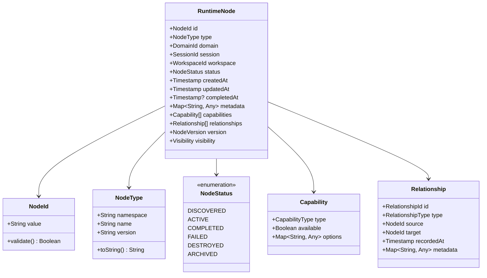
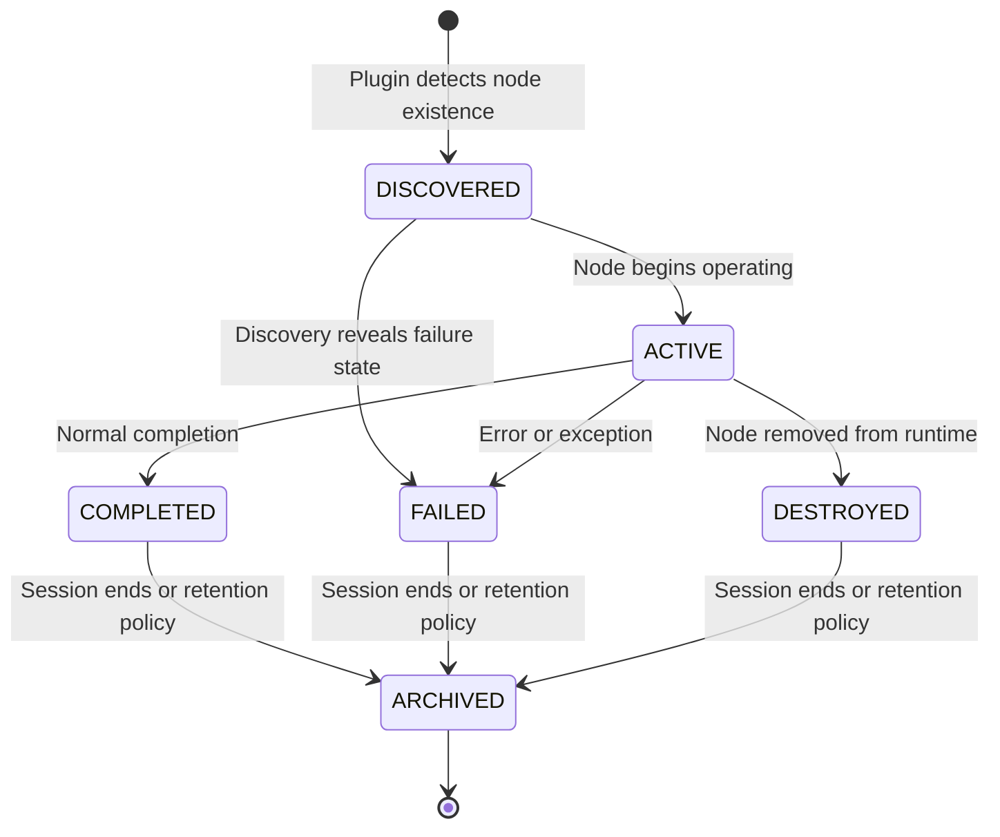
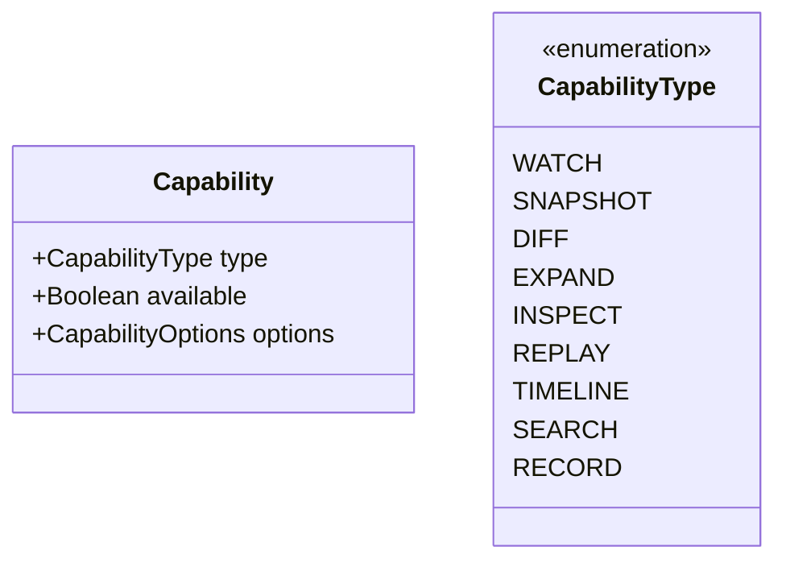
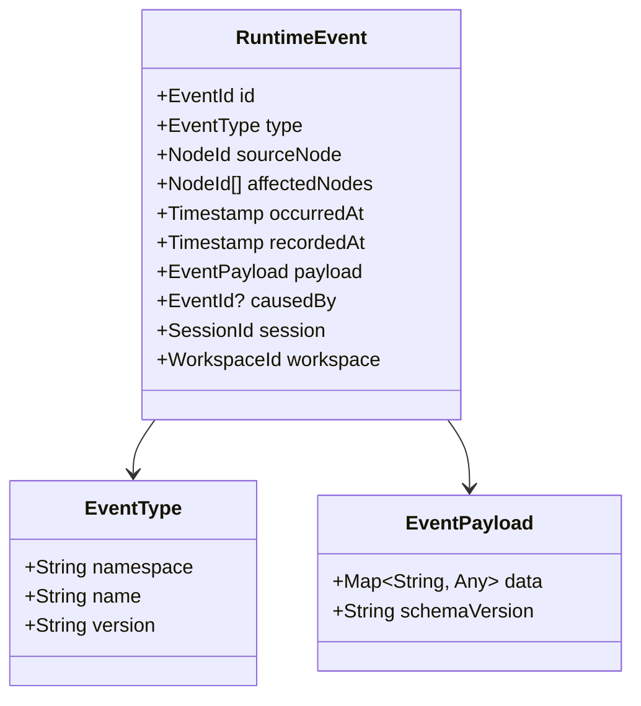
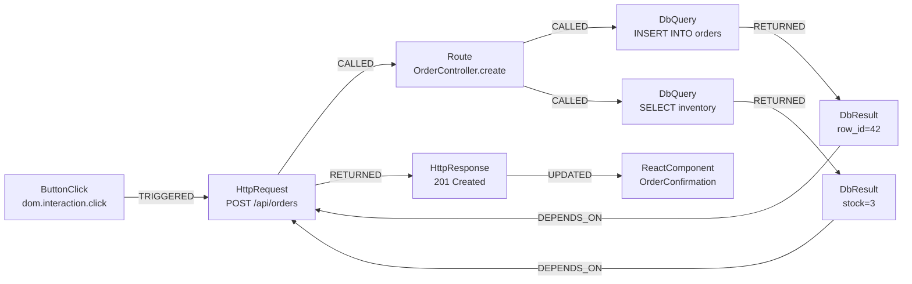
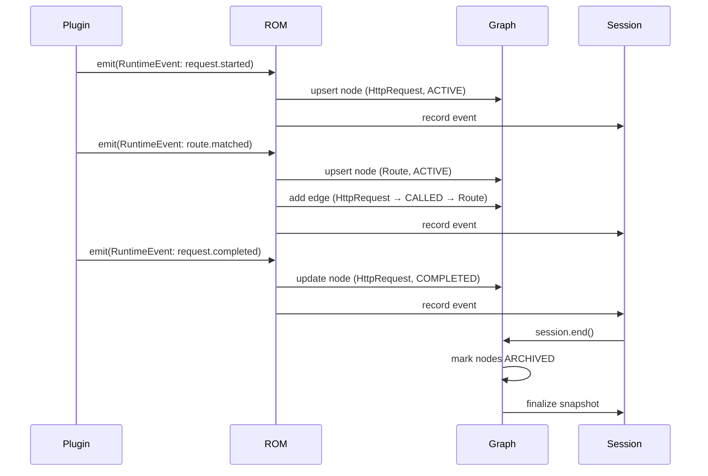
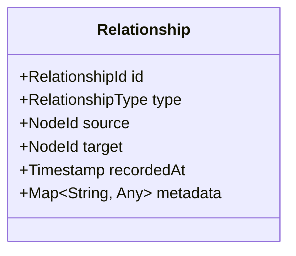
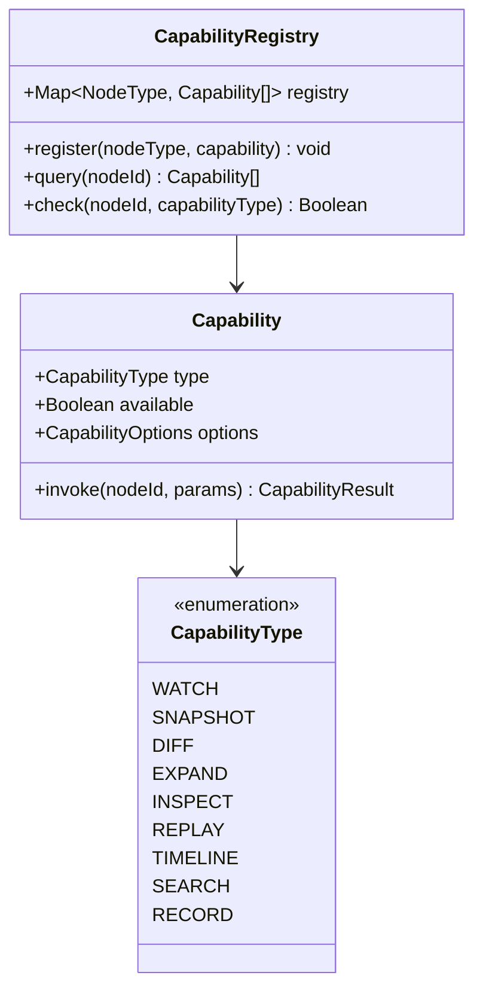
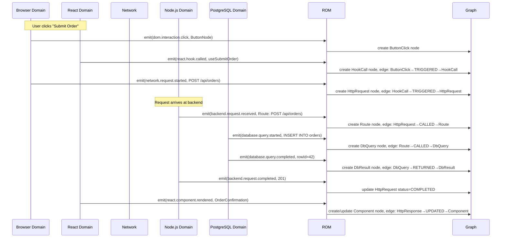
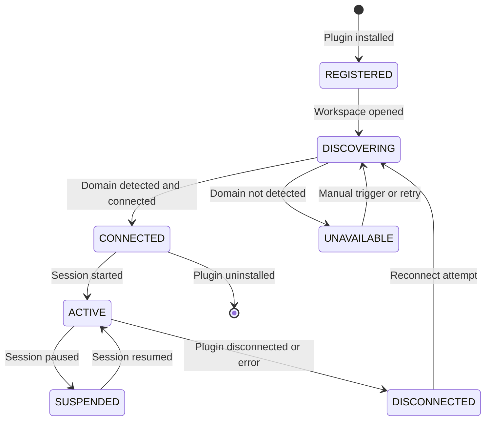

# RFC-0003: Runtime Object Model (ROM)

| Field      | Value                          |
|------------|--------------------------------|
| RFC        | 0003                           |
| Status     | Draft                          |
| Version    | 0.1                            |
| Category   | Core Architecture              |
| Authors    | Founding Team                  |
| Depends On | RFC-0001 (Glossary)            |

---

## Abstract

The Runtime Object Model (ROM) defines the universal, typed, graph-structured representation of running software within Observer. It is the canonical abstraction through which all runtime environments — browser, backend, database, container, terminal, or any future runtime — are expressed, stored, queried, and consumed.

ROM is to Observer what the DOM is to the browser: a structured model of a live, dynamic system that every consumer can rely on. Unlike the DOM, ROM spans every runtime environment, not just one. Unlike distributed tracing schemas, ROM captures not just timing but typed state, relationships, capabilities, and lifecycle.

Every component of Observer — the Runtime Explorer, Context Engine, Session Engine, Plugin SDK, Timeline Engine, and AI Context API — is built against ROM. No component accesses raw runtime data directly. ROM is the contract.

---

## Motivation

Modern software applications span multiple runtime environments simultaneously. A user action in the browser triggers a React component re-render, dispatches a network request, hits a Node.js backend, executes a PostgreSQL query, stores a result in Redis, and returns a JSON response that updates browser state. Understanding this flow — as a human or as a machine — requires crossing five or more runtime boundaries.

Today there is no shared model for this. Each environment exposes its own API:

| Environment | Native interface |
|-------------|-----------------|
| Browser | `window.performance`, DevTools Protocol, `console` |
| React | React DevTools Protocol, Fiber internals |
| Node.js | `async_hooks`, `process`, custom APM agents |
| PostgreSQL | `pg_stat_*` views, `EXPLAIN`, query logs |
| Redis | `MONITOR`, keyspace notifications, `INFO` |
| Docker | Docker Engine API, container stats |

These interfaces share no schema, no type system, no identity model, and no relationship representation. Consumers must integrate each independently.

ROM solves this with a single universal model. A network request is a `RuntimeNode` of type `HttpRequest` whether it originates in a browser `fetch`, an Axios call, or a Go `http.Client`. The model is the same. The consumer writes one query, one traversal, one renderer.

---

## Goals

1. Provide a universal, typed schema for all observable runtime objects.
2. Model runtime as a directed graph, not a flat list or tree.
3. Define stable identity for all runtime entities.
4. Express object lifecycle, capabilities, relationships, and metadata uniformly.
5. Be language-agnostic, framework-agnostic, and platform-agnostic.
6. Enable machine traversal without text parsing.
7. Support extensibility through plugin-owned metadata without changing the core model.

## Non-Goals

ROM does not define:

| Excluded concern | Where it is defined |
|-----------------|---------------------|
| Timeline generation algorithms | RFC-0004 (Timeline Engine) |
| Context assembly strategy | RFC-0006 (Context Engine) |
| Session lifecycle management | RFC-0005 (Session Model) |
| AI reasoning or inference | RFC-0010 (AI Context API) |
| Network transport protocol | Future: Runtime Protocol RFC |
| Storage and persistence format | Future: Storage RFC |
| User interface rendering | RFC-0009 (Runtime Explorer) |

---

## Design

### Core Philosophy

ROM models software as a **graph of typed runtime objects**. Not logs. Not files. Not traces. Objects.

```
❌  "POST /api/orders 500 Internal Server Error at 14:23:01.442"
     (a log line — unstructured, low-density, not machine-navigable)

✅  RuntimeNode {
      id:       "req_7f2a91",
      type:     "HttpRequest",
      method:   "POST",
      url:      "/api/orders",
      status:   500,
      duration: 142,
      relationships: [
        { type: "TRIGGERED_BY", target: "click_3b8d12" },
        { type: "CALLED",       target: "route_4c9f01" },
        { type: "RETURNED",     target: "error_8e1a33" }
      ]
    }
     (a ROM node — typed, structured, traversable, queryable)
```

The ROM node carries the same factual information as the log line, plus:
- A stable identity for cross-reference
- A type for semantic querying
- Relationships to causal neighbors
- Machine-readable fields (no string parsing required)

---

## Runtime Hierarchy

ROM organizes runtime reality into five levels:

```
┌─────────────────────────────────────────────────────────────────────┐
│  WORKSPACE                                                          │
│  "my-ecommerce-app"                                                 │
│                                                                     │
│  The software project under observation. Top-level container.       │
│  Persists across Sessions. Contains all Domains.                    │
│                                                                     │
│  ┌──────────────────┐  ┌──────────────────┐  ┌──────────────────┐  │
│  │  DOMAIN          │  │  DOMAIN          │  │  DOMAIN          │  │
│  │  Browser         │  │  Node.js         │  │  PostgreSQL      │  │
│  │                  │  │                  │  │                  │  │
│  │  One runtime     │  │  One runtime     │  │  One runtime     │  │
│  │  ecosystem.      │  │  ecosystem.      │  │  ecosystem.      │  │
│  │  Owned by one    │  │  Owned by one    │  │  Owned by one    │  │
│  │  plugin.         │  │  plugin.         │  │  plugin.         │  │
│  └────────┬─────────┘  └────────┬─────────┘  └────────┬─────────┘  │
│           │                     │                      │            │
│  ┌────────▼─────────────────────▼──────────────────────▼─────────┐  │
│  │  RUNTIME GRAPH                                                  │  │
│  │                                                                 │  │
│  │  The complete directed graph of all RuntimeNodes and            │  │
│  │  Relationships. Cross-domain edges exist (browser request       │  │
│  │  → backend route). The graph is the runtime.                    │  │
│  │                                                                 │  │
│  │  ┌──────────┐  TRIGGERED  ┌──────────┐  CALLED  ┌──────────┐  │  │
│  │  │  Node    │ ──────────► │  Node    │ ────────► │  Node    │  │  │
│  │  │ (click)  │             │ (request)│           │ (route)  │  │  │
│  │  └──────────┘             └──────────┘           └──────────┘  │  │
│  └─────────────────────────────────────────────────────────────────┘  │
│                                                                     │
│  ┌─────────────────────────────────────────────────────────────┐   │
│  │  SESSION                                                     │   │
│  │                                                              │   │
│  │  A bounded investigation. Contains the Events that drove    │   │
│  │  graph mutations, Snapshots, and assembled Context.          │   │
│  └─────────────────────────────────────────────────────────────┘   │
└─────────────────────────────────────────────────────────────────────┘
```

### Level Responsibilities

| Level | Responsibility | Persistence |
|-------|---------------|-------------|
| **Workspace** | Project identity, Domain registry, configuration | Permanent |
| **Domain** | Runtime ecosystem boundary, plugin ownership, Node type namespace | Permanent while plugin connected |
| **Runtime Graph** | Structural model of all live Nodes and Relationships | Live; reconstructable from Events |
| **Runtime Node** | Individual observable runtime object | Lifecycle-scoped |
| **Runtime Event** | Immutable record of a state change | Permanent (append-only) |

---

## Runtime Node

The RuntimeNode is the fundamental abstraction of ROM. Every observable entity in the runtime — a network request, a React component, a database query, a cookie, a container — is a RuntimeNode.

### Class Diagram



### Identity

Every RuntimeNode has a globally unique, stable identifier within its Workspace. Identity is assigned by the plugin that creates the node and must remain stable for the lifetime of the node.

```
node_id := {workspace_prefix}_{domain_prefix}_{type_prefix}_{unique_suffix}

Examples:
  ws1_browser_httpreq_7f2a91b3
  ws1_react_component_4d8c12e0
  ws1_pg_query_9a1f33c7
```

**Uniqueness guarantees**:
- Unique within a Workspace across all Sessions
- Stable across plugin reconnects (plugin is responsible for stable ID generation)
- Immutable once assigned

### Lifecycle

A RuntimeNode transitions through a defined set of states:



| State | Meaning |
|-------|---------|
| `DISCOVERED` | Plugin has detected the node. It may not yet be active. |
| `ACTIVE` | Node is operating — request in-flight, component mounted, query executing. |
| `COMPLETED` | Node has completed its work successfully. |
| `FAILED` | Node terminated in an error state. |
| `DESTROYED` | Node no longer exists in the runtime (component unmounted, connection closed). |
| `ARCHIVED` | Node data retained for historical querying but no longer live. |

### Metadata

The `metadata` field is an opaque, plugin-owned map of key-value pairs. ROM never interprets metadata directly. It is passed through to consumers as structured data.

**Design rationale**: Requiring ROM to know about React component props, PostgreSQL query plans, or Docker container labels would mean ROM must evolve every time any plugin domain evolves. By treating metadata as opaque to the core model, ROM remains stable while plugins evolve freely.

**Schema evolution**: Plugins may version their metadata schema. Breaking changes require a new schema version. The platform may surface metadata schema definitions for tooling support but does not enforce them at the ROM layer.

```json
{
  "id": "ws1_react_component_4d8c12e0",
  "type": "observer.react/Component",
  "status": "ACTIVE",
  "metadata": {
    "schemaVersion": "1.2",
    "componentName": "OrderForm",
    "fiber": { "tag": 1, "mode": 0 },
    "props": { "orderId": "ord_7a2b", "onSubmit": "[Function]" },
    "state": { "loading": false, "error": null }
  }
}
```

### Capabilities

Capabilities are operations that can be performed on a RuntimeNode. They are declared by the plugin and negotiated at connection time.



Capabilities are not universally available. A `DatabaseQuery` node can be inspected but not replayed by default. A `ReactComponent` node can be watched and snapshotted. A `HttpRequest` node can be diffed across Sessions.

**Capability negotiation**: When a plugin connects, it declares the capabilities available for each Node type it produces. Consumers check capability availability before attempting an operation. Attempting an unavailable capability returns a typed error, not a silent failure.

### Visibility

The `visibility` field controls who can access a node:

| Visibility | Meaning |
|------------|---------|
| `LOCAL` | Visible only within the local Observer instance |
| `SESSION` | Visible to anyone sharing the Session |
| `WORKSPACE` | Visible to all observers of the Workspace |

Default: `LOCAL`. Sharing always requires explicit action.

### Mutability

RuntimeNode metadata and status are mutable — they reflect the live state of the runtime entity. However, mutations are recorded as RuntimeEvents. The complete mutation history is reconstructable from the Event log.

The node object a consumer holds is a view of the current state. Historical states are accessible via Snapshots.

---

## Runtime Event

RuntimeEvents are the append-only record of change within the Runtime. They are the source of truth from which the Runtime Graph is built, Timelines are derived, and Snapshots are reconstructed.

### Class Diagram



### Immutability

Once recorded, a RuntimeEvent never changes. No field is mutable post-recording. If an event was recorded incorrectly, a corrective event is appended — the original is not modified.

This guarantees:
- Session replay produces identical results
- Events can be safely shared and referenced by ID
- Audit trails are complete and tamper-evident

### Timestamps

Each RuntimeEvent carries two timestamps:

| Field | Meaning |
|-------|---------|
| `occurredAt` | When the event happened in the originating runtime (runtime clock) |
| `recordedAt` | When Observer received and recorded the event (Observer clock) |

These differ when there is instrumentation latency. `occurredAt` is used for Timeline ordering. `recordedAt` is used for storage sequencing.

### Causality

The `causedBy` field links an event to its causal predecessor. This enables Observer to reconstruct causal chains without requiring full graph traversal:

```
EventId: evt_click_3b8d          causedBy: null
    └──► EventId: evt_req_7f2a   causedBy: evt_click_3b8d
             └──► EventId: evt_route_4c9f  causedBy: evt_req_7f2a
                      └──► EventId: evt_query_9a1f  causedBy: evt_route_4c9f
```

Causality chains power the Context Engine's ability to assemble the "why" around any given event.

### Event Type Taxonomy

```
observer/
  browser/
    dom.interaction.click
    dom.interaction.submit
    dom.mutation.created
    dom.mutation.destroyed
    navigation.started
    navigation.completed
  network/
    request.started
    request.completed
    request.failed
    request.aborted
  react/
    component.rendered
    component.mounted
    component.unmounted
    state.updated
    hook.called
    error.boundary.caught
  backend/
    request.received
    request.completed
    request.failed
    route.matched
  database/
    query.started
    query.completed
    query.failed
    transaction.started
    transaction.committed
    transaction.rolled_back
  process/
    started
    exited
    crashed
    output.line
  runtime/
    exception.thrown
    exception.caught
    memory.warning
```

---

## Runtime Graph

The Runtime Graph is the complete structural model of a running application. It is a directed, typed multigraph — multiple edges of different types may exist between any two nodes.

### Why a Graph, Not a Tree

Trees are a natural first model for software structure:
- Directory trees
- Component trees
- Call trees

The runtime is not a tree.

Consider this flow:

```
[User clicks Submit]
    │
    └─TRIGGERED──► [POST /api/orders]
                        │
                   ├─CALLED──► [Route: OrderController.create]
                   │                │
                   │           ├─CALLED──► [DB Query: INSERT INTO orders]
                   │           │               │
                   │           │           └─RETURNED──► [DB Result: row_id=42]
                   │           │
                   │           └─CALLED──► [DB Query: SELECT * FROM inventory]
                   │                           │
                   │                       └─RETURNED──► [DB Result: stock=3]
                   │
                   └─RETURNED──► [HTTP Response: 201]
                                     │
                                 └─UPDATED──► [React: OrderConfirmation]
```

The `OrderController.create` node has two parent DB query nodes. The HTTP Response is `RETURNED` from the request AND `UPDATED` the React component. Neither of these relationships is representable in a tree without duplication or loss.

The runtime is relational. Graph is the correct model.

### Graph Structure



### Graph Operations

| Operation | Description |
|-----------|-------------|
| **Traversal** | Follow Relationship edges from a source node to depth N |
| **Search** | Query nodes by type, status, metadata field, or text |
| **Expansion** | Reveal child or related nodes (lazy loading for large graphs) |
| **Filtering** | Reduce the graph to nodes matching criteria (type, domain, time range) |
| **Subgraph** | Extract a connected subgraph anchored on a specific node |
| **Path** | Find all paths between two nodes |

### Graph Ownership and Lifetime



The Runtime Graph is **owned by the platform**, not by individual plugins. Plugins contribute nodes and edges by emitting events. The platform applies those events to the graph. This separation ensures:

- No plugin can corrupt the graph state of another plugin
- Cross-domain edges (browser → backend) can be formed even when neither plugin is aware of the other
- The graph can be reconstructed from the Event log if lost

### Cycles

Directed cycles are possible in the Runtime Graph and are valid:
- A background worker pings an API which updates a cache which the worker reads again
- A component subscribes to a store, updates it, and re-reads it

Observer does not prohibit cycles. Traversal algorithms must handle them with cycle detection.

### Graph Serialization

The Runtime Graph must be serializable for:
- Session persistence
- Cross-instance sharing
- Replay

Serialization format: **open question** — see Open Questions section. JSON with stable node ordering is the baseline. Compact binary formats may be introduced in a future RFC.

---

## Relationships

Relationships are the edges of the Runtime Graph. They are typed, directional, and first-class objects with their own identity.

### Relationship Schema



### Standard Relationship Types

| Type | Semantics | Example |
|------|-----------|---------|
| `TRIGGERED` | Source caused Target to begin | `ButtonClick → TRIGGERED → HttpRequest` |
| `CALLED` | Source invoked Target | `Route → CALLED → DatabaseQuery` |
| `RETURNED` | Source produced the result in Target | `DatabaseQuery → RETURNED → DbResult` |
| `FAILED` | Source caused Target to fail | `NetworkError → FAILED → HttpRequest` |
| `UPDATED` | Source modified state in Target | `HttpResponse → UPDATED → ReactComponent` |
| `RENDERED` | Source caused Target to be displayed | `ReactComponent → RENDERED → DomNode` |
| `CREATED` | Source caused Target to come into existence | `Factory → CREATED → WorkerProcess` |
| `DESTROYED` | Source caused Target to cease to exist | `GarbageCollector → DESTROYED → CacheEntry` |
| `DEPENDS_ON` | Source requires Target to function | `Service → DEPENDS_ON → DatabaseConnection` |
| `USES` | Source reads from Target without modifying it | `Component → USES → Context` |
| `OBSERVES` | Source plugin is monitoring Target | `ReactObserver → OBSERVES → ReactComponent` |

**Why relationships are first-class**: Storing only nodes produces a directory. Storing nodes and typed edges produces understanding. The relationship type carries semantic meaning that cannot be recovered from node content alone. `A → B` is meaningless; `HttpRequest → CALLED → DatabaseQuery` is an explanation.

### Cross-Domain Relationships

Relationships may cross Domain boundaries. This is the mechanism through which Observer builds a unified picture of a multi-service application:

```
[Browser Domain]                    [Node.js Domain]
                                    
HttpRequest ────────────────────────► Route
POST /api/orders     CALLED          OrderController.create
```

Cross-domain relationship formation requires **correlation** — matching the outgoing request in the Browser Domain to the incoming route in the Node.js Domain. Correlation strategies are defined in future RFCs (e.g., via `X-Observer-Trace-Id` headers, timing correlation, or explicit plugin coordination).

---

## Capabilities

Capabilities define the operations available on a specific RuntimeNode type, as implemented by its owning plugin.



### Capability Descriptions

| Capability | Description | Who uses it |
|------------|-------------|-------------|
| `WATCH` | Subscribe to live state changes on this node | Runtime Explorer, AI agents |
| `SNAPSHOT` | Capture immutable point-in-time copy | Context Engine, Session Engine |
| `DIFF` | Compare two Snapshots of this node | Runtime Explorer, Context Engine |
| `EXPAND` | Reveal child or related nodes (lazy graph expansion) | Runtime Explorer |
| `INSPECT` | View full structured detail of the node | Runtime Explorer, AI agents |
| `REPLAY` | Re-execute the event sequence that produced this node | Session Engine |
| `TIMELINE` | View chronological Event history for this node | Runtime Explorer |
| `SEARCH` | Query across nodes of this type by field value | Runtime Explorer, Context Engine |
| `RECORD` | Explicitly start recording events for this node | Plugin SDK consumers |

### Capability Discovery

When a plugin connects, it registers capabilities for each Node type it produces:

```typescript
plugin.registerNodeType({
  type: "observer.react/Component",
  capabilities: [
    { type: "WATCH",    available: true  },
    { type: "SNAPSHOT", available: true  },
    { type: "DIFF",     available: true  },
    { type: "EXPAND",   available: true  },
    { type: "INSPECT",  available: true  },
    { type: "REPLAY",   available: false },
    { type: "TIMELINE", available: true  },
  ]
});
```

Consumers query the CapabilityRegistry before invoking any operation. Attempting an unavailable capability returns a typed `CapabilityUnavailableError`.

---

## Examples

### Example 1: Browser Network Request

```json
{
  "id": "ws1_browser_httpreq_7f2a91b3",
  "type": "observer.browser/HttpRequest",
  "domain": "browser",
  "status": "COMPLETED",
  "createdAt": "2024-11-15T14:23:01.300Z",
  "completedAt": "2024-11-15T14:23:01.442Z",
  "metadata": {
    "schemaVersion": "1.0",
    "method": "POST",
    "url": "/api/orders",
    "requestHeaders": { "Content-Type": "application/json" },
    "requestBody": { "productId": "prod_42", "qty": 1 },
    "status": 201,
    "responseHeaders": { "Content-Type": "application/json" },
    "responseBody": { "orderId": "ord_7a2b", "status": "confirmed" },
    "duration": 142,
    "initiator": "fetch"
  },
  "capabilities": ["WATCH", "SNAPSHOT", "DIFF", "INSPECT", "TIMELINE"],
  "relationships": [
    { "type": "TRIGGERED_BY", "target": "ws1_browser_click_3b8d12" },
    { "type": "CALLED",       "target": "ws1_node_route_4c9f01"   },
    { "type": "RETURNED",     "target": "ws1_browser_response_9d1e" }
  ]
}
```

### Example 2: React Component

```json
{
  "id": "ws1_react_component_4d8c12e0",
  "type": "observer.react/Component",
  "domain": "react",
  "status": "ACTIVE",
  "createdAt": "2024-11-15T14:22:58.100Z",
  "metadata": {
    "schemaVersion": "1.2",
    "displayName": "OrderForm",
    "fiberTag": 1,
    "props": {
      "orderId": "ord_7a2b",
      "onSubmit": "[Function: handleSubmit]"
    },
    "state": {
      "loading": false,
      "error": null,
      "items": [{ "productId": "prod_42", "qty": 1 }]
    },
    "renderCount": 3,
    "lastRenderDuration": 2.1
  },
  "capabilities": ["WATCH", "SNAPSHOT", "DIFF", "EXPAND", "INSPECT", "TIMELINE"],
  "relationships": [
    { "type": "RENDERED_BY", "target": "ws1_react_component_parent_8a3f" },
    { "type": "USES",        "target": "ws1_react_context_theme_7d2a"   },
    { "type": "UPDATED_BY",  "target": "ws1_browser_httpreq_7f2a91b3"  }
  ]
}
```

### Example 3: PostgreSQL Query

```json
{
  "id": "ws1_pg_query_9a1f33c7",
  "type": "observer.postgresql/Query",
  "domain": "postgresql",
  "status": "COMPLETED",
  "createdAt": "2024-11-15T14:23:01.380Z",
  "completedAt": "2024-11-15T14:23:01.410Z",
  "metadata": {
    "schemaVersion": "1.0",
    "sql": "INSERT INTO orders (product_id, qty, user_id) VALUES ($1, $2, $3) RETURNING id",
    "params": ["prod_42", 1, "usr_99"],
    "rowsAffected": 1,
    "duration": 30,
    "plan": {
      "nodeType": "Insert on orders",
      "cost": "0.00..0.01",
      "rows": 1
    },
    "connection": {
      "database": "ecommerce_dev",
      "poolSize": 10,
      "poolIdle": 8
    }
  },
  "capabilities": ["SNAPSHOT", "DIFF", "INSPECT", "TIMELINE", "SEARCH"],
  "relationships": [
    { "type": "CALLED_BY",  "target": "ws1_node_route_4c9f01"       },
    { "type": "RETURNED",   "target": "ws1_pg_result_2b7e44"        },
    { "type": "USES",       "target": "ws1_pg_connection_pool_1a3f" }
  ]
}
```

### Example 4: FastAPI Route Handler

```json
{
  "id": "ws1_fastapi_route_4c9f01",
  "type": "observer.fastapi/Route",
  "domain": "fastapi",
  "status": "COMPLETED",
  "createdAt": "2024-11-15T14:23:01.320Z",
  "completedAt": "2024-11-15T14:23:01.438Z",
  "metadata": {
    "schemaVersion": "1.0",
    "path": "/api/orders",
    "method": "POST",
    "handler": "create_order",
    "module": "app.routers.orders",
    "responseStatus": 201,
    "middleware": ["AuthMiddleware", "RateLimitMiddleware"],
    "dependencies": ["get_db", "get_current_user"]
  },
  "capabilities": ["SNAPSHOT", "INSPECT", "TIMELINE", "EXPAND"],
  "relationships": [
    { "type": "CALLED_BY", "target": "ws1_browser_httpreq_7f2a91b3" },
    { "type": "CALLED",    "target": "ws1_pg_query_9a1f33c7"        },
    { "type": "RETURNED",  "target": "ws1_fastapi_response_7b2c"    }
  ]
}
```

### Example 5: Docker Container

```json
{
  "id": "ws1_docker_container_6e8b22",
  "type": "observer.docker/Container",
  "domain": "docker",
  "status": "ACTIVE",
  "createdAt": "2024-11-15T09:14:00.000Z",
  "metadata": {
    "schemaVersion": "1.0",
    "name": "ecommerce-postgres",
    "image": "postgres:16-alpine",
    "ports": { "5432/tcp": "5432" },
    "env": { "POSTGRES_DB": "ecommerce_dev" },
    "status": "running",
    "cpu": { "percent": 2.1 },
    "memory": { "usageMb": 48, "limitMb": 512 }
  },
  "capabilities": ["WATCH", "SNAPSHOT", "INSPECT", "TIMELINE", "EXPAND"],
  "relationships": [
    { "type": "HOSTS", "target": "ws1_pg_domain_1a3f" }
  ]
}
```

### Example 6: Cross-Domain Request Sequence

This sequence diagram shows how ROM models a complete request from browser click to database query and response:



---

## Tradeoffs

### Graph vs. Tree

**Tree advantages**: simpler traversal, well-understood, maps to component hierarchies.

**Graph advantages**: accurately models causality, cross-domain relationships, shared dependencies, and cycles — all of which exist in real applications.

**Decision**: Graph. Modeling the runtime as a tree requires either data duplication (the same request appearing under multiple parent nodes) or loss of causal relationships. Observer chooses accuracy over simplicity.

### Graph vs. Log-Centric Model

**Log-centric advantages**: simple to produce, widely understood, requires no schema.

**Log-centric disadvantages**: unstructured, requires text parsing by consumers, no stable identity, no relationship model, no capability model.

**Decision**: Graph-based object model. The instrumentation overhead of producing structured nodes is accepted as necessary for machine-navigability. Log lines can be attached as metadata on nodes where they exist — Observer does not prohibit logs, it supplements them.

### Rich Core vs. Thin Core with Heavy Plugins

**Rich core**: ROM defines many standard Node types and fields. Uniform experience across plugins. Higher specification burden.

**Thin core**: ROM defines only identity, lifecycle, and relationship primitives. All domain fields in metadata. Maximum plugin flexibility, but consumers cannot rely on field names across plugins.

**Decision**: Balanced. ROM defines a typed core for well-known concepts (`HttpRequest`, `ReactComponent`) with standardized fields. Novel node types use opaque metadata. This enables portable consumers for common patterns while allowing plugins to innovate.

### Immutable Events vs. Mutable State

**Immutable events only**: maximum consistency and replayability. Consumers must reconstruct state by replaying events. High computation cost for large graphs.

**Mutable node objects**: consumers get current state directly. Simpler query model. Harder to replay.

**Decision**: Both. RuntimeNodes are mutable views of current state. RuntimeEvents are the immutable source of truth. The current state is the materialized view of events. Replay operates on events. This is the same design used by event-sourced systems.

---

## Plugin Integration

### How Plugins Produce Runtime Nodes

Plugins integrate with ROM through the Plugin SDK (RFC-0007). The contract is:

1. **Declare** the Node types the plugin produces (with their metadata schema and capabilities)
2. **Emit** `RuntimeEvents` via the SDK event emitter
3. **Never** mutate ROM directly — the platform applies events to the graph

```typescript
// Plugin declares node type at connection time
sdk.registerNodeType({
  type: "observer.react/Component",
  schema: ReactComponentMetadataSchema,
  capabilities: [WATCH, SNAPSHOT, DIFF, EXPAND, INSPECT, TIMELINE]
});

// Plugin emits events as they occur
sdk.emit({
  type: "observer.react/component.rendered",
  sourceNode: componentNodeId,
  occurredAt: performance.now(),
  payload: {
    displayName: fiber.type.displayName,
    props: serializeProps(fiber.memoizedProps),
    state: serializeState(fiber.memoizedState),
    renderDuration: endTime - startTime
  }
});
```

### Plugin Isolation

Plugins cannot read or modify nodes owned by other plugins. Each plugin has write access only to nodes in its own Domain. Cross-domain relationships are formed by the platform when events from multiple plugins reference the same correlation identifiers.

### Plugin Lifecycle



---

## Future Work

Future RFCs will build directly on ROM:

| RFC | Builds on ROM by |
|-----|-----------------|
| RFC-0004 (Runtime Graph) | Defining graph traversal, query, and serialization algorithms |
| RFC-0005 (Session Model) | Defining how Sessions own and bound subgraphs of ROM |
| RFC-0006 (Context Engine) | Assembling Context packages from ROM subgraphs |
| RFC-0007 (Plugin SDK) | Defining the plugin-to-ROM emission interface |
| Future: Runtime Protocol | Defining the wire format for plugin→platform event transport |
| Future: ROM Storage | Defining persistence and reconstruction from event logs |

---

## Open Questions

| # | Question | Impact |
|---|----------|--------|
| 1 | Should RuntimeNodes be explicitly versioned? If a node's metadata schema changes, does the node get a new version or a new type? | ROM schema evolution |
| 2 | Can the Runtime Graph become distributed — spanning multiple Observer instances across machines? If so, how are cross-instance node IDs assigned? | Multi-machine development, distributed tracing |
| 3 | Should metadata schemas be standardized per node type (published as JSON Schema or similar)? Or is schema publication strictly optional? | Tooling, consumer portability |
| 4 | How should plugins negotiate capabilities at runtime? Is capability negotiation synchronous at connect time, or can capabilities change while a session is active? | Plugin SDK design |
| 5 | How are cross-domain relationships formed when neither plugin is aware of the other? Is this the platform's responsibility via correlation ID, or do plugins explicitly declare cross-domain links? | Browser↔Backend correlation |
| 6 | What is the canonical serialization format for RuntimeGraph persistence — JSON, MessagePack, Protobuf, or something custom? | Session storage, replay |
| 7 | Should graph cycles be flagged, prevented, or simply handled transparently by traversal algorithms? | Context Engine, Runtime Explorer |
| 8 | Should `Observation` (RFC-0001 Glossary) be a distinct ROM object type, or is it a higher-level concept defined entirely in RFC-0006 (Context Engine)? | Glossary/ROM boundary |

---

## References

- RFC-0001: Observer Glossary
- RFC-0002: Observer OS — Vision and Product Philosophy
- RFC-0004: Runtime Graph (forthcoming)
- RFC-0005: Session Model (forthcoming)
- RFC-0006: Context Engine (forthcoming)
- RFC-0007: Plugin SDK (forthcoming)
