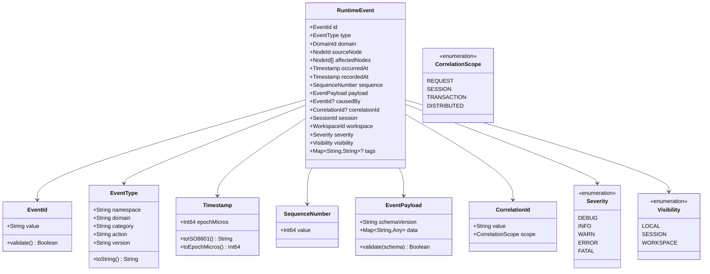
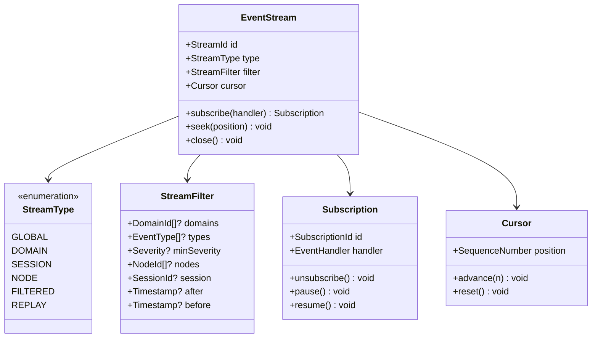
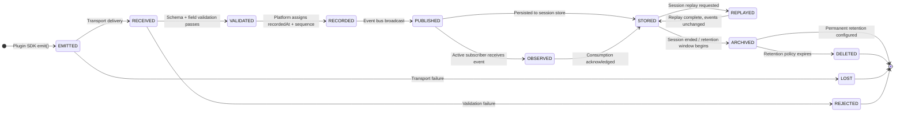
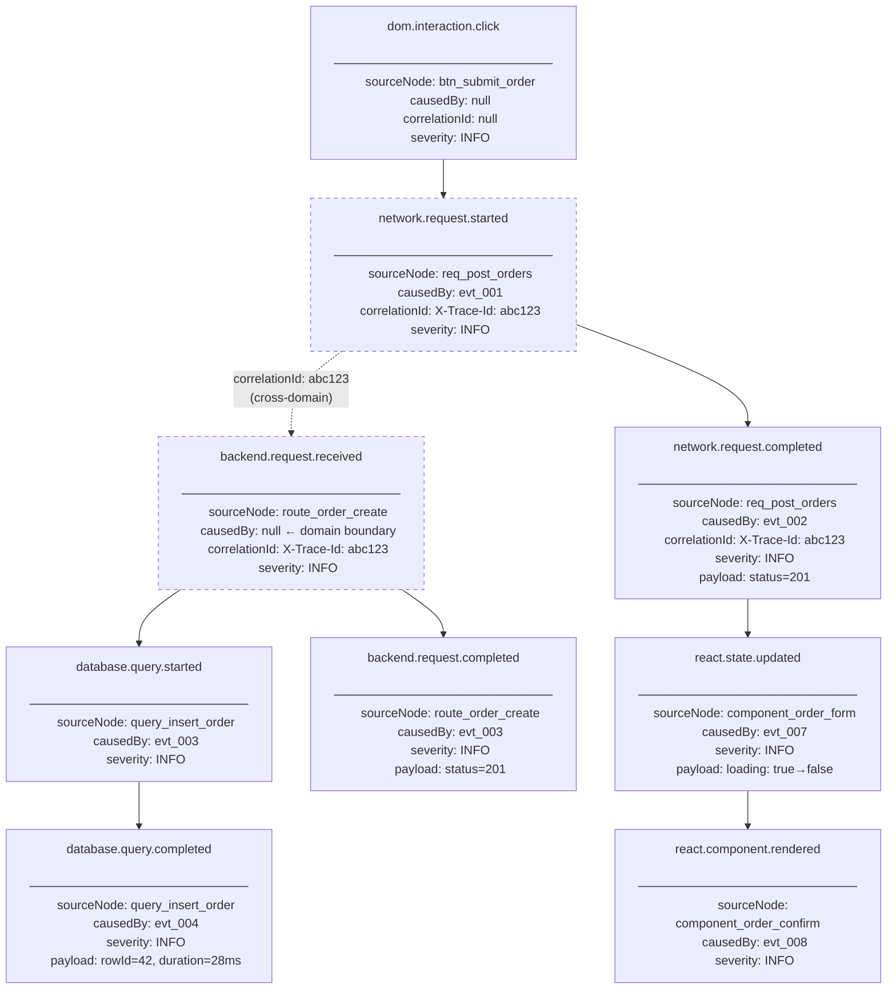
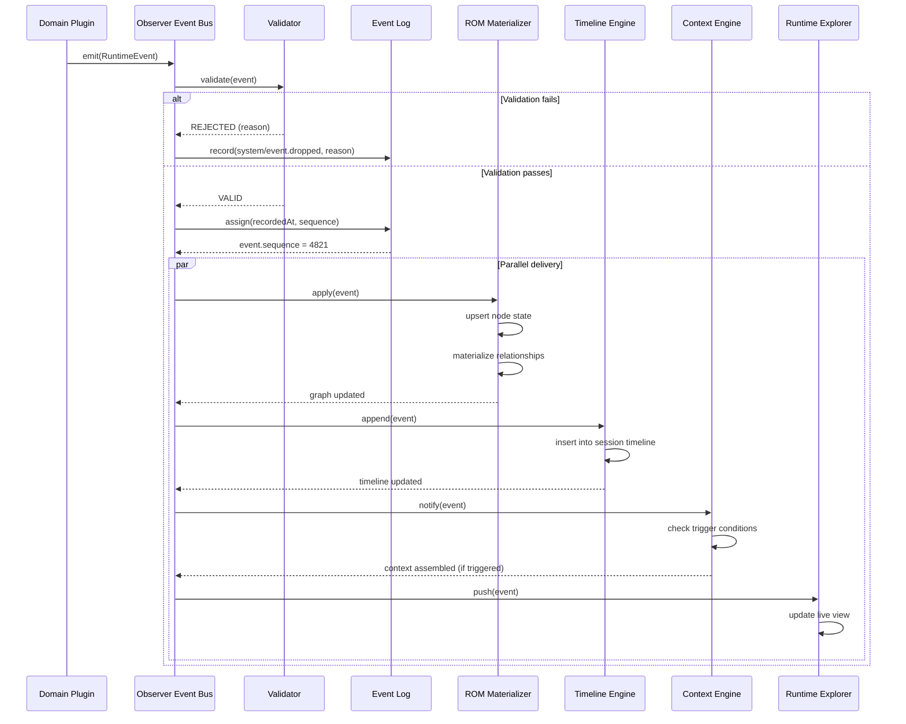

# RFC-0004: Runtime Event Model (REM)

| Field      | Value                                    |
|------------|------------------------------------------|
| RFC        | 0004                                     |
| Status     | Draft                                    |
| Version    | 0.1                                      |
| Category   | Core Architecture                        |
| Authors    | Founding Team                            |
| Depends On | RFC-0001 (Glossary), RFC-0003 (ROM)      |

---

## Abstract

The Runtime Event Model (REM) defines how Observer represents change over time. Where the Runtime Object Model (ROM) defines the structure of runtime state — what exists — REM defines the structure of runtime behavior — what happened, when, why, and in what causal order.

Every Runtime Event is an immutable, typed, timestamped record of a change that occurred within a running system. Events are the source of truth from which the Runtime Graph is materialized, Timelines are derived, Sessions are reconstructed, Context is assembled, and AI consumers derive understanding. Nothing in Observer is more fundamental than the Event.

This document specifies the complete schema of RuntimeEvent, the type taxonomy governing event classification, the ordering and causality model, the correlation mechanism for cross-domain event linking, the event stream architecture, event lifecycle from emission to archival, replay semantics, security constraints, and plugin integration contracts.

All Observer subsystems that produce, consume, store, or transmit runtime data are bound by the contracts defined here.

---

## Motivation

Modern software applications are not static. They are sequences of causally connected changes: a user clicks a button, a React component re-renders, a network request fires, a backend handler executes, a database query runs, a response propagates back, state updates, and a new UI is displayed. Understanding a running application means understanding this sequence — its structure, its timing, and its causality.

Today, engineers understand application behavior through four approximations:

**Logs** are freeform strings written by developers, after the fact, describing what they expect might be useful later. They carry no schema, no stable identity, no causal links, and no machine-navigable structure. Diagnosing a production incident from logs means parsing text, guessing at causality, and hoping the right log line was written.

**Distributed traces** capture timing spans across service boundaries. They answer "how long did this take?" but carry limited semantic information about what a span actually did, what state it operated on, or why it was invoked.

**Metrics** aggregate numerical observations over time windows. They answer "how many?" and "how fast?" but discard the individual events from which they are computed. A spike in error rate is visible; the specific request that caused it is not.

**Application Performance Monitoring (APM)** systems combine logs, traces, and metrics with vendor-specific instrumentation. They improve on raw logs but impose proprietary schemas that fragment the ecosystem and produce data silos.

None of these models represent change as a first-class, structured, typed, causal record. None of them answer: "What happened? Why did it happen? What caused it? What did it affect? How does this change relate to everything else that happened in the same second?"

REM answers these questions. A RuntimeEvent carries the *what* (event type), the *when* (dual timestamps), the *why* (causal predecessor chain), the *who* (source node, affected nodes, owning domain), and the *what it means* (typed payload with structured evidence). The complete sequence of events for a Session is the ground truth of application behavior — computable, replayable, and queryable.

---

## Goals

1. Define a universal, typed schema for all runtime change records across all Observer Domains.
2. Establish immutability as an inviolable guarantee: recorded events never change.
3. Provide a dual-clock model that separates runtime time from Observer recording time.
4. Enable causal chain reconstruction from first-party event fields, without graph traversal.
5. Enable cross-domain correlation of events produced by independent plugins.
6. Define a monotonic ordering model that is correct under clock drift and high-frequency emission.
7. Specify the complete event lifecycle from plugin emission to archival.
8. Define the event stream model: per-domain, merged, filtered, session, and replay streams.
9. Establish the serialization contract required for storage, replay, and AI consumption.
10. Define deterministic and partial replay semantics over event sequences.
11. Specify security and privacy constraints for sensitive event payloads.
12. Define the plugin contract for event type registration, ownership, and schema evolution.

---

## Non-Goals

REM does not define:

| Excluded Concern                              | Where It Is Defined              |
|-----------------------------------------------|----------------------------------|
| Runtime Node schema and type taxonomy         | RFC-0003 (ROM)                   |
| Session lifecycle, boundaries, and governance | RFC-0005 (Session Model)         |
| Context assembly from event subsets           | RFC-0006 (Context Engine)        |
| Plugin SDK wire protocol and transport        | RFC-0007 (Plugin SDK)            |
| Timeline rendering and navigation UI          | RFC-0009 (Runtime Explorer)      |
| AI Consumer query interface                   | RFC-0010 (AI Context API)        |
| Persistent storage format and indexing        | Future: Storage RFC              |
| Distributed Observer across multiple machines | Future: Distributed Runtime RFC  |
| User-defined event annotations                | Future: Annotation RFC           |
| Automated anomaly detection on event streams  | Future: Intelligence RFC         |

---

## Design

### ROM and REM: State and Behavior

ROM and REM are complementary and inseparable. ROM defines the *nouns* of the Observer data model; REM defines the *verbs*.

```
ROM answers: What exists in the runtime right now?
REM answers: What changed, and in what order, and why?
```

The relationship is causal and directional: Events (REM) produce Nodes (ROM). When a `network/request.started` event fires, the ROM materializes an `HttpRequest` node in `ACTIVE` status. When `network/request.completed` fires, ROM transitions that node to `COMPLETED` and records a duration. When `react/component.rendered` fires, ROM creates or updates a `ReactComponent` node with new props and state.

The Runtime Graph is a **materialized view** of the event log. If the event log is preserved, the graph can be rebuilt from scratch at any time. If the graph is lost, it is reconstructed by replaying events. The events are primary. The graph is derived.

This is not a new pattern. It is event sourcing — a proven architecture for systems that require auditability, replayability, and time-travel queries. Observer applies it to the runtime observation domain.

```
                    Events (REM)
                    ┌─────────────────────────────────────┐
                    │  evt_001: dom.interaction.click      │
                    │  evt_002: network.request.started    │  ──► materializes ──►  Runtime Graph (ROM)
                    │  evt_003: backend.request.received   │
                    │  evt_004: database.query.started     │
                    │  evt_005: database.query.completed   │
                    │  evt_006: network.request.completed  │
                    │  evt_007: react.component.rendered   │
                    └─────────────────────────────────────┘
                    (immutable, append-only)                    (mutable, derived)
```

### Events as the Source of Truth

Because the graph is derived, and because events are immutable, the following guarantees hold:

- **Replayability**: Given the same event sequence, the same graph state is always produced.
- **Auditability**: Every graph mutation has a corresponding event in the log. There are no unexplained state changes.
- **Time travel**: The graph state at any historical moment is reconstructable by replaying events up to a given timestamp.
- **Shareability**: A Session can be shared by sharing its event sequence. The recipient reconstructs the identical graph.
- **AI correctness**: An AI Consumer given a sequence of events has the complete, lossless ground truth of what happened, with no interpretive gaps introduced by summarization or aggregation.

### Immutability as an Engineering Constraint

Immutability is not a preference — it is an enforced architectural constraint. Once an event is recorded by Observer:

- No field may be modified
- No event may be deleted before its retention window expires
- No event may be silently dropped without a corresponding `observer/system/event.dropped` record

If an event was emitted with incorrect data, a corrective event is appended. The original event is preserved. This design mirrors append-only log systems (Kafka, PostgreSQL WAL, Datomic) where correctness is achieved by recording corrections, not by modifying history.

**Rationale**: Mutable events break replay determinism. If an event recorded at `T=100` is later modified, sessions replayed after the modification produce different results than sessions replayed before. This destroys the session-as-ground-truth guarantee. Immutability is the price of replayability.

### The Dual-Clock Problem

Every RuntimeEvent carries two timestamps:

| Field         | Clock Source               | Meaning                                      |
|---------------|----------------------------|----------------------------------------------|
| `occurredAt`  | Originating runtime clock  | When the change actually happened             |
| `recordedAt`  | Observer system clock      | When Observer received and persisted the event |

These differ for two reasons:

1. **Instrumentation latency**: There is always a finite delay between an event occurring in the runtime and the plugin delivering it to Observer. Batch-emitted events (e.g., flushed every 16ms) have up to 16ms of instrumentation latency. The `occurredAt` is the accurate time; `recordedAt` reflects the Observer pipeline delay.

2. **Clock drift**: In distributed environments, the runtime clock and the Observer clock may diverge. A backend event `occurredAt 14:23:01.380` from a server whose clock is 50ms fast will appear to precede a browser event that actually happened later. `recordedAt` provides a consistent observer-perspective ordering that is immune to client clock drift.

**Usage rule**: Use `occurredAt` for Timeline construction and causal ordering within a trusted Domain. Use `recordedAt` for storage sequencing and cross-domain ordering when clock trust is low.

---

## Architecture: Core Concepts

### RuntimeEvent

A RuntimeEvent is the atomic unit of change in Observer. It represents one discrete, observable fact about the runtime: something happened, at a specific time, to a specific runtime entity, as a result of something else.

RuntimeEvents are produced by Observer plugins (Domain Probes), transmitted to Observer's event bus, validated, sequenced, and recorded. They are never modified after recording.

### EventType

An EventType names a class of runtime change. Types are hierarchically namespaced and versioned:

```
{namespace}/{domain}/{category}.{action}

Examples:
  observer/browser/dom.interaction.click
  observer/network/request.started
  observer/react/component.rendered
  observer/database/query.completed
  observer/runtime/exception.thrown
```

The namespace `observer` is reserved for Observer platform and official plugin types. Third-party plugins use their own namespace:

```
acme-corp/kafka/message.published
my-org/custom-cache/key.evicted
```

Type names are lowercase, dot-separated, and follow a `noun.verb` convention for action events or `noun.state` for state transition events.

### Event Source and Target

Every RuntimeEvent has a **source** and one or more **targets**:

- **Source** (`sourceNode`): The Runtime Node that originated the event. This is the node the plugin was observing when it detected the change. It is the actor.
- **Targets** (`affectedNodes`): The Runtime Nodes whose state was changed by this event. These are the subjects.

In many events, source and target are the same node — the node reporting its own state change:

```
source: HttpRequest node (req_7f2a)
targets: [HttpRequest node (req_7f2a)]
type: network/request.completed
```

In causal events, they differ:

```
source: ButtonClick node (click_3b8d)
targets: [HttpRequest node (req_7f2a)]
type: network/request.started
```

The distinction is important for graph materialization: the platform uses `affectedNodes` to know which nodes to update, and `sourceNode` to know who to attribute the change to.

### Timestamps and Ordering

```
Timeline ordering uses occurredAt.
Storage ordering uses (recordedAt, sequence).
Causal ordering uses the causedBy chain.
```

Within a single Domain with a trusted clock, `occurredAt` provides a total ordering of events. Sequence numbers break sub-microsecond ties within the same Observer instance.

Across Domains, `occurredAt` cannot be trusted as a global order because runtime clocks are not synchronized. The `causedBy` chain provides a partial causal order — if event B has `causedBy: A`, then A happened before B regardless of their clock values.

### Sequence Numbers

Observer assigns a monotonically increasing sequence number to every event at record time. Sequence numbers are:

- Scoped to the Observer instance (not global across distributed Observer deployments)
- Strictly monotonic — no gaps, no reuse
- Assigned in `recordedAt` order
- Stored as `Int64` (adequate for continuous operation)

Sequence numbers provide a total order for all events within an Observer instance. Consumers that need a deterministic, clock-independent ordering of events can sort by `(recordedAt, sequence)`.

### Causality

The `causedBy` field creates an explicit causal chain between events. It holds the `EventId` of the predecessor event that directly caused the current event to occur.

This is a **single-parent** causality model. Each event has at most one direct causal predecessor. The chain forms a tree (or forest, for events with no causal parent). Observer does not support multi-parent causality in the event model — complex causal relationships are expressed through the Runtime Graph's Relationship edges, not through event causality.

The causality chain is the mechanism through which Observer answers: *"Why did this happen?"*

```
evt_001: dom.interaction.click         causedBy: null          (root: user action)
evt_002: network.request.started       causedBy: evt_001
evt_003: backend.request.received      causedBy: null          (root: cross-domain boundary)
evt_004: database.query.started        causedBy: evt_003
evt_005: database.query.completed      causedBy: evt_004
evt_006: backend.request.completed     causedBy: evt_003
evt_007: network.request.completed     causedBy: evt_002
evt_008: react.state.updated           causedBy: evt_007
evt_009: react.component.rendered      causedBy: evt_008
```

Note that `evt_003` is a causal root — it has no `causedBy` because the backend plugin received an HTTP request and cannot, by itself, know the browser event that initiated it. The link between `evt_002` and `evt_003` is established through **Correlation**, not Causality.

### Correlation

Correlation is the mechanism for linking events across Domain boundaries where the causal chain is broken by a process or network boundary.

Where `causedBy` links events within a continuous causal thread, a `correlationId` links events that are part of the same logical operation but were emitted by independent plugins that share no direct event reference.

**How it works**: When an HTTP request crosses from the Browser Domain to the Backend Domain, the browser plugin and backend plugin each produce events independently. They share a common artifact — the HTTP request itself — which carries an identifier (the `X-Request-ID` header, or a purpose-built `X-Observer-Trace-Id` header). Both plugins include this identifier as their `correlationId`. Observer uses matching correlation IDs to form the cross-domain Runtime Graph edge:

```
Browser:  evt_002 (network/request.started)       correlationId: "req_abc123"
Backend:  evt_003 (backend/request.received)      correlationId: "req_abc123"
                                                               ↕
                              Observer forms: evt_002 ←CORRELATES→ evt_003
                              Graph edge:     HttpRequest(browser) ──CALLED──► Route(backend)
```

Correlation does not establish temporal ordering or causality — it establishes **identity**: these two events describe the same logical operation from different perspectives.

### Evidence and Payload

The event `payload` is the structured evidence carried by the event. It is typed by the event's `type` field and versioned by `payload.schemaVersion`. The payload contains the factual data about the change — what changed, to what values, from what previous values.

Payloads are facts, not interpretations. A `react/state.updated` payload records the previous and next state values. It does not assess whether the state change was expected or correct — that is the role of AI Consumers processing the event.

Payloads are typed per event type. The schema for each event type's payload is published by the owning plugin as part of its Domain manifest. The platform validates payload structure against the declared schema.

### Event Scope

Event Scope defines the lifetime and relevance boundary of an event:

| Scope       | Meaning                                                                               |
|-------------|---------------------------------------------------------------------------------------|
| `REQUEST`   | Relevant to one request/response cycle. Expires when the request node is archived.    |
| `SESSION`   | Relevant to the current investigation session. Expires when the session is archived.  |
| `WORKSPACE` | Persistent across sessions. Relevant to the workspace's long-term runtime history.    |

Most events are `SESSION` scope. Long-lived infrastructure events (container started, service deployed) may be `WORKSPACE` scope.

### Event Lifetime

Event Lifetime is determined by its scope and the workspace retention policy:

```
SESSION scope:  Live → Archived (when session ends) → Deleted (per retention policy)
WORKSPACE scope: Live → Archived (never, unless explicitly purged) → Deleted (explicit only)
```

Events at `SESSION` scope are candidates for deletion after the configured session retention window (default: 90 days). `WORKSPACE` scope events are retained indefinitely unless an operator explicitly purges them.

### Event Ownership

Every event type is owned by exactly one Domain plugin. Ownership determines:

- Who is permitted to emit the event type
- What schema governs the payload
- Who is responsible for schema migration
- What version compatibility guarantees apply

Platform-defined event types (namespace `observer/system/`) are owned by the Observer platform itself and cannot be emitted by plugins.

---

## Interfaces

### RuntimeEvent Schema



### Field Reference

| Field           | Type                | Required | Description                                                                                                    |
|-----------------|---------------------|----------|----------------------------------------------------------------------------------------------------------------|
| `id`            | `EventId`           | Yes      | Globally unique, immutable event identifier. Format: `evt_{workspace_prefix}_{domain_prefix}_{ulid}`.         |
| `type`          | `EventType`         | Yes      | Hierarchical event type name. Determines payload schema, ownership, and routing.                               |
| `domain`        | `DomainId`          | Yes      | The Domain that produced this event. Denormalized from `sourceNode` for stream routing efficiency.             |
| `sourceNode`    | `NodeId`            | Yes      | The Runtime Node that originated the event. The actor.                                                         |
| `affectedNodes` | `NodeId[]`          | Yes      | Runtime Nodes whose state is changed by this event. Min length: 1.                                             |
| `occurredAt`    | `Timestamp`         | Yes      | When the change occurred, per the originating runtime clock. Microsecond precision. Used for Timeline ordering. |
| `recordedAt`    | `Timestamp`         | Yes      | When Observer received and recorded the event, per Observer's clock. Set by platform, not plugin.              |
| `sequence`      | `SequenceNumber`    | Yes      | Monotonically increasing number assigned at record time. Provides total order within an Observer instance.     |
| `payload`       | `EventPayload`      | Yes      | Structured evidence of the change. Typed by `type`, versioned by `payload.schemaVersion`.                     |
| `causedBy`      | `EventId?`          | No       | The EventId of the direct causal predecessor. Null for root events (user actions, external arrivals).          |
| `correlationId` | `CorrelationId?`    | No       | Shared identifier linking events across Domain boundaries. Null when correlation is not applicable.            |
| `session`       | `SessionId`         | Yes      | The Session within which this event was recorded.                                                              |
| `workspace`     | `WorkspaceId`       | Yes      | The Workspace this event belongs to.                                                                           |
| `severity`      | `Severity`          | Yes      | The operational significance of this event. Default: `INFO`.                                                   |
| `visibility`    | `Visibility`        | Yes      | Access scope for this event. Default: `SESSION`.                                                               |
| `tags`          | `Map<String,String>?` | No     | Optional key-value pairs for filtering and routing. Plugin-defined. E.g., `{"env": "dev", "user": "u123"}`.   |

### Severity Levels

Severity classifies the operational significance of an event. It is independent of event type — the same event type may have different severity depending on the outcome recorded in the payload.

| Level   | Value | Meaning                                                                                           | Example                                                    |
|---------|-------|---------------------------------------------------------------------------------------------------|------------------------------------------------------------|
| `DEBUG` | 0     | Detailed diagnostic information. Not surfaced by default. High volume.                            | React component re-rendered with identical props            |
| `INFO`  | 1     | Normal operation. Standard event. Expected to occur.                                              | HTTP request completed successfully                        |
| `WARN`  | 2     | Unexpected but recoverable condition. May indicate a developing problem.                          | Database query took 800ms (near threshold)                 |
| `ERROR` | 3     | Operation failed. Requires attention. Application may continue.                                   | HTTP request returned 500; database query failed           |
| `FATAL` | 4     | Critical failure. Process or service may be terminating or unreachable.                           | Unhandled exception; process crashed; container restarted  |

**Rationale for explicit severity**: Without severity on the event itself, consumers must inspect event payloads to determine significance. This requires knowing the payload schema for every event type before filtering can begin. Explicit severity enables pre-payload filtering — a consumer processing only ERROR and FATAL events never deserializes DEBUG payloads.

### EventStream

An EventStream is an ordered, potentially infinite sequence of RuntimeEvents. Streams are the mechanism through which events flow from emission to consumption.



### Stream Types

| Stream Type | Description                                                                          | Primary Consumer                       |
|-------------|--------------------------------------------------------------------------------------|----------------------------------------|
| `GLOBAL`    | All events from all Domains, unfiltered. Ordered by `(recordedAt, sequence)`.        | Platform internals, debug tooling      |
| `DOMAIN`    | All events from one Domain. Ordered by `(occurredAt, sequence)` within domain.       | Domain-specific plugin consumers       |
| `SESSION`   | All events within one Session. Ordered by Timeline ordering rules.                   | Session Engine, Timeline Engine        |
| `NODE`      | All events where a specific Node is in `sourceNode` or `affectedNodes`.              | Runtime Explorer node detail view      |
| `FILTERED`  | Events matching an arbitrary `StreamFilter`. Composition of other stream types.      | Context Engine, AI Consumer queries    |
| `REPLAY`    | A completed `SESSION` stream replayed at controlled speed. Immutable.                | Session replay, graph reconstruction   |

### Event Type Taxonomy

The full taxonomy of Observer-defined event types. Each entry represents an emittable event type. Third-party domains extend the taxonomy within their own namespace.

```
observer/
  browser/
    dom.interaction.click             User clicked a DOM element
    dom.interaction.submit            User submitted a form
    dom.interaction.keypress          User pressed a key
    dom.interaction.focus             Element received focus
    dom.interaction.blur              Element lost focus
    dom.mutation.node.created         DOM node added to document
    dom.mutation.node.destroyed       DOM node removed from document
    dom.mutation.attribute.changed    DOM attribute value changed
    dom.storage.read                  localStorage/sessionStorage read
    dom.storage.written               localStorage/sessionStorage written
    dom.cookie.set                    Cookie created or updated
    dom.cookie.deleted                Cookie deleted
    navigation.started                Browser navigation began
    navigation.completed              Navigation committed, DOM ready
    navigation.failed                 Navigation error (404, network error)
    console.logged                    console.log/warn/error called

  network/
    request.started                   Outbound HTTP request initiated
    request.completed                 HTTP response received, status 2xx/3xx
    request.failed                    HTTP response received, status 4xx/5xx
    request.aborted                   Request cancelled by client
    request.timeout                   Request exceeded timeout threshold
    websocket.opened                  WebSocket connection established
    websocket.message.sent            WebSocket message sent
    websocket.message.received        WebSocket message received
    websocket.closed                  WebSocket connection closed

  react/
    component.mounted                 Component first mounted to tree
    component.rendered                Component completed a render pass
    component.unmounted               Component removed from tree
    component.error                   Component threw in render or lifecycle
    state.updated                     Component local state changed
    props.changed                     Component props received new values
    hook.called                       Hook function invoked
    context.updated                   React context value changed
    error.boundary.caught             ErrorBoundary intercepted an exception
    suspense.started                  Component entered Suspense fallback
    suspense.resolved                 Suspense resolved with content

  backend/
    request.received                  HTTP request arrived at server
    request.completed                 HTTP response sent, status 2xx/3xx
    request.failed                    HTTP response sent, status 4xx/5xx
    route.matched                     Request matched a handler route
    middleware.entered                Middleware function began execution
    middleware.completed              Middleware function completed
    middleware.failed                 Middleware threw an error
    handler.entered                   Route handler began execution
    handler.completed                 Route handler returned response
    handler.failed                    Route handler threw an unhandled error

  database/
    query.started                     SQL/query execution began
    query.completed                   Query returned results successfully
    query.failed                      Query returned an error
    query.slow                        Query exceeded slow-query threshold
    transaction.started               Transaction opened
    transaction.committed             Transaction committed successfully
    transaction.rolled_back           Transaction rolled back
    connection.acquired               Connection obtained from pool
    connection.released               Connection returned to pool
    connection.failed                 Connection could not be established

  messaging/
    message.published                 Message sent to broker topic/queue
    message.consumed                  Message received from broker
    message.acknowledged              Message processing confirmed
    message.rejected                  Message processing rejected/nacked
    consumer.lag.threshold            Consumer lag exceeded threshold

  cache/
    key.read                          Cache key read (hit or miss)
    key.written                       Cache key set
    key.deleted                       Cache key deleted
    key.evicted                       Cache key evicted by policy
    key.expired                       Cache key reached TTL
    connection.acquired               Cache connection obtained from pool

  process/
    started                           Process began execution
    exited                            Process exited with code
    crashed                           Process terminated abnormally (no exit code)
    signal.received                   Process received OS signal
    output.line                       Process wrote a line to stdout/stderr
    file.read                         Process read from filesystem
    file.written                      Process wrote to filesystem

  container/
    started                           Container transitioned to running
    stopped                           Container exited cleanly
    restarted                         Container was restarted (crash loop or manual)
    killed                            Container was force-terminated
    health.check.passed               Container health check succeeded
    health.check.failed               Container health check failed
    oom.killed                        Container killed by OOM killer
    log.line                          Container emitted a log line

  terminal/
    command.started                   Shell command began execution
    command.completed                 Command exited with code 0
    command.failed                    Command exited with non-zero code
    output.line                       Command printed a line
    session.started                   Terminal session opened
    session.ended                     Terminal session closed

  runtime/
    exception.thrown                  Unhandled exception raised
    exception.caught                  Exception caught by handler
    promise.rejected                  Unhandled promise rejection
    memory.warning                    Memory usage approaching limit
    memory.gc                         Garbage collection cycle completed
    cpu.spike                         CPU usage exceeded threshold
    module.loaded                     Module/package loaded at runtime

  system/
    event.dropped                     An event was dropped (metadata only — no payload)
    stream.started                    An event stream opened
    stream.ended                      An event stream closed
    session.started                   Observer Session opened
    session.ended                     Observer Session closed
    plugin.connected                  Domain plugin established connection
    plugin.disconnected               Domain plugin lost connection
    replay.started                    Session replay began
    replay.completed                  Session replay finished
```

---

## Event Lifecycle

The complete lifecycle of a RuntimeEvent from the moment a plugin detects a change to the moment the event is either archived or deleted.



### Lifecycle Stage Descriptions

| Stage      | Actor           | Description                                                                                                           |
|------------|-----------------|-----------------------------------------------------------------------------------------------------------------------|
| `EMITTED`  | Plugin          | Plugin SDK detects a runtime change and calls `emit()`. Event is serialized and queued for transmission.              |
| `RECEIVED` | Observer Platform | Platform receives the event from the transport layer. Basic presence checks (required fields, valid IDs).             |
| `VALIDATED`| Observer Platform | Full schema validation: event type known, payload matches declared schema, node IDs exist in current session.         |
| `REJECTED` | Observer Platform | Validation failed. Event is discarded. A `system/event.dropped` meta-event is recorded with the rejection reason.     |
| `RECORDED` | Observer Platform | Platform assigns `recordedAt`, `sequence`, and persists to the append-only event log. Event is now immutable.         |
| `PUBLISHED`| Observer Platform | Event is broadcast on the event bus. All subscribers (Timeline Engine, Context Engine, Runtime Explorer, etc.) notified. |
| `OBSERVED` | Consumers       | Active subscribers process the event. ROM materializes graph mutations. Timeline is updated.                          |
| `STORED`   | Session Engine  | Event is durably persisted to session storage. Survives Observer restart.                                             |
| `REPLAYED` | Replay Engine   | Event is re-emitted into the graph reconstruction pipeline during Session replay. The original event is not modified.  |
| `ARCHIVED` | Session Engine  | Session has ended. Events transition to read-only archival state. No further mutations possible.                      |
| `DELETED`  | Retention Engine | Retention policy window has expired. Events are permanently removed from storage.                                     |
| `LOST`     | Transport       | Event was never delivered to Observer. This is an instrumentation failure, not a valid event state.                   |

---

## Event Ordering

Correct temporal ordering of events is a non-trivial problem. Three independent clocks are in play — the runtime's clock, the plugin's clock, and Observer's clock — and none are perfectly synchronized.

### Physical Ordering

Physical ordering uses wall-clock timestamps (`occurredAt`, `recordedAt`). It is simple and intuitive but has two failure modes:

1. **Clock drift**: A server whose clock is 200ms ahead will produce events with `occurredAt` values that appear to precede events that logically happened after them on other systems.
2. **Sub-millisecond bursts**: Multiple events within the same millisecond have equal `occurredAt`. Their relative order is undefined without an additional signal.

Physical ordering is suitable for same-domain, single-process timelines where clock integrity is trusted.

### Logical Ordering

Logical ordering uses the `causedBy` chain to establish a happens-before relationship without relying on clock values:

```
If event B has causedBy: A, then A happened-before B, regardless of their timestamps.
```

Logical ordering produces a partial order (causal predecessors are definitively ordered; causally unrelated events are not). This is sufficient for most investigation queries: "what happened before this error?" always has a correct answer via causal traversal.

### Sequence Number Ordering

Sequence numbers provide a total order of events within one Observer instance. Combined with `recordedAt`, they resolve all ties:

```
Sort key: (recordedAt_epoch_micros, sequence)
```

This ordering is immune to clock drift and sub-millisecond collisions. It represents the order in which Observer processed events, not the order in which they occurred in the runtime. For cross-domain comparison and storage consistency, this is the canonical ordering.

### Ordering Under Clock Drift

When `occurredAt` values from different Domains cannot be trusted relative to each other (due to clock drift between machines), Observer applies the following heuristic:

1. If events are causally linked (`causedBy` chain): use causal order.
2. If events share a `correlationId`: they are parallel, not sequential; no ordering claim is made.
3. If events are unrelated: sort by `(recordedAt, sequence)` with a logged uncertainty annotation.

Future Observer versions may adopt vector clocks for distributed deployments. See Open Questions.

### Monotonic Ordering Guarantee

The platform guarantees that sequence numbers issued within a single Observer instance are strictly monotonically increasing. No two events share a sequence number. No sequence number is reused after deletion or restart (the generator resumes from the last known value, not from zero).

---

## Causality

### The causedBy Chain

The causality model in REM is deliberately simple: single-parent, explicit, null-terminated. Each event optionally names one predecessor. The chain terminates at root events — events with no `causedBy` — which are either user-initiated actions or events that arrived from outside a tracked causal context.

**Why single-parent?** Multi-parent causality (an event caused by two prior events) exists in theory — a database join that depends on two queries completing could model both queries as causal parents. In practice, modeling this in the event chain creates complexity that does not pay for itself: the same information is expressed in the Runtime Graph's Relationship edges (two `DEPENDS_ON` edges into the join query node). The event causality chain is optimized for the common case — linear call chains — and delegates complex dependency modeling to the graph.

### Complete Causality Chain Example

The following flowchart traces the complete causal and correlational path of a single order submission, from browser click to rendered confirmation:



**Solid arrows** represent `causedBy` links (same-domain causal chain).
**Dashed arrows** represent `correlationId` links (cross-domain correlation — no direct causal reference).

### Causal Chain Reconstruction

The Context Engine reconstructs causal chains by walking the `causedBy` graph backward from any event to its root, then forward to its consequences. This operation is O(depth) and does not require graph traversal — it follows EventId references directly.

```typescript
function reconstructCausalChain(eventId: EventId): RuntimeEvent[] {
    const chain: RuntimeEvent[] = [];
    let current: RuntimeEvent | null = eventStore.get(eventId);

    // Walk backward to root
    while (current !== null) {
        chain.unshift(current);
        current = current.causedBy ? eventStore.get(current.causedBy) : null;
    }

    return chain;
}
```

---

## Correlation

### Purpose

Correlation bridges causal chains that cross process boundaries. Where `causedBy` provides precise causal links within a single plugin's event emission, `correlationId` provides affinity signals across independently operating plugins.

### Correlation Scopes

| Scope          | Description                                                                            | Typical Carrier                           |
|----------------|----------------------------------------------------------------------------------------|-------------------------------------------|
| `REQUEST`      | Events belonging to one HTTP request/response cycle across multiple domains.           | `X-Request-Id`, `X-Trace-Id` headers      |
| `SESSION`      | Events belonging to one user session (auth session, not Observer Session).             | Session cookie, auth token JTI            |
| `TRANSACTION`  | Events belonging to one database transaction, possibly spanning multiple queries.      | Transaction ID from DB driver             |
| `DISTRIBUTED`  | Events from multiple services and machines in a distributed system.                    | W3C Trace-Context `traceparent` header    |

### Request Correlation

The most common correlation scope. When a browser plugin emits `network/request.started` and the backend plugin emits `backend/request.received`, they are describing the same HTTP request from opposite sides of the network.

The correlation mechanism:

1. Browser plugin reads `X-Request-Id` from the outgoing request headers (or inserts one if absent).
2. Browser plugin sets `correlationId.value = X-Request-Id`, `correlationId.scope = REQUEST`.
3. Backend plugin reads `X-Request-Id` from the incoming request headers.
4. Backend plugin sets `correlationId.value = X-Request-Id`, `correlationId.scope = REQUEST`.
5. Observer's correlation engine detects the matching `correlationId` and forms the cross-domain graph edge: `HttpRequest(browser) ──CALLED──► Route(backend)`.

### Cross-Domain Correlation

Cross-domain correlation requires cooperation between the event producer (the runtime) and the plugin. The general pattern:

```
Runtime entity A sends artifact X to runtime entity B.
Artifact X carries a correlation identifier.
Plugin A reads the identifier from A's send call.
Plugin B reads the identifier from B's receive call.
Both emit events with matching correlationId.
Observer's correlation engine forms the cross-domain link.
```

This pattern applies beyond HTTP: Kafka message headers carry trace IDs; gRPC metadata carries trace context; database advisory locks carry session IDs.

### Distributed Correlation

When Observer instruments distributed systems (multiple services, multiple machines), W3C Trace-Context (`traceparent`/`tracestate` headers) serves as the correlation carrier. Plugins that support distributed correlation extract the W3C `trace-id` and use it as the `correlationId.value` with scope `DISTRIBUTED`.

Observer can export correlated events in OpenTelemetry format using the W3C trace ID as the OTel trace root. See the Tradeoffs section for the structural differences between OTel spans and REM events.

---

## Event Stream Architecture

### Stream Flow

The following sequence diagram shows the complete path of a RuntimeEvent from plugin emission to consumer delivery, including the event bus, ROM materialization, and Timeline Engine:



### Stream Backpressure

High-frequency domains (React renders, DOM mutations, Redis reads) can emit thousands of events per second during normal operation. Observer's event bus implements backpressure signaling: if a subscriber cannot keep up with event delivery, the bus applies flow control. The plugin transport layer supports credit-based flow control to prevent unbounded buffering.

Dropped events due to backpressure are recorded as `system/event.dropped` events with the reason `BACKPRESSURE`. This preserves the audit guarantee — no event is silently discarded.

### Replay Streams

A replay stream is a closed `SESSION` stream re-emitted under controlled conditions. Replay is read-only — the original events are never modified. Replay streams support two modes:

| Mode                  | Behavior                                                                          |
|-----------------------|-----------------------------------------------------------------------------------|
| `STRUCTURAL`          | Events are re-applied as fast as possible. Timing is not preserved. For graph reconstruction. |
| `TIMING_FAITHFUL`     | Events are re-applied with the original inter-event delays preserved. For behavior reproduction. |

Replay streams emit the sequence of events into the same pipeline as live events (Validator → ROM Materializer → Timeline Engine) but route to a dedicated replay session, not the live session. This prevents replay from corrupting the live Runtime Graph.

---

## Metadata and Schema Evolution

### Payload Versioning

Every `EventPayload` carries a `schemaVersion` field. This version is declared by the owning plugin and follows semantic versioning (`MAJOR.MINOR`):

| Change Type                          | Version Increment |
|--------------------------------------|-------------------|
| Adding an optional field             | MINOR             |
| Renaming a field                     | MAJOR             |
| Removing a field                     | MAJOR             |
| Changing a field type                | MAJOR             |
| Adding a required field              | MAJOR             |

Consumers declare the minimum schema version they require for each event type they consume. Observer's event bus can transcode events from older schema versions to newer ones if the owning plugin provides a migration function.

### Forward Compatibility

Consumers MUST ignore unknown payload fields. A consumer written against schema version `1.3` receiving an event with schema version `1.5` should not fail — it should process the known fields and ignore the additions.

**Rationale**: Plugin schema evolution is independent of consumer deployment cycles. A consumer that rejects events with unknown fields forces lockstep upgrades across all Observer components. This is incompatible with a plugin ecosystem where dozens of independent plugins evolve on independent schedules.

### Unknown Event Types

If Observer receives an event of an unregistered type, it:

1. Records the event with severity `WARN` and status `UNRECOGNIZED_TYPE`.
2. Does not attempt ROM materialization (no schema is available).
3. Delivers the event to subscribers with the raw payload intact.
4. Records a `system/event.dropped` event with reason `UNREGISTERED_TYPE`.

This ensures that events from a plugin version Observer hasn't updated for yet are preserved rather than silently discarded.

---

## Serialization

RuntimeEvents must be serializable for: local session persistence, cross-instance sharing, export to external systems, AI consumption, and Session replay.

### Canonical Format

The canonical wire format for RuntimeEvent is **JSON with UTF-8 encoding**. All timestamps are ISO 8601 strings with microsecond precision. EventIds and NodeIds are strings. Enum values are strings.

```
{
  "id": "evt_ws1_browser_01HN2V3PQRS...",
  "type": {
    "namespace": "observer",
    "domain": "network",
    "category": "request",
    "action": "completed",
    "version": "1.0"
  },
  "domain": "browser",
  "sourceNode": "ws1_browser_httpreq_7f2a91b3",
  "affectedNodes": ["ws1_browser_httpreq_7f2a91b3"],
  "occurredAt": "2024-11-15T14:23:01.442000Z",
  "recordedAt": "2024-11-15T14:23:01.445312Z",
  "sequence": 4821,
  "payload": {
    "schemaVersion": "1.2",
    "data": { ... }
  },
  "causedBy": "evt_ws1_browser_01HN2V3...",
  "correlationId": {
    "value": "req_abc123",
    "scope": "REQUEST"
  },
  "session": "sess_ws1_01HN2V",
  "workspace": "ws1_ecommerce",
  "severity": "INFO",
  "visibility": "SESSION",
  "tags": {}
}
```

### Compact Format (Storage)

For session storage, events are serialized with field name aliasing and binary timestamps to reduce size. The compact format is an implementation detail of the Storage subsystem (Future RFC) and is always decompressible to the canonical format.

### AI Consumption Format

When events are delivered to AI Consumers via the Context API, they are presented in canonical JSON. AI Consumers receive events as structured objects, never as raw bytes. The platform may add a `_meta` field with human-readable type descriptions to aid AI comprehension without altering the canonical schema.

---

## Replay Semantics

### Deterministic Replay

Given the same event sequence, replay always produces the same Runtime Graph state. This guarantee holds because:

1. Events are immutable — the sequence never changes.
2. ROM's graph mutation functions are deterministic — the same event always produces the same state transition.
3. Sequence numbers provide a canonical total ordering — replay processes events in the same order every time.

Determinism enables Session sharing: two developers replaying the same Session see the identical graph state at every point in time.

### Partial Replay

A Session's event stream can be replayed over any contiguous subsequence:

```
Full replay:    events [1 .. N]     → complete session graph
Time slice:     events [T1 .. T2]   → graph state for a time window
Causal slice:   events in causedBy-chain(event_k)  → only events causally connected to k
Domain slice:   events where domain = "database"   → only database events
Node slice:     events where affectedNodes ∋ node_X → only events affecting node X
```

Partial replay is the foundation of the Context Engine's "explain this error" capability: given an error event, replay only the causal chain that led to it.

### Replay Limitations

Replay is limited to what Observer captured. Events not captured by the plugin are gaps in the replay. The following are known replay limitations:

| Limitation                         | Reason                                                              |
|------------------------------------|---------------------------------------------------------------------|
| External system state not replayed | Observer does not control external databases or APIs during replay  |
| Timing-faithful replay is approximate | Sub-millisecond timing cannot be reproduced exactly on any hardware |
| Non-deterministic code             | Code with `Math.random()`, `Date.now()`, etc. produces different results on replay |
| Plugin-filtered events             | Events below a plugin's configured severity threshold were never emitted |

Replay reconstructs Observer's record of what happened — not the live application. Users of replay should understand that the replayed graph is a historical record, not a live system.

---

## Event Filtering

Consumers query the event stream by constructing a `StreamFilter`. The platform evaluates filters server-side — consumers receive only matching events, not the full stream.

### Filter Dimensions

| Dimension      | Type             | Description                                                            |
|----------------|------------------|------------------------------------------------------------------------|
| `domains`      | `DomainId[]`     | Match events from any of the listed Domains.                           |
| `types`        | `EventType[]`    | Match events of any of the listed types (prefix matching supported).   |
| `minSeverity`  | `Severity`       | Match events at or above the given severity level.                     |
| `nodes`        | `NodeId[]`       | Match events where the node is in `sourceNode` or `affectedNodes`.     |
| `session`      | `SessionId`      | Match events within the specified Session.                             |
| `after`        | `Timestamp`      | Match events where `occurredAt >= after`.                              |
| `before`       | `Timestamp`      | Match events where `occurredAt <= before`.                             |
| `correlationId`| `String`         | Match events sharing a correlation identifier.                         |
| `causedBy`     | `EventId`        | Match events in the causal subtree rooted at the given event.          |
| `tags`         | `Map<String,String>` | Match events whose `tags` contain all specified key-value pairs.   |

### Filter Composition

Filters compose with AND semantics: an event must satisfy all specified dimensions to be included. The platform optimizes filter evaluation order based on selectivity — domain filters (typically high selectivity) are evaluated before tag filters (typically low selectivity).

---

## Security and Privacy

### Sensitive Payload Fields

Event payloads frequently contain sensitive data: HTTP request bodies with user credentials, SQL queries with sensitive WHERE clauses, cookie values, authentication tokens, or personally identifiable information (PII) in React component props.

Observer applies sensitivity handling at three levels:

**Level 1 — Redaction by plugins**: Plugins MUST redact known sensitive fields before emission. The plugin's Domain manifest declares which payload fields are redacted:

```json
{
  "eventType": "observer/network/request.started",
  "redactedFields": ["payload.data.requestBody.password",
                     "payload.data.requestHeaders.Authorization",
                     "payload.data.requestHeaders.Cookie"]
}
```

Redacted fields are replaced with the sentinel value `"[REDACTED]"`. The field is preserved so consumers know it existed; the value is not recoverable.

**Level 2 — Platform-level PII filtering**: The platform applies a configurable PII detection pass on payloads before recording. This catches cases where plugins fail to redact. Default patterns include: credit card numbers, SSNs, email addresses in unexpected positions, and common secret patterns (bearer tokens, API keys).

**Level 3 — Visibility constraints**: Events with `visibility: LOCAL` are never transmitted outside the local Observer instance, regardless of sharing requests. Events with sensitive data that must be shared should be downgraded to `visibility: LOCAL` by the plugin.

### Permission Boundaries

Plugins operate in isolated permission contexts:

- A plugin may only emit events for its own Domain.
- A plugin may only reference nodes it created (its own Domain's nodes) in `sourceNode`.
- A plugin may reference nodes from other Domains in `affectedNodes` only via pre-approved cross-domain relationship types.
- A plugin cannot read events from another Domain's stream.

Permission boundaries are enforced by the Plugin SDK, not by the plugin itself. A plugin that attempts to emit an event with a `sourceNode` from another Domain receives a `PermissionDeniedError`.

### Plugin Event Validation

Events emitted by plugins are validated before recording:

1. Plugin identity is verified (signed plugin manifest).
2. The event type is registered in the plugin's declared manifest.
3. The `sourceNode` is owned by this plugin's Domain.
4. The payload validates against the declared schema for this event type and version.
5. PII detection pass (if enabled).

Events failing any validation step are rejected. The plugin receives a structured error indicating which check failed and why.

---

## Plugin Integration

### Event Type Registration

Before emitting any events, a plugin must register its event types in its Domain manifest:

```typescript
sdk.registerEventTypes([
  {
    type: "observer/database/query.started",
    version: "1.2",
    payloadSchema: QueryStartedPayloadSchema,   // JSON Schema
    defaultSeverity: "INFO",
    defaultVisibility: "SESSION",
    defaultScope: "REQUEST",
    redactedFields: ["payload.data.params"],    // query parameters may contain PII
    capabilities: {
      supportsReplay: true,
      supportsPartialReplay: true
    }
  },
  // ... additional types
]);
```

Registration happens once at plugin connection time. The platform returns a validation result: accepted types, rejected types (with rejection reasons), and any type version conflicts.

### Emitting Events

Plugins emit events via the SDK's `emit()` function:

```typescript
sdk.emit({
    type: "observer/database/query.started",
    sourceNode: queryNodeId,
    affectedNodes: [queryNodeId],
    occurredAt: performanceNow(),     // runtime clock, microseconds
    causedBy: currentHandlerEventId,  // set by plugin from request context
    correlationId: currentCorrelationId,
    severity: "INFO",
    payload: {
        schemaVersion: "1.2",
        data: {
            sql: "SELECT * FROM orders WHERE id = $1",
            params: ["[REDACTED]"],   // plugin redacts sensitive params
            database: "ecommerce_dev",
            connection: poolStats()
        }
    }
});
```

The `occurredAt` must be set by the plugin from the originating runtime clock, not from the SDK's system clock. This ensures the timestamp reflects when the event occurred in the runtime, not when the SDK processed the emission.

### Synthetic Events

A synthetic event is one emitted by a plugin to represent a change that cannot be directly observed but can be inferred. For example, a React plugin may synthesize a `component.mounted` event when it first observes a component in an already-mounted state, where the original mount event was missed before the plugin connected.

Synthetic events MUST:

1. Set `tags["synthetic"] = "true"`.
2. Include a `tags["synthetic.reason"]` explaining why the event is synthetic.
3. Use `occurredAt` equal to `recordedAt` (they have no runtime-side timestamp).

Consumers may filter or annotate synthetic events differently from observed events. AI Consumers receiving synthetic events should treat them as lower-confidence evidence.

### Schema Evolution for Plugin Authors

Plugin authors managing schema evolution must:

1. **Never remove fields in a MINOR version bump.** Removing fields is a MAJOR change.
2. **Provide migration functions** for MAJOR version transitions. The platform calls these to transcode stored events when a consumer requests an older event in the newer schema format.
3. **Maintain backward compatibility for two MAJOR versions.** A plugin at schema version `3.x` must be able to produce version `2.x` events for consumers that have not yet upgraded.
4. **Announce deprecations** via the manifest `deprecatedFields` list before removal. Fields must spend one MAJOR version deprecated before they are removed.

---

## Examples

### Example 1: Browser DOM Click

The root of most browser-initiated causal chains.

```json
{
  "id": "evt_ws1_browser_01HN2VB3PQRS4T5U",
  "type": {
    "namespace": "observer",
    "domain": "browser",
    "category": "dom.interaction",
    "action": "click",
    "version": "1.0"
  },
  "domain": "browser",
  "sourceNode": "ws1_browser_element_btn_submit",
  "affectedNodes": ["ws1_browser_element_btn_submit"],
  "occurredAt": "2024-11-15T14:23:01.100000Z",
  "recordedAt": "2024-11-15T14:23:01.103412Z",
  "sequence": 4817,
  "payload": {
    "schemaVersion": "1.0",
    "data": {
      "elementType": "button",
      "elementId": "btn-submit-order",
      "elementText": "Place Order",
      "coordinates": { "x": 312, "y": 480, "viewportX": 312, "viewportY": 280 },
      "target": { "tagName": "BUTTON", "className": "btn btn-primary", "disabled": false },
      "modifiers": { "ctrlKey": false, "shiftKey": false, "altKey": false },
      "isTrusted": true,
      "bubbled": true
    }
  },
  "causedBy": null,
  "correlationId": null,
  "session": "sess_ws1_01HN2V",
  "workspace": "ws1_ecommerce",
  "severity": "INFO",
  "visibility": "SESSION",
  "tags": { "page": "/checkout", "user": "[REDACTED]" }
}
```

**Timeline impact**: Creates a root event in the session timeline. The `causedBy: null` marks this as a user-initiated action — the causal root of the subsequent chain.

**Graph impact**: The `btn-submit-order` RuntimeNode is updated with a `lastInteraction` timestamp and a new `ButtonClick` interaction node is added to the graph.

---

### Example 2: HTTP Request (Browser Side)

Emitted when the browser's `fetch` or `XMLHttpRequest` initiates an outbound call.

```json
{
  "id": "evt_ws1_browser_01HN2VB3PQRS4T6V",
  "type": {
    "namespace": "observer",
    "domain": "network",
    "category": "request",
    "action": "started",
    "version": "1.2"
  },
  "domain": "browser",
  "sourceNode": "ws1_browser_httpreq_7f2a91b3",
  "affectedNodes": ["ws1_browser_httpreq_7f2a91b3"],
  "occurredAt": "2024-11-15T14:23:01.112000Z",
  "recordedAt": "2024-11-15T14:23:01.115218Z",
  "sequence": 4818,
  "payload": {
    "schemaVersion": "1.2",
    "data": {
      "method": "POST",
      "url": "https://api.example.com/api/orders",
      "requestHeaders": {
        "Content-Type": "application/json",
        "Accept": "application/json",
        "X-Request-Id": "req_abc123def456",
        "Authorization": "[REDACTED]"
      },
      "requestBody": {
        "productId": "prod_42",
        "quantity": 1
      },
      "initiator": "fetch",
      "initiatorStack": "handleSubmit (OrderForm.tsx:47)\nonSubmit (OrderForm.tsx:31)"
    }
  },
  "causedBy": "evt_ws1_browser_01HN2VB3PQRS4T5U",
  "correlationId": {
    "value": "req_abc123def456",
    "scope": "REQUEST"
  },
  "session": "sess_ws1_01HN2V",
  "workspace": "ws1_ecommerce",
  "severity": "INFO",
  "visibility": "SESSION",
  "tags": { "page": "/checkout" }
}
```

**Timeline impact**: Linked to the click event via `causedBy`. Establishes `req_abc123def456` as the correlation identifier for the entire request cycle.

**Graph impact**: Creates `HttpRequest` node in `ACTIVE` status. Adds `TRIGGERED` edge from `ButtonClick` to `HttpRequest`.

---

### Example 3: React Component Render

Emitted by the React Observer plugin whenever a component completes a render pass.

```json
{
  "id": "evt_ws1_react_01HN2VB3PQRS4T9Y",
  "type": {
    "namespace": "observer",
    "domain": "react",
    "category": "component",
    "action": "rendered",
    "version": "1.3"
  },
  "domain": "react",
  "sourceNode": "ws1_react_component_orderconfirm_4d8c",
  "affectedNodes": ["ws1_react_component_orderconfirm_4d8c"],
  "occurredAt": "2024-11-15T14:23:01.498000Z",
  "recordedAt": "2024-11-15T14:23:01.500911Z",
  "sequence": 4825,
  "payload": {
    "schemaVersion": "1.3",
    "data": {
      "displayName": "OrderConfirmation",
      "renderType": "update",
      "renderCause": "stateChange",
      "renderDurationMs": 2.1,
      "renderCount": 2,
      "propsChanged": {
        "orderId": { "prev": null, "next": "ord_7a2b" },
        "status": { "prev": null, "next": "confirmed" }
      },
      "stateSnapshot": {
        "loading": false,
        "error": null,
        "orderId": "ord_7a2b"
      },
      "childCount": 4,
      "fiber": {
        "tag": 1,
        "mode": 0,
        "flags": 4
      }
    }
  },
  "causedBy": "evt_ws1_react_01HN2VB3PQRS4T8X",
  "correlationId": {
    "value": "req_abc123def456",
    "scope": "REQUEST"
  },
  "session": "sess_ws1_01HN2V",
  "workspace": "ws1_ecommerce",
  "severity": "INFO",
  "visibility": "SESSION",
  "tags": { "component": "OrderConfirmation", "renderCount": "2" }
}
```

**Timeline impact**: The `correlationId` matching the original HTTP request allows the Context Engine to connect this render to the request that triggered it, completing the end-to-end causal picture.

**Graph impact**: Updates `ReactComponent` node with new props, state, and render metrics. Adds `UPDATED` edge from `HttpResponse` to `ReactComponent`.

---

### Example 4: Express Route Handler (Backend)

Emitted by the Node.js/Express Observer plugin when a handler begins execution.

```json
{
  "id": "evt_ws1_node_01HN2VB3PQRS4T7W",
  "type": {
    "namespace": "observer",
    "domain": "backend",
    "category": "handler",
    "action": "entered",
    "version": "1.1"
  },
  "domain": "node",
  "sourceNode": "ws1_node_route_4c9f01",
  "affectedNodes": ["ws1_node_route_4c9f01"],
  "occurredAt": "2024-11-15T14:23:01.142000Z",
  "recordedAt": "2024-11-15T14:23:01.148334Z",
  "sequence": 4819,
  "payload": {
    "schemaVersion": "1.1",
    "data": {
      "method": "POST",
      "path": "/api/orders",
      "handlerName": "createOrder",
      "handlerFile": "src/routes/orders.ts",
      "handlerLine": 23,
      "middlewareChain": ["authMiddleware", "rateLimitMiddleware", "validateBody"],
      "params": {},
      "query": {},
      "requestId": "req_abc123def456",
      "userId": "[REDACTED]",
      "remoteAddress": "[REDACTED]",
      "incomingHeaders": {
        "Content-Type": "application/json",
        "X-Request-Id": "req_abc123def456"
      }
    }
  },
  "causedBy": null,
  "correlationId": {
    "value": "req_abc123def456",
    "scope": "REQUEST"
  },
  "session": "sess_ws1_01HN2V",
  "workspace": "ws1_ecommerce",
  "severity": "INFO",
  "visibility": "SESSION",
  "tags": { "service": "api", "env": "dev" }
}
```

**Note on `causedBy: null`**: The Express plugin cannot know the EventId of the browser-side `network/request.started` event. The causal link is expressed through the matching `correlationId`. The Context Engine, upon seeing two events with matching `correlationId`, forms the cross-domain graph edge and can present the complete chain to consumers even though no direct `causedBy` link exists.

**Graph impact**: Creates `Route` node in `ACTIVE` status. Observer's correlation engine, seeing `correlationId: req_abc123def456` on both this event and `evt_ws1_browser_01HN2VB3PQRS4T6V`, adds a `CALLED` edge from the `HttpRequest(browser)` node to this `Route(node)` node.

---

### Example 5: PostgreSQL Query Execution

```json
{
  "id": "evt_ws1_pg_01HN2VB3PQRS4T8X",
  "type": {
    "namespace": "observer",
    "domain": "database",
    "category": "query",
    "action": "completed",
    "version": "1.0"
  },
  "domain": "postgresql",
  "sourceNode": "ws1_pg_query_9a1f33c7",
  "affectedNodes": ["ws1_pg_query_9a1f33c7", "ws1_pg_result_2b7e44"],
  "occurredAt": "2024-11-15T14:23:01.410000Z",
  "recordedAt": "2024-11-15T14:23:01.413781Z",
  "sequence": 4823,
  "payload": {
    "schemaVersion": "1.0",
    "data": {
      "sql": "INSERT INTO orders (product_id, quantity, user_id) VALUES ($1, $2, $3) RETURNING id",
      "params": ["[REDACTED]", "[REDACTED]", "[REDACTED]"],
      "durationMs": 28.4,
      "rowsAffected": 1,
      "rowsReturned": 1,
      "result": { "id": 42 },
      "plan": {
        "nodeType": "Insert on orders",
        "estimatedCost": "0.00..0.01",
        "estimatedRows": 1,
        "actualRows": 1,
        "actualTimeMs": 27.1
      },
      "connection": {
        "database": "ecommerce_dev",
        "schema": "public",
        "poolId": "pool_main",
        "poolSize": 10,
        "poolIdleConnections": 7
      },
      "transaction": null
    }
  },
  "causedBy": "evt_ws1_node_01HN2VB3PQRS4T7W",
  "correlationId": {
    "value": "req_abc123def456",
    "scope": "REQUEST"
  },
  "session": "sess_ws1_01HN2V",
  "workspace": "ws1_ecommerce",
  "severity": "INFO",
  "visibility": "SESSION",
  "tags": { "db": "ecommerce_dev", "table": "orders" }
}
```

**Graph impact**: Transitions `DbQuery` node to `COMPLETED`. Creates `DbResult` node. Adds `RETURNED` edge from `DbQuery` to `DbResult`. Duration and plan data are written to node metadata.

---

### Example 6: Unhandled Runtime Exception

Exception events are the most common trigger for Context Engine activation. They carry `severity: ERROR` or `FATAL` and typically cause the Context Engine to immediately assemble an investigation Context.

```json
{
  "id": "evt_ws1_node_01HN2VB3PQRS5AAA",
  "type": {
    "namespace": "observer",
    "domain": "runtime",
    "category": "exception",
    "action": "thrown",
    "version": "1.1"
  },
  "domain": "node",
  "sourceNode": "ws1_node_exception_e3f9b2",
  "affectedNodes": [
    "ws1_node_exception_e3f9b2",
    "ws1_node_route_4c9f01"
  ],
  "occurredAt": "2024-11-15T15:01:22.881000Z",
  "recordedAt": "2024-11-15T15:01:22.884119Z",
  "sequence": 9142,
  "payload": {
    "schemaVersion": "1.1",
    "data": {
      "name": "TypeError",
      "message": "Cannot read properties of undefined (reading 'id')",
      "stack": [
        { "function": "createOrder",    "file": "src/routes/orders.ts",   "line": 41, "col": 22 },
        { "function": "Layer.handle",   "file": "node_modules/express/lib/router/layer.js", "line": 95, "col": 5 },
        { "function": "next",           "file": "node_modules/express/lib/router/route.js", "line": 137, "col": 13 }
      ],
      "caught": false,
      "pid": 12847,
      "context": {
        "handlerName": "createOrder",
        "requestId": "req_xyz789",
        "memoryUsageMb": 142
      }
    }
  },
  "causedBy": "evt_ws1_node_01HN2VB3PQRS5A99",
  "correlationId": {
    "value": "req_xyz789",
    "scope": "REQUEST"
  },
  "session": "sess_ws1_01HN2V",
  "workspace": "ws1_ecommerce",
  "severity": "ERROR",
  "visibility": "SESSION",
  "tags": { "service": "api", "handler": "createOrder" }
}
```

**Context Engine trigger**: An `ERROR` severity event in the `runtime/exception.thrown` category triggers automatic Context assembly. The Context Engine walks the `causedBy` chain backward to find the causal root, assembles the affected nodes, and packages the full causal Context for the AI Consumer.

---

### Example 7: Kafka Message Published

Third-party namespace event for a Kafka producer plugin.

```json
{
  "id": "evt_ws1_kafka_01HN2VB3PQRS5BBB",
  "type": {
    "namespace": "observer",
    "domain": "messaging",
    "category": "message",
    "action": "published",
    "version": "1.0"
  },
  "domain": "kafka",
  "sourceNode": "ws1_kafka_producer_orders_topic",
  "affectedNodes": ["ws1_kafka_producer_orders_topic", "ws1_kafka_message_7c3b"],
  "occurredAt": "2024-11-15T14:23:01.460000Z",
  "recordedAt": "2024-11-15T14:23:01.463992Z",
  "sequence": 4824,
  "payload": {
    "schemaVersion": "1.0",
    "data": {
      "topic": "orders.created",
      "partition": 3,
      "offset": 18492,
      "key": "ord_7a2b",
      "valueSchema": "order_created_v2",
      "valueSizeBytes": 284,
      "headers": {
        "correlation-id": "req_abc123def456",
        "source-service": "order-api"
      },
      "acks": "all",
      "durationMs": 4.2,
      "broker": "kafka-broker-01:9092"
    }
  },
  "causedBy": "evt_ws1_node_01HN2VB3PQRS4T7W",
  "correlationId": {
    "value": "req_abc123def456",
    "scope": "REQUEST"
  },
  "session": "sess_ws1_01HN2V",
  "workspace": "ws1_ecommerce",
  "severity": "INFO",
  "visibility": "SESSION",
  "tags": { "topic": "orders.created", "partition": "3" }
}
```

---

### Example 8: Redis Command

```json
{
  "id": "evt_ws1_redis_01HN2VB3PQRS5CCC",
  "type": {
    "namespace": "observer",
    "domain": "cache",
    "category": "key",
    "action": "written",
    "version": "1.0"
  },
  "domain": "redis",
  "sourceNode": "ws1_redis_key_session_user99",
  "affectedNodes": ["ws1_redis_key_session_user99"],
  "occurredAt": "2024-11-15T14:23:01.450000Z",
  "recordedAt": "2024-11-15T14:23:01.453201Z",
  "sequence": 4822,
  "payload": {
    "schemaVersion": "1.0",
    "data": {
      "command": "SETEX",
      "key": "session:user:[REDACTED]",
      "ttlSeconds": 3600,
      "valueSizeBytes": 412,
      "valueType": "string",
      "durationMs": 0.8,
      "database": 0,
      "server": "redis-01:6379",
      "previousExists": false
    }
  },
  "causedBy": "evt_ws1_node_01HN2VB3PQRS4T7W",
  "correlationId": {
    "value": "req_abc123def456",
    "scope": "REQUEST"
  },
  "session": "sess_ws1_01HN2V",
  "workspace": "ws1_ecommerce",
  "severity": "INFO",
  "visibility": "SESSION",
  "tags": { "db": "0", "command": "SETEX" }
}
```

---

## Tradeoffs

### Events vs. Logs vs. Traces vs. Metrics vs. OpenTelemetry

| Dimension                     | Observer RuntimeEvent                         | Log Entry                            | Distributed Trace Span               | Metric Data Point                    | OpenTelemetry Span                   |
|-------------------------------|-----------------------------------------------|--------------------------------------|--------------------------------------|--------------------------------------|--------------------------------------|
| **Primary unit**              | Typed change record                           | Freeform string                      | Timing interval                      | Numerical measurement                | Timing interval + attributes         |
| **Schema**                    | Enforced per event type                       | None (optional structured logging)   | Parent ID + start/end time           | Name + value + labels                | Partially standardized               |
| **Identity**                  | Stable EventId per event                      | None (line number in a file)         | SpanId + TraceId                     | None at individual point level       | SpanId + TraceId                     |
| **Node references**           | First-class (sourceNode, affectedNodes)       | None                                 | None (text attributes)               | None                                 | None                                 |
| **Causal chain**              | First-class (`causedBy` field)                | None; must parse text                | Parent-child span tree               | None                                 | Parent span reference                |
| **Cross-domain correlation**  | First-class (`correlationId` field)           | None; must parse text                | W3C Trace-Context propagation        | Label cardinality                    | W3C Trace-Context                    |
| **Immutability**              | Enforced by platform                          | Typically append-only but no enforcement | Spans may be modified before export | Immutable after aggregation window  | Depends on SDK/backend               |
| **Machine navigability**      | Full: typed fields, node references, graph    | Low: requires text parsing           | Medium: timing tree traversal        | Low: label-based grouping only       | Medium: attribute traversal          |
| **Temporal model**            | Dual clock (occurredAt + recordedAt)          | Single timestamp (write time)        | Start time + duration                | Single timestamp (sample time)       | Start time + duration                |
| **Replay capability**         | First-class: deterministic session replay     | Not applicable                       | Not applicable                       | Not applicable                       | Not applicable                       |
| **Causality model**           | Explicit: single-parent `causedBy` chain      | None                                 | Implicit: parent span nesting        | None                                 | Parent span reference                |
| **Severity**                  | First-class typed enum                        | Varies by logger; string             | Not natively applicable              | Not applicable                       | Span status (OK/ERROR)               |
| **Runtime Graph integration** | Native: events materialize graph nodes/edges  | None                                 | None                                 | None                                 | None                                 |
| **Extensibility**             | Plugin-owned types with schema versioning     | Unconstrained                        | Attribute key-value                  | Label cardinality                    | Attribute key-value                  |
| **Volume**                    | Selected change events (moderate to high)     | Very high (all log.write calls)      | Sampled (typically 0.1–10%)          | Very high (time series)              | Sampled                              |
| **AI consumability**          | High: structured, typed, causal, relational   | Low: requires NLP/parsing            | Medium: timing + attributes          | Low: numerical only                  | Medium                               |
| **Interoperability**          | Can export as OTel; can import from OTel with loss | Universal but lossy          | Standard with OTel ecosystem         | Standard with Prometheus ecosystem   | Standard OTel ecosystem              |

### Engineering Rationale

**Why not extend OpenTelemetry instead of defining REM?**

OpenTelemetry is excellent at what it does: timing spans across service boundaries, propagating trace context, collecting metrics, and capturing structured log records. Observer adopts OTel-compatible correlation identifiers (W3C Trace-Context) precisely because OTel has solved cross-service correlation well.

But OTel's data model is fundamentally span-centric. Spans are timing intervals. They have a start and end, a parent span, and attributes. They do not have: stable node identity, typed Runtime Node references, a relationship graph, ROM lifecycle states, capabilities, or a causality model distinct from span nesting. An OTel span that says "this route handler ran for 42ms" carries less information than a REM event that says "this Route node (in COMPLETED status, called by this HttpRequest node, which called these two DbQuery nodes) ran for 42ms and here is its full execution context."

Observer does not attempt to replace OTel in environments where OTel is already deployed. Observer can consume OTel data and project it into the REM/ROM model. Observer can export REM events in OTel format for consumers that require it. The two models are interoperable, not competing.

**Why not use structured logging (JSON logs)?**

Structured logs improve on freeform logs by adding machine-readable fields. They do not solve the fundamental problems:

1. They have no schema enforcement. A field called `requestId` in one log entry may be called `request_id` in the next.
2. They have no stable identity. A log line cannot be referenced from another log line.
3. They have no relationship model. There is no way to express "this log line is causally related to that one" without parsing convention-dependent text.
4. They have no lifecycle model. A log line is a one-shot write; it cannot be updated when the operation it describes completes.
5. They are written by developers, not by structured instrumentation. They cover what developers remembered to log, not what actually happened.

REM events are not better logs. They are a different primitive.

**Why not metrics?**

Metrics answer population-level questions: "How many requests failed this minute?" REM answers instance-level questions: "What specifically happened during this request, and why?" These are complementary, not competing. Observer does not replace metrics; it adds the individual-event layer that metrics discard.

---

## Future Work

### Event Compression

High-frequency domains produce event volumes that strain storage and stream consumers. React applications with frequent state updates, Redis deployments with high command rates, and DOM-intensive animations can each produce thousands of events per second.

Future compression strategies must preserve correctness:

| Strategy              | Description                                                                                    | Correctness Risk     |
|-----------------------|------------------------------------------------------------------------------------------------|----------------------|
| **Burst deduplication** | When N identical events occur within window W, record one event + `burst_count: N` metadata.  | Low if N and W are tracked |
| **Delta encoding**    | For state update events, store only the delta from previous state rather than full snapshots.   | Low if deltas are invertible |
| **Semantic aggregation** | Collapse N `react/component.rendered` events on the same component into one summary event.    | Medium — replay may miss intermediate states |
| **Tiered retention**  | Full fidelity for recent events; compressed summaries for older events.                        | High — compressed old events cannot be fully replayed |

All compression strategies must guarantee: a compressed event stream, when decompressed, produces the identical Runtime Graph state as the uncompressed stream. Lossy compression requires explicit declaration as `visibility: COMPRESSED` and must be opt-in.

### Distributed Event Ordering

When Observer spans multiple machines (developer machine + server + database host), each machine's clock is independent. The current sequence number model provides a total order within one Observer instance but not across instances.

Future work: implement Hybrid Logical Clocks (HLC) or Vector Clocks for multi-instance deployments. These provide causal ordering guarantees without requiring synchronized physical clocks.

### Interactive Replay

Replay currently operates in two modes: structural (as fast as possible) and timing-faithful (at original speed). Future work: an interactive replay mode in which the developer can step through events one at a time, inspect graph state at each step, and branch the timeline by modifying event payloads to explore counterfactual scenarios ("what would have happened if this query had returned empty?").

### Event Annotations

Developer-authored annotations attached to specific events: "this is the bug," "this timing is expected," "ignore this error." Annotations are a separate concern from events (they are not runtime evidence) and will be defined in a future RFC.

### Plugin Synthetic Event Governance

The current definition permits plugins to emit synthetic events under self-declared conditions. A future RFC should define: which event types are permitted as synthetic, what evidence level a synthetic event carries, and how AI Consumers should weight synthetic vs. directly observed events.

### OpenTelemetry Bidirectional Bridge

Formalizing the import and export contract between OTel and REM:

- **OTel → REM**: Import OTel spans as RuntimeEvents, projecting span attributes onto REM payload fields. TraceId becomes `correlationId`. SpanId becomes `EventId`. Parent SpanId becomes `causedBy`.
- **REM → OTel**: Export RuntimeEvents as OTel spans for systems that consume OTel. Causal chains map to span parent-child trees. Node metadata maps to span attributes.

The mapping is lossy in both directions (REM has concepts OTel cannot represent; OTel has sampling semantics REM does not use), but a formal bridge enables Observer to participate in existing OTel-based observability infrastructure.

---

## Open Questions

| # | Question                                                                                                                                       | Impact                                       |
|---|------------------------------------------------------------------------------------------------------------------------------------------------|----------------------------------------------|
| 1 | Should events be append-only forever, or can expired events be deleted after the retention window? If deleted, does the gap in the sequence number space indicate their former presence? | Retention policy, storage cost, audit guarantees |
| 2 | Can plugins emit synthetic events (events inferred rather than directly observed)? If so, what governance prevents plugins from emitting fabricated evidence that distorts AI reasoning? | Plugin SDK, AI Consumer trust model          |
| 3 | Should timing-faithful replay preserve inter-event timing exactly, or only approximately? Exact timing requires a real-time scheduler; approximate timing is simpler but introduces drift. | Replay Engine design, developer expectations |
| 4 | Can replay become interactive — allowing developers to pause, modify event payloads, and explore counterfactual execution paths? If so, how are modified replays distinguished from original sessions? | Session Engine, Runtime Explorer UX          |
| 5 | How should distributed Observer instances synchronize event streams when the developer's machine, the server, and the database host each run a separate Observer? Which instance is authoritative for cross-instance sequence ordering? | Distributed Runtime RFC, multi-machine support |
| 6 | Should the `correlationId` field support multiple correlation identifiers per event (e.g., a request that belongs to both a distributed trace and a database transaction)? Or is a single `correlationId` always sufficient? | Cross-domain correlation completeness        |
| 7 | Should severity be assigned by the plugin, or should Observer compute it from payload analysis (e.g., automatically setting ERROR when `statusCode >= 500`)? Plugin-assigned severity is fast but inconsistent; platform-computed severity is consistent but requires payload schema knowledge. | Severity consistency, filtering reliability  |
| 8 | What is the correct behavior when `occurredAt` is missing or provably incorrect (e.g., a timestamp in the future or before the Session started)? Reject the event, clamp the timestamp, or record with a `SUSPECT_TIMESTAMP` flag? | Timeline correctness, event validity rules   |
| 9 | Should cross-domain correlation require both plugins to actively cooperate (both must know the correlation carrier), or can Observer infer correlations from timing and structural similarity without plugin participation? | Correlation reliability, plugin coordination burden |
| 10 | How should event filtering interact with `causedBy` chains? If a filter selects event B but not event A (which is B's causal predecessor), should A be included automatically to preserve causal context? | Context Engine completeness, stream consumer semantics |

---

## References

- RFC-0001: Observer Glossary — The Language of Runtime Intelligence
- RFC-0002: Observer OS — Vision and Product Philosophy
- RFC-0003: Runtime Object Model (ROM)
- RFC-0005: Session Model (forthcoming)
- RFC-0006: Context Engine (forthcoming)
- RFC-0007: Plugin SDK (forthcoming)
- RFC-0009: Runtime Explorer (forthcoming)
- RFC-0010: AI Context API (forthcoming)
- W3C Trace Context Specification: https://www.w3.org/TR/trace-context/
- OpenTelemetry Specification: https://opentelemetry.io/docs/specs/otel/
- Martin Fowler — Event Sourcing: https://martinfowler.com/eaaDev/EventSourcing.html
- Leslie Lamport — Time, Clocks, and the Ordering of Events in a Distributed System (1978)
- Kulkarni et al. — Logical Physical Clocks and Consistent Snapshots in Globally Distributed Databases (2014)
