# RFC-0005: Runtime Graph Model (RGM)

| Field      | Value                                               |
|------------|-----------------------------------------------------|
| RFC        | 0005                                                |
| Status     | Draft                                               |
| Version    | 0.1                                                 |
| Category   | Core Architecture                                   |
| Authors    | Founding Team                                       |
| Depends On | RFC-0001 (Glossary), RFC-0003 (ROM), RFC-0004 (REM) |

---

## Abstract

The Runtime Graph Model (RGM) defines the complete structural and behavioral specification of the Runtime Graph — the canonical internal representation of a running software system within Observer OS. Where RFC-0003 (ROM) defines the schema of individual Runtime Nodes and Runtime Events, the RGM defines how those objects compose into a coherent, queryable, traversable, and temporally aware graph that encodes execution.

The Runtime Graph is not a visualization, not a distributed trace, not a dependency diagram, and not a log. It is the primary data structure of Observer OS: a directed, typed, temporal multigraph in which every vertex is an observable runtime object, every edge is a typed semantic relationship, and every historical state is reconstructable from the immutable event record established in RFC-0004.

Every subsystem in Observer — the Timeline Engine, Context Engine, Runtime Explorer, Session Engine, Plugin SDK, and all AI Consumer interfaces — derives its view from the Runtime Graph. This document specifies the Runtime Graph's structure, lifecycle, traversal semantics, temporal model, cross-domain linking strategy, serialization contract, performance requirements, security boundaries, and integration contracts with all dependent subsystems.

Engineers building Observer's core runtime engine must treat this document as the definitive specification for the Runtime Graph.

---

## Motivation

Running software is not a sequence of events. It is a network of relationships.

When a user clicks a button, that click triggers a hook. The hook dispatches a network request. The request reaches a route handler. The route handler opens a database transaction, executes two queries, and commits. The transaction result is serialized into a response. The response crosses the network. The browser receives it. A React component re-renders. The DOM updates. The user sees a confirmation.

This is not a list. It is a graph. Every node in that description has specific, typed, directional relationships to other nodes. Understanding the behavior — especially when it goes wrong — means understanding those relationships. Which component triggered which request? Which query caused the timeout? Which route handler is responsible for the error returned to the browser?

Today, developers reconstruct this picture manually. They correlate log entries by timestamp, copy request IDs across tabs, and mentally assemble the causal chain from fragments scattered across five monitoring tools. The reconstruction is slow, error-prone, and inaccessible to machines.

Observer's answer is the Runtime Graph: a first-class, platform-maintained, machine-queryable graph that makes the relationship network explicit, structured, and traversable by both humans and AI agents — in real time.

The Runtime Object Model (RFC-0003) established the schema for individual nodes and events. The Runtime Event Model (RFC-0004) established the immutable event record. The Runtime Graph Model establishes the graph itself: how nodes and events combine into a connected structure, how that structure evolves over time, how it is queried, and how every other Observer subsystem derives its view from it.

---

## Goals

1. Define the Runtime Graph as the canonical internal representation of Observer OS — the single source of structural truth about a running application.
2. Specify the complete graph schema: vertices, edges, subgraphs, connected components, and temporal layers.
3. Establish Relationship as a first-class object with identity, direction, typed semantics, and temporal validity.
4. Define four new Relationship types — `PRODUCED`, `CONSUMED`, `CORRELATED_WITH`, `EXPLAINS` — and their traversal and lifecycle rules.
5. Specify graph traversal algorithms and the rules that govern algorithm selection.
6. Define the temporal graph model: how the graph evolves, how historical states are reconstructed, and how replay operates.
7. Specify cross-domain linking: the mechanism by which nodes from different Domains are connected into a unified graph without requiring plugins to coordinate directly.
8. Define integration contracts between the Runtime Graph and the Timeline Engine, Context Engine, Runtime Explorer, and Plugin SDK.
9. Specify serialization, performance, and security requirements.
10. Provide concrete, multi-technology examples that engineers can use to validate their implementations.

## Non-Goals

The Runtime Graph Model does not define:

| Excluded concern | Where it belongs |
|-----------------|-----------------|
| Node and Event schemas | RFC-0003 (ROM) |
| Event immutability and payload structure | RFC-0004 (REM) |
| How Sessions are created, bounded, and stored | RFC-0006 (Session Model) |
| How Context packages are assembled from subgraphs | RFC-0007 (Context Engine) |
| The Plugin SDK wire protocol | RFC-0008 (Plugin SDK) |
| The visual rendering of the graph | RFC-0009 (Runtime Explorer) |
| The AI Context API and AI Consumer contracts | RFC-0010 (AI Context API) |
| A production graph database implementation | Future: Storage RFC |
| Distributed graph consensus across multiple Observer instances | Future: Distributed RGM RFC |
| Static code analysis or architecture diagramming | Out of scope for Observer entirely |
| OpenTelemetry ingestion or compatibility | Future: Observability Bridge RFC |

The Runtime Graph is an internal data structure. It is not a visualization framework. Rendering decisions belong to RFC-0009.

---

## Design: Graph Philosophy

### Why Graph, Not Any Alternative

The Runtime Graph model was reached by systematically evaluating and rejecting four alternative representations. Each alternative captures something real about runtime behavior. Each fails to capture enough.

#### Alternative 1: Tree

Trees are the natural first instinct. Component trees, call stacks, directory trees — software is full of hierarchical structure. Trees are simple to traverse, easy to render, and well-understood.

The runtime is not a tree. A single database query can be called by multiple route handlers. A React component can be updated by multiple network responses. An HTTP response can trigger multiple downstream state changes. None of these relationships fit in a tree without either duplicating nodes (losing identity) or dropping edges (losing causality).

The moment a node has two parents, a tree breaks. Runtime behavior produces this constantly.

**Verdict: rejected.** Trees are a valid view of specific subsets of the Runtime Graph (component hierarchy, call chain) but cannot represent the graph as a whole.

#### Alternative 2: Flat Event Stream

Event streams are the foundation of every modern observability system. They are simple, append-only, and can be indexed and queried at scale.

Flat event streams do not model relationships. A stream can record that event B followed event A, but it cannot express that A *caused* B, that A and B refer to the same underlying entity, or that B has three causal predecessors. Correlating stream events into meaningful structure requires external processing — and the result of that processing is, precisely, a graph.

Flat streams also cannot model state. A stream records changes; consumers must replay the entire stream to determine current state. For large, long-running applications this is computationally expensive and impractical for interactive queries.

**Verdict: rejected.** Event streams are the *input* to the Runtime Graph (via the event sourcing pattern), not the representation itself. RFC-0004 (REM) governs the event stream. RFC-0005 governs the graph that is built from it.

#### Alternative 3: Log-Based Representation

Logs are ubiquitous. Every developer understands them. Existing tooling (Elasticsearch, Loki, Splunk, Datadog) is mature and battle-tested.

Logs are fundamentally unstructured text. They require string parsing by consumers. They have no stable identity model, no type system, no relationship model, and no capability model. A consumer that reads Observer logs has no way to know which log lines belong to the same request, which request triggered which database query, or what the current state of a React component is. Answering any structural question requires reconstructing structure that the log representation threw away.

Log lines may exist as metadata on Runtime Nodes where plugins choose to emit them. Observer does not prohibit logs; it supplements them with a richer model.

**Verdict: rejected** as the primary representation. Logs may appear as metadata within the graph.

#### Alternative 4: Static Architecture Graph

Static architecture graphs (service maps, dependency graphs, call graphs derived from source analysis) model the structure of a system as defined in code. They are useful for design-time reasoning and documentation.

Observer is a runtime platform. The question it answers is not "what is this system designed to do" but "what is this system doing right now, and what happened in the last thirty seconds." Static graphs cannot capture dynamic behavior: which service actually called which other service for this specific request, which code path was taken, what state was in memory when the error occurred.

**Verdict: rejected.** Static architecture graphs are a valid reference artifact. They are not a substitute for runtime observation.

#### Why Graph Is Correct

The Runtime Graph is the correct model because:

1. **It accurately represents the runtime.** Causality, composition, shared dependencies, cycles — all exist in real applications and are all expressible as graph structures without duplication or loss.
2. **Relationships are the information.** The fact that an HTTP request *called* a route handler is not implicit context — it is the primary explanation. Storing nodes without edges stores fragments. Storing typed edges stores understanding.
3. **Graph traversal is the natural query model.** "Why did this component re-render?" is a backward traversal question. "What was affected by this failing query?" is a forward traversal question. These are graph operations. They cannot be expressed naturally against a flat list or a tree.
4. **It subsumes the alternatives.** A Timeline is a filtered, time-ordered projection of the graph. A trace is a path subgraph. A component tree is a RENDERED-edge subgraph. A dependency graph is a DEPENDS_ON-edge subgraph. The graph is the general case; the alternatives are views.

### The Runtime Graph as Canonical Representation

The Runtime Graph is not a derived artifact. It is not assembled from logs after the fact. It is not a reporting structure built for display purposes.

The Runtime Graph is the canonical internal representation of Observer OS. It is built in real time as plugins emit events. Every other Observer subsystem is a consumer of the Runtime Graph, not a peer. When the Runtime Explorer displays a node, it is reading from the graph. When the Context Engine assembles a Context package, it is traversing the graph. When the Timeline Engine produces a Timeline, it is projecting the graph onto a time axis.

This primacy is intentional and permanent. It means:

- There is one source of structural truth in Observer.
- No subsystem maintains its own parallel copy of runtime structure.
- All structural queries go through the graph.
- The graph is the contract that every component of Observer depends on.

### Running Software Is a Network of Relationships

The practical implication of this philosophy is that Observer stores relationships as eagerly as it stores nodes. A Runtime Node without relationships is an isolated fact. A Runtime Node with its full relationship context is an explanation.

When an engineer asks "why did this fail?", Observer's answer is a subgraph — a connected set of nodes and relationships that traces the causal chain from origin to failure. The quality of that answer depends entirely on the completeness and accuracy of the relationships stored in the graph.

This is why Relationships are first-class objects in the RGM. They have their own identity, their own lifecycle, their own metadata, and their own traversal semantics. They are not annotations on nodes. They are structural objects in their own right.

---

## Architecture

### RuntimeGraph Schema

The RuntimeGraph object is the top-level container for all graph state within a Session. It holds the complete set of nodes, edges, subgraphs, and temporal metadata.

```mermaid
classDiagram
    class RuntimeGraph {
        +GraphId id
        +WorkspaceId workspace
        +SessionId session
        +GraphVersion version
        +Timestamp createdAt
        +Timestamp updatedAt
        +GraphStatus status
        +Map~NodeId, RuntimeNode~ nodes
        +Map~RelationshipId, Relationship~ edges
        +Map~DomainId, Subgraph~ subgraphs
        +Map~String, ConnectedComponent~ components
        +TemporalIndex temporalIndex
        +CrossDomainIndex crossDomainIndex
        +GraphMetrics metrics
        +GraphConfig config
        +addNode(node: RuntimeNode) void
        +removeNode(nodeId: NodeId) void
        +addEdge(rel: Relationship) void
        +removeEdge(relId: RelationshipId) void
        +traverse(opts: TraversalOptions) TraversalResult
        +query(q: GraphQuery) QueryResult
        +snapshot() GraphSnapshot
        +subgraph(anchor: NodeId, depth: int) RuntimeGraph
        +replay(upTo: Timestamp) RuntimeGraph
    }

    class GraphId {
        +String value
        +validate() Boolean
    }

    class GraphVersion {
        +Long sequence
        +Timestamp at
        +EventId causedBy
        +increment() GraphVersion
    }

    class GraphStatus {
        <<enumeration>>
        INITIALIZING
        ACTIVE
        SUSPENDED
        FINALIZING
        FINALIZED
        ARCHIVED
    }

    class Subgraph {
        +DomainId domain
        +Set~NodeId~ nodeIds
        +Set~RelationshipId~ edgeIds
        +Timestamp lastModified
    }

    class ConnectedComponent {
        +String componentId
        +Set~NodeId~ nodeIds
        +NodeId rootNodeId
        +Timestamp firstSeen
        +Timestamp lastSeen
    }

    class TemporalIndex {
        +TreeMap~Timestamp, GraphVersion~ versionsByTime
        +Map~NodeId, List~Timestamp~~ nodeTimeline
        +Map~RelationshipId, Timestamp~ edgeCreatedAt
        +getVersionAt(t: Timestamp) GraphVersion
        +getNodeHistoryAt(nodeId: NodeId, t: Timestamp) RuntimeNode
    }

    class CrossDomainIndex {
        +Map~CorrelationId, Set~NodeId~~ correlationGroups
        +Map~NodeId, Set~NodeId~~ crossDomainPeers
        +link(a: NodeId, b: NodeId, correlationId: CorrelationId) void
        +peersOf(nodeId: NodeId) Set~NodeId~
    }

    class GraphMetrics {
        +Long nodeCount
        +Long edgeCount
        +Long crossDomainEdgeCount
        +Long eventCount
        +Duration activeDuration
        +Map~String, Long~ nodeCountByType
        +Map~String, Long~ edgeCountByType
    }

    class GraphConfig {
        +Int maxNodeCount
        +Int maxDepth
        +Duration retentionWindow
        +Boolean cyclesAllowed
        +Boolean lazyLoadingEnabled
        +Int pageSizeDefault
    }

    RuntimeGraph --> GraphId
    RuntimeGraph --> GraphVersion
    RuntimeGraph --> GraphStatus
    RuntimeGraph --> Subgraph
    RuntimeGraph --> ConnectedComponent
    RuntimeGraph --> TemporalIndex
    RuntimeGraph --> CrossDomainIndex
    RuntimeGraph --> GraphMetrics
    RuntimeGraph --> GraphConfig
```

### Graph Structure: Concepts

#### Vertices (Runtime Nodes)

Vertices in the Runtime Graph are Runtime Nodes as defined in RFC-0003. Each node has a stable identity, a type, a Domain affiliation, a lifecycle status, structured metadata, and a declared set of capabilities. Nodes are owned by the plugin that created them and may only be mutated by events emitted by that plugin.

The graph maintains a flat index of all nodes by their `NodeId`. Domain-scoped subgraph indexes provide O(1) access to all nodes within a Domain.

#### Edges (Relationships)

Edges in the Runtime Graph are Relationship objects. Every Relationship is directional (`source → target`), typed (one of the standard Relationship types), and identified by a stable `RelationshipId`. Relationships are first-class objects: they have their own creation timestamp, their own metadata map, and their own visibility setting.

The graph is a **multigraph**: multiple Relationships of different types may exist between the same pair of nodes. A `DatabaseQuery` node may have both a `CALLED_BY` edge from a `Route` node and a `USES` edge from a `Connection` node simultaneously. This is valid and expected.

#### Subgraphs

A Subgraph is the set of nodes and edges belonging to a single Domain. Subgraphs are maintained automatically by the graph engine as plugins emit events. A node always belongs to exactly one Domain Subgraph. Relationships may cross Domain boundaries — a cross-domain Relationship is recorded in both the `CrossDomainIndex` and in the edge set of each connected Domain's Subgraph.

Subgraphs are not independent graphs. They are views into the unified Runtime Graph, maintained for efficient Domain-scoped queries. Traversal can move freely across Subgraph boundaries.

#### Connected Components

A Connected Component is a maximal set of nodes that are reachable from each other when edge direction is ignored. In a typical web application, a single user request from click to database response forms one Connected Component. Long-running background workers, periodic cron jobs, and unrelated browser interactions form separate Connected Components within the same graph.

Observer maintains the Connected Component index incrementally. When a cross-domain Relationship links two previously disconnected Components, the platform merges them. When Component membership changes, the Context Engine is notified so it can update its relevance scoring.

#### Temporal Layers

The Runtime Graph is temporally aware. It does not represent a single point in time — it represents a complete history of all states the graph has passed through.

The temporal model has three layers:

1. **Current State**: The materialized graph reflecting all events applied so far. This is what most consumers read.
2. **Version History**: A sequence of `GraphVersion` objects, each pointing to the event that caused that version transition. The `TemporalIndex` maps timestamps to versions for point-in-time queries.
3. **Node Timelines**: Per-node histories of state transitions, reconstructable from the event log via RFC-0004 tooling.

These three layers together enable: real-time observation (current state), historical queries ("what was the state at T?"), and replay ("reconstruct the graph from event 0 to event N").

### Relationship Schema (Extended)

RFC-0003 established the basic Relationship schema. The RGM extends it with additional fields necessary for temporal reasoning, graph traversal, and confidence-weighted analysis.

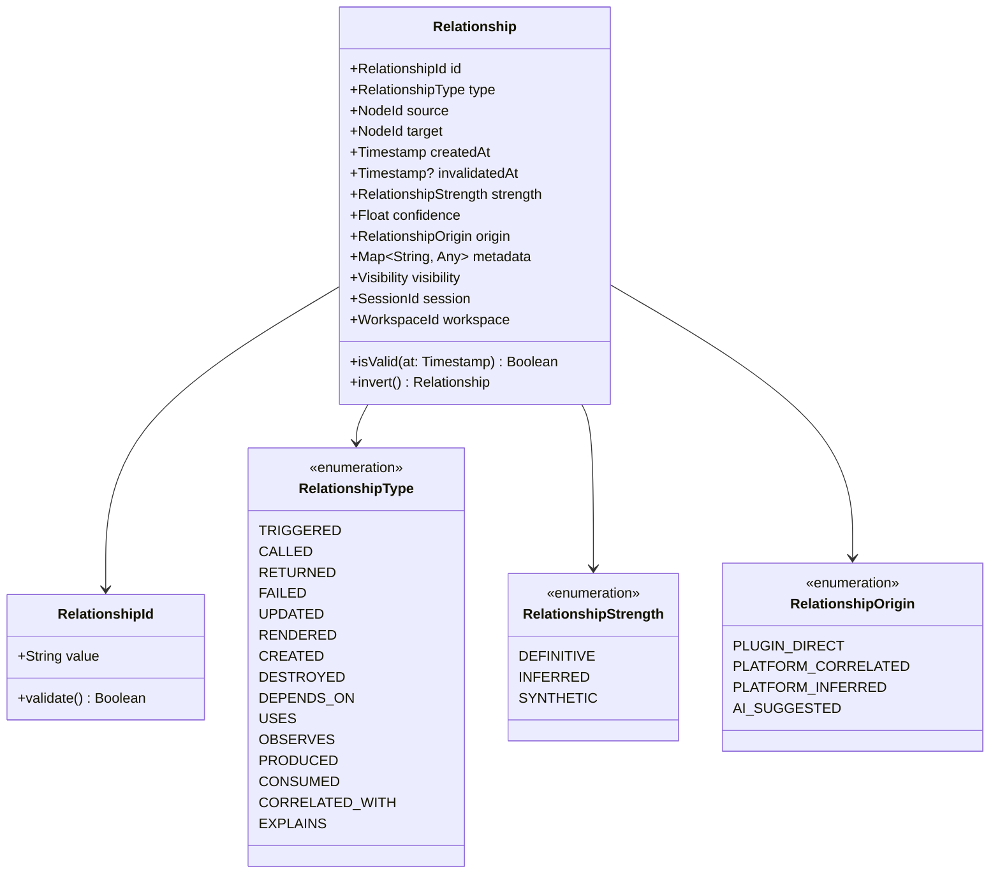

#### Relationship Fields

| Field | Type | Description |
|-------|------|-------------|
| `id` | `RelationshipId` | Stable, globally unique identifier within the Workspace |
| `type` | `RelationshipType` | Semantic classification of the relationship |
| `source` | `NodeId` | The node the edge originates from |
| `target` | `NodeId` | The node the edge points to |
| `createdAt` | `Timestamp` | When this relationship was first recorded |
| `invalidatedAt` | `Timestamp?` | When this relationship was superseded or invalidated; `null` means currently valid |
| `strength` | `RelationshipStrength` | Whether this relationship is directly observed, inferred, or synthetic |
| `confidence` | `Float [0.0–1.0]` | Degree of certainty; `1.0` for directly observed, lower for correlated or inferred |
| `origin` | `RelationshipOrigin` | Which system produced this relationship |
| `metadata` | `Map<String, Any>` | Plugin-owned or platform-owned contextual data |
| `visibility` | `Visibility` | Access control scope (LOCAL, SESSION, WORKSPACE) |

#### Relationship Strength

| Strength | Meaning | Typical `confidence` |
|----------|---------|---------------------|
| `DEFINITIVE` | Directly observed by a plugin via instrumentation. The relationship is a fact. | `1.0` |
| `INFERRED` | Derived by the platform from correlation identifiers, timing, or structural patterns. Highly likely but not directly observed. | `0.7–0.95` |
| `SYNTHETIC` | Created to represent an architectural or causal link that cannot be directly observed (e.g., a plugin expressing that its Container hosts a Database). | `0.5–0.8` |

Consumers that require only observed facts should filter on `strength = DEFINITIVE`. Analysis systems and AI Consumers may leverage inferred and synthetic relationships with appropriate weighting.

#### Relationship Directionality

All Relationships are directional. The direction encodes the semantic flow of the relationship type:

- `TRIGGERED`: the causing node is the source, the caused node is the target.
- `CALLED`: the caller is the source, the callee is the target.
- `RETURNED`: the function or query that produced a result is the source; the result node is the target.
- `DEPENDS_ON`: the node that requires something is the source; the thing it requires is the target.

Bidirectional traversal is supported by the graph engine. When traversing upstream (following edges backward), the engine inverts source and target. The semantic meaning of an inverted relationship is the logical converse: `CALLED` becomes "was called by", `TRIGGERED` becomes "was triggered by."

#### Relationship Multiplicity

Multiple Relationships of different types between the same pair of nodes are valid. Multiple Relationships of the same type between the same pair of nodes are also valid when they represent distinct interactions:

- A route handler that called the same database query twice within one request produces two `CALLED` edges, each with a distinct `RelationshipId` and `createdAt` timestamp.
- The same button component that triggered two separate requests produces two `TRIGGERED` edges.

The graph engine does not deduplicate. Identity is by `RelationshipId`, not by `(source, target, type)`.

#### Relationship Temporal Validity

Relationships carry a `createdAt` and an optional `invalidatedAt` timestamp. A Relationship is considered **valid at time T** if `createdAt ≤ T` and (`invalidatedAt` is null OR `T < invalidatedAt`).

Temporal queries against the graph respect relationship validity windows. A graph snapshot at time T includes only relationships valid at T.

#### Relationship Deletion

Relationships are never physically deleted from the graph's event log. When a relationship is superseded (e.g., a component is unmounted and remounted, creating new edges), the old relationship is invalidated by setting `invalidatedAt` to the relevant event timestamp. The event record retains the full history.

### Complete Relationship Type Reference

#### Inherited from RFC-0001 / RFC-0003

| Type | Direction | Semantics |
|------|-----------|-----------|
| `TRIGGERED` | cause → effect | Source initiated the lifecycle of Target |
| `CALLED` | caller → callee | Source invoked Target as a function, handler, or query |
| `RETURNED` | producer → result | Source completed and produced the result represented by Target |
| `FAILED` | cause → affected | Source caused Target to enter a failed state |
| `UPDATED` | modifier → modified | Source changed the state of Target |
| `RENDERED` | renderer → output | Source caused Target to be presented to the user |
| `CREATED` | creator → created | Source caused Target to come into existence |
| `DESTROYED` | destroyer → destroyed | Source caused Target to cease to exist |
| `DEPENDS_ON` | dependent → dependency | Source requires Target to function correctly |
| `USES` | reader → resource | Source reads from Target without modifying it |
| `OBSERVES` | observer → subject | An Observer plugin monitors Target |

#### New Relationship Types (Defined in this RFC)

##### `PRODUCED`

**Purpose**: Expresses that a source node generated a data artifact or message that became a distinct runtime entity.

`PRODUCED` differs from `RETURNED` in that `RETURNED` models the direct result of a function call or query. `PRODUCED` models the emission of an output into a shared channel, queue, or stream where the output has an independent lifecycle.

**Examples**:
- `KafkaProducer → PRODUCED → KafkaMessage`
- `BackgroundWorker → PRODUCED → JobResult`
- `WebhookHandler → PRODUCED → WebhookPayload`
- `PostgreSQLTrigger → PRODUCED → NotificationEvent`

**Traversal behavior**: Forward traversal from a producer node follows `PRODUCED` edges to find all outputs generated. Backward traversal from a message node follows `PRODUCED` edges to find the node that created it.

**Creation rules**: Created by the plugin that instruments the producing system. Must reference both the producing node and the produced entity node, both of which must exist in the graph before the relationship is recorded.

**Deletion rules**: Invalidated when the produced artifact is acknowledged, consumed, or expired.

---

##### `CONSUMED`

**Purpose**: Expresses that a target node processed, read, or acknowledged a data artifact produced by another node.

`CONSUMED` is the counterpart to `PRODUCED`. Together they model message-passing architectures: producers emit messages, consumers receive them, and the `CORRELATED_WITH` relationship links the two ends when they refer to the same logical operation.

**Examples**:
- `KafkaMessage → CONSUMED → KafkaConsumer`
- `JobQueue → CONSUMED → WorkerProcess`
- `EventStream → CONSUMED → AnalyticsPipeline`
- `DomainEvent → CONSUMED → EventHandler`

**Traversal behavior**: Forward traversal from a message node follows `CONSUMED` edges to find all consumers. Backward traversal from a consumer node follows `CONSUMED` edges to find what it has processed.

**Creation rules**: Created by the plugin that instruments the consuming system. The consuming node must exist in the graph. The consumed artifact node must exist or be discoverable by correlation ID.

**Deletion rules**: A `CONSUMED` relationship is considered complete (not deleted) once the consumer acknowledges or processes the message. It persists in the graph as a historical record.

---

##### `CORRELATED_WITH`

**Purpose**: Expresses that two Runtime Nodes represent the same logical operation observed from different Domain perspectives.

Cross-domain linking is the most complex challenge in the Runtime Graph. When a browser issues an HTTP request, the Browser Domain creates an `HttpRequest` node. When the backend receives that same request, the Node.js Domain creates a `Route` node. These are two different Runtime Nodes, created by two different plugins, representing two perspectives on the same logical event. `CORRELATED_WITH` is the edge that links them.

`CORRELATED_WITH` is undirected in semantic meaning but is stored as bidirectional edges (`A → CORRELATED_WITH → B` and `B → CORRELATED_WITH → A`) for consistent traversal. The platform may store only one canonical direction; the query engine resolves both.

**Examples**:
- `BrowserHttpRequest ↔ CORRELATED_WITH ↔ BackendRoute`
- `KafkaProducerMessage ↔ CORRELATED_WITH ↔ KafkaConsumerMessage`
- `FrontendSession ↔ CORRELATED_WITH ↔ BackendAuthSession`
- `OutboundRPCCall ↔ CORRELATED_WITH ↔ InboundRPCHandler`

**Correlation mechanisms**:
- **Trace ID propagation**: A unique ID injected into an HTTP header (e.g., `X-Observer-Trace-Id`) is read by both the browser plugin and the backend plugin.
- **Timing correlation**: When trace IDs are unavailable, the platform correlates by URL, method, timestamp proximity, and payload fingerprint (lower confidence, `INFERRED` strength).
- **Plugin-declared correlation**: A plugin explicitly emits a `CORRELATED_WITH` event naming both nodes.

**Traversal behavior**: `CORRELATED_WITH` edges are traversed during cross-domain expansion. When the Runtime Explorer expands a browser request node, traversal follows `CORRELATED_WITH` to find the corresponding backend route.

**Creation rules**: Preferably created by the platform's cross-domain correlation engine using trace IDs. May be created by plugins when they have direct knowledge of cross-domain identity.

**Deletion rules**: `CORRELATED_WITH` relationships are permanent historical records. They are not invalidated when the correlated nodes complete.

---

##### `EXPLAINS`

**Purpose**: Expresses that a Runtime Node provides explanatory context for another Runtime Node.

`EXPLAINS` is a meta-relationship. It does not model a causal or operational dependency in the runtime. It models an epistemic relationship: "understanding node A requires understanding node B."

`EXPLAINS` relationships are primarily created by the platform's Context Engine and by AI Consumers. They encode the results of contextual analysis in the graph itself, making that analysis reusable by other consumers.

**Examples**:
- `ExceptionThrown → EXPLAINS → HttpRequest` (the exception provides context for why the request failed)
- `ConfigurationNode → EXPLAINS → DatabaseQuery` (a misconfigured timeout explains why the query is slow)
- `ReactErrorBoundary → EXPLAINS → ComponentTree` (the error boundary explains the behavior of the subtree it guards)
- `FeatureFlag → EXPLAINS → CodePathNode` (a flag value explains why a specific code path was taken)

**Traversal behavior**: `EXPLAINS` edges are traversed by the Context Engine when assembling evidence for a Context package. They are not traversed by default in operational traversals (causal chains, dependency traversal) unless the consumer opts in.

**Creation rules**: May be created by the Context Engine, by AI Consumers via the feedback API, or by plugins that have direct knowledge of explanatory relationships (e.g., a configuration plugin that knows a specific setting influenced a specific query). Human annotations also produce `EXPLAINS` edges.

**Deletion rules**: `EXPLAINS` relationships may be invalidated if the configuration or context they represent changes. AI-generated `EXPLAINS` relationships should be tagged with `origin = AI_SUGGESTED` and may be pruned by the platform if they are superseded or disproven.

---

### Graph Node Lifecycle

Within the Runtime Graph, individual node lifecycle is governed by the state machine defined in RFC-0003. At the graph level, we additionally specify how node lifecycle transitions interact with the graph structure.

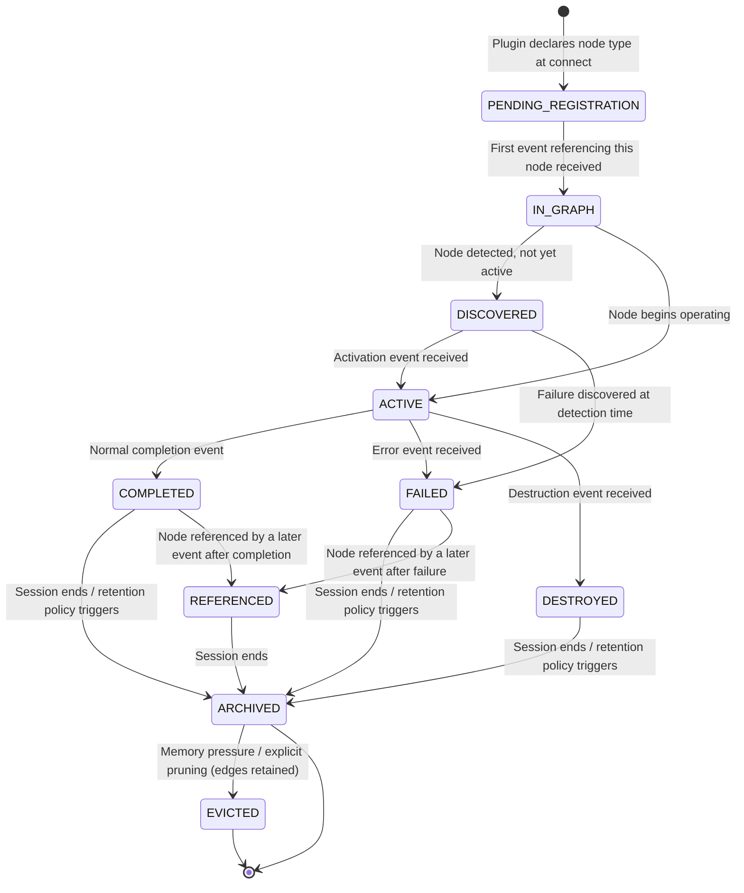

**PENDING_REGISTRATION**: The platform knows the node type exists (plugin has declared it) but no events for specific node instances have been received yet.

**IN_GRAPH**: A node enters the graph the moment the first event referencing its `NodeId` is processed. The node is then assigned a lifecycle status (`DISCOVERED` or `ACTIVE`) based on the event type.

**REFERENCED**: A completed or failed node that receives subsequent references (e.g., a DB result node referenced by a later Context Engine annotation). The node remains accessible and is not archived until the Session ends.

**EVICTED**: Under memory pressure, the platform may evict the node object from the in-memory graph while retaining its edges and its entry in the event log. Evicted nodes can be reconstructed on demand from the event log.

---

## Graph Traversal

The Runtime Graph supports multiple traversal strategies. The correct strategy depends on the question being asked. This section defines the strategies, their traversal semantics, and the rules that govern algorithm selection.

### Traversal Algorithm Selection

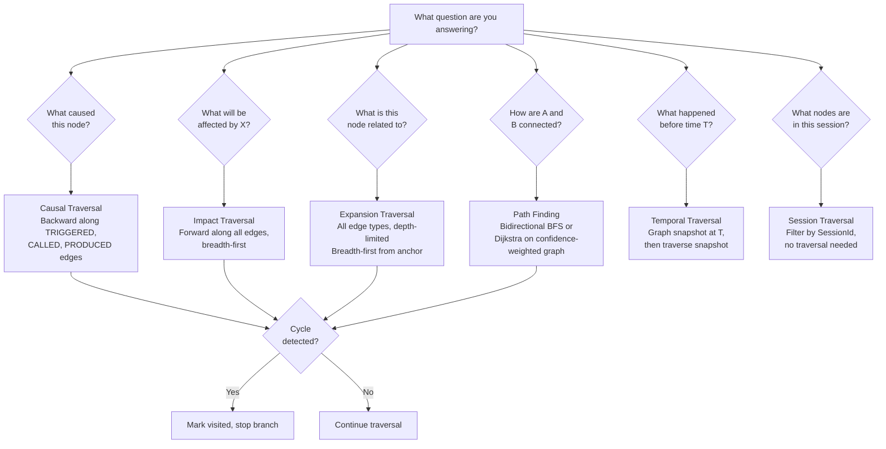

### Depth-First Traversal

**Use case**: Tracing a complete causal chain from a root cause node forward through all its effects. Finding all leaves in a connected component.

**Algorithm**: Standard DFS with a visited set for cycle detection. Visits a node, then recursively visits each unvisited neighbor before backtracking.

**Traversal options**:
- `direction`: `FORWARD` (follow edges source → target), `BACKWARD` (follow edges target → source), or `BOTH`.
- `edgeTypes`: Filter by specific Relationship types. If empty, all types are traversed.
- `maxDepth`: Hard limit on traversal depth. Default: platform-configured (e.g., 20).
- `domainFilter`: Restrict traversal to specific Domains.
- `statusFilter`: Skip nodes in specified statuses (e.g., skip ARCHIVED nodes).

**Cycle handling**: The visited set is keyed by `NodeId`. When a node already in the visited set is encountered, the branch is terminated without revisiting. The traversal result includes a `cyclesDetected: Boolean` flag.

### Breadth-First Traversal

**Use case**: Expanding a node to its immediate neighbors. Discovering the full impact radius of an event at increasing depth levels. Building the "neighborhood" of a node for display in the Runtime Explorer.

**Algorithm**: Standard BFS using a queue and a visited set.

**Priority BFS**: When `confidence`-weighted traversal is enabled, the queue becomes a priority queue sorted by descending edge confidence. High-confidence (DEFINITIVE) relationships are explored before lower-confidence (INFERRED, SYNTHETIC) relationships.

### Causal Traversal

**Use case**: "Why did this happen?" Tracing backward from a failure, an anomaly, or a point of interest to its causal ancestors.

**Algorithm**: Backward BFS or DFS that preferentially follows `TRIGGERED`, `CALLED`, `RETURNED` (inverted), and `PRODUCED` (inverted) edges. Also follows the `causedBy` field on RuntimeEvents as a secondary traversal path.

**Causal depth limit**: Causal traversals terminate when they reach a node with no incoming causal edges (a root cause node), when they exceed `maxDepth`, or when they cross a configurable number of Domain boundaries.

**Result structure**: A causal traversal returns an ordered causal chain (the most direct path from root to anchor), plus the full causal subgraph (all nodes reachable via causal edges).

### Impact Traversal

**Use case**: "What was affected by this change?" Forward traversal from a modified node to all nodes that may have been influenced.

**Algorithm**: Forward BFS following `TRIGGERED`, `UPDATED`, `RETURNED`, `PRODUCED`, and `CONSUMED` edges. Does not follow `DEPENDS_ON` or `USES` edges by default (those represent static structural dependencies, not dynamic propagation).

**Impact radius**: Consumers can specify a `maxImpactDepth` to limit the blast radius. The Context Engine uses `maxImpactDepth = 5` by default for Context package assembly.

### Path Finding

**Use case**: "How is node A connected to node B?" Useful for understanding indirect dependencies, unexpected connections, and the shortest explanation between two observed facts.

**Algorithm**: Bidirectional BFS. Simultaneously explores outward from both A and B; terminates when the two frontiers meet.

**Weighted path finding**: When `useConfidenceWeighting = true`, the algorithm uses Dijkstra's shortest path with edge cost `1.0 - confidence`. This finds the most confidently-supported path rather than the shortest hop count.

**No path result**: If no path exists between A and B within the current graph (they are in separate Connected Components with no cross-domain links), the platform returns `null` with a diagnostic message indicating they are in distinct components.

### Temporal Traversal

**Use case**: "What was the state of the graph at time T?" Historical investigation, replay, and before/after comparison.

**Algorithm**: The `TemporalIndex` maps timestamps to `GraphVersion` records. The engine reconstructs a `GraphSnapshot` at the requested time by applying all events up to `T` to an empty graph. For performance, the engine may maintain pre-computed snapshots at configurable checkpoints.

**Incremental reconstruction**: When the requested time T is close to an existing checkpoint, the engine starts from that checkpoint and applies only the events between the checkpoint and T. This reduces reconstruction time for large graphs.

### Context Traversal

**Use case**: "What is the relevant subgraph for answering this question?" Used by the Context Engine to assemble context packages.

**Algorithm**: Multi-strategy traversal anchored on a seed node or event. The engine:
1. Performs causal traversal backward from the anchor to find contributing causes.
2. Performs impact traversal forward from the anchor to find affected nodes.
3. Expands `CORRELATED_WITH` edges to pull in cross-domain peers.
4. Follows `EXPLAINS` edges to include contextually relevant nodes.
5. Scores each discovered node by relevance (distance from anchor, relationship type weight, node status).
6. Prunes the result to the top-N nodes by score, respecting a configurable size budget.

Context traversal is the most computationally intensive traversal type. It is always executed asynchronously and may be cached with a short TTL.

### Session Traversal

**Use case**: "What nodes exist within Session Z?" Pure index lookup, not a graph traversal.

**Algorithm**: The graph maintains a `sessionIndex` mapping each `SessionId` to the set of `NodeId` values added during that Session. Session traversal resolves this index directly. No edge traversal is required.

### Graph Query Language

The RGM defines a structured query interface for programmatic access. Queries are expressed as `GraphQuery` objects rather than a string query language, to avoid parsing overhead and ensure type safety.

```typescript
interface GraphQuery {
  // Node filters
  nodeTypes?: NodeType[];
  nodeStatuses?: NodeStatus[];
  domains?: DomainId[];
  sessions?: SessionId[];
  nodeMetadataFilter?: MetadataFilter;

  // Edge filters
  relationshipTypes?: RelationshipType[];
  relationshipStrengths?: RelationshipStrength[];

  // Temporal filters
  createdAfter?: Timestamp;
  createdBefore?: Timestamp;
  validAt?: Timestamp;

  // Traversal options
  traversal?: TraversalOptions;

  // Result options
  limit?: number;
  offset?: number;
  includeRelationships?: boolean;
  includeMetadata?: boolean;
}

interface TraversalOptions {
  strategy: 'DFS' | 'BFS' | 'CAUSAL' | 'IMPACT' | 'PATH' | 'CONTEXT';
  anchor: NodeId;
  target?: NodeId;              // Required for PATH strategy
  direction: 'FORWARD' | 'BACKWARD' | 'BOTH';
  maxDepth: number;
  edgeTypes?: RelationshipType[];
  domainFilter?: DomainId[];
  useConfidenceWeighting?: boolean;
  includeCycles?: boolean;
}
```

**Example queries (English → GraphQuery)**:

| Question | Query strategy |
|----------|---------------|
| Find every request originated from Button X | `{ nodeTypes: ['HttpRequest'], traversal: { strategy: 'IMPACT', anchor: buttonXNodeId, direction: 'FORWARD', edgeTypes: ['TRIGGERED'] } }` |
| Find all downstream failures from query Y | `{ nodeStatuses: ['FAILED'], traversal: { strategy: 'IMPACT', anchor: queryYNodeId, direction: 'FORWARD' } }` |
| Find every React component affected by API Z | `{ nodeTypes: ['ReactComponent'], traversal: { strategy: 'IMPACT', anchor: apiZNodeId, direction: 'FORWARD', edgeTypes: ['UPDATED', 'RENDERED'] } }` |
| Find every node in Session S | `{ sessions: ['S'], limit: 1000 }` |
| Find shortest causal path between A and B | `{ traversal: { strategy: 'PATH', anchor: nodeAId, target: nodeBId, useConfidenceWeighting: true } }` |
| Find all nodes modified after Event E | `{ createdAfter: eventE.occurredAt }` |

---

## Temporal Graph Model

### Philosophy

The Runtime Graph exists across time, not just at a single instant. Observer is a forensic instrument as much as it is a live monitor. An engineer investigating a bug that occurred thirty minutes ago needs to reconstruct the exact graph state at the moment of failure — not the current state, which may have already recovered.

The temporal model gives every graph state a timestamp and makes historical states queryable. It is built on the append-only event log from RFC-0004 and requires no additional storage of full historical graph copies (though caching checkpoints is permitted for performance).

### Graph Versions

Every mutation to the Runtime Graph produces a new `GraphVersion`. A version records:
- Its sequence number (monotonically increasing integer)
- The timestamp of the causative event
- The `EventId` of the causative event

The version sequence is the authoritative ordering of graph states. When events arrive with `occurredAt` timestamps out of order (due to instrumentation latency), the version sequence reflects the order in which the platform processed them. The `TemporalIndex` maps wall-clock timestamps to version sequences for point-in-time queries.

### Incremental Updates

The graph is always updated incrementally. When a plugin emits a `RuntimeEvent`:

1. The platform applies the event to the current graph state (upsert node, add edge, update node status).
2. A new `GraphVersion` is recorded pointing to this event.
3. The `TemporalIndex` is updated with the new version.
4. Subscribers are notified of the incremental change (the delta, not the full graph).

Full graph snapshots are taken at configurable checkpoints (e.g., every 100 versions, every 30 seconds, or when a Session ends). Snapshots are not the primary storage format — they are a performance optimization for reconstruction.

### Node Evolution

A Runtime Node may change many times during its lifetime. Each change is recorded as a `RuntimeEvent`. The node object held by the graph engine reflects the current (most recently applied) state. Previous states are accessible by:

1. Querying the `TemporalIndex` for the graph version at time T.
2. Requesting the node's state at that version (via event log replay or snapshot lookup).

The platform does not guarantee in-memory retention of all historical node states. Retention is governed by the graph's `config.retentionWindow`. Historical states outside the retention window are accessible only via event log replay.

### Relationship Evolution

Relationships, once created, carry their `createdAt` timestamp permanently. When a relationship becomes invalid (e.g., a component is unmounted, breaking its render relationship), the platform sets `invalidatedAt` on the relationship rather than removing it.

The graph engine's default query mode returns only currently-valid relationships (where `invalidatedAt` is null or in the future). Temporal queries include all relationships valid at the queried timestamp, including those subsequently invalidated.

### Historical Reconstruction

To reconstruct the graph at any historical point T:

```
function reconstructAt(T: Timestamp): RuntimeGraph {
  checkpoint = temporalIndex.nearestCheckpointBefore(T)
  graph = checkpoint != null ? checkpoint.graph.clone() : new RuntimeGraph()
  events = eventLog.eventsBetween(checkpoint?.timestamp ?? START, T)
  for event in events.orderedByOccurredAt():
    graph.apply(event)
  return graph
}
```

The reconstruction produces an exact replica of the graph state at T, including node statuses, metadata, and relationship validity, as they existed at that moment.

### Replay

Replay is a distinct operation from historical reconstruction. Reconstruction produces a static snapshot. Replay re-executes the event sequence and drives the graph through each intermediate state, notifying subscribers at each step. Replay is used by:

- The Runtime Explorer's playback feature
- The Session Engine's replay capability
- Integration tests that validate plugin behavior against a recorded event stream

Replay always operates at a user-configurable speed multiplier. At `1.0x`, events are replayed with their original inter-event timing. At `0.0x` (step mode), the user advances the replay manually.

---

## Cross-Domain Graph

The defining capability of the Runtime Graph — the capability that distinguishes Observer from every existing observability tool — is the **unified cross-domain graph**: a single connected graph that spans all runtime environments simultaneously.

### The Cross-Domain Problem

Each Domain plugin observes a slice of the runtime independently. The Browser plugin sees the `HttpRequest` node. The Node.js plugin sees the `Route` node. Neither plugin, in isolation, knows about the other's node. Neither plugin can create the `CORRELATED_WITH` edge that connects them.

The platform is responsible for cross-domain linking. It does this through the **Cross-Domain Correlation Engine**, a component of the Runtime Graph layer that matches nodes across Domains using correlation identifiers and pattern matching.

### Correlation Strategies

#### Strategy 1: Trace ID Propagation (DEFINITIVE)

The preferred strategy. Each browser request is assigned a unique `X-Observer-Trace-Id` header value before dispatch. The Browser Domain plugin injects this header and records it in the `HttpRequest` node's metadata. The backend Domain plugin reads this header from the incoming request and records it in the `Route` node's metadata. The platform's Cross-Domain Correlation Engine scans for matching trace IDs and creates a `CORRELATED_WITH` relationship with `strength = DEFINITIVE, confidence = 1.0`.

This strategy requires no coordination between Domain plugins. Each plugin independently records the trace ID. The platform performs the correlation.

#### Strategy 2: Request Fingerprint Matching (INFERRED)

When trace ID propagation is unavailable (legacy endpoints, third-party services, or non-HTTP protocols), the platform correlates by fingerprint: `(url, method, timestamp, payload-hash)`. A browser `POST /api/orders` at `T` with a specific body hash is correlated with a backend `Route POST /api/orders` at `T + δ` (where δ falls within a configurable latency window).

This strategy produces `strength = INFERRED, confidence = 0.85` relationships by default. Confidence degrades with timestamp delta and ambiguity (multiple matching requests in the window).

#### Strategy 3: Plugin-Declared Correlation

A plugin may explicitly emit a `CORRELATED_WITH` event naming two nodes. This is used when the plugin has direct knowledge of cross-domain identity — for example, a message broker plugin that knows the producer message ID and the consumer message ID refer to the same logical message.

Plugin-declared correlations receive `strength = DEFINITIVE` if emitted by a trusted plugin, `strength = INFERRED` otherwise.

### The Full Cross-Domain Request Path

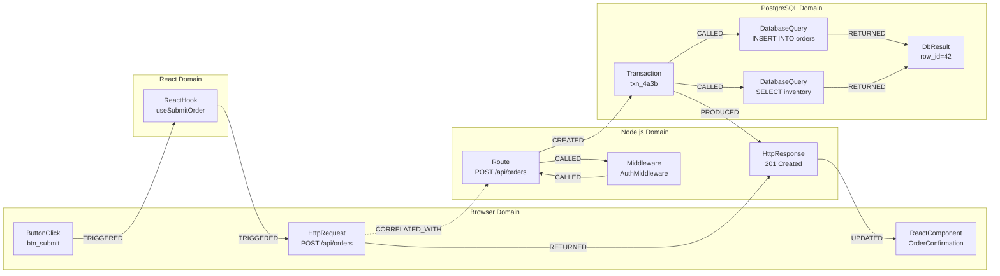

This graph is the canonical representation of a complete request cycle. Dashed edges (CORRELATED_WITH) cross Domain boundaries and are formed by the platform's correlation engine. Solid edges are formed by individual Domain plugins.

---

## Platform Integrations

### Integration with the Runtime Explorer

The Runtime Explorer (RFC-0009) is a read-only consumer of the Runtime Graph. It never writes to the graph directly. Its integration contract with the Runtime Graph is:

#### Navigation

The Explorer requests a starting node (by ID or by query) and receives its full node object including all currently-valid relationships. From there, it follows edges by requesting neighboring nodes via the `EXPAND` operation.

#### Expansion

When a user expands a node in the Explorer, the platform executes a depth-limited BFS (default depth 2) from the selected node and returns the resulting subgraph. The Explorer renders only what the graph provides — it does not perform its own relationship inference.

#### Filtering

The Explorer passes `GraphQuery` filters (by node type, Domain, status, time range) to the graph engine. The graph engine executes the query and returns a filtered node set. The Explorer renders the result.

#### Watching

The Explorer subscribes to graph delta notifications for a specific subgraph. When any node in the watched subgraph changes, the graph engine pushes the delta (not the full graph) to the Explorer. The Explorer applies the delta locally.

#### Searching

Full-text and field-value search across nodes is delegated to the graph engine's query interface. The Explorer passes a `GraphQuery` with a `nodeMetadataFilter` and receives a ranked list of matching nodes.

#### Focus Mode

In Focus Mode, the Explorer requests a `context traversal` subgraph anchored on the selected node. The graph engine executes the Context Traversal algorithm and returns a scored, pruned subgraph representing the most relevant neighborhood.

#### Bookmarks

Bookmarks are stored as named graph queries (`GraphQuery` + label). When a bookmark is activated, the Explorer re-executes the stored query against the current graph.

### Integration with the Timeline Engine

The Timeline Engine (RFC-0004 domain) projects the Runtime Graph onto a time axis. Its relationship with the Runtime Graph is:

#### Timeline Generation

A Timeline for a given node is generated by querying the graph's `TemporalIndex` for all events with `sourceNode = nodeId OR nodeId in affectedNodes`. The events are returned in `occurredAt` order. The Timeline Engine processes these events into a human-readable Timeline structure.

#### Event Ordering

The Timeline Engine respects the dual-timestamp model: `occurredAt` governs the visual ordering in the Timeline; `recordedAt` governs the storage ordering in the event log. When events arrive with out-of-order `occurredAt` timestamps, the Timeline Engine inserts them at their correct position in the Timeline (not at the end).

#### Causal Ordering

For events where `occurredAt` timestamps are identical (common in synthetic or replay scenarios), the Timeline Engine uses causal ordering: an event with `causedBy = X` is always positioned after event X, regardless of timestamp.

#### Graph Replay

Replay from the Timeline Engine is implemented as a sequence of temporal graph queries at increasing T values. The Timeline Engine controls the replay cursor; the graph engine provides graph state at each cursor position.

#### Timeline Reconstruction

A Timeline can be reconstructed for any past time range by querying the event log, even after the live Runtime Graph has been archived. The Timeline Engine accesses the event log directly for historical reconstruction, bypassing the in-memory graph.

### Integration with the Context Engine

The Context Engine (RFC-0007) assembles Context packages from Runtime Graph subgraphs. Its relationship with the Runtime Graph is:

#### Relevant Subgraph Extraction

When the Context Engine receives a query (an anchor event, a node of interest, or a natural language question), it executes a Context Traversal from the anchor. The graph engine returns a scored subgraph. The Context Engine refines this subgraph based on the specific question being answered.

#### Graph Scoring

Each node in the Context Traversal result carries a relevance score assigned by the graph engine. The score is computed from:
- Graph distance from the anchor (closer = higher score)
- Relationship type weight (causal edges score higher than structural edges)
- Node status (`FAILED` and `COMPLETED` nodes score higher than `ACTIVE` nodes for post-hoc analysis)
- Temporal recency (more recent nodes score higher for live investigations)

The Context Engine may re-weight these scores based on the specific question type.

#### Relationship Weighting

For Context assembly, different Relationship types contribute differently to context relevance:

| Relationship Type | Context Weight |
|------------------|---------------|
| `TRIGGERED` | 1.0 (highest — direct causal link) |
| `CALLED` | 0.95 |
| `FAILED` | 0.95 (failure context is highly relevant) |
| `RETURNED` | 0.85 |
| `EXPLAINS` | 0.9 |
| `CORRELATED_WITH` | 0.85 |
| `UPDATED` | 0.75 |
| `PRODUCED` | 0.75 |
| `CONSUMED` | 0.7 |
| `CREATED` | 0.65 |
| `RENDERED` | 0.6 |
| `DEPENDS_ON` | 0.5 |
| `USES` | 0.45 |
| `OBSERVES` | 0.2 (lowest — meta-relationship) |
| `DESTROYED` | 0.3 |
| `SYNTHETIC` (any) | 0.4 |

#### Evidence Extraction

The Context Engine extracts graph evidence (specific nodes and relationships that answer the question) by walking the scored subgraph. Each extracted node becomes a structured fact in the Context package. Each extracted relationship becomes an explanatory link.

#### Context Generation

The final Context package includes the subgraph itself (as a serialized graph fragment), the scored node list, extracted evidence facts, and traversal metadata (anchor, strategy used, depth reached). AI Consumers receive the full package and may traverse the subgraph themselves.

### Integration with Plugins

Plugins interact with the Runtime Graph exclusively through the Plugin SDK (RFC-0008). The integration contract is:

#### Graph Contribution via Events

Plugins never write to the Runtime Graph directly. They emit `RuntimeEvents` via the SDK. The platform applies those events to the graph. This separation guarantees:

1. No plugin can corrupt the graph state of another plugin's Domain.
2. The event log remains the single source of truth regardless of plugin behavior.
3. Cross-domain relationships can be formed by the platform without plugin cooperation.

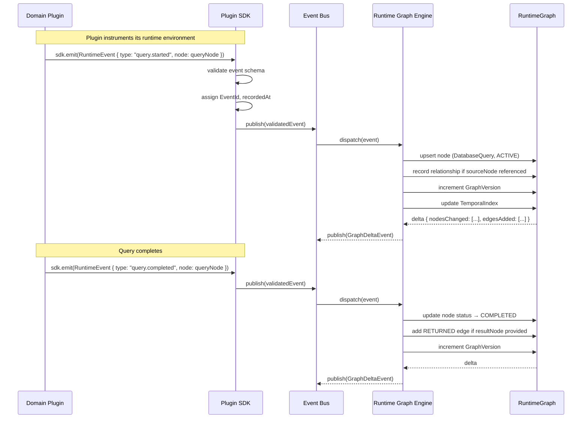

#### Plugin Registration and Graph Contribution

When a plugin connects to Observer, it performs two registrations with the graph engine:

1. **Node type registration**: The plugin declares all node types it produces, including metadata schema version and capability declarations.
2. **Relationship type declaration**: The plugin declares which Relationship types it will create and the rules under which it creates them.

The graph engine validates incoming events against these declarations. Events that reference undeclared node types are rejected with a typed error. Events that create undeclared relationship types are quarantined for operator review.

#### Plugin Isolation

A plugin may only create or modify nodes in its own Domain. A plugin event that references a node in a foreign Domain (e.g., a React plugin event referencing a PostgreSQL query node as its `sourceNode`) is rejected by the graph engine with a `DomainIsolationError`.

Cross-domain relationships (e.g., `CORRELATED_WITH`) are created by the platform, not by plugins. A plugin may request cross-domain correlation by emitting a `CorrelationHint` event that names the correlation identifier, but the actual relationship is created by the platform's Cross-Domain Correlation Engine after validation.

#### Plugin Version Compatibility

When a plugin connects with a new schema version for an existing node type, the graph engine:
1. Creates a new version entry in the node type registry.
2. Applies the new schema to all future nodes of that type.
3. Retains the old schema for historical nodes (used during reconstruction and replay).
4. Notifies consumers that the schema has changed.

Breaking schema changes (removing required fields, changing field types) require a major version increment. The graph engine maintains consumers' subscriptions against the schema version they registered with, applying transformation if needed.

---

## Interfaces

### RuntimeGraph TypeScript Interface

```typescript
interface RuntimeGraph {
  readonly id: GraphId;
  readonly workspace: WorkspaceId;
  readonly session: SessionId;
  readonly version: GraphVersion;
  readonly status: GraphStatus;
  readonly createdAt: Timestamp;
  readonly updatedAt: Timestamp;

  // Primary indexes
  readonly nodes: ReadonlyMap<NodeId, RuntimeNode>;
  readonly edges: ReadonlyMap<RelationshipId, Relationship>;

  // Structural indexes
  readonly subgraphs: ReadonlyMap<DomainId, Subgraph>;
  readonly components: ReadonlyMap<string, ConnectedComponent>;
  readonly temporalIndex: TemporalIndex;
  readonly crossDomainIndex: CrossDomainIndex;

  // Metrics and config
  readonly metrics: GraphMetrics;
  readonly config: GraphConfig;

  // Mutation (platform-internal only — plugins use Event emission)
  apply(event: RuntimeEvent): GraphDelta;

  // Traversal
  traverse(opts: TraversalOptions): TraversalResult;
  query(q: GraphQuery): QueryResult;

  // Subgraph extraction
  subgraph(anchor: NodeId, depth: number): RuntimeGraph;
  connectedComponent(nodeId: NodeId): ConnectedComponent | null;

  // Temporal operations
  snapshot(): GraphSnapshot;
  snapshotAt(t: Timestamp): GraphSnapshot;
  replay(opts: ReplayOptions): ReplaySession;

  // Utility
  hasNode(nodeId: NodeId): boolean;
  hasEdge(relId: RelationshipId): boolean;
  neighborsOf(nodeId: NodeId, direction?: EdgeDirection): NodeId[];
  edgesBetween(a: NodeId, b: NodeId): Relationship[];
  pathBetween(a: NodeId, b: NodeId, opts?: PathOptions): Path | null;
}

type GraphStatus =
  | 'INITIALIZING'
  | 'ACTIVE'
  | 'SUSPENDED'
  | 'FINALIZING'
  | 'FINALIZED'
  | 'ARCHIVED';

interface GraphDelta {
  readonly version: GraphVersion;
  readonly nodesAdded: RuntimeNode[];
  readonly nodesUpdated: Array<{ before: RuntimeNode; after: RuntimeNode }>;
  readonly nodesRemoved: NodeId[];
  readonly edgesAdded: Relationship[];
  readonly edgesInvalidated: RelationshipId[];
  readonly causedBy: EventId;
}

interface GraphSnapshot {
  readonly id: SnapshotId;
  readonly graphId: GraphId;
  readonly version: GraphVersion;
  readonly takenAt: Timestamp;
  readonly nodes: ReadonlyMap<NodeId, RuntimeNode>;
  readonly edges: ReadonlyMap<RelationshipId, Relationship>;
  readonly metrics: GraphMetrics;
}

interface TraversalResult {
  readonly nodes: RuntimeNode[];
  readonly edges: Relationship[];
  readonly rootNode: NodeId;
  readonly strategy: TraversalStrategy;
  readonly depth: number;
  readonly cyclesDetected: boolean;
  readonly truncated: boolean;  // true if maxDepth was reached
  readonly scores?: Map<NodeId, number>;  // populated by CONTEXT strategy
}

interface Path {
  readonly nodes: NodeId[];
  readonly edges: RelationshipId[];
  readonly totalConfidence: number;
  readonly hopCount: number;
}
```

### Relationship TypeScript Interface

```typescript
interface Relationship {
  readonly id: RelationshipId;
  readonly type: RelationshipType;
  readonly source: NodeId;
  readonly target: NodeId;
  readonly createdAt: Timestamp;
  readonly invalidatedAt?: Timestamp;
  readonly strength: RelationshipStrength;
  readonly confidence: number;  // [0.0, 1.0]
  readonly origin: RelationshipOrigin;
  readonly metadata: Record<string, unknown>;
  readonly visibility: Visibility;
  readonly session: SessionId;
  readonly workspace: WorkspaceId;

  isValid(at?: Timestamp): boolean;
  invert(): Relationship;  // returns inverse logical relationship
}

type RelationshipType =
  | 'TRIGGERED' | 'CALLED' | 'RETURNED' | 'FAILED'
  | 'UPDATED' | 'RENDERED' | 'CREATED' | 'DESTROYED'
  | 'DEPENDS_ON' | 'USES' | 'OBSERVES'
  | 'PRODUCED' | 'CONSUMED' | 'CORRELATED_WITH' | 'EXPLAINS';

type RelationshipStrength = 'DEFINITIVE' | 'INFERRED' | 'SYNTHETIC';
type RelationshipOrigin =
  | 'PLUGIN_DIRECT'
  | 'PLATFORM_CORRELATED'
  | 'PLATFORM_INFERRED'
  | 'AI_SUGGESTED';
```

---

## Examples

### Example 1: React + Express Application

A full-stack application with a React frontend and an Express.js backend. A user submits a form that triggers a POST request, which the backend handles, queries a PostgreSQL database, and responds.

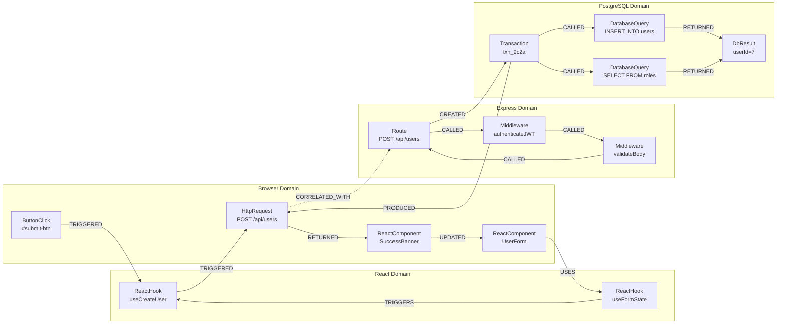

**Key observations**:
- The dashed `CORRELATED_WITH` edge between `HttpRequest` (Browser Domain) and `Route` (Express Domain) is formed by the platform via trace ID propagation.
- The `Transaction` node groups both database queries — this is the correct model for multi-query operations within a single transaction.
- The `ReactHook: useFormState` is used by the `UserForm` component before the click event — illustrating that the graph captures pre-existing state nodes, not just the click-triggered chain.

### Example 2: Next.js Full-Stack (Server Components + API Routes)

A Next.js application where a Server Component fetches data directly and a Client Component handles interaction.

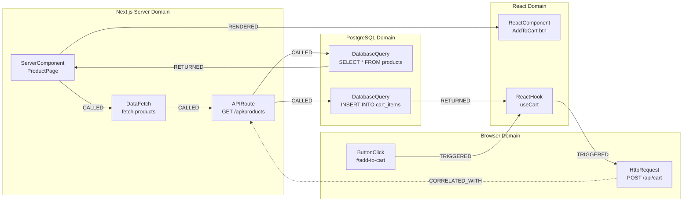

### Example 3: Kafka Message Pipeline

An event-driven architecture where a backend service produces messages to a Kafka topic, and a separate consumer service processes them.

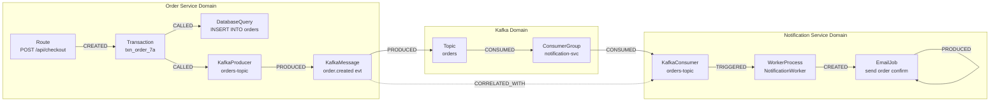

**Key observations**:
- `PRODUCED` models the emission of a Kafka message from the producer to the topic.
- `CONSUMED` models the consumption of the message from the topic by the consumer group, and from the consumer group to the consumer service.
- `CORRELATED_WITH` links the producer's `KafkaMessage` node with the consumer's `KafkaConsumer` node — these are two Domain perspectives on the same logical message. The Kafka Domain plugin creates this link using the Kafka message offset as the correlation identifier.

### Example 4: Docker + Microservices

A multi-service application running in Docker containers. The Docker Domain plugin contributes Container nodes. Cross-domain links connect containers to the services they host.

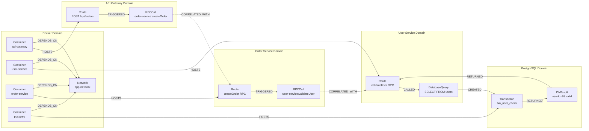

**Key observations**:
- `HOSTS` is a Synthetic Relationship created by the Docker Domain plugin when it detects that a container is running a known service process. Confidence is `0.8` (inferred from process name and port mapping, not directly observed).
- The microservice-to-microservice calls are linked via `CORRELATED_WITH` using request trace IDs propagated through gRPC metadata or HTTP headers.
- The `Network` node represents the Docker network — it is a shared infrastructure dependency for all containers, expressed via `DEPENDS_ON` edges.

### Example 5: Background Worker with Failure Propagation

A background job that fails, propagating failure context back through the graph.

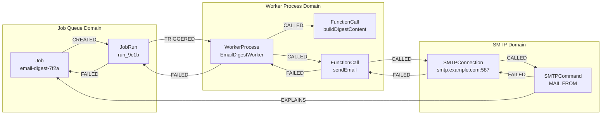

**Key observations**:
- The failure chain propagates backward through `FAILED` edges: the `SMTPCommand` failure causes the `SMTPConnection` to fail, which causes `sendEmail` to fail, which causes the worker to fail, which causes the job run to fail, which causes the job itself to be marked failed.
- The `EXPLAINS` edge from `SMTPCommand` to `Job` is created by the Context Engine once it identifies the root cause. An AI Consumer querying "why did this job fail?" will traverse this `EXPLAINS` edge to the SMTP command failure in one hop, rather than traversing the full failure chain.

---

## Serialization

### Purpose

The Runtime Graph must be serializable for:

| Use case | Requirements |
|----------|-------------|
| Session persistence | Complete, lossless, reconstruct-able from storage |
| Cloud sync | Compact, incremental, conflict-resistant |
| Replay | Ordered event log; graph is reconstructed from events |
| Import / export | Human-readable (JSON), machine-importable |
| AI consumption | Structured, queryable, metadata-inclusive |
| Partial graph transfer | Subgraph extraction without full graph copy |
| Compression | Space-efficient for large graphs |

### Serialization Formats

The RGM defines two serialization formats:

#### Format 1: Full Graph JSON (canonical)

A complete JSON representation of the RuntimeGraph object. This is the canonical format for Session persistence, import, and export. It includes all nodes, all edges (including invalidated edges), full metadata, and the temporal index.

```json
{
  "rgm_version": "0.1",
  "graph": {
    "id": "graph_ws1_sess_7a2b",
    "workspace": "ws1",
    "session": "sess_7a2b",
    "version": { "sequence": 147, "at": "2024-11-15T14:23:01.442Z" },
    "status": "FINALIZED",
    "nodes": {
      "ws1_browser_httpreq_7f2a91b3": { /* RuntimeNode object */ }
    },
    "edges": {
      "rel_ws1_7f2a_to_4c9f_called": { /* Relationship object */ }
    },
    "temporalIndex": {
      "checkpoints": [
        { "version": 100, "at": "2024-11-15T14:22:58.000Z", "snapshotRef": "snap_100" }
      ]
    }
  }
}
```

#### Format 2: Event Log + Seed Snapshot (replay-native)

An ordered JSON array of RuntimeEvent objects, optionally preceded by a seed GraphSnapshot for fast reconstruction. This is the canonical format for replay, long-term archival, and situations where storage efficiency is critical.

The event log format is defined in RFC-0004. The graph can always be reconstructed from the event log alone; the seed snapshot is a performance optimization.

### Partial Graph Serialization

When transferring only a subgraph (e.g., for Context package delivery to an AI Consumer), the serialized format includes:

1. The subgraph's nodes.
2. All edges whose `source` and `target` are both within the subgraph.
3. **Dangling edge stubs**: edges that cross the subgraph boundary, represented with a truncated target/source node (containing only `id`, `type`, and `domain`). This allows consumers to know that a relationship exists beyond the subgraph boundary without receiving the full graph.
4. Traversal metadata: which strategy was used, what the anchor was, and the relevance score of each node.

### Version Compatibility

The `rgm_version` field in serialized graphs ensures forward and backward compatibility. The platform maintains compatibility rules:

- **Minor version increments**: new optional fields added. Old consumers ignore unknown fields. Backward compatible.
- **Major version increments**: field removals or type changes. The platform provides a migration utility. Old consumers must upgrade before loading major-version-incremented graphs.

### Compression

Large graphs (Session graphs containing thousands of nodes) should be compressed before storage and transmission. The platform uses `zstd` compression for graph blobs by default. Compression is applied at the application level (after JSON serialization) and is transparent to consumers.

---

## Performance

### Design Principles

The Runtime Graph is a live, in-memory data structure that is mutated continuously as events arrive. Performance requirements are:

1. **Event application latency**: Applying a single RuntimeEvent to the graph must complete within 1 millisecond for 99% of events under normal load.
2. **Traversal latency**: A depth-5 BFS from any node in a graph of 10,000 nodes must complete within 10 milliseconds.
3. **Query latency**: A `GraphQuery` with two filter conditions must return results within 5 milliseconds for graphs of 10,000 nodes.
4. **Memory footprint**: A graph with 10,000 nodes and 50,000 edges must fit within 200 MB of heap memory.

### Incremental Graph Updates

The graph engine never rebuilds the full graph in response to an event. Every event application is an incremental mutation:

- **Upsert node**: O(1) hash map insertion or update.
- **Add edge**: O(1) hash map insertion + O(degree) index updates.
- **Update temporal index**: O(log N) sorted structure insertion.
- **Update connected components**: Amortized O(α(N)) using a union-find structure.

### Memory Management

For Sessions that run for extended periods and accumulate large graphs, the platform applies tiered memory management:

| Tier | Contents | Access latency |
|------|----------|---------------|
| Hot (in-memory) | All nodes and edges from the last `retentionWindow` (default: 10 min) | < 1ms |
| Warm (local disk cache) | Nodes older than `retentionWindow`, edges retained | ~5ms |
| Cold (event log) | All events; graph reconstructable from events | ~50ms + reconstruction time |

**Node eviction**: When memory pressure triggers eviction, nodes are written to the warm tier. Their edges remain in the hot tier as stubs (containing only `id`, `type`, `domain`, `status`). When a consumer accesses an evicted node, the platform reconstructs it from the warm cache or event log transparently.

**Edge retention**: Edges are never evicted before their associated nodes. When a node is evicted, its edges remain until both the source and target node are evicted. This ensures traversal can always discover connectivity even when full node data is in the warm tier.

### Large Graph Handling

For workspaces with unusually large graphs (e.g., long-running integration test suites, high-traffic local servers), the platform applies:

- **Node paging**: Traversal results are paginated. The default page size is 100 nodes. Consumers request subsequent pages with a cursor.
- **Lazy relationship loading**: By default, node objects are returned without their full relationship list. Consumers request relationships explicitly when needed.
- **Domain subgraph pruning**: The platform may automatically archive Domain subgraphs for plugins that have been disconnected for more than the configured retention window.
- **Metric-triggered checkpoints**: When the graph exceeds `config.maxNodeCount * 0.8`, the platform takes a snapshot and archives the oldest 20% of nodes to the warm tier.

### Relationship Indexing

The graph maintains the following relationship indexes for O(1) lookup:

| Index | Key | Value |
|-------|-----|-------|
| `bySource` | `NodeId` | `Set<RelationshipId>` |
| `byTarget` | `NodeId` | `Set<RelationshipId>` |
| `byType` | `RelationshipType` | `Set<RelationshipId>` |
| `byCrosssDomain` | `(DomainId, DomainId)` | `Set<RelationshipId>` |
| `bySession` | `SessionId` | `Set<RelationshipId>` |

### Concurrency and Thread Safety

The graph engine is single-writer, multiple-reader. Event application (the only write operation) is serialized through a single dispatch queue. Reads (traversal, query, snapshot) are served concurrently against the current graph state.

Reads that begin during an event application receive a consistent snapshot of the pre-application state. The graph engine uses copy-on-write semantics for the hot data structures to avoid blocking concurrent readers.

### Future: Distributed Graph

When Observer is deployed in distributed mode (multiple Observer instances observing the same application across different machines), the Runtime Graph will need to support distributed consistency. This is out of scope for the current RFC and is deferred to a future Distributed RGM RFC. The current design's separation between event emission and graph application is intentional: it makes a distributed event log + distributed graph construction tractable in a future design.

---

## Security

### Domain Isolation

Each Domain Subgraph is owned by the plugin that registered it. The graph engine enforces ownership at event application time: an event from Plugin A cannot mutate nodes in Plugin B's Domain. Attempting to do so results in a `DomainIsolationError` logged at warning level.

This isolation is absolute. There is no "admin override" that bypasses it. Even the platform's own Context Engine and Timeline Engine access foreign Domain nodes through the read interface, not by bypassing isolation.

### Permission Boundaries

The graph engine respects the `visibility` field on every node and relationship:

| Visibility | Can be read by |
|------------|---------------|
| `LOCAL` | Only the current Observer instance; not transmitted to cloud sync |
| `SESSION` | Any consumer sharing the Session (including AI Consumers with Session access) |
| `WORKSPACE` | Any consumer with Workspace-level access |

When an AI Consumer requests a Context package, the graph engine filters the traversal result to exclude nodes and edges with `visibility = LOCAL`. AI Consumers never receive LOCAL-visibility data.

### Sensitive Nodes

Certain node types may carry sensitive data (credentials in HTTP request metadata, PII in database query parameters). The graph engine supports configurable redaction rules per node type:

```typescript
interface RedactionRule {
  nodeType: NodeType;
  metadataPath: string;  // JSONPath expression
  strategy: 'REDACT' | 'HASH' | 'TRUNCATE';
}
```

Redaction rules are applied at graph query time, not at event application time. The internal graph stores the original data. Only external interfaces (AI Consumer API, export, cloud sync) apply redaction. This allows internal tools (Runtime Explorer for authenticated developers) to see full data while external consumers see redacted data.

### Plugin Trust

Plugins are assigned a trust level at registration time:

| Trust Level | Can create relationship types | Can create synthetic relationships | Can set `confidence > 0.9` |
|-------------|------------------------------|-----------------------------------|--------------------------|
| `TRUSTED` | All standard + declared custom | Yes | Yes |
| `STANDARD` | All standard types | No | No (capped at 0.9) |
| `SANDBOXED` | Only types declared at registration | No | No (capped at 0.7) |

Third-party plugins start at `STANDARD` trust. First-party Observer plugins (bundled with the platform) start at `TRUSTED`. Plugins can apply for elevated trust via the plugin registry process (defined in RFC-0008).

### Selective Graph Sharing

When a developer shares a Session with a colleague or with an AI Consumer, the platform creates a scoped, read-only view of the graph bounded to the shared Session. The shared view:

1. Includes only nodes and edges with `visibility = SESSION` or `visibility = WORKSPACE`.
2. Applies all redaction rules appropriate for the recipient's permission level.
3. Does not expose the `TemporalIndex` beyond the Session's time bounds.
4. Does not allow traversal into nodes belonging to other Sessions.

### Session Isolation

Nodes and events from different Sessions are logically isolated within the graph. A query scoped to Session A cannot return results from Session B unless the Session A graph explicitly includes cross-session references (which must be created deliberately by an operator, not automatically by the platform).

---

## Tradeoffs

### Graph vs. Tree

**Trees** offer simpler traversal and rendering. They map naturally to component hierarchies and call stacks.

**The Runtime Graph** requires more complex traversal algorithms and cannot be rendered with a simple recursive tree walk.

**Decision: Graph.** The runtime produces diamond-shaped dependencies, shared resources, and multi-parent relationships constantly. A tree model requires either node duplication (breaking identity) or edge elision (losing causality). Both are unacceptable. Observer accepts the traversal complexity in exchange for representational accuracy.

### Graph vs. Event Stream

**Event streams** are simpler to produce, broadly supported, and integrable with existing observability infrastructure.

**The Runtime Graph** requires richer instrumentation and a stateful graph engine.

**Decision: Graph, built from Event Stream.** The Runtime Graph is event-sourced: the event stream (RFC-0004) is the source of truth, and the graph is the materialized view. This gives Observer the simplicity benefits of event streams (append-only, replayable, auditable) and the structural benefits of a graph (traversable, queryable, relationship-aware). The two models are complementary, not competitive.

### Graph vs. OpenTelemetry

**OpenTelemetry** is the industry standard for distributed tracing. It has wide adoption, extensive tooling, and a stable specification.

**The Runtime Graph** requires Observer-specific instrumentation and a custom data model.

**Decision: Runtime Graph as primary model; OpenTelemetry as future bridge.** OpenTelemetry captures timing spans and baggage propagation. It does not capture React component state, DOM events, browser cookies, database query plans, or the semantic relationships between these. Observer's Runtime Graph is a superset. A future Observability Bridge RFC will define how OpenTelemetry spans can be ingested and represented as Runtime Nodes within Observer, enabling interoperability without requiring Observer to reduce its model to OTel's constraints.

### Graph vs. Distributed Traces

**Distributed traces** (Jaeger, Zipkin, Datadog APM) provide cross-service timing correlation and are deeply integrated into production backend infrastructure.

**The Runtime Graph** requires Observer-specific agents and a richer relationship model.

**Decision: Runtime Graph is the development-time complement to production traces.** Observer is positioned between development tooling and production observability. Distributed traces answer "what is the latency breakdown in production for this endpoint?" Observer answers "why did this specific request fail in my development environment, and what was the complete state of the system when it happened?" These are different questions for different audiences. Observer does not replace production tracing; it provides a richer model during development.

### Graph vs. Static Analysis

**Static analysis** (dependency graphs, call graphs, import trees derived from source code) provides accurate structural understanding without requiring runtime instrumentation.

**The Runtime Graph** can only represent what actually executed, not all possible executions.

**Decision: Runtime Graph is the dynamic complement to static analysis.** Static analysis shows what the code *can* do. The Runtime Graph shows what the code *did do* for a specific execution. A developer investigating a bug needs to know what *actually* happened, not what the code theoretically permits. Observer's Runtime Graph is intentionally a runtime artifact.

### Mutable Nodes vs. Immutable-Only

**Immutable-only** (representing all state as a sequence of events, with no mutable node objects) maximizes consistency, auditability, and replay fidelity.

**Mutable node objects** make queries and display substantially simpler — consumers read the current state without replaying events.

**Decision: Both, via event sourcing.** Runtime Nodes are mutable views of current state. Runtime Events are the immutable source of truth. This is the standard event-sourcing pattern. The graph engine materializes current node state from the event log. Consumers get simple direct reads of current state; replayability and audit are preserved in the event log.

### Rich Graph Core vs. Thin Core with Plugins

**Thin core**: the graph manages only identity and edges; all semantic knowledge lives in plugins. Maximum plugin flexibility; minimum coupling.

**Rich core**: the graph manages semantic relationship types, standard node schemas, and traversal algorithms. Consumers benefit from standardized queries; plugins are more constrained.

**Decision: Structured core, extensible metadata.** The RGM defines 15 standard Relationship types covering the vast majority of runtime semantic relationships. Plugins declare node type schemas and metadata. The core traversal algorithms operate on the standard Relationship types, enabling portable consumers. Plugin-specific semantics live in node metadata, which the core does not interpret.

---

## Future Work

| Item | RFC | Description |
|------|-----|-------------|
| Distributed Runtime Graph | Future: Distributed RGM RFC | Extending the graph model to span multiple Observer instances across machines. Key questions: node ID assignment, conflict resolution, partial consistency. |
| OTel Observability Bridge | Future: Observability Bridge RFC | Ingesting OpenTelemetry spans as Runtime Nodes. Mapping OTel baggage to `CORRELATED_WITH` relationships. |
| Graph Pruning Policy | Future: Storage RFC | Defining automated pruning rules for large graphs. What is retained, what is archived, what is deleted, and when. |
| AI Feedback Loop | RFC-0010 (AI Context API) | Allowing AI Consumers to create `EXPLAINS` relationships via the graph API, enriching the graph with AI-derived context. |
| Relationship Confidence Scoring | Candidate for RGM v0.2 | Formalizing the confidence scoring model. Defining how the platform updates confidence scores as more evidence arrives. |
| Graph Diff | RFC-0009 (Runtime Explorer) | Cross-Session graph comparison: showing what changed between two Sessions of the same request. |
| Custom Relationship Types | RFC-0008 (Plugin SDK) | Allowing plugins to define and register custom Relationship types beyond the 15 standard types. Defining namespace, registration, and validation rules. |
| Graph Query Language (GQL) | Future: Query RFC | A string-based query language for graph queries, suitable for use by human developers in the Runtime Explorer search bar. |
| Temporal Snapshot Compaction | Future: Storage RFC | Strategies for compacting the temporal index when session histories grow large. Defining what precision is required at what age. |

---

## Open Questions

| # | Question | Impact | Status |
|---|----------|--------|--------|
| 1 | Should the Runtime Graph support distribution across multiple Observer instances? If yes, which consistency model — strong, eventual, or causal? | Fundamental to multi-machine development setups and team collaboration features | Open |
| 2 | Should Relationships carry confidence scores as defined in this RFC, or should confidence be reserved for a future version? The current RFC includes confidence as a field, but the scoring algorithms that populate it are not yet defined. | Relationship schema stability; consumers may rely on confidence | Open |
| 3 | Can plugins create synthetic Relationships using the `SYNTHETIC` strength? Should `SYNTHETIC` relationships be confined to platform creation only? | Plugin trust model; risk of noisy or incorrect synthetic edges from third-party plugins | Open |
| 4 | How should graph pruning work? Should old nodes be archived automatically by time, by event count, by graph size, or by operator policy? Who initiates pruning — the graph engine, the Session Engine, or an explicit operator action? | Session longevity for long-running applications; memory management | Open |
| 5 | Should historical graphs (completed Sessions) be considered immutable? If an AI Consumer posts an `EXPLAINS` relationship after a Session has been finalized, should the finalized graph be updated or should the annotation live in a separate annotation layer? | Auditability vs. enrichment; affects the graph immutability guarantee | Open |
| 6 | Can the Runtime Graph become eventually consistent? If events arrive out of order (instrumentation delay, network jitter), should the graph tolerate inconsistent intermediate states, or should it enforce causal ordering even at the cost of latency? | Live graph accuracy vs. real-time responsiveness | Open |
| 7 | Should custom Relationship types be allowed from third-party plugins, or should the 15 standard types be the only permitted types? If custom types are allowed, how are they namespaced, versioned, and documented for consumers? | Plugin ecosystem extensibility vs. consumer portability | Open |
| 8 | What is the canonical wire format for graph serialization — JSON, MessagePack, Protocol Buffers, or a custom format? The current RFC specifies JSON as the baseline. A binary format is likely necessary for large graphs and low-latency AI Consumer consumption. | Storage efficiency, transmission bandwidth, deserialization latency | Open |

---

## References

- RFC-0000: The Observer Philosophy
- RFC-0001: Observer OS Glossary — The Language of Runtime Intelligence
- RFC-0002: Observer OS — Vision and Product Philosophy
- RFC-0003: Runtime Object Model (ROM)
- RFC-0004: Runtime Event Model (REM)
- RFC-0006: Session Model (forthcoming)
- RFC-0007: Context Engine (forthcoming)
- RFC-0008: Plugin SDK (forthcoming)
- RFC-0009: Runtime Explorer (forthcoming)
- RFC-0010: AI Context API (forthcoming)
- [OpenTelemetry Specification](https://opentelemetry.io/docs/reference/specification/) — referenced for interoperability discussion
- [Event Sourcing pattern](https://martinfowler.com/eaaDev/EventSourcing.html) — Fowler, referenced for the mutable-nodes + immutable-events design
- [Property Graph Model](https://neo4j.com/developer/graph-database/) — referenced for first-class edge design
