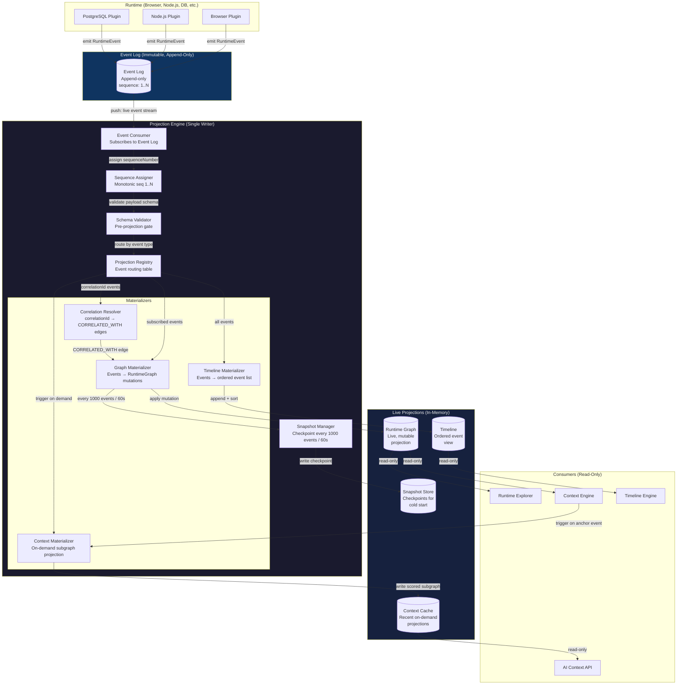
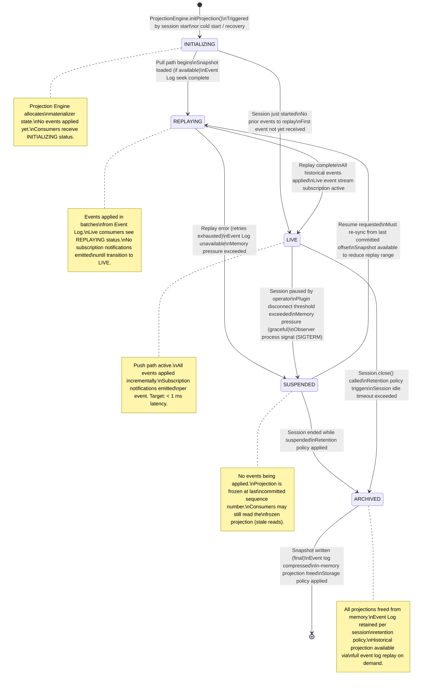
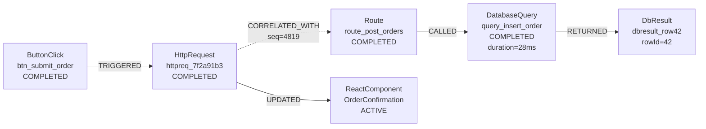

# RFC-0006: Projection Engine

| Field      | Value                                                                    |
|------------|--------------------------------------------------------------------------|
| RFC        | 0006                                                                     |
| Status     | Draft                                                                    |
| Version    | 0.1                                                                      |
| Category   | Core Architecture                                                        |
| Authors    | Founding Team                                                            |
| Depends On | RFC-0001 (Glossary), RFC-0003 (ROM), RFC-0004 (REM), RFC-0005 (Runtime Graph) |

---

## Abstract

The Projection Engine is the central processing component of Observer OS. It occupies the position between the immutable Event Log and every derived view that Observer exposes — the Runtime Graph, the Timeline, Context packages, and AI Context projections. The Projection Engine is the only writer to any of these views. It is the enforcement boundary between immutable events and mutable projections.

Architecture Review 001 established that Runtime Events are the source of truth and that everything visible to Observer consumers is a derived projection. This RFC specifies how that derivation works: the algorithms, the component architecture, the ordering guarantees, the consistency model, the failure modes, the snapshot strategy for performance, and the complete lifecycle of a projection from initialization through archival.

Engineers building the Projection Engine, integrating against it, or extending it with new projection types must treat this document as the definitive specification.

---

## Motivation

Architecture Review 001 resolved the source-of-truth question unambiguously: Runtime Events are immutable facts; all views are derived projections. That decision creates an obligation. A claim as strong as "the graph is disposable and always rebuildable" requires a component that actually makes it true — reliably, with bounded latency, across all operating conditions.

The Projection Engine is that component.

Without a correctly specified Projection Engine, the event-sourced architecture is a philosophy without a mechanism. The following questions all require answers that only the Projection Engine can provide:

**For live debugging:** When a developer is watching the Runtime Explorer while their application is running, how quickly does a browser click appear in the graph? How does the Projection Engine propagate an event from the Event Log to every consumer that cares about it, without introducing perceptible lag?

**For historical investigation:** When a developer asks "what did the graph look like five minutes ago?", how does the Projection Engine reconstruct that state? Does it replay from the beginning of the session? From the nearest snapshot? How long does reconstruction take for a session that has been running for two hours?

**For crash recovery:** If Observer's process is killed and restarted, the in-memory Runtime Graph is gone. How does the Projection Engine rebuild it? How far back in the event log must it scan? What are the latency expectations before the graph is current again?

**For cross-domain correlation:** When a browser HTTP request event and a backend route handler event share a `correlationId`, who detects that and creates the `CORRELATED_WITH` edge? The browser plugin does not know the backend plugin exists. The backend plugin does not know the browser event occurred. The Projection Engine must bridge them.

**For plugin isolation:** If a buggy plugin emits a malformed event, can it corrupt the Runtime Graph for nodes belonging to a different Domain? The answer must be no, and the Projection Engine is the enforcement mechanism.

None of these questions are answered by the Event Log, the Runtime Graph schema, or the plugin SDK in isolation. They are answered by the Projection Engine — the component that stands between every event and every view.

---

## Goals

1. Specify the Projection Engine as the exclusive writer to all Observer projections — Runtime Graph, Timeline, Context, and AI Context packages.
2. Define the push path: how live events flow from the Event Log through the Projection Engine to all registered materializers with sub-millisecond end-to-end latency.
3. Define the pull path: how the Projection Engine reconstructs any projection from the Event Log for cold starts, historical queries, and crash recovery.
4. Establish the ordering model: `sequenceNumber` (Observer-assigned, monotonic) as the canonical projection order; `occurredAt` (plugin clock) as the display order for Timeline and UI.
5. Specify the Snapshot Manager: optional performance optimization producing checkpoints every 1,000 events or 60 seconds, never required for correctness.
6. Define cross-domain correlation resolution: how the Projection Engine detects matching `correlationId` values across Domain boundaries and materializes `CORRELATED_WITH` edges.
7. Specify the Projection Registry: the catalog of all active projections, their event subscriptions, and their lifecycle states.
8. Define the complete projection lifecycle: INITIALIZING → REPLAYING → LIVE → SUSPENDED → ARCHIVED.
9. Specify plugin isolation enforcement at the projection boundary.
10. Define performance requirements and the concurrency model (single-writer, concurrent readers).
11. Establish the internal API surface through which Observer subsystems query projections.
12. Provide concrete, multi-technology examples that engineers can use to validate implementations.

## Non-Goals

The Projection Engine specification does not define:

| Excluded concern | Where it belongs |
|-----------------|-----------------|
| Runtime Node and Relationship schemas | RFC-0003 (ROM) |
| Event schema, payload structure, and EventType taxonomy | RFC-0004 (REM) |
| Runtime Graph traversal algorithms and query language | RFC-0005 (RGM) |
| Session lifecycle, creation, and bounding | Future: Session Model RFC |
| Context package assembly strategy and relevance scoring | Future: Context Engine RFC |
| Plugin SDK wire protocol and transport | Future: Plugin SDK RFC |
| Runtime Explorer rendering | Future: Runtime Explorer RFC |
| AI Consumer query interface and response format | Future: AI Context API RFC |
| Persistent storage format for the Event Log | Future: Storage RFC |
| Distributed Projection Engine across multiple Observer instances | Future: Distributed Runtime RFC |
| User-defined annotations on projections | Future: Annotation RFC |
| Anomaly detection triggered by projection state | Future: Intelligence RFC |

The Projection Engine processes events and maintains projections. It does not define what those projections mean, how they are queried by end users, or how they are persisted to disk beyond checkpoint snapshots.

---

## Design: Core Concepts

### What Is a Projection?

A **projection** is a derived, materialized view computed by applying an ordered sequence of Runtime Events to an initial state. Projections are:

- **Derived**: their content is entirely determined by the event sequence. No projection contains information that is not present in the event log.
- **Disposable**: losing a projection does not lose information. It can always be rebuilt by replaying events.
- **Deterministic**: given the same event sequence in the same order, the same projection is always produced. Two independent Projection Engine instances that process identical event sequences produce identical projections.
- **Opinionated**: each projection type interprets events through a specific lens. The Runtime Graph materializes events into a graph of nodes and relationships. The Timeline materializes events into a time-ordered sequence. A Context projection materializes events into a curated subgraph anchored on a specific question.
- **Point-in-time**: every projection is valid as of a specific `sequenceNumber`. A projection at `sequence = N` reflects exactly the first N events applied in sequence order. No more, no less.

The critical implication: **the Runtime Graph is not the source of truth.** It is a projection of the source of truth. If the Runtime Graph is lost — due to a crash, a memory pressure eviction, or a deliberate reset — it can be fully reconstructed by replaying the Event Log. The graph is essential for low-latency reads, but it is not irreplaceable.

This "disposable graph" property is what enables Observer's time-travel queries, crash recovery guarantees, and session sharing features. It must be preserved unconditionally: every mutation to the Runtime Graph must trace back to a specific Runtime Event. No silent, event-less mutations are permitted.

### The "Disposable Graph" Invariant

The Projection Engine enforces a single inviolable invariant throughout all of its operation:

> **For every state S in the Runtime Graph at sequence number N, there exists a deterministic function F such that F(events[1..N]) = S.**

This invariant means:

1. The Projection Engine is the only writer to the Runtime Graph. No other component holds a write reference to the graph.
2. Every write the Projection Engine performs on the graph corresponds to exactly one Runtime Event.
3. The write function for each event type is a pure function of the event payload and the current graph state.
4. The write function has no side effects outside the graph (no network calls, no external state).

Any implementation that violates this invariant — for example, by writing to the graph in response to a timer, an operator command, or a plugin connection event that was not recorded as a RuntimeEvent — destroys the disposable graph property and must be rejected.

### Live Projection vs. Historical Projection

The Projection Engine operates in two distinct modes, which may run simultaneously for different consumers:

**Live Projection** is the continuous, incremental maintenance of the Runtime Graph as events arrive in real time. Each event, upon receipt, is immediately applied to the current projection. Live projection targets sub-millisecond latency from event arrival to graph update. This is what enables the Runtime Explorer to show changes in real time.

**Historical Projection** is the point-in-time reconstruction of a projection as it existed at a specific past moment. Historical projection is initiated by a consumer query: "give me the graph state as of sequence 4,200" or "give me the graph state at 14:23:01 UTC." Historical projection is performed by the pull path: load the nearest snapshot before the target point, then replay events from the snapshot to the target.

The two modes share the same materializer logic — the same `apply(event)` function produces graph mutations for both live and historical projections. The difference is in how events are sourced (pushed in real time vs. pulled from the event log) and in the target output (updating the live graph vs. producing a point-in-time snapshot).

### Projection Types

The Projection Engine maintains three projection types, each serving different consumers:

| Projection Type | Output | Consumer | Mode | Notes |
|-----------------|--------|----------|------|-------|
| **Runtime Graph** | Directed typed graph (RFC-0005) | Runtime Explorer, Context Engine, all internal queries | Live + Historical | Always maintained; the primary projection |
| **Timeline** | Ordered sequence of events scoped to a node, domain, or session | Timeline Engine, Runtime Explorer | Live + Historical | A filtered, sorted view over the event log |
| **Context Projection** | Scored subgraph anchored on a node or event | Context Engine, AI Consumer API | On-demand only | Never maintained continuously; computed on request |

A fourth projection type — **AI Context Projection** — wraps a Context Projection with additional structure (token budget management, serialization for LLM consumption) and is defined in the AI Context API RFC.

### Projection Ordering: `sequenceNumber` is the Law

Runtime Events carry two timestamps and one sequence number:

- `occurredAt`: the plugin-side clock at the time the event was detected. Used for Timeline display and causal reasoning within a trusted Domain. Subject to clock drift, network delay, and out-of-order delivery.
- `recordedAt`: the Observer-side clock at the time the event was received. Used for storage sequencing.
- `sequenceNumber`: the monotonically increasing integer assigned by Observer's Event Log on receipt. This is the canonical projection order.

The Projection Engine applies events to projections in strict `sequenceNumber` order. This decision has several consequences:

**Determinism**: because sequence numbers are unique and monotonically increasing within an Observer instance, any two runs of the Projection Engine that process the same events in the same sequence number order produce identical projections.

**Out-of-order `occurredAt` handling**: a plugin that experiences instrumentation latency may deliver an event with an `occurredAt` value that is earlier than events already in the projection. The Projection Engine does not re-sort by `occurredAt`. It applies the event at its assigned sequence position. The Runtime Graph reflects the order in which events were known to Observer, not the order in which they occurred according to plugin clocks. The Timeline materializer, however, inserts events at their `occurredAt` position in the ordered event list — so the Timeline correctly represents temporal order for display purposes, even though the graph update happened later in sequence order.

**Cross-domain ordering**: events from different Domains are interleaved by sequence number. A browser event with sequence 4,817 is applied before a backend event with sequence 4,818, regardless of their `occurredAt` values. This provides a consistent total order without requiring clock synchronization across Domains.

### Projection Consistency Model

**Within-session consistency: strong.** All projections within a Session see the same events in the same sequence number order. The Runtime Graph, the Timeline, and any Context Projections derived from the same Session are always mutually consistent: they reflect the same event history.

**Cross-projection consistency: transactional per event.** When an event is applied, all registered materializers receive it before the Projection Engine acknowledges receipt of the next event. This means the Runtime Graph and the Timeline are always in sync: if the graph has been updated to reflect event N, the Timeline also reflects event N.

**Cross-session consistency: eventual.** Sessions are independent. The Projection Engine maintains separate projection state for each active Session. There is no guaranteed ordering relationship between events from different Sessions.

**Lag tolerance: bounded.** The Projection Engine defines a maximum acceptable lag between event arrival and projection update. For live sessions, this target is one event propagation delay (< 1 ms under normal load). Events that cannot be applied within the lag budget due to system overload trigger backpressure on the Event Log consumer, not silent dropping.

---

## Architecture

### Full Projection Pipeline



### Internal Component Architecture

```mermaid
classDiagram
    class ProjectionEngine {
        +EngineId id
        +SessionId session
        +WorkspaceId workspace
        +ProjectionEngineStatus status
        +SequenceNumber currentSequence
        +Timestamp lastEventAt
        +ProjectionRegistry registry
        +EventConsumer consumer
        +GraphMaterializer graphMaterializer
        +TimelineMaterializer timelineMaterializer
        +SnapshotManager snapshotManager
        +CorrelationResolver correlationResolver
        +start() void
        +stop() void
        +suspend() void
        +resume() void
        +applyEvent(event: RuntimeEvent) ProjectionDelta
        +replayFrom(sequence: SequenceNumber) void
        +replayFrom(timestamp: Timestamp) void
        +requestSnapshot() SnapshotId
        +loadSnapshot(id: SnapshotId) void
        +status() ProjectionEngineStatus
    }

    class EventConsumer {
        +ConsumerId id
        +SubscriptionId subscription
        +SequenceNumber committedOffset
        +ConsumeMode mode
        +connect(eventLog: EventLog) void
        +disconnect() void
        +seek(sequence: SequenceNumber) void
        +poll() RuntimeEvent[]
        +acknowledge(sequence: SequenceNumber) void
        +pause() void
        +resume() void
    }

    class ProjectionRegistry {
        +Map~ProjectionId, ProjectionDescriptor~ projections
        +Map~EventType, Set~ProjectionId~~ routingTable
        +register(descriptor: ProjectionDescriptor) void
        +deregister(id: ProjectionId) void
        +route(event: RuntimeEvent) ProjectionId[]
        +getDescriptor(id: ProjectionId) ProjectionDescriptor
        +allActiveProjections() ProjectionDescriptor[]
    }

    class ProjectionDescriptor {
        +ProjectionId id
        +ProjectionType type
        +Set~EventType~ subscribedEventTypes
        +ProjectionStatus status
        +SequenceNumber lastAppliedSequence
        +Timestamp lastAppliedAt
        +SchemaVersion schemaVersion
        +ProjectionConfig config
    }

    class GraphMaterializer {
        +RuntimeGraph graph
        +DomainIsolationEnforcer isolationEnforcer
        +SchemaValidator validator
        +apply(event: RuntimeEvent) GraphDelta
        +applyBatch(events: RuntimeEvent[]) GraphDelta[]
        +upsertNode(event: RuntimeEvent) RuntimeNode
        +addRelationship(event: RuntimeEvent) Relationship
        +updateNodeStatus(event: RuntimeEvent) RuntimeNode
        +validateDomainOwnership(event: RuntimeEvent) void
        +redactSensitiveFields(node: RuntimeNode) RuntimeNode
    }

    class TimelineMaterializer {
        +Map~SessionId, OrderedEventList~ timelines
        +apply(event: RuntimeEvent) void
        +getTimeline(session: SessionId) OrderedEventList
        +getTimeline(node: NodeId) OrderedEventList
        +getTimeline(domain: DomainId) OrderedEventList
        +getTimelineSlice(session: SessionId, from: Timestamp, to: Timestamp) OrderedEventList
    }

    class ContextMaterializer {
        +RuntimeGraph graphRef
        +EventLog eventLogRef
        +materialize(anchor: AnchorSpec) ContextProjection
        +materializeAtSequence(anchor: AnchorSpec, seq: SequenceNumber) ContextProjection
        +score(node: RuntimeNode, anchor: AnchorSpec) Float
        +prune(projection: ContextProjection, budget: TokenBudget) ContextProjection
    }

    class SnapshotManager {
        +SnapshotStore store
        +SequenceNumber lastSnapshotSequence
        +Timestamp lastSnapshotAt
        +Int eventsSinceLastSnapshot
        +Int checkpointIntervalEvents
        +Duration checkpointIntervalTime
        +takeSnapshot(graph: RuntimeGraph, sequence: SequenceNumber) SnapshotId
        +loadSnapshot(id: SnapshotId) GraphSnapshot
        +findNearestSnapshot(sequence: SequenceNumber) GraphSnapshot
        +findNearestSnapshot(timestamp: Timestamp) GraphSnapshot
        +pruneOldSnapshots(keepLast: Int) void
        +validateSchema(snapshot: GraphSnapshot) Boolean
    }

    class CorrelationResolver {
        +Map~CorrelationId, PendingCorrelation~ pendingCorrelations
        +Map~CorrelationId, ResolvedCorrelation~ resolvedCorrelations
        +Duration correlationTimeout
        +observe(event: RuntimeEvent) void
        +tryResolve(correlationId: CorrelationId) ResolvedCorrelation?
        +getPending() PendingCorrelation[]
        +getExpired() PendingCorrelation[]
        +markUnresolved(correlationId: CorrelationId) void
    }

    class PendingCorrelation {
        +CorrelationId correlationId
        +List~CorrelationCandidate~ candidates
        +Timestamp firstSeenAt
        +Timestamp expiresAt
        +CorrelationScope scope
    }

    class ResolvedCorrelation {
        +CorrelationId correlationId
        +NodeId sideA
        +NodeId sideB
        +DomainId domainA
        +DomainId domainB
        +RelationshipId createdEdge
        +Timestamp resolvedAt
        +Float confidence
    }

    ProjectionEngine --> EventConsumer
    ProjectionEngine --> ProjectionRegistry
    ProjectionEngine --> GraphMaterializer
    ProjectionEngine --> TimelineMaterializer
    ProjectionEngine --> SnapshotManager
    ProjectionEngine --> CorrelationResolver
    ProjectionRegistry --> ProjectionDescriptor
    CorrelationResolver --> PendingCorrelation
    CorrelationResolver --> ResolvedCorrelation
```



---

## Push Path: Live Event Processing

The push path is the operational mode for live Sessions. It handles the continuous stream of events emitted by connected plugins and delivers projection updates with sub-millisecond end-to-end latency.

### Push Path Sequence

```mermaid
sequenceDiagram
    participant Plugin as Domain Plugin
    participant EL as Event Log
    participant EC as EventConsumer
    participant VAL as SchemaValidator
    participant SEQ as SequenceAssigner
    participant PR as ProjectionRegistry
    participant GM as GraphMaterializer
    participant TM as TimelineMaterializer
    participant CR as CorrelationResolver
    participant RG as RuntimeGraph
    participant RE as Runtime Explorer
    participant CE as Context Engine

    Plugin->>EL: emit(RuntimeEvent{type, domain, payload, occurredAt, causedBy, correlationId})
    Note over EL: Append to log; event persisted durably

    EL->>EC: push(event) [subscription delivery]
    EC->>VAL: validate(event)

    alt Schema validation fails
        VAL-->>EC: REJECTED {reason: SCHEMA_MISMATCH}
        EC->>EL: record(system/event.dropped, reason)
        Note over EC: Continue; no graph mutation
    else Domain isolation violation
        VAL-->>EC: REJECTED {reason: DOMAIN_ISOLATION_VIOLATION}
        EC->>EL: record(system/event.dropped, reason)
    else Validation passes
        VAL-->>EC: VALID
        EC->>SEQ: assignSequence(event)
        SEQ-->>EC: event.sequenceNumber = 4821
        Note over SEQ: Monotonic, never reused

        EC->>PR: route(event)
        PR-->>EC: materializers = [GraphMaterializer, TimelineMaterializer, CorrelationResolver]

        par Apply to all registered materializers
            EC->>GM: apply(event)
            GM->>GM: validateDomainOwnership(event)
            GM->>GM: upsertNode(event.sourceNode)
            GM->>GM: updateRelationships(event)
            GM->>GM: redactSensitiveFields()
            GM->>RG: write(delta)
            RG-->>GM: delta{nodesChanged, edgesAdded}
            GM-->>EC: GraphDelta

        and
            EC->>TM: apply(event)
            TM->>TM: insertAt(event.occurredAt)
            TM-->>EC: TimelineDelta

        and
            EC->>CR: observe(event)
            CR->>CR: extractCorrelationId(event)

            alt correlationId present
                CR->>CR: checkPending(correlationId)

                alt Match found in pending
                    CR->>CR: resolve(sideA, sideB)
                    CR->>GM: createCorrelatedWithEdge(sideA, sideB)
                    GM->>RG: addEdge(CORRELATED_WITH)
                    CR-->>EC: CorrelationResolved
                else No match yet
                    CR->>CR: addToPending(correlationId, event.sourceNode)
                    CR-->>EC: CorrelationPending
                end
            end
        end

        EC->>EC: checkSnapshotThreshold()

        alt 1000 events elapsed OR 60s elapsed
            EC->>SM: takeSnapshot(graph, sequence=4821)
            SM-->>EC: snapshotId
        end

        EC->>EL: acknowledge(sequence=4821)

        RG-->>RE: push(delta) [subscription notification]
        RG-->>CE: push(delta) [subscription notification]

        Note over RE: Updates live graph view
        Note over CE: Evaluates context trigger conditions
    end
```

### Push Path Design Rationale

**Parallel materializer dispatch.** The Projection Engine delivers each event to all registered materializers simultaneously, not sequentially. The Graph Materializer, Timeline Materializer, and Correlation Resolver all receive the event in the same dispatch round. This is safe because:

1. Each materializer writes to a different output (graph, timeline, correlation state). There is no shared mutable state between materializers for a given event.
2. The Projection Engine waits for all materializer completions before acknowledging the event and processing the next one. This preserves the within-session consistency guarantee: all projections advance together.

If a materializer fails, the Projection Engine does not advance past the failed event. It retries the event application with exponential backoff. If retries are exhausted, the session is suspended and an operator alert is emitted. The event is never silently dropped.

**Single-event processing, not batching.** For live sessions, the Projection Engine processes events one at a time (with parallel materializer dispatch per event). Batching would reduce system call overhead but would delay projection updates and violate the sub-millisecond latency target. Batching is used only in the pull path (historical replay) where latency targets are different.

**Correlation Resolver in the push path.** Cross-domain correlation edges cannot be formed until both sides of a correlation have been observed. The Correlation Resolver runs inline in the push path on every event to check for pending matches. This means correlation edges appear in the Runtime Graph as soon as the second side is received, with no polling delay.

**Snapshot threshold check.** After each event is successfully applied, the Projection Engine checks whether the snapshot threshold has been crossed (1,000 events since last snapshot, or 60 seconds elapsed since last snapshot). If so, a snapshot is taken asynchronously — it does not block event processing. The snapshot captures the current graph state at the current sequence number, providing a fast starting point for future cold starts.

### Target Latencies (Push Path)

| Metric | Target | Notes |
|--------|--------|-------|
| Event arrival to graph update | < 1 ms (p99) | Measured from Event Log delivery to RuntimeGraph.apply() completion |
| Event arrival to Runtime Explorer notification | < 5 ms (p99) | Includes graph update + delta push to subscriber |
| Correlation resolution latency | < 1 ms after second side arrives | Resolved inline during event processing |
| Snapshot write latency | < 50 ms (async, non-blocking) | Snapshot taken on background goroutine/thread |

---

## Pull Path: Cold Starts, Historical Queries, and Replay

The pull path handles the three scenarios where the Projection Engine must build a projection from past events rather than from a live stream: cold starts (Observer restarts mid-session), historical queries (point-in-time graph state), and explicit replay requests.

### Pull Path Sequence

```mermaid
sequenceDiagram
    participant Caller as Caller (Session Engine / Explorer / Context Engine)
    participant PE as Projection Engine
    participant SM as Snapshot Manager
    participant SS as Snapshot Store
    participant EL as Event Log
    participant PR as ProjectionRegistry
    participant GM as Graph Materializer
    participant TM as Timeline Materializer
    participant RG as Runtime Graph

    Caller->>PE: initProjection(sessionId, targetSequence?)
    Note over PE: targetSequence = null means "build to current"

    PE->>PE: status = INITIALIZING
    PE->>SM: findNearestSnapshot(targetSequence ?? current)

    SM->>SS: query(sessionId, beforeSequence)

    alt Snapshot found
        SS-->>SM: GraphSnapshot{sequence=4000, graph=..., schemaVersion=0.1}
        SM->>SM: validateSchema(snapshot)

        alt Schema version mismatch
            SM-->>PE: SCHEMA_MISMATCH {snapshotVersion=0.0, currentVersion=0.1}
            PE->>PE: discard snapshot; will replay from beginning
            PE->>EL: seek(sessionId, sequence=1)
        else Schema valid
            SM-->>PE: snapshot{sequence=4000}
            PE->>RG: loadSnapshot(snapshot)
            RG-->>PE: graph initialized at sequence=4000
            PE->>TM: loadTimeline(sessionId, upTo=snapshot.sequence)
            PE->>EL: seek(sessionId, sequence=4001)
            Note over PE: Start replay from snapshot point
        end
    else No snapshot available
        SS-->>SM: null
        SM-->>PE: NO_SNAPSHOT
        PE->>EL: seek(sessionId, sequence=1)
        Note over PE: Replay from beginning
    end

    PE->>PE: status = REPLAYING
    PE->>PR: setMode(REPLAY)

    loop Replay events in sequenceNumber order
        PE->>EL: poll(batchSize=100)
        EL-->>PE: events[4001..4100]

        loop Each event in batch
            PE->>GM: apply(event)
            GM->>RG: write(delta)
            PE->>TM: apply(event)
        end

        PE->>EL: acknowledge(lastSequence=4100)

        alt targetSequence reached
            PE->>PE: break replay loop
        end

        alt current sequence == eventLog.latestSequence
            PE->>PE: replay complete; transition to live
        end
    end

    alt Replaying to "current" (cold start / crash recovery)
        PE->>PE: status = LIVE
        PE->>EC: subscribeToLiveStream(sessionId, fromSequence=currentSequence+1)
        Note over PE: Transition seamlessly to push path
        PE-->>Caller: ProjectionReady{sequence=currentSequence}

    else Replaying to targetSequence (historical query)
        PE-->>Caller: HistoricalProjection{sequence=targetSequence, graph=RG.snapshot()}
        Note over PE: Graph returned as snapshot; PE continues live projection independently
    end
```

### Pull Path Design Rationale

**Batch replay, not single-event.** During replay, the Projection Engine polls the Event Log in batches (default: 100 events per batch). Each batch is applied atomically. This is safe because replay is not observed by live consumers — the Runtime Graph is not yet published until replay completes. Batching during replay dramatically reduces Event Log round-trip overhead and enables replay throughput of tens of thousands of events per second.

**Snapshot schema validation before load.** Every snapshot carries a `schemaVersion` that records the version of the graph schema in effect when the snapshot was taken. If the current Projection Engine version has a different schema than the snapshot, the snapshot is discarded and replay begins from the start of the event log. This ensures that schema migrations never result in a corrupt projection: the full event log is always replayed with the current schema's materializer logic applied to every event.

**Seamless push-to-live transition.** After a cold start replay completes, the Projection Engine must transition from replay mode to live mode without missing any events emitted during the replay window. This is achieved by:

1. The Event Consumer subscribes to the live event stream before replay begins, queuing any new events.
2. Replay processes events from the snapshot point up to the last known sequence at subscription time.
3. After replay, the Projection Engine drains the queued live events (which may have arrived during replay).
4. The Projection Engine switches to the normal push path.

This design ensures no gap between the last replayed event and the first live event. The projection is complete and consistent when it transitions to LIVE status.

**Historical projection isolation.** When a consumer requests a historical projection (point-in-time graph state), the Projection Engine builds the historical projection in an isolated context that does not affect the live Runtime Graph. The live graph continues receiving events normally while the historical projection is being computed. The historical projection is returned as an immutable snapshot.

### Replay Performance Targets

| Scenario | Target | Notes |
|----------|--------|-------|
| Cold start from no snapshot (session start) | < 100 ms | Trivial; no events to replay |
| Cold start from snapshot (session ongoing) | < 500 ms per 1,000 events replayed | With in-process snapshot store |
| Historical query (point-in-time graph) | < 1 s for sessions up to 10,000 events | From nearest snapshot to target |
| Full session replay (forensic analysis) | Throughput ≥ 10,000 events/second | Batched replay mode |
| Crash recovery (rebuild live graph) | < 30 s for a 60-minute session | Assuming snapshots at 60s intervals |

---

## Snapshot Strategy

Snapshots are an optional performance optimization for the pull path. They are never required for correctness. The event log is always sufficient to rebuild any projection. Snapshots exist solely to reduce the number of events that must be replayed on cold start.

### Snapshot Triggers

The Snapshot Manager takes a snapshot when either of the following thresholds is crossed:

- **Event threshold**: 1,000 events have been applied since the last snapshot.
- **Time threshold**: 60 seconds have elapsed since the last snapshot.

Both thresholds are checked after each event is applied in the push path. The snapshot is taken asynchronously — the Projection Engine does not pause event processing to wait for the snapshot to complete.

These thresholds are configurable per-session via `ProjectionEngineConfig`. For sessions with very high event rates (> 10,000 events per second), the event threshold may be increased to reduce snapshot I/O overhead. For sessions where sub-second crash recovery is required, the time threshold may be decreased.

### Snapshot Content

A snapshot is a serialized, point-in-time copy of the Runtime Graph state at a specific sequence number. It contains:

```typescript
interface GraphSnapshot {
  readonly snapshotId: SnapshotId;
  readonly sessionId: SessionId;
  readonly workspaceId: WorkspaceId;
  readonly sequenceNumber: SequenceNumber;
  readonly takenAt: Timestamp;
  readonly schemaVersion: SchemaVersion;
  readonly graph: SerializedRuntimeGraph;
  readonly correlationState: SerializedCorrelationState;
  readonly timelineState: SerializedTimelineState;
  readonly metrics: SnapshotMetrics;
  readonly checksum: String;   // SHA-256 of graph content for integrity verification
}
```

The `correlationState` includes all pending correlations at the time of the snapshot, ensuring that a replay starting from the snapshot does not re-attempt correlation resolution for events before the snapshot point.

The `timelineState` includes the ordered event list for all active Timeline projections, enabling Timeline reconstruction without replaying the timeline events from the beginning.

### Snapshot Lifecycle

```
Event N applied →
Snapshot threshold crossed →
  Projection Engine enqueues snapshot request →
  SnapshotManager.takeSnapshot(graph, sequence=N) [async] →
  Serialize graph to snapshot format →
  Write to SnapshotStore →
  Record snapshotId and sequence in SnapshotIndex →
  Emit system/snapshot.taken event →
  [5 minutes later] Prune snapshots older than keepLast=5 →
```

The `keepLast` parameter controls how many historical snapshots are retained per session. The default is 5. For a session with 60-second checkpoint intervals, this retains the last 5 minutes of snapshots — sufficient for near-instant recovery in all common crash scenarios.

### Snapshot Invalidation

A snapshot is invalidated (discarded during cold start) when:

1. **Schema version mismatch**: the snapshot's `schemaVersion` does not match the current Projection Engine's schema version. Full event replay is required.
2. **Checksum failure**: the snapshot's `checksum` does not match the computed checksum of the deserialized content. The snapshot is corrupt; full event replay is required.
3. **Explicit invalidation**: an operator command invalidates all snapshots for a session (used after a bug fix in the materializer logic). Full event replay is required.

When a snapshot is invalidated, event replay begins from the start of the session's event log. The Projection Engine logs the invalidation reason for operator visibility.

---

## Cross-Domain Projection: Correlation Resolution

Cross-domain projection is the mechanism by which events from independent Domain plugins — which have no awareness of each other — are connected into a unified Runtime Graph through `CORRELATED_WITH` edges. The Correlation Resolver is responsible for this.

### Correlation Resolution Flow

```mermaid
flowchart TD
    START([Event arrives with correlationId]) --> EXTRACT

    EXTRACT[Extract correlationId\nand sourceNode from event] --> CHECK_PENDING

    CHECK_PENDING{Is correlationId\nalready in\nPending table?} -->|No| ADD_PENDING
    CHECK_PENDING -->|Yes| CHECK_DOMAIN

    CHECK_DOMAIN{Is this event\nfrom a different\nDomain than\nthe pending entry?} -->|No, same domain| SKIP
    CHECK_DOMAIN -->|Yes, different domain| MATCH_FOUND

    ADD_PENDING[Add to PendingCorrelations\ncorrelationId → candidate\n{nodeId, domainId, sequence, expiresAt}] --> WAIT

    WAIT[Wait for matching\nevent from another Domain] --> TIMEOUT_CHECK

    TIMEOUT_CHECK{Correlation timeout\nexceeded?\n> 30 seconds} -->|Yes| MARK_UNRESOLVED
    TIMEOUT_CHECK -->|No| WAIT

    MATCH_FOUND[Remove from PendingCorrelations\nCreate ResolvedCorrelation\n{sideA, sideB, domainA, domainB}] --> ASSESS_CONFIDENCE

    ASSESS_CONFIDENCE{Correlation\nmechanism?} -->|Shared correlationId\n= exact match| DEFINITIVE
    ASSESS_CONFIDENCE -->|Fingerprint match\n= inferred| INFERRED

    DEFINITIVE[Set confidence = 1.0\nstrength = DEFINITIVE\norigin = PLATFORM_CORRELATED] --> CREATE_EDGE
    INFERRED[Set confidence = 0.85\nstrength = INFERRED\norigin = PLATFORM_CORRELATED] --> CREATE_EDGE

    CREATE_EDGE[Emit CORRELATED_WITH edge\nsideA.nodeId → sideB.nodeId\nvia GraphMaterializer] --> RECORD_RESOLVED

    RECORD_RESOLVED[Add to ResolvedCorrelations table\nRecord resolvedAt timestamp] --> EMIT_EVENT

    EMIT_EVENT[Emit system/correlation.resolved\nRuntimeEvent for audit log] --> DONE([Done])

    MARK_UNRESOLVED[Mark as UNRESOLVED\nSet status = TIMED_OUT\nEmit system/correlation.timeout\nfor diagnostics] --> CLEANUP

    CLEANUP[Remove from PendingCorrelations\nRetain in UnresolvedCorrelations\nfor operator visibility] --> DONE

    SKIP[Same-domain events share\ncorrelationId legitimately\nNo cross-domain edge needed] --> DONE

    style MATCH_FOUND fill:#1a5276,color:#fff
    style MARK_UNRESOLVED fill:#641e16,color:#fff
    style CREATE_EDGE fill:#145a32,color:#fff
```

### Correlation Mechanisms

The Correlation Resolver supports three correlation mechanisms, evaluated in priority order:

#### Mechanism 1: Exact `correlationId` Match (confidence = 1.0)

The preferred mechanism. Both plugins independently include the same `correlationId` value in their events. The Correlation Resolver detects matching IDs across different Domains and creates a `CORRELATED_WITH` edge with `confidence = 1.0, strength = DEFINITIVE`.

For HTTP requests, the `correlationId` is typically the value of the `X-Request-Id` or `X-Observer-Trace-Id` header. The browser plugin reads this header from the outgoing request. The backend plugin reads it from the incoming request. Both emit it as `correlationId.value`.

For Kafka messages, the `correlationId` is typically the Kafka message offset, topic, and partition triple. Both the producer plugin and the consumer plugin record this triple as their `correlationId`.

**No plugin coordination is required.** Each plugin independently records the correlation identifier that naturally exists in the protocol. The Projection Engine performs the match.

#### Mechanism 2: Request Fingerprint Match (confidence = 0.80–0.95)

When trace ID propagation is unavailable, the Correlation Resolver attempts fingerprint matching using:

```
fingerprint = (method, url, responseSizeBytes, timeDeltaMs)
```

If a browser `POST /api/orders` event at `T` is followed within the configured latency window (default: 5 seconds) by a backend `POST /api/orders` event at `T + δ` (where `δ < 5,000 ms`), and no other events in that window match on the same `(method, url)` tuple, the Correlation Resolver creates a `CORRELATED_WITH` edge with `confidence` computed as:

```
confidence = 0.95 - (0.05 * ambiguityCount) - (0.001 * deltaMs)
```

Where `ambiguityCount` is the number of competing candidates in the window. If `confidence < 0.50`, the correlation is not created; the candidates remain in the pending table until timeout.

Fingerprint matching is `strength = INFERRED, origin = PLATFORM_CORRELATED`.

#### Mechanism 3: Plugin-Declared Correlation (confidence = 1.0)

A plugin may explicitly emit a `CorrelationHintEvent` naming two node IDs it knows to be correlated. This is used when the plugin has direct knowledge of cross-domain identity (e.g., a message broker plugin that tracks producer-to-consumer lineage internally).

Plugin-declared correlations bypass the pending table and are applied directly by the Graph Materializer. They receive `confidence = 1.0, strength = DEFINITIVE, origin = PLUGIN_DIRECT`.

### Correlation Timeout

Pending correlations that do not resolve within the configured timeout (default: 30 seconds) are moved to `UNRESOLVED` status. An `UNRESOLVED` correlation means:

- One side of a cross-domain interaction was observed.
- The other side was never received (the plugin may not be connected, the protocol may not carry trace IDs, or the event may have been dropped).

Unresolved correlations are recorded in the `UnresolvedCorrelations` index and surfaced to operators via the diagnostic API. They do not cause the Projection Engine to error or stall.

### Pending Correlation State During Snapshots

The `PendingCorrelations` table is included in every snapshot (as `correlationState`). When the Projection Engine loads a snapshot, it restores pending correlations from the snapshot state. This prevents the following scenario:

1. Browser HTTP request event arrives (sequence 4,000) → added to pending correlations.
2. Snapshot taken at sequence 4,000 (without correlation state → pending lost).
3. Projection Engine restarts, loads snapshot at 4,000.
4. Backend route event arrives (sequence 4,001) → correlation resolver has no pending entry → `CORRELATED_WITH` edge is never created.

By including pending correlation state in the snapshot, the replay starting from sequence 4,001 correctly finds the pending entry and creates the edge.

---

## Projection Lifecycle

Each projection maintained by the Projection Engine has a defined lifecycle with five states.



### Lifecycle State Details

**INITIALIZING**: The Projection Engine has been created for a Session but has not yet begun applying events. The Snapshot Manager is queried for the nearest snapshot. The Event Consumer is configured but not yet subscribed. Duration: typically < 10 ms.

**REPLAYING**: The Projection Engine is reading historical events from the Event Log and applying them in batch mode. Live consumers querying the Runtime Graph during REPLAYING receive the partially-replayed projection, which is complete as of the last applied sequence number but does not yet reflect the full session history. Consumers should handle this by polling the projection status before making decisions that depend on historical completeness.

**LIVE**: Normal operating state. The Event Consumer is subscribed to the live event stream. Events are applied incrementally as they arrive. All subscription notifications are emitted. This is the target state for active Sessions.

**SUSPENDED**: Event processing has been paused. The projection is frozen at the last applied sequence number. Triggers for suspension include: operator commands, plugin disconnection, memory pressure, and graceful process shutdown. On resume, the Projection Engine transitions back to REPLAYING to catch up on any events that arrived during the suspension window.

**ARCHIVED**: The Session has ended and the in-memory projection has been freed. The event log for the Session is retained according to the workspace retention policy (default: 90 days). Any future requests for this session's graph state require a full or partial event log replay. The Projection Engine emits a `system/projection.archived` event and writes a final snapshot before freeing memory.

---

## Plugin Integration

### The Plugin Contract

Plugins interact with Observer exclusively through event emission. They never interact with the Projection Engine directly, and they have no write access to any projection. The plugin contract, enforced by the Plugin SDK, is:

1. Plugins emit `RuntimeEvent` objects via `sdk.emit()`.
2. The Plugin SDK validates, serializes, and delivers events to the Event Log.
3. The Event Log appends the event and notifies the Projection Engine.
4. The Projection Engine applies the event to all registered materializers.
5. The updated projection is available to consumers.

This separation is architectural, not contractual. There is no code path by which a plugin can directly write to the Runtime Graph. The Projection Engine is the only entry point for graph writes, and it only accepts events from the Event Log, not direct write calls.

### Schema Validation at the Projection Boundary

Before applying any event to a materializer, the Projection Engine performs schema validation. This is the pre-projection gate:

```
validate(event):
  1. Verify event.type is registered in the Plugin Registry
  2. Verify event.domain matches the registered domain for event.type
  3. Verify event.sourceNode is owned by event.domain
  4. Verify event.payload validates against schema[event.type, event.payload.schemaVersion]
  5. Verify event.sequenceNumber > last applied sequenceNumber (ordering guard)
  6. Apply PII detection rules (if configured)
```

Events that fail validation are not applied. The Projection Engine records a `system/event.dropped` event in the Event Log with the rejection reason, ensuring the rejection is auditable. The projection advances to the next event.

### Domain Isolation Enforcement

The Graph Materializer enforces domain isolation on every event it processes. The isolation rule is:

> A plugin may only mutate Runtime Nodes in its own Domain.

Implementation: before writing any node mutation to the Runtime Graph, the Graph Materializer checks `event.domain == node.domain`. If the node's domain does not match the event's domain, the mutation is rejected with a `DomainIsolationError`, logged at WARNING level, and the event is not applied. The Projection Engine continues processing subsequent events.

Cross-domain `CORRELATED_WITH` edges are the single exception: they connect nodes across Domain boundaries. These edges are created exclusively by the Correlation Resolver, which operates at the Projection Engine level (above the plugin layer), not by plugin events directly. A plugin may emit a `CorrelationHintEvent` to request cross-domain linking, but the actual edge creation is performed by the Projection Engine after validating the hint.

### Misbehaving Plugin Isolation

A misbehaving plugin that emits malformed, invalid, or out-of-schema events cannot corrupt the Runtime Graph for other Domains. The schema validation and domain isolation checks ensure:

1. Invalid events are rejected before reaching any materializer.
2. Valid events from Plugin A can only mutate nodes owned by Domain A.
3. Plugin A's events cannot reference or modify Plugin B's nodes.

A plugin that emits events at extremely high frequency (event storm) is handled by backpressure on the Event Log consumer, not by dropping events silently. The Event Consumer pauses delivery to the overloaded materializer and signals the Plugin SDK to apply flow control. The `system/event.dropped` reason `BACKPRESSURE` is recorded if events must be dropped.

---

## Projection API: Internal Interfaces

The following interfaces define how Observer subsystems (Runtime Explorer, Context Engine, Timeline Engine, AI Context API) query and subscribe to projections. All query interfaces are read-only. No subsystem writes to projections directly.

### Runtime Graph Query Interface

```typescript
interface ProjectionEngineAPI {
  // Graph queries (live projection)
  getNode(nodeId: NodeId): RuntimeNode | null;
  getNodes(filter: NodeFilter): RuntimeNode[];
  getEdge(relId: RelationshipId): Relationship | null;
  getEdges(filter: EdgeFilter): Relationship[];
  traverse(opts: TraversalOptions): TraversalResult;
  query(q: GraphQuery): QueryResult;

  // Point-in-time queries (historical projection)
  getNodeAt(nodeId: NodeId, sequence: SequenceNumber): RuntimeNode | null;
  getNodeAt(nodeId: NodeId, timestamp: Timestamp): RuntimeNode | null;
  queryAt(q: GraphQuery, sequence: SequenceNumber): QueryResult;
  queryAt(q: GraphQuery, timestamp: Timestamp): QueryResult;

  // Subgraph queries
  subgraphOf(anchor: NodeId, depth: number): RuntimeGraph;
  connectedComponent(nodeId: NodeId): ConnectedComponent | null;
  sessionSubgraph(sessionId: SessionId): RuntimeGraph;

  // Timeline queries
  getTimeline(scope: TimelineScope): OrderedEventList;
  getTimelineSlice(scope: TimelineScope, from: Timestamp, to: Timestamp): OrderedEventList;

  // On-demand context projection
  materializeContext(anchor: AnchorSpec, budget?: TokenBudget): ContextProjection;
  materializeContextAt(anchor: AnchorSpec, sequence: SequenceNumber): ContextProjection;

  // Subscription
  subscribe(filter: ProjectionFilter, handler: ProjectionDeltaHandler): SubscriptionId;
  unsubscribe(id: SubscriptionId): void;

  // Status
  getStatus(): ProjectionEngineStatus;
  getCurrentSequence(): SequenceNumber;
  getMetrics(): ProjectionEngineMetrics;
}

interface ProjectionEngineStatus {
  state: 'INITIALIZING' | 'REPLAYING' | 'LIVE' | 'SUSPENDED' | 'ARCHIVED';
  currentSequence: SequenceNumber;
  lastEventAt: Timestamp;
  replayProgress?: { current: SequenceNumber; target: SequenceNumber; percent: number };
  pendingCorrelations: number;
  snapshotInfo: { lastSnapshotSequence: SequenceNumber; lastSnapshotAt: Timestamp };
}

interface ProjectionFilter {
  nodeIds?: NodeId[];
  domains?: DomainId[];
  eventTypes?: EventType[];
  sessions?: SessionId[];
  minSeverity?: Severity;
}

type ProjectionDeltaHandler = (delta: ProjectionDelta) => void;

interface ProjectionDelta {
  sequenceNumber: SequenceNumber;
  causedBy: EventId;
  nodesAdded: RuntimeNode[];
  nodesUpdated: Array<{ before: RuntimeNode; after: RuntimeNode }>;
  edgesAdded: Relationship[];
  edgesInvalidated: RelationshipId[];
  correlationsResolved: ResolvedCorrelation[];
}
```

### Subscription Model

Consumers subscribe to projection changes via `subscribe(filter, handler)`. The Projection Engine maintains a subscription registry. After each event is applied and all materializers complete, the Projection Engine computes deltas for each subscription and pushes them to registered handlers.

**Subscription semantics:**
- Subscriptions are session-scoped. A subscription remains active until explicitly cancelled or until the session is archived.
- The handler receives a `ProjectionDelta` for each event that produces changes matching the subscription filter.
- If a consumer cannot process deltas fast enough, the Projection Engine applies backpressure: the subscription's delivery queue accumulates up to a configurable limit (default: 1,000 pending deltas), after which the consumer is marked slow and the Projection Engine pauses delivery for that subscription until the queue drains.
- Consumers that fall more than 10,000 events behind are disconnected with a `SUBSCRIPTION_LAG_EXCEEDED` error. They must re-subscribe and re-query the current state.

### Point-in-Time Query Contract

```typescript
// Returns the graph state exactly as it existed after sequence N was applied.
// If sequence N is in the future, returns null.
// If sequence N is in the past:
//   - If sequence N is within the hot retention window: O(1) from version index
//   - If sequence N requires snapshot + replay: bounded by replay throughput
queryAt(q: GraphQuery, sequence: SequenceNumber): QueryResult
```

Point-in-time queries are always consistent within a single call. Two calls to `queryAt` with the same `sequence` always return the same result. This guarantee is provided by the event-sourced model: the same events applied in the same order always produce the same projection.

---

## Security and Isolation

### The Projection Engine as the Security Boundary

The Projection Engine is the enforcement point for all security constraints on graph mutations. Because it is the only writer to the Runtime Graph, all security rules need to be implemented in one place rather than distributed across plugins.

**Domain ownership**: enforced by the Graph Materializer's domain isolation check on every event (described in Plugin Integration above).

**Visibility enforcement**: the Graph Materializer checks each node's declared `visibility` setting before writing it to the Runtime Graph. Nodes with `visibility = LOCAL` are never exposed through the public Projection API, even when queried directly.

**Sensitive field redaction**: the Graph Materializer applies configured redaction rules to node metadata before writing to the graph. Redaction rules are workspace-level configuration, not plugin-level. The raw event payload is retained in the Event Log; the redacted representation is what appears in the projection. This means:

- The Event Log (which is the source of truth) contains original data.
- The Runtime Graph (the projection) contains redacted data.
- Internal tools with Event Log access (authorized platform operations) can see original data.
- External consumers (Runtime Explorer, AI Context API) see only the redacted projection.

**Cross-session isolation**: each Session's projection is maintained as a separate namespace in the Runtime Graph. The Projection API enforces session boundaries: a query for Session A cannot return nodes from Session B unless the query explicitly spans sessions (a capability reserved for workspace-level administrative consumers).

### Plugin Trust Enforcement

The Projection Engine enforces the plugin trust model defined in RFC-0005 at projection time:

| Trust Level | Max relationship confidence | Can create synthetic relationships | Schema override |
|-------------|----------------------------|----------------------------------|----------------|
| `TRUSTED` | 1.0 | Yes | Yes (for platform-internal plugins) |
| `STANDARD` | 0.90 | No | No |
| `SANDBOXED` | 0.70 | No | No |

If a `SANDBOXED` plugin emits an event that would create a relationship with `confidence > 0.70`, the Projection Engine caps the confidence at 0.70 before writing the relationship to the graph. The plugin is not notified; the cap is applied silently for security hardening.

---

## Performance

### Incremental Processing Architecture

The Projection Engine never rebuilds a projection from scratch in response to a live event. Every event application is incremental:

| Operation | Complexity | Notes |
|-----------|-----------|-------|
| Upsert node in graph | O(1) | Hash map by NodeId |
| Add edge to graph | O(1) + O(degree) | Hash map insert + index update |
| Update temporal index | O(log N) | Sorted structure by sequence number |
| Update session index | O(1) | Set.add(nodeId) |
| Update cross-domain index | O(1) | Hash map by CorrelationId |
| Check correlation pending table | O(1) | Hash map by CorrelationId |
| Timeline insert (ordered by occurredAt) | O(log N) | Binary tree insert |
| Route event through projection registry | O(EventTypes subscribed) | Typically O(1)–O(5) |
| Notify subscriptions | O(subscriptions) | Linear scan of subscription registry |

Total per-event cost under normal conditions (single session, <10,000 nodes): approximately 200–400 µs. The 1 ms latency target leaves 600–800 µs headroom for system call overhead, serialization, and subscription notification.

### Memory Model

The Projection Engine maintains the following in-memory structures:

| Structure | Approximate size | Growth |
|-----------|-----------------|--------|
| Runtime Graph nodes | ~1 KB per node | Linear in node count |
| Runtime Graph edges | ~200 bytes per edge | Linear in edge count |
| Temporal index | ~100 bytes per sequence entry | Linear in event count |
| Timeline (per session) | ~500 bytes per event | Linear in event count |
| Pending correlations | ~500 bytes per pending | Bounded by active request count |
| Snapshot (hot) | ~1 MB per 1,000 nodes | Periodic; replaced by newer snapshots |
| Subscription registry | ~200 bytes per subscription | Bounded by consumer count |

For a typical 60-minute developer session with 100,000 events and 5,000 nodes, the Projection Engine consumes approximately 150–250 MB of heap memory. This is within the target of 200 MB for a 10,000-node graph specified in RFC-0005.

### Node Paging and Lazy Loading

For sessions that exceed the hot memory budget, the Projection Engine applies tiered memory management:

**Hot tier (in-memory)**: all nodes and edges from the last `retentionWindow` (default: 10 minutes). O(1) access.

**Warm tier (local disk cache)**: nodes older than `retentionWindow`, edges retained as stubs. ~5 ms access. The Projection Engine evicts nodes from the hot tier to the warm tier using a Least Recently Used policy when memory pressure exceeds 80% of the configured budget.

**Cold tier (event log only)**: nodes whose full data is not in either hot or warm tier. Reconstructed on demand by replaying the relevant events. ~50 ms + reconstruction time.

When a consumer accesses an evicted node, the Projection Engine fetches it from the warm or cold tier transparently. The consumer sees no difference except for increased access latency.

### Concurrency Model

The Projection Engine uses a **single-writer, concurrent-reader** concurrency model:

**Event application (write path)**: serialized through a single dispatch queue. Only one event is being applied at any moment. This eliminates the need for write locks and ensures sequential consistency.

**Query serving (read path)**: concurrent. Multiple consumers can query the Runtime Graph simultaneously. The graph data structures support concurrent reads without locks via copy-on-write semantics on the hot data structures.

**Snapshot writes (async write path)**: performed on a background worker thread. The snapshot writer operates on a copy of the graph state taken at the snapshot sequence number. It does not block the main event dispatch queue.

**Subscription notification (async push path)**: delta computation and handler invocation are performed asynchronously after the event is applied. The main dispatch queue advances to the next event without waiting for subscription handlers to complete.

The single-writer model means the Projection Engine is not parallelized across multiple events. Future work (see Future Work section) may introduce parallel materializer execution for independent event types, but the initial implementation prioritizes correctness over throughput.

---

## Examples

### Example 1: Browser Click Event — Cascade Through the Projection Engine

A developer clicks the "Place Order" button on an e-commerce checkout page. This single user action triggers a cascade of events, each of which the Projection Engine processes and applies to the Runtime Graph.

**Event sequence emitted by plugins:**

```
seq=4817: observer/browser/dom.interaction.click
          sourceNode: btn_submit_order
          domain: browser

seq=4818: observer/network/request.started
          sourceNode: httpreq_7f2a91b3
          causedBy: evt_4817
          correlationId: "req_abc123"
          domain: browser

seq=4819: observer/backend/handler.entered
          sourceNode: route_post_orders
          causedBy: null   ← domain boundary; no causedBy from browser
          correlationId: "req_abc123"
          domain: node

seq=4820: observer/database/query.started
          sourceNode: query_insert_order
          causedBy: evt_4819
          domain: postgresql

seq=4821: observer/database/query.completed
          sourceNode: query_insert_order
          affectedNodes: [query_insert_order, dbresult_row42]
          causedBy: evt_4820
          payload: { rowId: 42, duration: 28ms }
          domain: postgresql

seq=4822: observer/backend/handler.completed
          sourceNode: route_post_orders
          causedBy: evt_4819
          payload: { status: 201 }
          domain: node

seq=4823: observer/network/request.completed
          sourceNode: httpreq_7f2a91b3
          causedBy: evt_4818
          correlationId: "req_abc123"
          payload: { status: 201 }
          domain: browser

seq=4824: observer/react/component.rendered
          sourceNode: component_order_confirmation
          causedBy: evt_4823
          correlationId: "req_abc123"
          domain: react
```

**Projection Engine processing trace:**

```
[seq=4817] APPLY dom.interaction.click
  GraphMaterializer: upsert ButtonClick node (btn_submit_order) → COMPLETED
  TimelineMaterializer: insert at occurredAt=14:23:01.100
  CorrelationResolver: no correlationId → skip
  RuntimeGraph delta: {nodesAdded: [ButtonClick/btn_submit_order]}
  Snapshot check: 4817 % 1000 ≠ 0, elapsed < 60s → no snapshot

[seq=4818] APPLY network.request.started
  GraphMaterializer: upsert HttpRequest node (httpreq_7f2a91b3) → ACTIVE
  GraphMaterializer: add TRIGGERED edge (btn_submit_order → httpreq_7f2a91b3) [causedBy chain]
  TimelineMaterializer: insert at occurredAt=14:23:01.112
  CorrelationResolver: correlationId="req_abc123" → add to pending
    pending["req_abc123"] = {nodeId: httpreq_7f2a91b3, domain: browser, seq: 4818, expiresAt: +30s}
  RuntimeGraph delta: {nodesAdded: [HttpRequest/httpreq_7f2a91b3], edgesAdded: [TRIGGERED]}

[seq=4819] APPLY backend.handler.entered
  GraphMaterializer: upsert Route node (route_post_orders) → ACTIVE
  TimelineMaterializer: insert at occurredAt=14:23:01.142
  CorrelationResolver: correlationId="req_abc123" → check pending
    → pending["req_abc123"] exists from domain=browser, this event domain=node → DIFFERENT DOMAIN
    → MATCH FOUND
    → create CORRELATED_WITH edge: httpreq_7f2a91b3 ←→ route_post_orders
    → confidence=1.0, strength=DEFINITIVE, origin=PLATFORM_CORRELATED
    → move "req_abc123" from pending to resolved
    GraphMaterializer: add CORRELATED_WITH edge
  RuntimeGraph delta: {nodesAdded: [Route/route_post_orders], edgesAdded: [CORRELATED_WITH]}

[seq=4820] APPLY database.query.started
  GraphMaterializer: upsert DatabaseQuery node (query_insert_order) → ACTIVE
  GraphMaterializer: add CALLED edge (route_post_orders → query_insert_order) [causedBy chain]
  TimelineMaterializer: insert at occurredAt=14:23:01.180
  RuntimeGraph delta: {nodesAdded: [DatabaseQuery/query_insert_order], edgesAdded: [CALLED]}

[seq=4821] APPLY database.query.completed
  GraphMaterializer: update DatabaseQuery node → COMPLETED, duration=28ms
  GraphMaterializer: upsert DbResult node (dbresult_row42) → COMPLETED
  GraphMaterializer: add RETURNED edge (query_insert_order → dbresult_row42)
  TimelineMaterializer: insert at occurredAt=14:23:01.410
  RuntimeGraph delta: {nodesUpdated: [DatabaseQuery], nodesAdded: [DbResult], edgesAdded: [RETURNED]}

[seq=4822] APPLY backend.handler.completed
  GraphMaterializer: update Route node → COMPLETED, status=201
  TimelineMaterializer: insert
  RuntimeGraph delta: {nodesUpdated: [Route]}

[seq=4823] APPLY network.request.completed
  GraphMaterializer: update HttpRequest node → COMPLETED, status=201
  TimelineMaterializer: insert
  CorrelationResolver: correlationId="req_abc123" → already resolved → skip
  RuntimeGraph delta: {nodesUpdated: [HttpRequest]}

[seq=4824] APPLY react.component.rendered
  GraphMaterializer: upsert ReactComponent node (component_order_confirmation) → ACTIVE
  GraphMaterializer: add UPDATED edge (httpreq_7f2a91b3 → component_order_confirmation) [causedBy chain]
  TimelineMaterializer: insert
  RuntimeGraph delta: {nodesAdded: [ReactComponent], edgesAdded: [UPDATED]}
```

**Final Runtime Graph state after all 8 events:**



**Total processing time for 8 events:** approximately 2–4 ms end-to-end. The correlation resolution at seq=4,819 added approximately 200 µs for the pending table lookup and edge creation.

---

### Example 2: Cold Start Replay from Snapshot

The Observer process has been running for 45 minutes. The developer restarts Observer (e.g., to upgrade to a new version). The active session has accumulated 4,500 events. The Snapshot Manager has written snapshots at sequences 1,000, 2,000, 3,000, and 4,000.

**Recovery sequence:**

```
[00:00] Observer process starts
[00:00] ProjectionEngine initialized for session sess_7a2b
[00:00] status = INITIALIZING

[00:00] SnapshotManager.findNearestSnapshot(sessionId=sess_7a2b, beforeSequence=∞)
  → SnapshotStore query → found snapshot at sequence=4000
  → GraphSnapshot{sequence=4000, takenAt=14:18:05, schemaVersion=0.1, nodeCount=3,847}

[00:01] SchemaValidator.validate(snapshot.schemaVersion=0.1, current=0.1)
  → version match → snapshot accepted

[00:01] RuntimeGraph.loadSnapshot(snapshot)
  → 3,847 nodes loaded
  → 12,211 edges loaded
  → TemporalIndex reconstructed at sequence=4000
  → CrossDomainIndex loaded (14 resolved correlations, 2 pending)
  → CorrelationResolver.loadState(snapshot.correlationState)

[00:01] TimelineMaterializer.loadTimeline(snapshot.timelineState)
  → 4,000 events pre-loaded into timeline structure

[00:01] EventLog.seek(sessionId=sess_7a2b, fromSequence=4001)

[00:01] status = REPLAYING (replaying from seq=4001 to latest)

[00:01] Replay batch: events[4001..4100] → apply(batch) → 100 events in 22ms
[00:01] Replay batch: events[4101..4200] → apply(batch) → 100 events in 19ms
[00:01] Replay batch: events[4201..4300] → apply(batch) → 100 events in 21ms
[00:01] Replay batch: events[4301..4400] → apply(batch) → 100 events in 20ms
[00:02] Replay batch: events[4401..4500] → apply(batch) → 100 events in 21ms

[00:02] Replay complete: applied events 4001..4500 (500 events in ~103ms total)

[00:02] EventConsumer.subscribeToLiveStream(fromSequence=4501)
  → Any events that arrived during the replay window (0 in this case) would be drained here

[00:02] status = LIVE
[00:02] ProjectionEngine ready. currentSequence=4500, nodeCount=3,912
```

**Cold start time: ~130 ms total** (10 ms initialization + 20 ms snapshot load + 103 ms replay of 500 events). Without the snapshot, replaying all 4,500 events from the beginning would take approximately 900 ms.

---

### Example 3: Cross-Domain Correlation — Browser Fetch Matched to Backend Route

A developer is using a React application. They click a button that fires a `fetch()` call to `POST /api/checkout`. The backend Node.js server receives and handles the request.

Both plugins independently emit events with `correlationId = "req_xyz789"` (extracted from the `X-Request-Id` header).

**Projection Engine's correlation resolution, step by step:**

```
[seq=6100, t=15:30:02.100] network.request.started
  domain: browser
  sourceNode: httpreq_checkout_9a3b
  correlationId: {value: "req_xyz789", scope: REQUEST}

  CorrelationResolver.observe(event):
    correlationId = "req_xyz789"
    Check pending["req_xyz789"] → NOT FOUND
    Add to pending:
      pending["req_xyz789"] = {
        candidates: [{
          nodeId: httpreq_checkout_9a3b,
          domain: browser,
          sequence: 6100,
          occurredAt: 15:30:02.100
        }],
        firstSeenAt: 15:30:02.103,
        expiresAt: 15:30:32.103,   ← 30s timeout
        scope: REQUEST
      }
    Result: CorrelationPending

─────── [network round-trip: ~28ms] ───────

[seq=6107, t=15:30:02.131] backend.request.received
  domain: node
  sourceNode: route_checkout_4d7c
  correlationId: {value: "req_xyz789", scope: REQUEST}

  CorrelationResolver.observe(event):
    correlationId = "req_xyz789"
    Check pending["req_xyz789"] → FOUND
    Candidates: [{domain: browser}]
    This event domain: node → DIFFERENT DOMAIN → resolve

    Resolution:
      sideA = httpreq_checkout_9a3b (domain: browser)
      sideB = route_checkout_4d7c   (domain: node)
      confidence = 1.0 (exact correlationId match)
      strength = DEFINITIVE
      origin = PLATFORM_CORRELATED

    GraphMaterializer.addRelationship({
      type: CORRELATED_WITH,
      source: httpreq_checkout_9a3b,
      target: route_checkout_4d7c,
      confidence: 1.0,
      strength: DEFINITIVE,
      origin: PLATFORM_CORRELATED,
      metadata: {
        correlationId: "req_xyz789",
        resolvedAtSequence: 6107,
        sideASeenAt: 6100,
        sideBSeenAt: 6107,
        resolutionLatencyMs: 28
      }
    })

    Move pending["req_xyz789"] → resolved["req_xyz789"]
    Emit system/correlation.resolved event → Event Log (audit)

    Result: CorrelationResolved
```

**Runtime Graph after resolution:**

```
HttpRequest(browser)           Route(node)
httpreq_checkout_9a3b  ←────────────────────→  route_checkout_4d7c
                       CORRELATED_WITH
                       confidence=1.0
                       strength=DEFINITIVE
```

The Runtime Explorer now shows these two nodes as linked. A developer clicking on the browser `HttpRequest` node can immediately navigate to the backend `Route` node, and vice versa. This cross-domain link was formed without any coordination between the browser plugin and the Node.js plugin.

---

### Example 4: Historical Query — Graph State at T-5 Minutes

A developer is investigating an error that occurred five minutes ago. They ask the Runtime Explorer: "Show me the graph state at 15:25:00 UTC." The current time is 15:30:00 UTC. The session has accumulated 8,000 events.

```
Consumer: ProjectionEngineAPI.queryAt(
  q: {sessions: ["sess_main"]},
  timestamp: Timestamp("2024-11-15T15:25:00.000Z")
)

ProjectionEngine:
  1. Convert timestamp to sequenceNumber:
     TemporalIndex.getSequenceAt(15:25:00.000) → sequence=5,142
     (the temporal index maps wall-clock time to the last sequence applied before that time)

  2. Find nearest snapshot before sequence 5,142:
     SnapshotManager.findNearestSnapshot(sequence=5142) → snapshot at sequence=5000
     snapshot{nodeCount=2,847, edgeCount=9,211, takenAt=15:24:03.000}

  3. Initialize isolated historical projection context:
     historicalGraph = RuntimeGraph.fromSnapshot(snapshot)
     Note: this is a COPY; the live graph is not affected

  4. Replay events 5001..5142 into historicalGraph:
     eventLog.events(session="sess_main", from=5001, to=5142)
     → 142 events, applied in ~15ms
     → historicalGraph now reflects exact state at 15:25:00.000

  5. Apply the query filter to historicalGraph:
     filter: {sessions: ["sess_main"]}
     → all 2,914 nodes (142 events produced 67 new nodes)

  6. Return:
     QueryResult{
       nodes: [...2,914 nodes...],
       edges: [...9,847 edges...],
       asOfSequence: 5142,
       asOfTimestamp: "2024-11-15T15:25:00.000Z",
       reconstructedFrom: {snapshotSequence: 5000, eventsReplayed: 142, totalTimeMs: 23}
     }
```

The live Runtime Graph (currently at sequence 8,000) is unaffected. The historical query was computed in an isolated context using a copy of the snapshot plus 142 replayed events. The developer sees the graph exactly as it was at 15:25:00 UTC, including nodes that have since been completed, relationships that have since been invalidated, and the correlation state at that moment.

---

### Example 5: Context Engine Requesting an On-Demand Context Projection

A `runtime/exception.thrown` event with `severity: ERROR` arrives at sequence 7,891. The Projection Engine detects this trigger condition and notifies the Context Engine. The Context Engine requests an on-demand Context Projection anchored on the error event.

```
[seq=7891] runtime/exception.thrown
  severity: ERROR
  sourceNode: exception_typeerror_9f2a
  affectedNodes: [exception_typeerror_9f2a, route_create_order_4c9f]
  causedBy: evt_7887 (backend.handler.entered)
  domain: node
  payload: {
    name: "TypeError",
    message: "Cannot read properties of undefined (reading 'id')",
    stack: [{function: "createOrder", file: "src/routes/orders.ts", line: 41}]
  }

ProjectionEngine applies event normally (push path):
  GraphMaterializer: upsert Exception node → FAILED
  GraphMaterializer: add FAILED edge (exception → route)
  RuntimeGraph delta emitted to subscribers

Context Engine subscription handler fires:
  Condition: severity=ERROR AND type=runtime/exception.thrown
  → Request on-demand context projection

ContextMaterializer.materialize(anchor: {
  type: "EVENT",
  eventId: evt_7891,
  nodeId: exception_typeerror_9f2a,
  strategy: "CONTEXT"
})

Context Materializer processing:

  Phase 1 — Causal traversal (backward from anchor):
    exception_typeerror_9f2a ←[FAILED]← route_create_order_4c9f
    route_create_order_4c9f  ←[CORRELATED_WITH]← httpreq_post_orders_7f2a
    httpreq_post_orders_7f2a ←[TRIGGERED]← buttonclick_submit_3b8d
    Causal chain: [buttonclick, httpreq, route, exception]

  Phase 2 — Impact traversal (forward from route node, depth=3):
    route_create_order_4c9f →[CALLED]→ query_insert_order_9a1f
    query_insert_order_9a1f: status=ACTIVE (not completed → relevant to error)
    query_insert_order_9a1f →[CALLED]→ transaction_txn_4a3b
    Additional impacted nodes: [query, transaction]

  Phase 3 — EXPLAINS edge traversal:
    No EXPLAINS edges yet (exception is new)

  Phase 4 — Scoring:
    exception_typeerror_9f2a: score=1.00 (anchor node)
    route_create_order_4c9f:  score=0.95 (direct causal predecessor, FAILED edge)
    httpreq_post_orders_7f2a: score=0.85 (2 hops, CORRELATED_WITH)
    query_insert_order_9a1f:  score=0.80 (direct impact, ACTIVE status = unresolved)
    buttonclick_submit_3b8d:  score=0.75 (3 hops, causal root)
    transaction_txn_4a3b:     score=0.65 (impact traversal, 2 hops from anchor)

  Phase 5 — Pruning (default budget: 20 nodes):
    All 6 nodes are within budget → no pruning required

  Result:
    ContextProjection{
      anchor: exception_typeerror_9f2a,
      anchorEvent: evt_7891,
      asOfSequence: 7891,
      nodes: [exception, route, httpreq, query, buttonclick, transaction],
      edges: [FAILED, CORRELATED_WITH, TRIGGERED, CALLED, CALLED],
      scores: {exception: 1.0, route: 0.95, httpreq: 0.85, query: 0.80, ...},
      causalChain: [buttonclick, httpreq, route, exception],
      materializationTimeMs: 8
    }
```

The Context Engine receives the `ContextProjection` and assembles a structured context package for the AI Consumer, including the causal chain, the affected nodes, and the scored relevance of each node. The AI Consumer can immediately identify that the `TypeError` in `createOrder` at line 41 occurred during a database query that had not yet completed — and follow the causal chain back to the originating button click.

---

## Tradeoffs

### Single-Writer vs. Parallel Materializers

**Single-writer model**: the Projection Engine processes one event at a time and dispatches it to all materializers before moving to the next event. This guarantees that after each event, all projections (graph, timeline, correlation state) are consistent with each other at the same sequence number.

**Alternative: parallel event processing** where multiple events are materialized simultaneously by different materializer threads.

**Decision: single-writer, parallel materializer dispatch per event.** The key insight is that within a single event dispatch, materializers are independent (they write to different data structures). Parallelism across events would require either complex locking between materializers or accepting that projections can be temporarily out of sync (the graph has applied event N+1 while the timeline is still at event N). For a developer debugging tool where consistency is more important than maximum throughput, temporary projection inconsistency is unacceptable. The single-writer model is simpler, verifiably correct, and meets the throughput requirements for single-developer sessions.

The performance cost: approximately 15–20% lower throughput than a fully parallel model at high event rates. This is acceptable for the use case.

### Inline Correlation Resolution vs. Background Correlation

**Inline model**: the Correlation Resolver runs on every event as part of the push path, inline with event processing.

**Background model**: events are applied to the graph without correlation; a background service periodically scans for matching correlation IDs and creates edges.

**Decision: inline correlation resolution.** The developer experience requires that cross-domain edges appear immediately when both sides are observed. A background model with a 1-second scan interval means the Runtime Explorer shows an HTTP request and a backend route as disconnected for up to 1 second after the second side arrives. For a developer watching live traffic, this latency is jarring. The inline model resolves correlations within the same event dispatch as the second-side arrival: typically < 1 ms after the event with the matching ID is applied.

The cost: the Correlation Resolver hash-table lookup adds ~200 µs to every event that carries a `correlationId`. This is acceptable.

### Snapshot Correctness vs. Performance Tradeoff

Snapshots are never required for correctness. Any projection can always be rebuilt from events alone. Snapshots exist only to reduce cold-start replay time.

**The risk**: a bug in the snapshot writer or a schema version mismatch could produce a corrupt or mismatched snapshot. If the Projection Engine loads a corrupt snapshot, the resulting projection is incorrect. The Projection Engine resolves this by: (1) computing a checksum for every snapshot and validating it on load; (2) performing schema version validation before loading; (3) falling back to full event replay if either check fails.

**The cost of fallback**: for a 60-minute session without a valid snapshot, cold-start replay takes approximately 90 seconds at the target replay throughput of 10,000 events per second. This is acceptable for crash recovery but inconvenient for frequent restarts. The mitigation is aggressive snapshot retention: keep the last 5 snapshots per session, ensuring a valid snapshot is almost always available.

### Event Ordering: `sequenceNumber` vs. `occurredAt`

**`sequenceNumber` for projection order** means that the Runtime Graph reflects the order events were known to Observer, not the order they occurred in the runtime. A browser event with `occurredAt = T-100ms` that arrives late (due to plugin buffering) will be applied after backend events that actually occurred after it.

**Alternative: `occurredAt` ordering** where the Projection Engine sorts all pending events by `occurredAt` before applying them.

**Decision: `sequenceNumber` for projection order, `occurredAt` for Timeline display.** Out-of-order `occurredAt` reordering is complex: it requires buffering events until the "sort window" has passed, which introduces latency. More critically, it is not deterministic under clock drift: an event with a future `occurredAt` could force indefinite buffering. The `sequenceNumber` model is always deterministic, always monotonic, and produces consistent replay results. The Timeline materializer correctly handles `occurredAt` ordering for display purposes, so the developer sees events in their actual temporal order in the Timeline even though the graph was updated in sequence-number order.

### Context Projection: On-Demand vs. Continuous

**On-demand (current design)**: Context Projections are computed when requested by the Context Engine, triggered by high-severity events or explicit consumer queries.

**Continuous model**: the Projection Engine maintains a rolling Context Projection for the most recent ERROR-severity node at all times.

**Decision: on-demand.** Context Projections are expensive (multi-strategy traversal + scoring). Maintaining them continuously for every possible anchor node is not feasible. The on-demand model concentrates computation on the specific contexts that consumers actually need. The cost is a ~8–15 ms latency to produce a Context Projection after a trigger event — acceptable for an interactive debugging tool where the developer's attention is naturally directed to the trigger event before the context is displayed.

---

## Future Work

| Item | RFC | Description |
|------|-----|-------------|
| Parallel Materializer Execution | Candidate for PE v0.2 | Processing independent event types in parallel across materializer workers. Requires proving independence of event types and handling partial ordering at merge points. |
| Distributed Projection Engine | Future: Distributed RFC | Extending the PE to span multiple Observer instances. Requires distributed event log synchronization and projection merge strategies. |
| AI-Triggered Context Projections | Future: AI Context API RFC | Allowing AI Consumers to define custom projection anchors and trigger Context Projections based on arbitrary conditions. |
| Event Compression During Replay | Future: Storage RFC | Deduplicating high-frequency events (React renders, Redis reads) during replay while preserving correctness. Requires formal definition of "compression-safe" event types. |
| Projection Diffing | Future: Session RFC | Computing the graph diff between two point-in-time projections ("what changed between 15:20 and 15:25?"). Enables before/after comparison for bug investigation. |
| Hybrid Logical Clocks | Future: Distributed RFC | Replacing `recordedAt` with Hybrid Logical Clocks (HLC) for multi-instance deployments where monotonic sequence numbers cannot be maintained across machines. |
| Projection Engine Metrics API | PE v0.2 | Exposing detailed performance counters: events-per-second, materializer latency histograms, correlation resolution rates, snapshot hit rates. |
| Adaptive Snapshot Interval | PE v0.2 | Dynamically adjusting the snapshot interval based on event rate, session age, and available disk I/O. High-rate sessions benefit from more frequent snapshots; low-rate sessions do not need them. |
| Projection Schema Migration | Future: Schema RFC | Defining the upcast function contract for applying new materializer logic to historical events without replaying the entire event log from the beginning. |
| Event Replay in Observer | Future: Session RFC | Allowing a developer to start a "replay session" that replays a historical session's events through the Projection Engine at controlled speed, driving the Runtime Explorer in real time. |

---

## Open Questions

| # | Question | Impact | Status |
|---|----------|--------|--------|
| 1 | **Materializer failure handling**: if the Graph Materializer fails on a specific event (e.g., due to a memory allocation error), should the Projection Engine skip the event and continue, retry indefinitely, or suspend the session? Skipping breaks the disposable graph invariant (graph state no longer matches event log). Indefinite retry blocks all subsequent events. Session suspension is the safest choice but requires operator intervention. | Projection Engine reliability guarantees; developer experience during errors | Open |
| 2 | **Correlation timeout configurability**: the default 30-second correlation timeout is appropriate for HTTP request-response cycles, but may be too short for asynchronous message processing (Kafka consumer lag can exceed 30 seconds under normal operation). Should correlation timeout be configurable per `correlationId.scope`? | Correlation completeness for async systems | Open |
| 3 | **Pending correlation persistence**: pending correlations are included in snapshots. But between snapshot intervals, if the Projection Engine crashes before a snapshot is written, pending correlations are lost. Should the Projection Engine write pending correlations to a separate, more frequent journal (e.g., every 100 events)? Or is replaying the events that established the pending correlations sufficient? | Correlation completeness after crash recovery | Open |
| 4 | **Multiple correlation candidates**: the current design assumes one dominant candidate per `correlationId`. In high-concurrency scenarios (many concurrent requests with the same endpoint), multiple browser events may race to claim the same `correlationId`. The Correlation Resolver currently resolves first-match. Should it wait for a configurable window and score all candidates? | Correlation accuracy in high-concurrency scenarios | Open |
| 5 | **Historical projection isolation**: historical projections currently use a copy of the snapshot graph and replay events into the copy. For very large sessions, this copy can be expensive (> 1 GB for million-node graphs). Should the Projection Engine support a "read-only temporal lens" that answers point-in-time queries by version-traversal without copying the graph? | Memory efficiency for large historical queries | Open |
| 6 | **Context Materializer cache invalidation**: computed Context Projections are cached for a short TTL (default: 5 seconds). If the Runtime Graph changes significantly within the TTL (e.g., additional related errors are discovered), the cached Context Projection becomes stale. Should the cache be invalidated proactively when the anchor node's neighborhood changes? | Context Engine accuracy for fast-moving sessions | Open |
| 7 | **Projection Engine per Session vs. shared Projection Engine**: the current design creates one Projection Engine per active Session. For workspaces with many concurrent Sessions (e.g., a shared development environment), this may create significant memory overhead. Should a single Projection Engine instance manage multiple Sessions with shared materializer state where appropriate? | Memory efficiency; Session isolation guarantees | Open |
| 8 | **Event upcasting during replay**: if the projection schema changes between the time events were emitted and a replay is requested (e.g., a new field is added to the Graph Materializer's node output), should events be "upcasted" before materializing? If yes, what is the contract for the upcast function and how are breaking changes handled? | Schema evolution; long-term session correctness | Open |

---

## References

- Architecture Review 001: Source of Truth for Observer Runtime — *Event-Sourced Runtime, Architecture B Adopted*
- RFC-0000: The Observer Philosophy
- RFC-0001: Observer Glossary — The Language of Runtime Intelligence
- RFC-0002: Observer OS Vision and Product Philosophy
- RFC-0003: Runtime Object Model (ROM)
- RFC-0004: Runtime Event Model (REM)
- RFC-0005: Runtime Graph Model (RGM)
- Future: Session Model RFC (session lifecycle and bounding)
- Future: Context Engine RFC (context assembly and relevance scoring)
- Future: Plugin SDK RFC (plugin wire protocol)
- Future: Storage RFC (Event Log persistence, snapshot store)
- Martin Fowler — *Event Sourcing*: https://martinfowler.com/eaaDev/EventSourcing.html
- Martin Fowler — *CQRS*: https://martinfowler.com/bliki/CommandQuerySeparation.html
- Greg Young — *Event Sourcing*: foundational CQRS/ES paper, 2010
- Jay Kreps — *The Log: What every software engineer should know about real-time data's unifying abstraction* (LinkedIn Engineering Blog, 2013)
- Kleppmann — *Designing Data-Intensive Applications*, Chapter 11: Stream Processing — referenced for the event log and derived views model
- Lamport — *Time, Clocks, and the Ordering of Events in a Distributed System* (CACM 1978) — referenced for the ordering model and happens-before relation
- Kulkarni et al. — *Logical Physical Clocks and Consistent Snapshots in Globally Distributed Databases* (2014) — referenced for the discussion of `occurredAt` vs. `sequenceNumber` ordering
- Redux documentation — *Motivation and Core Concepts* — referenced for the reducer/projection pattern analogy
- Kafka documentation — *Kafka Streams Architecture* — referenced for the incremental stateful processing model
- Kubernetes — *Controller Runtime Design* — referenced for the reconciliation loop and single-writer patterns
