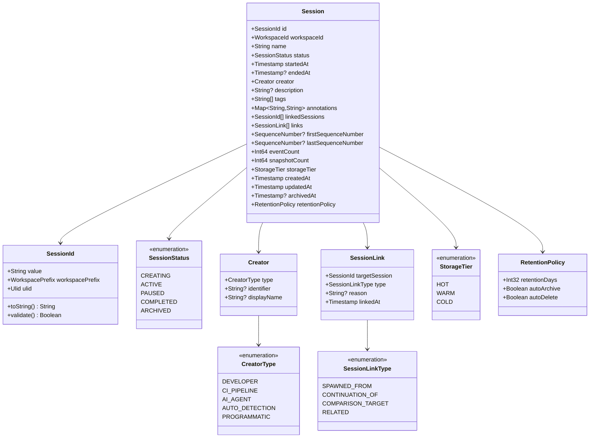
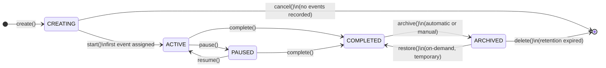
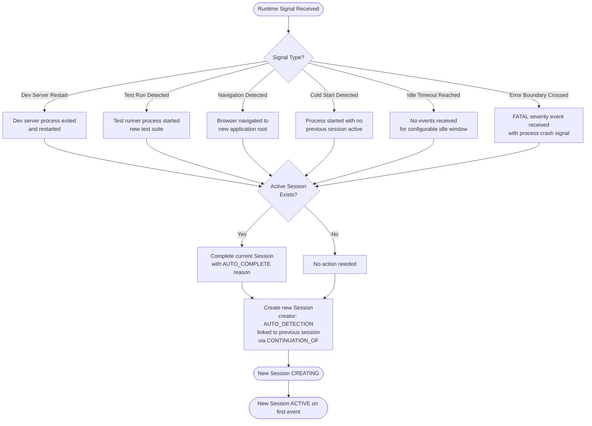
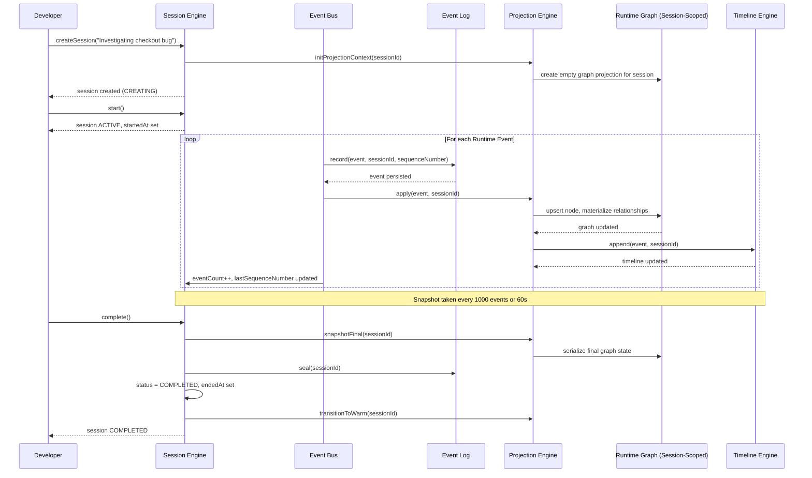
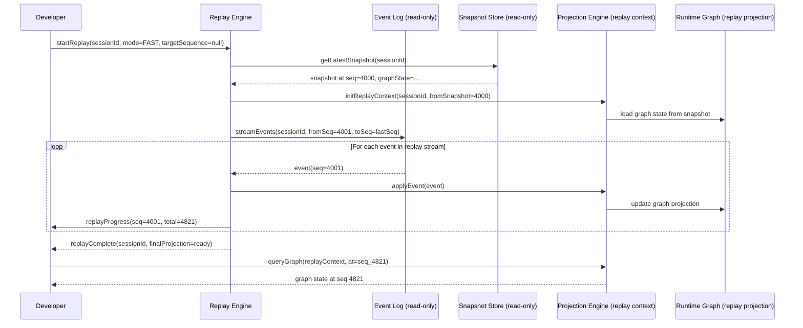
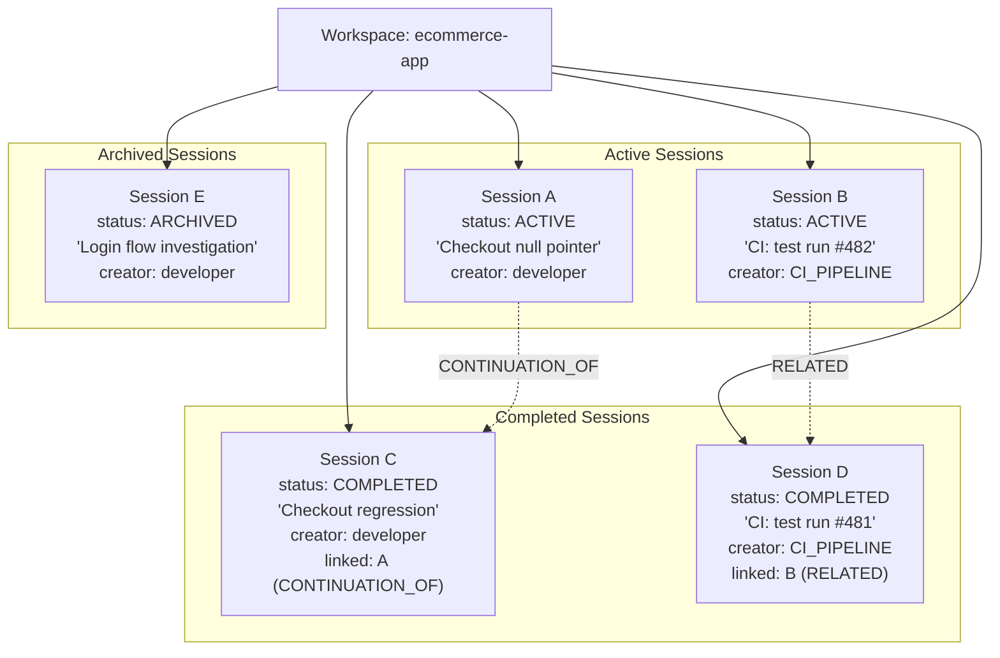

# RFC-0007: Session Model

| Field      | Value                                                                                   |
|------------|-----------------------------------------------------------------------------------------|
| RFC        | 0007                                                                                    |
| Status     | Draft                                                                                   |
| Version    | 0.1                                                                                     |
| Category   | Core Architecture                                                                       |
| Authors    | Founding Team                                                                           |
| Depends On | RFC-0001 (Glossary), RFC-0003 (ROM), RFC-0004 (REM), RFC-0006 (Projection Engine)      |

---

## Abstract

A Session is a bounded developer investigation. It is the organizing unit that gives Runtime Events temporal scope, semantic meaning, and human identity. Every Runtime Event belongs to exactly one Session. Every Session is a slice of the append-only Event Log — not a wrapper around it, not a pointer to it, but an immutable, deterministic subsequence of it.

This document specifies the complete design of the Observer Session Model: what a Session is, how it is created and ended, how it stores and exposes its Event Log slice, how it maintains a scoped Runtime Graph projection, how it supports deterministic replay and cross-session comparison, and how it integrates with the Projection Engine, Timeline Engine, and AI Consumer interfaces. It covers Session identity, metadata, lifecycle state transitions, storage tiers, snapshot strategy, collaboration, CI/CD automation, and the full internal and external API surface.

All Observer subsystems that create, read, write, or consume Sessions are governed by the contracts defined here. Engineers building the Observer Session Engine must treat this document as the authoritative specification.

---

## Motivation

When a developer investigates a bug, they are doing something with structure: they form a hypothesis, collect evidence, observe behavior, and draw conclusions. That investigation has a beginning and an end. It has a scope — some subset of the application's runtime activity that is relevant to the question being asked. It produces findings. It can be shared, replayed, compared to other investigations, and handed to an AI agent for deeper analysis.

Today, nothing in standard observability tooling captures this investigation as a first-class object. Developers work with undifferentiated streams: a log tail that started when they opened a terminal, a trace that started when they refreshed a browser, a metrics dashboard that covers the last fifteen minutes. None of these are bounded. None have identity. None can be replayed. None can be compared to yesterday's investigation of the same bug. None can be handed to an AI agent with the confidence that the agent receives complete, coherent, scoped evidence.

Observer solves this with Sessions. A Session is the container for one investigation. It begins when the developer decides to investigate. It ends when the investigation is complete. Everything that happened between those boundaries — every Runtime Event from every connected Domain — is captured in the Session's Event Log slice, preserved in exactly the order it occurred, and made available for replay, comparison, sharing, and AI consumption.

The Session is not a side-car concept. It is not metadata layered on top of events. The Session boundary IS the scope of the Event Log slice. Events do not exist inside Observer outside of Sessions. Every emitted event is assigned to exactly one Session at the moment it is received. Sessions are the unit of runtime investigation, and investigation is what Observer exists to enable.

---

## Goals

1. Define the Session as a bounded, immutable slice of the append-only Event Log scoped to one developer investigation.
2. Specify the complete Session identity and metadata schema, including all status values and their semantics.
3. Define the full Session lifecycle: creation triggers, state transitions, closure, archival, and restoration.
4. Establish that Session boundaries are immutable once set: the start boundary is fixed at creation; the end boundary is fixed at completion.
5. Specify how the Projection Engine maintains a scoped Runtime Graph projection for each Session.
6. Define the Session storage tier model: hot (memory), warm (local disk), and cold (compressed archive).
7. Specify the Snapshot strategy (checkpoint every 1,000 events or 60 seconds, whichever occurs first) and its role in projection bootstrap.
8. Define deterministic Session replay semantics: full replay, partial replay, and replay speed modes.
9. Define cross-session comparison (Session Diff) semantics and the graph-structural difference model.
10. Define the Session collaboration model: local by default, opt-in sharing, read-only for non-owners, privacy redaction before export.
11. Specify the complete internal and external Session API surface.
12. Define multi-session architecture: concurrent sessions within a Workspace, linked sessions, and session relationships.
13. Define CI/CD integration: automated session creation, test-run sessions, and archival with test results.
14. Identify open questions requiring resolution before implementation begins.

---

## Non-Goals

The Session Model does not define:

| Excluded Concern                                      | Where It Is Defined                          |
|-------------------------------------------------------|----------------------------------------------|
| Runtime Node schema and type taxonomy                 | RFC-0003 (ROM)                               |
| Runtime Event schema, immutability, and causality     | RFC-0004 (REM)                               |
| Runtime Graph traversal algorithms and edge types     | RFC-0005 (RGM)                               |
| Projection Engine implementation and materialization  | RFC-0006 (Projection Engine)                 |
| Context package assembly from event subsets           | RFC-0008 (Context Engine)                    |
| Plugin SDK wire protocol and Domain transport         | RFC-0009 (Plugin SDK)                        |
| Runtime Explorer visual interface                     | RFC-0010 (Runtime Explorer)                  |
| AI Consumer query protocol beyond what is listed here | RFC-0011 (AI Context API)                    |
| Persistent storage format and indexing implementation | Future: Storage RFC                          |
| Distributed Observer across multiple machines         | Future: Distributed Runtime RFC              |
| User-defined event annotations on Sessions            | Future: Annotation RFC                       |
| Semantic search across multiple Sessions              | Future: Intelligence RFC                     |
| Authentication and access control for shared Sessions | Future: Auth RFC                             |

---

## Design

### Core Concept: What Is a Session?

A Session is a **bounded developer investigation**. That sentence has three load-bearing words.

**Bounded**: A Session has a defined start and a defined end. Before the start, events are either in a previous Session or discarded. After the end, no new events enter the Session. The boundary is fixed when the Session closes — it cannot be extended, trimmed, or modified after the fact.

**Developer**: Sessions are organized around human investigative intent. A developer investigating a bug starts a Session. A CI/CD system running a test suite starts a Session for each run. An AI agent diagnosing an anomaly starts a Session for the diagnosis. The Session's structure reflects the investigation's scope, not an arbitrary time window imposed by the infrastructure.

**Investigation**: A Session is not a passive recording. It is the evidence collected during an active question. Sessions have names. Sessions are tagged with what was being investigated. Sessions can be compared to other Sessions asking the same question under different conditions.

**What a Session is not**: A Session is not an HTTP session. It is not an authenticated user session. It is not a terminal session. It is not a time window (though it has one). It is not a log tail. When using Observer Session types in code environments where these other meanings of "session" are common — Go's `context.Context`, a browser's `sessionStorage`, an OAuth session token — use the type name `InvestigationSession` or `ObserverSession` to prevent collisions.

### A Session Is a Slice of the Event Log

The most important implementation consequence of the Session definition is this: **a Session does not contain events; a Session IS a view over the events that belong to it**.

Events are the source of truth. The Event Log is append-only and immutable. When an event is emitted within an active Session, the event is assigned `session: <SessionId>` at record time and appended to the global Event Log. The Session is then defined as:

```
Session S = { e ∈ EventLog | e.session == S.id } ordered by e.sequenceNumber
```

Everything that the Session provides — its Runtime Graph projection, its Timeline, its Snapshots, its Context packages — is a derived view over this primary sequence. Nothing stored under the Session name is more authoritative than the events in the Event Log that carry its `session` field. If the Session's projection state and the Event Log disagree, the Event Log is correct.

This design is event sourcing applied to the runtime observation domain. It inherits event sourcing's guarantees: replayability, auditability, shareability, and time-travel queries. Every graph mutation has a corresponding event. No state transition is invisible. The complete history of an investigation is the events that occurred during it, in sequence.

### Sessions Give Events Scope and Meaning

Without Sessions, the Event Log is an undifferentiated global stream: every event from every Domain, in sequence, forever. This stream is correct but not useful for investigation. There is no way to answer "what events belong to the investigation I started this morning?" without some organizing structure.

Sessions provide that structure. They give events three properties they cannot have in isolation:

**Temporal scope**: Events in a Session occurred between `startedAt` and `endedAt`. Queries over a Session's events can be answered without scanning the full global Event Log.

**Semantic scope**: Events in a Session were collected during one investigation. The `name`, `tags`, and `annotations` on the Session describe what was being investigated. An event in a Session named "Investigating null pointer in createOrder" belongs to a different conceptual context than the same event type in a Session named "Checkout performance regression".

**Identity**: Sessions are named, stable, and addressable. A developer can say "look at Session sess_ws1_01HN2V" and another developer, an AI agent, or an automated system can look at exactly the same evidence. This is not possible with a raw event stream, where "the events I collected this morning" is not a shareable, stable reference.

### Session vs. Adjacent Concepts

The Observer vocabulary overlaps with adjacent tools in specific ways that require precise disambiguation.

| Concept             | In Adjacent Tools                                  | In Observer                                                                                |
|---------------------|----------------------------------------------------|--------------------------------------------------------------------------------------------|
| Session             | HTTP session (auth token lifetime)                 | Bounded developer investigation. Identified by `SessionId`. Scoped to a Workspace.        |
| Trace               | Distributed trace (OTel TraceId, timing spans)     | A Session may contain events whose `correlationId` matches an OTel trace ID, but a Session is not a trace. A Session is broader: it contains events from all Domains during the investigation, not only the events in one distributed call chain. |
| Log stream          | Undifferentiated tail of text or structured JSON   | A Session's Event Log is a typed, structured, bounded sequence of RuntimeEvents with causal links, identity, and a graph projection. |
| Recording           | Screen recording, HAR file, test fixture           | A Session is a structured runtime record, not a reproduction artifact. It cannot be "played back" in a browser — it is replayed within Observer's Projection Engine. |
| Test run            | CI artifact: pass/fail + timing                    | A Session may correspond to a test run (one Session per test run is the default CI integration pattern), but the Session contains the full structured runtime evidence of the run, not just the test outcome. |

---

## Architecture

### Session Identity and Metadata

Every Session is uniquely identified within its Workspace. The identity and metadata schema is the fixed set of fields associated with a Session for its entire lifetime.



### Field Reference

| Field                 | Type                    | Required | Mutable After Creation? | Description                                                                                                                              |
|-----------------------|-------------------------|----------|-------------------------|------------------------------------------------------------------------------------------------------------------------------------------|
| `id`                  | `SessionId`             | Yes      | Never                   | Stable, globally unique within Workspace. Format: `sess_{workspace_prefix}_{ulid}`. Assigned at creation, never changes.                |
| `workspaceId`         | `WorkspaceId`           | Yes      | Never                   | The Workspace this Session belongs to. A Session never migrates across Workspaces.                                                       |
| `name`                | `String`                | Yes      | Until COMPLETED         | Human-readable investigation label. Auto-generated if not provided (e.g., "Session 2024-11-15 14:23"). Updatable while ACTIVE or PAUSED. |
| `status`              | `SessionStatus`         | Yes      | By lifecycle only        | Current lifecycle state. Transitions are governed by the lifecycle state machine. Cannot be set directly; set via API operations.        |
| `startedAt`           | `Timestamp`             | Yes      | Never                   | When the Session transitioned from CREATING to ACTIVE. Immutable once set.                                                               |
| `endedAt`             | `Timestamp?`            | No       | Once (on COMPLETED)     | When the Session was completed. Null while ACTIVE or PAUSED. Set once at `complete()` and immutable thereafter.                          |
| `creator`             | `Creator`               | Yes      | Never                   | Who or what created this Session: a developer, CI pipeline, AI agent, or automatic detection heuristic.                                  |
| `description`         | `String?`               | No       | Until COMPLETED         | Longer free-text description of the investigation goal. Optional.                                                                        |
| `tags`                | `String[]`              | No       | Until ARCHIVED          | Developer-assigned labels for filtering and search. E.g., `["bug", "checkout-flow", "sprint-47"]`.                                       |
| `annotations`         | `Map<String, String>`   | No       | Until ARCHIVED          | Key-value pairs for structured metadata. E.g., `{"deploy": "v2.4.1", "ticket": "PROJ-1482"}`.                                           |
| `linkedSessions`      | `SessionId[]`           | No       | Until ARCHIVED          | IDs of Sessions that are logically related to this investigation. Maintained for bidirectional navigation.                                |
| `links`               | `SessionLink[]`         | No       | Until ARCHIVED          | Typed relationships to other Sessions: `SPAWNED_FROM`, `CONTINUATION_OF`, `COMPARISON_TARGET`, `RELATED`.                               |
| `firstSequenceNumber` | `SequenceNumber?`       | No       | Once (on ACTIVE)        | The global `sequenceNumber` of the first event assigned to this Session. Null until the first event arrives.                             |
| `lastSequenceNumber`  | `SequenceNumber?`       | No       | Until COMPLETED         | The global `sequenceNumber` of the last event in this Session. Updated with each new event. Fixed at `complete()`.                       |
| `eventCount`          | `Int64`                 | Yes      | Until COMPLETED         | Running count of events in this Session's Event Log slice. Incremented with each new event.                                              |
| `snapshotCount`       | `Int64`                 | Yes      | Until COMPLETED         | Count of Snapshots taken within this Session.                                                                                            |
| `storageTier`         | `StorageTier`           | Yes      | By lifecycle            | Current storage tier: `HOT` (ACTIVE/PAUSED), `WARM` (COMPLETED), `COLD` (ARCHIVED).                                                    |
| `createdAt`           | `Timestamp`             | Yes      | Never                   | When the Session record was first created. Precedes `startedAt` by the duration of the CREATING phase.                                  |
| `updatedAt`           | `Timestamp`             | Yes      | On every mutation        | Timestamp of the last metadata or status update.                                                                                         |
| `archivedAt`          | `Timestamp?`            | No       | Once (on ARCHIVED)      | When the Session was moved to cold storage. Null until archived.                                                                         |
| `retentionPolicy`     | `RetentionPolicy`       | Yes      | Until ARCHIVED          | Governs how long this Session is retained before deletion. Inherits from Workspace default (30 days) if not overridden.                  |

### Session Lifecycle

A Session moves through exactly five states. The state machine is strict: no transitions outside the permitted set are valid. Attempts to transition to a non-permitted state return a `SessionStateError`.



#### CREATING

The transitional state between Session record creation and the first event being received. In this state:

- The Session record exists and has a `SessionId`
- No events have been assigned to this Session
- The Projection Engine has initialized a new graph projection scope for this Session
- `startedAt` is not yet set
- `firstSequenceNumber` is not yet set

The CREATING state is brief in practice — it exists because there is always a finite gap between creating the Session record and receiving the first event. In most cases, this state lasts fewer than 100 milliseconds. A Session that remains in CREATING for more than the configured timeout (default: 30 seconds) without receiving any event is flagged for operator review. It is not automatically cancelled, because automated Session creation (CI/CD) may have a longer startup sequence.

A Session in CREATING can be cancelled. Cancellation removes the Session record and releases the projection scope. No event records are affected because no events were assigned.

#### ACTIVE

The normal operating state. In this state:

- Events are being received and appended to the Session's Event Log slice in real time
- The Runtime Graph projection is being updated by the Projection Engine with each new event
- The Timeline is growing chronologically
- Snapshots are being taken at the configured checkpoint interval
- `startedAt` is set and immutable
- `firstSequenceNumber` is set (set when the first event arrived)
- `lastSequenceNumber` is updated with each new event
- `eventCount` increments with each new event

An ACTIVE Session is in the `HOT` storage tier. Its event log is in memory for fast append and query access.

#### PAUSED

Event capture is suspended. In this state:

- No new events are being assigned to this Session
- The Runtime Graph projection is frozen at the state it held when `pause()` was called
- The Timeline shows no new entries
- The Session record and all existing events remain in memory (HOT tier)
- The developer can query the existing projection and timeline freely
- Snapshots are not taken (there is no new event activity)

Pausing is intentional. A developer who needs to interrupt their investigation without losing context can pause the Session. When resumed, event capture resumes and the projection picks up from where it froze.

Events emitted by Domain plugins during a PAUSED Session are **not discarded** — they are queued by the Session Engine and applied in order when the Session is resumed. This prevents gaps in the Session's causal record when the developer returns from a pause. See the Tradeoffs section for the memory implications of this decision and the configurable queue limit.

#### COMPLETED

The investigation is concluded. In this state:

- No new events will be accepted
- `endedAt` is set and immutable
- `lastSequenceNumber` is fixed
- `eventCount` is final
- The Event Log slice is sealed: append-only guarantees are now read-only guarantees
- The Runtime Graph projection transitions from `HOT` to `WARM` storage
- A final Snapshot is taken immediately before the transition
- The Session is available for historical query, replay, and comparison

A COMPLETED Session moves to `WARM` storage: the event log is persisted to local disk with indexing for efficient query access. The in-memory projection may be evicted after a configurable idle window (default: 10 minutes), with future access requiring a projection bootstrap from the most recent Snapshot plus replay.

#### ARCHIVED

Long-term storage. In this state:

- The Session is compressed and moved to cold storage
- The in-memory projection and the on-disk indexed event log are released
- The Session record itself (metadata only) remains in `WARM` storage for fast listing and discovery
- The full event log and all Snapshots are in compressed cold storage
- Access requires an explicit `restore()` call that decompresses the event log and rebuilds the projection from the latest Snapshot plus replay
- After restoration, the Session temporarily enters a `COMPLETED` state for query access
- Restoration is marked with a `restoredAt` timestamp; the Session re-archives automatically after a configurable idle window (default: 2 hours)

Archival is triggered either automatically (when a COMPLETED Session's `retentionPolicy.autoArchive` is true and the Session has been idle past the warm retention window) or manually (via the `archive()` API call). The default warm retention window is 7 days — COMPLETED Sessions that have not been accessed in 7 days are automatically archived.

### Permitted State Transitions

| From        | To          | Trigger                                    | Permitted? |
|-------------|-------------|--------------------------------------------|------------|
| CREATING    | ACTIVE      | `start()` or first event received          | Yes        |
| CREATING    | (removed)   | `cancel()` (no events recorded)            | Yes        |
| ACTIVE      | PAUSED      | `pause()`                                  | Yes        |
| ACTIVE      | COMPLETED   | `complete()`                               | Yes        |
| PAUSED      | ACTIVE      | `resume()`                                 | Yes        |
| PAUSED      | COMPLETED   | `complete()`                               | Yes        |
| COMPLETED   | ARCHIVED    | `archive()` (manual or automatic)          | Yes        |
| ARCHIVED    | COMPLETED   | `restore()` (temporary restoration)        | Yes        |
| ARCHIVED    | (deleted)   | `delete()` (retention expired)             | Yes        |
| Any         | ACTIVE      | (re-opening a closed session)              | **No**     |
| COMPLETED   | ACTIVE      | (any attempt to reopen)                    | **No**     |
| ARCHIVED    | ACTIVE      | (any attempt to reopen)                    | **No**     |

The prohibition on re-opening a completed Session is intentional and enforced. A Session's boundary is its identity. Re-opening would break the immutability of the end boundary and invalidate any comparisons or AI analyses conducted on the basis of the completed Session. If an investigation needs to continue, start a new Session linked to the completed one via a `CONTINUATION_OF` link.

### Session Creation Triggers

Sessions can be created by four mechanisms:

**Manual (Developer-initiated)**: A developer explicitly starts a Session from the Observer UI or CLI. This is the primary creation path during active development.

```
developer:       click "Start Investigation" in Runtime Explorer
Session Engine:  createSession({name: "Checkout null pointer", creator: DEVELOPER})
Session Engine:  → status: CREATING
Session Engine:  → status: ACTIVE (on first event)
```

**Automatic (Heuristic-based)**: Observer's boundary detection engine creates Sessions based on observable runtime signals that indicate a new investigation context has begun. Heuristics fire without developer action.

**Programmatic (API-triggered)**: An external system calls Observer's Session API to create a Session. The primary use case is CI/CD integration (see the CI/CD Integration section).

**AI-Agent-triggered**: An AI Consumer calls the external Session API to create a Session for its own investigation. The `creator.type` is set to `AI_AGENT` and the `creator.identifier` records which agent created the Session.

### Automatic Session Boundary Detection

Observer can detect Session boundaries without developer intervention. The boundary detection engine monitors runtime signals and fires a `NEW_SESSION_BOUNDARY_DETECTED` internal event when a signal indicates a clean break in investigation context.



#### Heuristic Catalog

| Signal                          | Boundary Action                          | New Session Creator | Link Type         |
|---------------------------------|------------------------------------------|---------------------|-------------------|
| Dev server process restart      | Complete current → create new            | `AUTO_DETECTION`    | `CONTINUATION_OF` |
| Test runner invocation (`jest`, `vitest`, `pytest`, etc.) | Complete current → create new per suite | `AUTO_DETECTION`    | `RELATED`         |
| Browser full-page reload (not SPA navigation) | Create new in parallel or complete current | `AUTO_DETECTION`    | `CONTINUATION_OF` |
| First event after cold start (no prior Session) | Create first Session for Workspace | `AUTO_DETECTION`    | None              |
| Configured idle timeout (default: 10 minutes of no events) | Complete current Session | `AUTO_DETECTION`    | None              |
| Process FATAL crash (container restart, OOM kill) | Complete current → create new            | `AUTO_DETECTION`    | `CONTINUATION_OF` |
| CI pipeline invocation          | Create new Session per test run          | `CI_PIPELINE`       | None              |

Automatic boundary detection is configurable. Developers can disable specific heuristics, adjust thresholds (e.g., idle timeout), or disable automatic boundary detection entirely and control Sessions manually. Heuristics are opt-in for teams that prefer explicit control.

### Session as Event Log Slice

Every RuntimeEvent emitted to Observer is assigned to exactly one Session at the moment the Observer Event Bus validates and records it. The assignment is performed by the Session Router, a subsystem of the Session Engine.

**Assignment rules**:

1. If there is exactly one ACTIVE Session in the Workspace, the event is assigned to that Session.
2. If there are multiple ACTIVE Sessions (concurrent investigation), the event is assigned based on Domain routing rules. Each Domain plugin registers a Session routing preference at plugin connection time. Events from ambiguous Domains go to the primary Session (the most recently created ACTIVE Session) unless overridden.
3. If there is no ACTIVE Session, the event is **not discarded** — it is queued in a short-lived pre-session buffer (max 5 seconds, 1,000 events). If a new Session becomes ACTIVE within that window, the buffered events are assigned to it. If no Session becomes ACTIVE, the events are dropped and a `system/event.dropped` record is created.
4. If the event already carries a `session` field set by the plugin, that assignment is honored if the Session is ACTIVE. If the Session is not ACTIVE, the event is rejected with a `SessionNotActiveError`.

**Invariants**:

- An event's `session` field is set once, at record time, and never changes.
- A COMPLETED Session never receives new events.
- An event's `sequenceNumber` is globally monotonic across all Sessions in an Observer instance. The Session does not have its own sequence number space.
- The Session's `firstSequenceNumber` and `lastSequenceNumber` define an inclusive range within the global sequence. Within that range, not all sequence numbers necessarily belong to this Session (concurrent Sessions interleave their events in the global log).

The canonical query for a Session's events:

```sql
SELECT * FROM event_log
WHERE session_id = :session_id
ORDER BY sequence_number ASC
```

### Session Boundaries Are Immutable

Once a Session is completed:

- `startedAt` is immutable (set when ACTIVE was first entered)
- `endedAt` is immutable (set at completion)
- `firstSequenceNumber` is immutable
- `lastSequenceNumber` is immutable
- No new events can be appended
- No existing events can be modified or removed (they follow Event Log retention policy, not Session policy)

This immutability is the foundation of all Session-based guarantees. Comparison between two Sessions is only meaningful if both Sessions are closed — a completed Session's graph projection is stable and can be diffed against another stable projection. AI analysis of a completed Session produces findings that remain valid as long as the Session exists — the ground truth does not change under the AI's analysis. Replay of a completed Session always produces the same result, forever.

**If you need to investigate more, start a new Session.** A `CONTINUATION_OF` link documents the relationship between the completed investigation and the new one. This is an intentional design constraint, not a limitation.

### Session Projections

Each Session maintains its own Runtime Graph projection, scoped to the events in that Session's Event Log slice. The Projection Engine manages one projection context per ACTIVE or recently accessed Session.



#### Projection Scoping

A Session's Runtime Graph projection is scoped to the events in that Session. A node that exists across multiple Sessions (a long-lived `ReactComponent`, a persistent `DatabaseConnection`, a running `Container`) has **independent state** in each Session's projection:

- In Session A, `Container(api-server)` may be in `RUNNING` state with a specific uptime and resource snapshot.
- In Session B, the same container may be in `RESTARTING` state after a crash, with different resource metrics.

The node is the same physical entity, but its observed state during each investigation differs. The Session projection records what was observed during that investigation, not a shared global truth about the node.

**Node identity across Sessions**: Nodes share a stable `nodeId` that is assigned by the ROM materializer the first time the node is observed. The same `nodeId` may appear in multiple Sessions. The Session projection for each Session independently tracks that node's state as observed during that Session's events. Cross-session node queries (e.g., "show me how this component's props changed across Sessions A, B, and C") are answered by querying each Session's projection for the node and comparing the results.

#### Projection Bootstrap

When a Session's projection is evicted from memory (after COMPLETED status and the warm idle window), subsequent access requires a bootstrap:

1. Load the most recent Snapshot for this Session (the closest checkpoint before the desired access point).
2. Replay events from the Snapshot's `sequenceNumber + 1` to the desired target sequence number (or `lastSequenceNumber` for the full projection).
3. The resulting in-memory projection is identical to the projection that would have been produced by replaying all events from the beginning.

Bootstrap uses Snapshots to avoid replaying the entire event log for large Sessions. A Session with 50,000 events and Snapshots every 1,000 events requires replaying at most 999 events after the last Snapshot — not 50,000.

Bootstrap is transparent to callers. The API always returns a projection ready for query, regardless of whether the projection was in memory or required bootstrap.

### Snapshot Strategy

Snapshots are optional performance checkpoints. They are **not required for correctness** — a Session without Snapshots can be fully replayed from its complete event sequence. They exist solely to accelerate projection bootstrap.

**Checkpoint interval**: A Snapshot is taken when either of the following conditions is met within an ACTIVE Session:

- 1,000 events have been appended since the last Snapshot (or since the Session started)
- 60 seconds have elapsed since the last Snapshot (or since the Session started)

Whichever condition fires first triggers the Snapshot. The two conditions ensure that high-event-rate Sessions checkpoint frequently (by event count) and low-event-rate Sessions checkpoint periodically (by time).

**Snapshot contents**: A Snapshot is a serialized copy of the complete Runtime Graph state at a specific `sequenceNumber`. It contains:

- The `sequenceNumber` at which the Snapshot was taken
- The serialized Runtime Graph: all nodes (with all current fields), all relationships, all node lifecycle states
- A SHA-256 checksum of the serialized graph (for integrity verification)
- A `snapshotId` of the form `snap_{sessionId}_{sequenceNumber}`
- The `recordedAt` timestamp of the Snapshot operation

**Snapshot storage**: Snapshots are stored alongside the Session's event log in the same storage tier. When a Session moves to COLD storage, its Snapshots are compressed and archived with it.

**Snapshot validity**: A Snapshot is valid as long as the event sequence it represents has not been modified. Since events are immutable, Snapshots are always valid for the duration of the Session's retention. A Snapshot is never "stale" — it accurately reflects graph state at its sequence number, forever.

**Final Snapshot**: When a Session is completed (`complete()` is called), the Session Engine takes a final Snapshot before sealing the event log. This final Snapshot represents the complete graph state of the investigation and is the most commonly accessed Snapshot (it is the starting point for cross-session comparison).

### Session Storage Tiers

```
HOT     ────────────────────────►  WARM  ──────────────────►  COLD
(ACTIVE, PAUSED)               (COMPLETED)                 (ARCHIVED)
  in-memory                    local disk + index          compressed archive
  fast append + query          fast query, medium restore  slow restore, indefinite retention
```

| Tier | Status            | Storage Medium         | Event Log Access           | Projection Access              | Snapshot Access         | Approximate Query Latency |
|------|-------------------|------------------------|----------------------------|--------------------------------|-------------------------|---------------------------|
| HOT  | ACTIVE, PAUSED    | In-memory              | O(1) append, O(n) query    | In-memory, O(1)                | In-memory or disk       | < 1ms                     |
| WARM | COMPLETED (recent)| Local disk, indexed    | Indexed query, O(log n)    | In-memory if idle < 10 min; bootstrap from disk if evicted | On disk | 1–50ms               |
| COLD | ARCHIVED          | Compressed archive     | After restore: as WARM     | After restore: as WARM         | After restore: as WARM  | 5–30s restore, then WARM  |

**Hot tier eviction**: An ACTIVE Session's event log is always in memory. When a Session becomes COMPLETED, the event log is flushed to disk (WARM tier) and the in-memory copy is retained for the warm idle window (default: 10 minutes). After the idle window, the in-memory copy is evicted to free memory.

**Warm tier retention**: COMPLETED Sessions remain in WARM storage for the configured warm retention window (default: 7 days). After this window, if `retentionPolicy.autoArchive` is true (default), the Session is automatically moved to COLD.

**Cold tier**: ARCHIVED Sessions are compressed and stored in the workspace's archive location. The compression format and storage backend are implementation details of the Storage subsystem (Future RFC). Restoration from COLD to WARM is triggered by `restore()` and takes between 5 and 30 seconds depending on Session size.

**Retention policy defaults**:

| Policy Field        | Default Value | Developer Override |
|---------------------|---------------|--------------------|
| `retentionDays`     | 30 days       | 1–365 days         |
| `autoArchive`       | true          | false (disable)    |
| `autoDelete`        | false         | true (enable)      |
| Warm idle window    | 10 minutes    | 1–60 minutes       |
| Warm retention      | 7 days        | 1–30 days          |

The `retentionDays` clock starts from `endedAt` for COMPLETED Sessions and `archivedAt` for ARCHIVED Sessions. When `retentionDays` expires and `autoDelete` is true, the Session (events, Snapshots, and projection) is permanently deleted. The Session metadata record is retained for an additional 90 days with status `DELETED` to preserve audit logs and linked Session references.

### Session Timeline

The Session Timeline is a projection of the Session's Event Log, organized for chronological human navigation. It is not stored separately — it is computed on demand from the Event Log and refreshed incrementally as new events arrive in an ACTIVE Session.

**Ordering model**:

- **Display ordering**: `occurredAt` (the originating runtime timestamp). This is what a developer sees when viewing the Timeline — events ordered by when they happened in the running software.
- **Correctness ordering**: `sequenceNumber` (the Observer-assigned monotonic sequence). This is the canonical ordering used by the Projection Engine and Replay Engine. Within a single Domain with a trusted clock, `occurredAt` and `sequenceNumber` ordering agree. Across Domains with clock drift, they may diverge.

When `occurredAt` values conflict (two events from different Domains with timestamps within 1ms that have inconsistent `sequenceNumber` order), the Timeline marks the affected events with an `OUT_OF_ORDER` flag and presents them in `sequenceNumber` order with a developer-visible notice.

**Timeline filtering**: The Timeline supports filtering on any combination of:

| Filter Dimension | Type             | Description                                                                 |
|-----------------|------------------|-----------------------------------------------------------------------------|
| `domains`       | `DomainId[]`     | Include only events from the listed Domains.                                |
| `nodeTypes`     | `NodeType[]`     | Include only events affecting nodes of the listed types.                    |
| `eventTypes`    | `EventType[]`    | Include only events of the listed types (prefix match supported).           |
| `severity`      | `Severity`       | Include only events at or above the given severity.                         |
| `after`         | `Timestamp`      | Include only events where `occurredAt >= after`.                            |
| `before`        | `Timestamp`      | Include only events where `occurredAt <= before`.                           |
| `nodes`         | `NodeId[]`       | Include only events where the node is in `sourceNode` or `affectedNodes`.   |
| `correlationId` | `String`         | Include only events sharing a specific correlation identifier.              |
| `tags`          | `Map<String,String>` | Include only events whose tags contain all specified key-value pairs.   |
| `minSeverity`   | `Severity`       | Shorthand for severity-based filtering with a floor value.                  |

Filters compose with AND semantics. The Timeline is the primary surface through which developers navigate Session evidence in the Runtime Explorer.

### Session Replay

Replay is the most powerful consequence of Sessions-as-Event-Log-slices. Because the Event Log is immutable and the Projection Engine is deterministic, replaying a Session's event sequence always produces the same Runtime Graph state, forever.



**Replay is read-only**. Replayed events flow through the Projection Engine into a dedicated replay projection context. They do not flow into the live Session's projection. They do not appear in any live Timeline. They do not trigger any live Context Engine notifications. The original event records are not modified in any way during replay.

**Replay modes**:

| Mode              | Behavior                                                                                     | Use Case                                                        |
|-------------------|----------------------------------------------------------------------------------------------|-----------------------------------------------------------------|
| `FAST`            | Events applied as fast as the Projection Engine can process them. Timing not preserved.     | Projection bootstrap, bug reproduction, automated analysis      |
| `TIMING_FAITHFUL` | Events applied with original inter-event delays preserved. Playback matches original speed. | Observing runtime behavior as it occurred, timing-sensitive investigation |
| `STEP_BY_STEP`    | Developer advances one event at a time. Graph state is available between each step.         | Interactive debugging, teaching, detailed investigation         |

**Partial replay**: Replay does not need to cover the full Session. Supported partial replay modes:

| Partial Mode      | Range                                                                          | Production Rule                                                                |
|-------------------|--------------------------------------------------------------------------------|--------------------------------------------------------------------------------|
| Full              | Events 1 → lastSequenceNumber                                                  | Produces complete Session graph                                                 |
| To sequence       | Events 1 → targetSequenceNumber (or last Snapshot before target + events after) | Produces graph state at a specific point in the Session                        |
| Time slice        | Events in `occurredAt` range [T1, T2]                                         | Produces graph state for a sub-window of the Session                           |
| Causal chain      | Events in `causedBy` chain(eventId) plus their causal descendants              | Produces only the causal tree relevant to a specific event                      |
| Domain slice      | Events where `domain = X`                                                      | Produces Domain-specific graph state without cross-domain events               |
| Node slice        | Events where `sourceNode = nodeId` or `nodeId ∈ affectedNodes`                | Produces the complete history of a specific node                               |

**Replay and Snapshots**: Replay bootstraps from the most recent Snapshot at or before the target sequence number. If no Snapshot exists (unlikely under the 1,000-event checkpoint policy), replay starts from sequence 1. The choice of Snapshot does not affect the result — it only affects replay speed.

**Replay determinism**: The determinism guarantee is:

```
Given the same event sequence E₁, E₂, ..., Eₙ and the same Projection Engine version,
replay always produces the same Runtime Graph state Gₙ.
```

This guarantee breaks if the Projection Engine version changes between two replays such that an event's graph materialization logic is different. The Projection Engine maintains version compatibility notes for each ROM/REM version, and Sessions record the Projection Engine version at creation time for forensic purposes.

### Session Comparison (Diff)

Two completed Sessions can be compared to produce a Session Diff: a structured representation of what changed in the Runtime Graph between one investigation and another.

**Primary use cases**:

1. **Regression identification**: "Did this deploy change how the component tree renders?" — compare a Session from before the deploy with one from after.
2. **Bug localization**: "Why does this bug appear in Session B but not Session A?" — compare the graph projections to find structural differences.
3. **Performance comparison**: "Was this request faster or slower yesterday?" — compare the node timing metadata across Sessions.
4. **Test baseline comparison**: "Did the test run this morning match the expected baseline Session?" — compare CI Sessions for structural regression.

**Diff semantics**: A Session Diff operates on the final Runtime Graph projections of two Sessions (Session A and Session B). The diff is structural and semantic — it compares nodes, relationships, node states, and node metadata. It does not diff raw event logs.

```
SessionDiff(A, B) = {
    addedNodes:     nodes in B.graph not in A.graph
    removedNodes:   nodes in A.graph not in B.graph
    changedNodes:   nodes in both, with changed state or metadata
    addedEdges:     relationships in B.graph not in A.graph
    removedEdges:   relationships in A.graph not in B.graph
    changedEdges:   relationships in both, with changed metadata
    summary:        human-readable description of the structural delta
}
```

Diff results are stable: the same two Sessions always produce the same Diff. Diffs are computed on demand and not stored by default (they are rederivable from the two projections). AI Consumers receiving a Diff have sufficient information to reason about regressions without reading the raw event logs of both Sessions.

**Diff limitations**: Sessions from different Workspaces cannot be diffed (they have no shared node identity). Sessions that cover different time ranges and therefore contain different subsets of nodes produce Diffs with many false positives — nodes appear "added" or "removed" when they were simply outside the investigation scope of one Session. Best practice for comparison is to scope both Sessions to the same functional scenario.

### Session Collaboration

Observer Sessions are local by default. A Session created on a developer's machine stays on that machine unless explicitly shared.

**Sharing model**:

- **Local (default)**: Session data exists only on the creating machine. No network transmission occurs.
- **Export for sharing**: A developer exports a Session as a self-contained archive. The archive includes the event log, Snapshots, and metadata. It does not include Workspace credentials or sensitive plugin configurations.
- **Import by teammate**: A teammate imports the archive into their Observer instance. The imported Session is read-only.
- **AI Consumer sharing**: A Session can be shared with an AI Consumer via the external Session API. The Consumer receives the event log and projection via the standard API — no archive file is produced.

**Privacy constraints on shared Sessions**: Before a Session is exported or shared, Observer applies a privacy filter:

| Category               | Action                                                                          |
|------------------------|---------------------------------------------------------------------------------|
| PII in event payloads  | Fields tagged `[REDACTED]` by plugins remain redacted in the export             |
| `visibility: LOCAL` events | Stripped from the export entirely                                          |
| Session `annotations`  | Developer-annotated annotations are included (they are investigative notes, not secrets) |
| Session `tags`         | Included                                                                        |
| Workspace credentials  | Never included. The Workspace is identified by a shareable workspace name only  |
| Plugin authentication tokens | Stripped from plugin metadata before export                            |
| Source code snippets in stack traces | Included (stack frames are part of the runtime record, not secrets) |

**Shared Session permissions**: A shared (imported) Session is always read-only for the recipient. The recipient cannot append events, modify metadata, or re-export the Session. The original creator retains the canonical copy.

**Shared Session identity**: A shared Session retains its original `SessionId`. If a teammate imports the same Session twice, the second import does not create a duplicate — the same `SessionId` prevents collision.

### Multi-Session Architecture

Multiple Sessions can be active concurrently within a Workspace. This supports:

- **Parallel investigations**: Two developers investigating different bugs in the same Workspace simultaneously
- **Background monitoring**: One Session monitoring the full application while a developer's active Session covers a specific sub-domain
- **CI + developer sessions**: A CI Session running automated tests concurrently with a developer's manual investigation Session



**Event routing with concurrent Sessions**: When multiple Sessions are ACTIVE, every incoming event must be routed to exactly one Session. The routing rules, in priority order:

1. If the event's `correlationId` matches a known correlation context owned by a specific Session, route to that Session.
2. If the Domain plugin specified a Session preference at plugin connection time, route to that Session.
3. If the event's `domain` is exclusively registered to a specific concurrent Session (e.g., the CI Session registered the `test-runner` Domain), route to that Session.
4. Default: route to the primary Session (the most recently created ACTIVE Session with `creator.type = DEVELOPER`, or if no developer Session exists, the most recently created ACTIVE Session of any creator type).

The routing decision is recorded in the event itself (via the `session` field) and is immutable. If a developer believes an event was misrouted, there is no correction mechanism — routing is a side effect of the decision to have concurrent Sessions. Design concurrent Session setups carefully.

### CI/CD Integration

Observer integrates with CI/CD pipelines by treating each test run as a Session. The pattern:

1. CI pipeline starts. The CI plugin (or CI integration API call) creates a new Observer Session with `creator.type = CI_PIPELINE`, `creator.identifier = "github-actions"` (or whatever system), and a `name` derived from the test suite identifier and build number.
2. The Session starts. The test runner begins executing tests. Each Domain plugin emits events into the CI Session.
3. The test suite completes. The CI plugin calls `complete()` on the Session. The Session is sealed.
4. The Session is linked to the test results artifact: the `annotations` field receives `{"ci.result": "passed", "ci.build": "4182", "ci.suite": "unit"}`.
5. The Session is archived automatically after the warm retention window (or immediately, if the CI integration specifies `archive_on_close = true` in its configuration).
6. AI Consumers can query the archived CI Session to detect regressions, identify flaky test patterns, and produce structured test analysis reports.

**One Session per test suite** (not per test case): Granularity at the individual test case level would produce thousands of Sessions per CI run with minimal events per Session. The suite-level granularity balances investigative utility against operational overhead. Individual test case results are captured as node metadata within the Session's graph projection (each test case is a `TestCase` node in the ROM).

**Test Sessions and retention**: CI Sessions default to a longer default retention than developer Sessions (90 days vs. 30 days), because regression analysis queries require access to historical CI Sessions spanning multiple deploys.

---

## Interfaces

### Internal Session API

The internal Session API is used by Observer subsystems. It is not exposed directly to external consumers.

```typescript
interface SessionEngine {
    // Lifecycle operations
    createSession(request: CreateSessionRequest): Promise<Session>;
    startSession(sessionId: SessionId): Promise<Session>;
    pauseSession(sessionId: SessionId): Promise<Session>;
    resumeSession(sessionId: SessionId, options?: ResumeOptions): Promise<Session>;
    completeSession(sessionId: SessionId, options?: CompleteOptions): Promise<Session>;
    archiveSession(sessionId: SessionId): Promise<Session>;
    restoreSession(sessionId: SessionId): Promise<Session>;
    deleteSession(sessionId: SessionId): Promise<void>;
    cancelCreating(sessionId: SessionId): Promise<void>;

    // Metadata operations
    updateSessionName(sessionId: SessionId, name: string): Promise<Session>;
    updateSessionDescription(sessionId: SessionId, description: string): Promise<Session>;
    addSessionTag(sessionId: SessionId, tag: string): Promise<Session>;
    removeSessionTag(sessionId: SessionId, tag: string): Promise<Session>;
    setSessionAnnotation(sessionId: SessionId, key: string, value: string): Promise<Session>;
    removeSessionAnnotation(sessionId: SessionId, key: string): Promise<Session>;
    linkSessions(sessionId: SessionId, targetId: SessionId, linkType: SessionLinkType, reason?: string): Promise<void>;

    // Event routing
    routeEvent(event: RuntimeEvent): Promise<SessionId>;
    assignEventToSession(event: RuntimeEvent, sessionId: SessionId): Promise<void>;

    // Query operations
    getSession(sessionId: SessionId): Promise<Session>;
    listSessions(workspaceId: WorkspaceId, filter?: SessionFilter): Promise<SessionPage>;
    queryEvents(sessionId: SessionId, filter?: EventFilter): Promise<EventPage>;
    streamEvents(sessionId: SessionId, filter?: EventFilter): AsyncIterable<RuntimeEvent>;

    // Projection operations
    getProjection(sessionId: SessionId): Promise<RuntimeGraph>;
    getProjectionAtSequence(sessionId: SessionId, sequenceNumber: SequenceNumber): Promise<RuntimeGraph>;
    getProjectionAtTimestamp(sessionId: SessionId, timestamp: Timestamp): Promise<RuntimeGraph>;

    // Timeline operations
    getTimeline(sessionId: SessionId, filter?: TimelineFilter): Promise<TimelinePage>;

    // Snapshot operations
    takeSnapshot(sessionId: SessionId): Promise<Snapshot>;
    getSnapshot(snapshotId: SnapshotId): Promise<Snapshot>;
    listSnapshots(sessionId: SessionId): Promise<Snapshot[]>;
    getLatestSnapshot(sessionId: SessionId): Promise<Snapshot | null>;
    getSnapshotBeforeSequence(sessionId: SessionId, sequenceNumber: SequenceNumber): Promise<Snapshot | null>;

    // Replay operations
    startReplay(sessionId: SessionId, options: ReplayOptions): Promise<ReplayContext>;
    advanceReplay(replayContextId: ReplayContextId, steps?: number): Promise<ReplayProgress>;
    stopReplay(replayContextId: ReplayContextId): Promise<void>;
    getReplayProjection(replayContextId: ReplayContextId): Promise<RuntimeGraph>;

    // Comparison operations
    compareSession(sessionAId: SessionId, sessionBId: SessionId, options?: DiffOptions): Promise<SessionDiff>;
}

interface CreateSessionRequest {
    workspaceId: WorkspaceId;
    name?: string;            // Auto-generated if omitted
    description?: string;
    tags?: string[];
    annotations?: Record<string, string>;
    creator: Creator;
    linkedSessions?: SessionLink[];
    retentionPolicy?: Partial<RetentionPolicy>;
    startImmediately?: boolean; // If true, transition CREATING → ACTIVE immediately
}

interface ReplayOptions {
    mode: 'FAST' | 'TIMING_FAITHFUL' | 'STEP_BY_STEP';
    fromSequence?: SequenceNumber;   // Default: use latest Snapshot before targetSequence
    toSequence?: SequenceNumber;     // Default: lastSequenceNumber
    filter?: EventFilter;            // For partial replay (domain slice, node slice, etc.)
}

interface DiffOptions {
    atSequenceA?: SequenceNumber;    // Default: lastSequenceNumber of Session A
    atSequenceB?: SequenceNumber;    // Default: lastSequenceNumber of Session B
    includeAddedNodes?: boolean;     // Default: true
    includeRemovedNodes?: boolean;   // Default: true
    includeChangedNodes?: boolean;   // Default: true
    includeAddedEdges?: boolean;     // Default: true
    includeRemovedEdges?: boolean;   // Default: true
    nodeTypeFilter?: string[];       // Restrict diff to specific node types
}
```

### External Session API (AI Consumer)

The external API is exposed to AI Consumers and external tools via the Observer AI Context API. It is a read-oriented subset of the internal API with additional context-packaging operations.

```typescript
interface ExternalSessionAPI {
    // Session discovery
    listSessions(workspaceId: WorkspaceId, filter?: ExternalSessionFilter): Promise<ExternalSessionPage>;
    getSession(sessionId: SessionId): Promise<ExternalSession>;

    // Event access
    querySessionEvents(sessionId: SessionId, filter?: EventFilter): Promise<EventPage>;
    streamLiveSession(sessionId: SessionId): AsyncIterable<RuntimeEvent>;   // ACTIVE sessions only

    // Graph access
    querySessionGraph(sessionId: SessionId, query: GraphQuery): Promise<GraphQueryResult>;
    getSessionGraphAtTimestamp(sessionId: SessionId, timestamp: Timestamp): Promise<RuntimeGraph>;
    getSessionGraphAtSequence(sessionId: SessionId, sequenceNumber: SequenceNumber): Promise<RuntimeGraph>;

    // Timeline access
    getSessionTimeline(sessionId: SessionId, filter?: TimelineFilter): Promise<ExternalTimelinePage>;

    // Context packages
    getSessionContextPackage(sessionId: SessionId, options?: ContextPackageOptions): Promise<ContextPackage>;
    getNodeContextInSession(sessionId: SessionId, nodeId: NodeId): Promise<NodeContext>;
    getEventCausalChain(sessionId: SessionId, eventId: EventId): Promise<CausalChain>;

    // Comparison
    compareSessionsExternal(sessionAId: SessionId, sessionBId: SessionId, options?: DiffOptions): Promise<SessionDiff>;
}

interface ExternalSession {
    id: SessionId;
    workspaceId: WorkspaceId;
    name: string;
    status: SessionStatus;
    startedAt: Timestamp;
    endedAt: Timestamp | null;
    creator: Creator;
    tags: string[];
    annotations: Record<string, string>;
    eventCount: number;
    linkedSessions: SessionLink[];
    // Note: raw event payloads are access-controlled; redacted fields are not exposed
}

interface ContextPackageOptions {
    maxEvents?: number;        // Default: 500. Limits event count for large Sessions
    includeSnapshots?: boolean; // Default: false. Include Snapshot graph states
    domainFilter?: DomainId[]; // Include only events from these Domains
    severityFloor?: Severity;  // Default: INFO. Exclude DEBUG events
    format?: 'json' | 'markdown'; // Default: json
}
```

### Session API Error Types

| Error Type                | HTTP Equivalent | Description                                                                                   |
|---------------------------|-----------------|-----------------------------------------------------------------------------------------------|
| `SessionNotFoundError`    | 404             | The specified `SessionId` does not exist in this Workspace.                                   |
| `SessionNotActiveError`   | 409             | An operation requiring ACTIVE status was attempted on a Session that is not ACTIVE.           |
| `SessionStateError`       | 409             | An invalid state transition was attempted (e.g., completing an ARCHIVED Session).             |
| `SessionBoundaryError`    | 422             | Attempted to modify an immutable boundary (e.g., changing `startedAt` after ACTIVE).         |
| `SessionStorageTierError` | 503             | Requested operation requires HOT or WARM access but Session is COLD and not yet restored.    |
| `SessionQuotaExceeded`    | 429             | Workspace has reached the maximum number of concurrent ACTIVE Sessions.                       |
| `ReplayContextExpiredError` | 410           | The referenced replay context has expired (idle timeout or explicit stop).                    |
| `IncompatibleSessionsError` | 422          | Sessions passed to `compareSession` are from different Workspaces or are not COMPLETED.       |

---

## Examples

### Example 1: Developer Debug Session

**Scenario**: A developer is investigating a null pointer exception in the order checkout flow. They observe the bug, start an investigation, reproduce it, and find the root cause.

**Session metadata**:

```json
{
  "id": "sess_ecom_01HN2V3PQRS4T5U",
  "workspaceId": "ws_ecommerce",
  "name": "Null pointer in createOrder handler",
  "status": "COMPLETED",
  "startedAt": "2024-11-15T14:23:00.000Z",
  "endedAt": "2024-11-15T14:47:22.000Z",
  "creator": {
    "type": "DEVELOPER",
    "identifier": "local",
    "displayName": "Developer"
  },
  "tags": ["bug", "checkout", "null-pointer"],
  "annotations": {
    "ticket": "ECOM-1482",
    "rootCause": "queryResult.rows[0] accessed without null check when INSERT returns empty",
    "fix": "Added null guard at orders.ts:41"
  },
  "eventCount": 4821,
  "snapshotCount": 5,
  "linkedSessions": [],
  "storageTier": "WARM"
}
```

**Timeline**: 4,821 events covering: 1 page load, 1 button click, 1 HTTP request cycle (browser + backend), 1 database INSERT, 1 unhandled TypeError, and approximately 200 React renders and DOM mutations from the initial page load.

**Key projection state**: At `endedAt`, the Runtime Graph contains 47 nodes including: `ReactComponent(OrderForm)`, `ReactComponent(OrderConfirmation)`, `HttpRequest(POST /api/orders)`, `Route(createOrder)`, `DatabaseQuery(INSERT INTO orders)`, and `Exception(TypeError: Cannot read properties of undefined)`. The `Exception` node is the causal anchor — its `causedBy` chain traces back to the `DatabaseQuery` returning an empty result set when the `RETURNING id` clause expected one row.

**Developer workflow**: Developer replayed the Session in STEP_BY_STEP mode, advancing event by event from the `database/query.completed` event forward to identify the exact code path where `rows[0]` was accessed on an empty array.

---

### Example 2: Automated Test Session

**Scenario**: CI pipeline runs the unit test suite for the checkout module on a pull request build.

**Session metadata**:

```json
{
  "id": "sess_ecom_01HPQR7STUV8W9X",
  "workspaceId": "ws_ecommerce",
  "name": "CI: unit tests / checkout / PR #204 / build #4182",
  "status": "ARCHIVED",
  "startedAt": "2024-11-15T12:00:01.000Z",
  "endedAt": "2024-11-15T12:04:38.000Z",
  "creator": {
    "type": "CI_PIPELINE",
    "identifier": "github-actions",
    "displayName": "GitHub Actions / ci.yml"
  },
  "tags": ["ci", "unit-tests", "checkout"],
  "annotations": {
    "ci.result": "passed",
    "ci.build": "4182",
    "ci.suite": "checkout",
    "ci.pr": "204",
    "ci.branch": "fix/null-pointer-createorder",
    "ci.commit": "a3f7b2c"
  },
  "eventCount": 28194,
  "snapshotCount": 28,
  "linkedSessions": [
    {
      "targetSession": "sess_ecom_01HPQR6ABCD1234",
      "type": "RELATED",
      "reason": "Previous CI run (build #4181) for comparison"
    }
  ],
  "storageTier": "COLD"
}
```

**AI Consumer query**: An AI Consumer queries this archived Session (after `restore()`) to compare the graph projection of the `createOrder` Route node against the previous build's Session. The comparison reveals that the `DatabaseQuery` node no longer transitions to a state with `rowsReturned: 0` — the null guard fix is confirmed by structural graph comparison.

---

### Example 3: AI Investigation Session

**Scenario**: An AI agent detects an anomaly in the checkout flow metrics. It creates an Observer Session, queries the Runtime Graph, requests a Context package, and produces a structured diagnostic report.

**Session metadata**:

```json
{
  "id": "sess_ecom_01HQ4R5TUVW6X7Y",
  "workspaceId": "ws_ecommerce",
  "name": "AI: Anomaly investigation — checkout error rate spike 14:00-14:05",
  "status": "COMPLETED",
  "startedAt": "2024-11-15T14:00:00.000Z",
  "endedAt": "2024-11-15T14:05:30.000Z",
  "creator": {
    "type": "AI_AGENT",
    "identifier": "claude-3-5-sonnet-20241022",
    "displayName": "Claude (Anomaly Monitor)"
  },
  "tags": ["ai-investigation", "anomaly", "checkout"],
  "annotations": {
    "trigger": "checkout error rate exceeded 5% threshold",
    "finding": "TypeError in createOrder handler, 47 occurrences in 5-minute window",
    "confidence": "high"
  },
  "eventCount": 1204,
  "snapshotCount": 2
}
```

**AI workflow**:

1. AI calls `createSession()` with `creator.type: AI_AGENT`.
2. AI calls `streamLiveSession(sessionId)` to receive live events.
3. AI calls `querySessionGraph(sessionId, {nodeType: "Exception", severity: "ERROR"})` after 30 seconds of event collection.
4. AI calls `getEventCausalChain(sessionId, eventId)` for the most frequent Exception event.
5. AI calls `getSessionContextPackage(sessionId, {domainFilter: ["node", "database"], severityFloor: "WARN"})`.
6. AI calls `completeSession(sessionId)`.
7. AI returns a structured diagnostic report including: the `causalChain`, the affected `Route` and `DatabaseQuery` nodes, and the specific line of code in the stack trace.

---

### Example 4: Session Replay for Bug Reproduction

**Scenario**: A developer received a bug report from a colleague based on a Session captured two days ago. The original developer has already fixed the bug, but wants to confirm the fix by comparing the replay of the old Session against a new Session of the same flow.

**Replay workflow**:

```
1. Developer retrieves the archived Session:
   GET /sessions/sess_ecom_01HN2V3PQRS4T5U
   → Status: ARCHIVED. Observer triggers restore().

2. Observer decompresses the event log and Snapshots.
   Restoration takes 8 seconds (Session had 4,821 events, 5 Snapshots).

3. Developer starts a STEP_BY_STEP replay:
   startReplay(sessionId, mode=STEP_BY_STEP, fromSequence=null)
   → Replay Engine loads latest Snapshot (seq=4000), applies events 4001-4821.

4. Developer advances replay to the DatabaseQuery event (seq=4789):
   advanceReplay(replayContextId, steps=1)
   → Graph shows: DatabaseQuery node with rowsReturned=0, no affectedRows.

5. Developer advances to the next event (seq=4790):
   advanceReplay(replayContextId, steps=1)
   → Graph shows: createOrder handler accessing result.rows[0] on empty array.
   → Exception node appears in graph with causal link to DatabaseQuery.

6. Developer compares against a new Session with the fix applied:
   compareSession(oldSessionId, newSessionId, {
     atSequenceA: 4790,
     atSequenceB: 3891    // same point in new session
   })
   → Diff: changedNodes: [DatabaseQuery → rowsReturned changed from 0 to 1]
   → Diff: removedNodes: [Exception(TypeError)]
   → Fix confirmed.
```

---

### Example 5: Cross-Session Regression Comparison

**Scenario**: After deploying v2.4.1, the checkout team wants to verify that the component tree rendered by the Order Confirmation page matches the structure from the v2.4.0 baseline Session.

**Comparison query**:

```typescript
const diff = await sessionEngine.compareSession(
    "sess_ecom_baseline_v240",   // Session A: last successful v2.4.0 CI run
    "sess_ecom_deploy_v241",     // Session B: first v2.4.1 CI run
    {
        nodeTypeFilter: ["ReactComponent", "HttpRequest", "DatabaseQuery"],
        includeAddedEdges: true,
        includeRemovedEdges: true
    }
);
```

**Diff result** (abbreviated):

```json
{
  "sessionA": "sess_ecom_baseline_v240",
  "sessionB": "sess_ecom_deploy_v241",
  "addedNodes": [
    {
      "nodeId": "ws_ecom_react_component_loyaltyBanner",
      "nodeType": "ReactComponent",
      "displayName": "LoyaltyPointsBanner",
      "firstSeenAt": "2024-11-15T14:23:01.499Z"
    }
  ],
  "removedNodes": [],
  "changedNodes": [
    {
      "nodeId": "ws_ecom_react_component_orderconfirm",
      "nodeType": "ReactComponent",
      "displayName": "OrderConfirmation",
      "changes": [
        { "field": "childCount", "from": 4, "to": 5 }
      ]
    }
  ],
  "addedEdges": [
    {
      "source": "ws_ecom_react_component_orderconfirm",
      "target": "ws_ecom_react_component_loyaltyBanner",
      "type": "RENDERED"
    }
  ],
  "removedEdges": [],
  "summary": "1 new ReactComponent added (LoyaltyPointsBanner). OrderConfirmation child count increased from 4 to 5. No removals. 0 database query structure changes."
}
```

**Interpretation**: The diff shows that v2.4.1 added the `LoyaltyPointsBanner` component to the Order Confirmation page, increasing `OrderConfirmation`'s child count from 4 to 5. No regressions detected. The AI Consumer reviewing this diff can confirm the deploy introduced no unexpected structural changes and the new component is the only graph-structural difference.

---

## Tradeoffs

### Why Sessions Are Slices of the Event Log, Not Containers

An alternative design would make Sessions containers: events would be stored inside the Session record, not in a global Event Log with a `session` field. This would make event queries trivially scoped (no filter needed) and Session deletion trivially complete (delete the container, all events go with it).

Observer rejects this design for three reasons:

**Cross-session event ordering is lost.** When two Sessions are ACTIVE concurrently, their events are interleaved in time. A container model would store them in separate event buckets with no shared ordering. Reconstructing the global timeline of concurrent events (for debugging race conditions between parallel requests belonging to different Sessions) becomes impossible.

**Projection Engine topology becomes complex.** The Projection Engine maintains the Runtime Graph by applying events in `sequenceNumber` order. If events are fragmented across Session containers, the Projection Engine must merge and sort event streams from multiple containers to maintain a consistent graph. With a global Event Log and a `session` field, the Projection Engine reads one stream and routes events to per-Session projection contexts.

**Storage optimization opportunities are lost.** A global append-only Event Log enables write-ahead log (WAL) style storage, block-level compression of sequential events, and efficient range scans by `sequenceNumber`. Fragmented per-Session logs prevent these optimizations.

The cost of the slice approach is that Session event queries always require a filter (`WHERE session_id = X`). This is a well-understood indexing problem with well-understood solutions, and it is the correct tradeoff.

### Why Session Boundaries Are Immutable

Allowing Session boundaries to be extended after the fact (re-opening a COMPLETED Session to add events) is tempting — a developer might want to continue an investigation without starting a new Session. Observer disallows this for the following reasons:

**Comparison validity depends on boundary stability.** If Session A's boundary can be changed after a diff of Sessions A and B was computed, that diff is now invalid. There is no mechanism to notify consumers that previously-computed diffs are stale. Immutable boundaries mean that any comparison or AI analysis performed on a Session remains correct indefinitely.

**Replay determinism depends on boundary stability.** If new events can be appended to a COMPLETED Session, a replay of that Session at T=0 produces a different result than a replay at T=1h. This breaks the foundational guarantee.

**The cost is low.** Starting a new Session linked via `CONTINUATION_OF` takes less than 100 milliseconds. The developer loses nothing except the aesthetic of a single Session covering the full investigation.

### Why Pause Queues Events Instead of Discarding Them

When a Session is PAUSED, Domain plugins continue emitting events. Observer queues these events rather than discarding them for the following reason: a paused investigation has not ended. The developer may have paused to take a break, to consult a colleague, or to read code. The runtime continued running during the pause. Discarding events that occurred during the pause would create a gap in the Session's event record and break causal chain continuity.

The cost of queuing is memory usage during PAUSED state. The mitigating factors are:

- Most Sessions are paused for short durations (minutes, not hours).
- The event queue is bounded: a configurable maximum (default: 10,000 events per 30-second window) prevents unbounded growth. If the queue is full, events are dropped with a `system/event.dropped` record, and the developer receives a warning that gap has occurred.
- Developers who need to pause indefinitely should complete the Session and start a new one.

### Why One Session Per Test Suite Instead of Per Test Case

Granularity at the test case level would produce thousands of Sessions per CI run. A test suite with 500 tests would produce 500 Sessions, each with a small number of events (20–200 depending on the test). This creates indexing and listing overhead that does not produce proportional investigative value, because individual test cases are already tracked as `TestCase` nodes within the suite-level Session's graph projection.

The suite-level granularity produces Sessions that are the right size for the primary CI query: "what happened during this test run?" A per-test-case Session is the right size for "what happened during this test?" — but this query is answered by filtering the suite Session's Timeline to the relevant test case's events (via the `correlationId` that links the test case's events).

---

## Future Work

### Event Compression Within Sessions

High-frequency Domains (React renders at 60fps, Redis reads at 10,000 req/s) can produce Sessions with millions of events. Storage and replay of these Sessions at full fidelity is expensive. Future work: implement semantic aggregation within Sessions (burst deduplication, delta encoding) with explicit user consent and a `lossy: true` flag on compressed events. Lossless compression is always applied at the storage tier level and is transparent.

### Interactive Counterfactual Replay

Current replay is read-only: the developer observes what happened but cannot explore "what would have happened if X were different?" Future work: interactive replay mode in which the developer can modify event payloads (change a database query result, inject a different HTTP response) and observe how the Runtime Graph projection diverges from the original Session. Modified replays would be stored as `COUNTERFACTUAL` Sessions linked to the source Session — never merged into the original.

### Distributed Sessions (Multi-Machine Observer)

The current Session model assumes a single Observer instance per Workspace. In distributed systems with Observer running on multiple machines (developer laptop + server + database host), events from different machines may need to be merged into a single Session. Future work: define a multi-instance Session merge protocol that preserves causal ordering guarantees across instance boundaries using Hybrid Logical Clocks.

### Session Search and Semantic Discovery

Currently, Sessions are discovered by `workspaceId`, `status`, `tags`, and `annotations`. Future work: a semantic search capability that allows queries like "find Sessions where a checkout error occurred" or "find Sessions that match this causal pattern." This requires an index of semantic Session properties derived from graph analysis — a future Intelligence RFC.

### Nested Sessions

An open question (see Open Questions) is whether a Session can be nested within another Session. If supported, nested Sessions would allow a developer to define an investigation-within-investigation: a narrowly scoped examination of one component's behavior within the context of a broader Session capturing the full application. The implementation complexity is significant (event routing, projection scoping, and the boundary immutability rules all interact). This is deferred to a future RFC.

### Session Branching

Inspired by Git's branch model: the ability to branch a Session at a specific `sequenceNumber`, producing two divergent investigation threads from a common starting point. This extends the counterfactual replay idea to the Session level. Full design deferred to future work.

### Team Workspace and Collaborative Editing

The current collaboration model is export-import with read-only recipients. Future work: a shared Workspace mode in which multiple developers observe the same live Session simultaneously, with the originating developer retaining ownership and non-owners able to annotate but not modify events or boundaries.

---

## Open Questions

| # | Question | Impact | Status |
|---|----------|--------|--------|
| 1 | **Nested Sessions**: Should a Session be allowed to contain child Sessions? An investigation-within-investigation would allow narrowly scoped sub-investigations to be captured without starting a parallel top-level Session. The boundary rules, event routing, and projection scoping for nested Sessions are significantly more complex than flat Sessions. | Session lifecycle model, Projection Engine | Open — deferred to future RFC |
| 2 | **Session-scoped sequence numbers vs. global sequence numbers**: The current design uses global `sequenceNumber` and identifies Session events by the `session` field. An alternative is a per-Session sequence number that resets to 1 for each Session. Per-Session sequences simplify partial replay (replay from seq 1 is always the full Session) but lose the ability to answer "what was happening in the global runtime around event N in Session A?" | Replay Engine, Storage RFC | Open |
| 3 | **Event queue behavior during PAUSE**: When a Session is PAUSED, events are queued with a configurable limit. When the queue is full, events are dropped. Is a hard queue limit the right behavior, or should PAUSED Sessions automatically complete after the queue limit is reached? Auto-complete preserves event integrity but may surprise developers. | Session Engine, developer UX | Open |
| 4 | **Storage format for COLD tier**: The cold storage format (compression algorithm, file format, index format) is marked as an implementation detail for the Storage RFC. However, the Session Model must define the minimum requirements: the format must support random-access Snapshot retrieval without decompressing the full Session, and it must be readable by future Observer versions for at least 5 years. | Storage RFC, backward compatibility | Open — Storage RFC must answer |
| 5 | **Event routing with concurrent Sessions and ambiguous Domain ownership**: When two Sessions are ACTIVE and an event arrives from a Domain not exclusively owned by either Session, the routing falls back to the primary Session. This is a potential footgun for developers running parallel investigations. Should Observer require explicit Session targeting for ambiguous Domains? Should it route to both Sessions (fan-out)? Fan-out would break the invariant that each event belongs to exactly one Session. | Session Engine, developer UX | Open |
| 6 | **Session retention negotiation with AI Consumers**: An AI Consumer may analyze a Session and wish to retain it beyond the developer-configured retention window. Should AI Consumers be able to extend a Session's retention? If so, who pays the storage cost — the developer or the AI Consumer? | External API, billing model | Open |
| 7 | **Projection Engine version compatibility for long-lived Archives**: A Session archived today may be restored in three years by a version of Observer whose Projection Engine applies events differently (schema migrations, materialization logic changes). How does the Session Engine guarantee that a restored Session produces the same graph it produced originally? Should Snapshots include the Projection Engine version at snapshot time, and should restore use that version for replay? | Projection Engine, long-term compatibility | Open |
| 8 | **Session comparison across different Workspace configurations**: Two Sessions from the same Workspace but with different Domain plugins active (e.g., Session A had the Redis plugin active; Session B did not) produce incomparable graph projections for Redis-related nodes. Should `compareSession` fail, warn, or silently omit the incomparable nodes? | Comparison semantics, AI Consumer contracts | Open |
| 9 | **Maximum concurrent ACTIVE Sessions per Workspace**: A Workspace with no limit on concurrent ACTIVE Sessions could have unbounded memory usage (each ACTIVE Session holds an in-memory projection). What is the correct limit? Should the limit be configurable? What happens when the limit is reached — reject new Sessions or evict the least-recently-used projection? | Resource management, Session Engine | Open |
| 10 | **CI test case granularity override**: The default is one Session per test suite. Some CI pipelines may prefer one Session per test case (for integration tests with long-running setup). Should the CI integration API support a `granularity: SUITE | TEST_CASE | CUSTOM` parameter? If so, the Session Engine must support creating thousands of Sessions per CI run efficiently. | CI/CD integration, performance | Open |

---

## References

- RFC-0000: The Observer Philosophy
- RFC-0001: Observer Glossary — The Language of Runtime Intelligence
- RFC-0002: Observer OS — Vision and Product Philosophy
- RFC-0003: Runtime Object Model (ROM)
- RFC-0004: Runtime Event Model (REM)
- RFC-0005: Runtime Graph Model (RGM)
- RFC-0006: Projection Engine (forthcoming)
- RFC-0008: Context Engine (forthcoming)
- RFC-0009: Plugin SDK (forthcoming)
- RFC-0010: Runtime Explorer (forthcoming)
- RFC-0011: AI Context API (forthcoming)
- Martin Fowler — Event Sourcing: https://martinfowler.com/eaaDev/EventSourcing.html
- Martin Fowler — Snapshot (event sourcing optimization): https://martinfowler.com/eaaDev/Snapshot.html
- Greg Young — CQRS and Event Sourcing: https://cqrs.files.wordpress.com/2010/11/cqrs_documents.pdf
- Pat Helland — Immutability Changes Everything (CIDR 2015): https://cidrdb.org/cidr2015/Papers/CIDR15_Paper16.pdf
- Leslie Lamport — Time, Clocks, and the Ordering of Events in a Distributed System (1978)
- Kubernetes Enhancement Proposals (KEPs): https://github.com/kubernetes/enhancements — format reference
- Docker RFCs: https://github.com/moby/moby/tree/master/docs/contributing — format reference
- W3C Trace Context Specification: https://www.w3.org/TR/trace-context/
