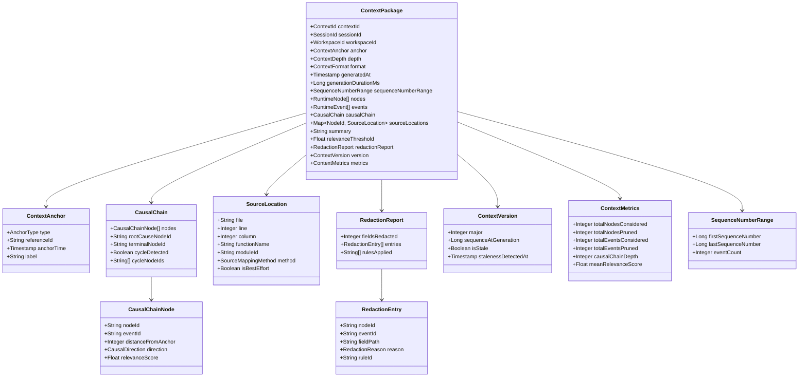
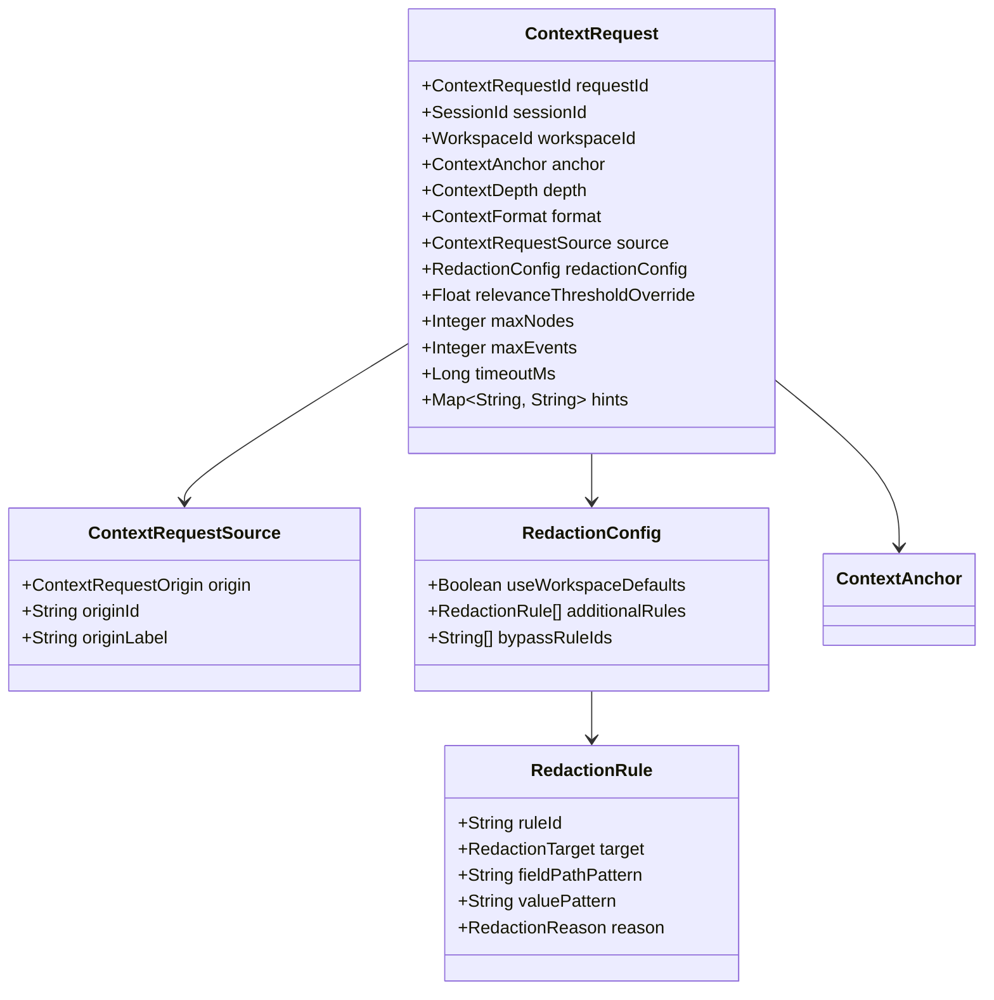
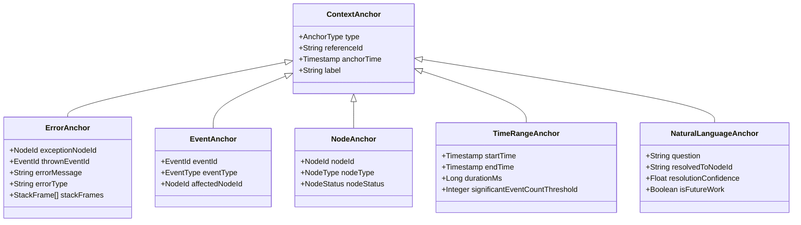
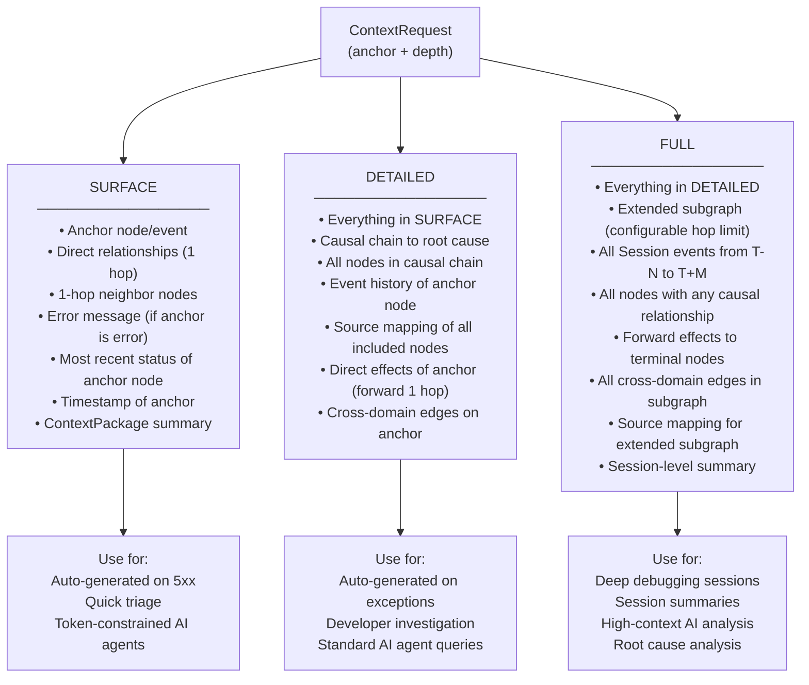
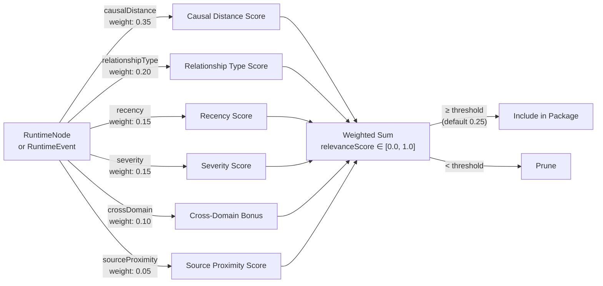
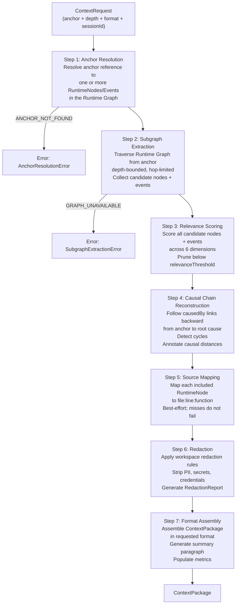
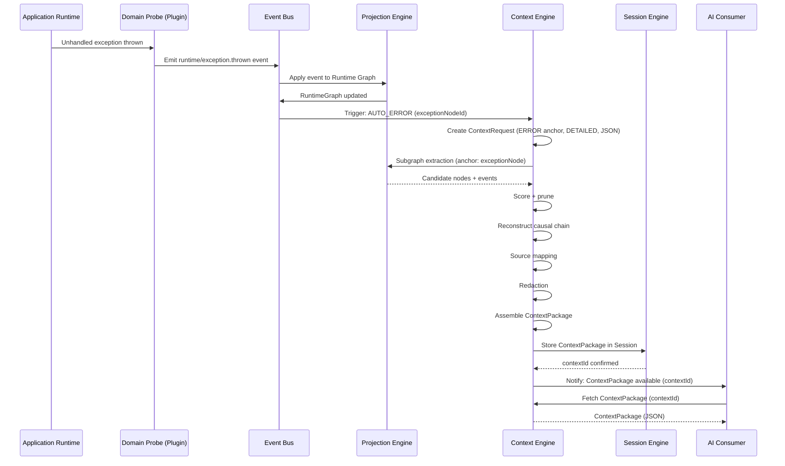

# RFC-0008: Context Engine

| Field      | Value                                                                                                                                          |
|------------|------------------------------------------------------------------------------------------------------------------------------------------------|
| RFC        | 0008                                                                                                                                           |
| Status     | Draft                                                                                                                                          |
| Version    | 0.1                                                                                                                                            |
| Category   | Core Architecture                                                                                                                              |
| Authors    | Founding Team                                                                                                                                  |
| Depends On | RFC-0001 (Glossary), RFC-0003 (ROM), RFC-0004 (REM), RFC-0005 (Runtime Graph), RFC-0006 (Projection Engine), RFC-0007 (Session Model)          |

---

## Abstract

The Context Engine is the subsystem of Observer OS that transforms raw runtime data — the Runtime Graph and Event Log established in RFC-0005 and RFC-0004 — into **Context Packages**: curated, scoped, relevance-ranked packages of runtime intelligence designed for consumption by AI agents and human developers.

Raw runtime data is not understanding. The Runtime Graph for a non-trivial application can contain hundreds of nodes and thousands of edges. The Event Log for a twenty-minute debugging session may contain tens of thousands of events. Neither the Runtime Graph nor the Event Log, presented in full, is consumable by a human developer trying to answer a specific question, or by an AI agent with a finite token budget. Completeness without curation is noise.

The Context Engine solves this problem by answering one question: **given a specific anchor — an error, an event, a node, a time range, or a question — what is the minimum set of structured runtime facts that fully explains it?** The output is a Context Package: a structured, bounded, relevance-ranked, source-mapped, privacy-redacted representation of exactly what an AI Consumer or developer needs to understand that anchor, and nothing more.

The Context Engine does not reason. It does not suggest fixes. It does not interpret runtime data. It curates runtime facts. The distinction is structural and enforced: the Context Engine is an Observer OS internal subsystem that produces Runtime Intelligence; AI reasoning about that intelligence is the responsibility of the AI Consumer. This boundary is the mechanism by which Observer OS remains a factual platform rather than an opinion machine.

This document specifies the complete design of the Context Engine: what a Context Package is and is not, the anatomy of a Context Package including its schema, anchor types, depth levels, and output formats, the seven-step Context generation pipeline, the six types of Context anchors, the relevance scoring model, automatic trigger conditions, caching semantics, multi-context Session behavior, privacy and redaction guarantees, and integration contracts with the Runtime Graph, AI Context API, Runtime Explorer, and Session Engine.

Engineers building the Context Engine must treat this document as the definitive specification. Every schema field, every pipeline step, every scoring weight, and every interface contract defined here is binding for v0.1. Deviations require an RFC amendment.

---

## Motivation

### The Signal-to-Noise Problem

Modern software applications in active development produce enormous volumes of runtime data. A typical React + Node.js application handling a single failed form submission might generate:

- 40–80 DOM events (mouse, keyboard, focus, blur)
- 3–6 network requests and their responses
- 10–20 React component renders and reconciliation cycles
- 1–3 backend route handler invocations
- 2–5 database queries
- 1 unhandled exception with a 30-frame stack trace
- 200–400 individual state mutations
- Hundreds of timing measurements

Presented as a raw stream, this data is overwhelming. The developer investigating "why did the form submission fail?" does not need to see every mouse event, every React reconciliation, or every timing measurement. They need to see: the exception, the request that triggered it, the database query that failed, the route handler that issued that query, and the component that initiated the request. That is five nodes and a causal chain connecting them. Everything else is irrelevant to this specific question.

Today, this relevance filtering happens entirely in the developer's head. They scan logs manually, apply grep filters, open multiple browser tabs, and mentally reconstruct the causal chain. This process is slow, error-prone, and inaccessible to machines. An AI agent given a raw log file cannot reliably identify which of a thousand log lines is relevant to a specific question without significant prompt engineering and hallucination risk.

The Context Engine makes relevance filtering an explicit, first-class operation. It turns the question "what is relevant here?" into an algorithmic function with defined inputs, defined outputs, and measurable quality.

### AI Consumers Require Structured Input

The emergence of large language model-based developer tools has created a new class of consumer for runtime data: the AI Consumer (RFC-0001). AI Consumers have two properties that raw runtime data cannot satisfy:

**Token budgets.** An AI model reasoning over runtime data operates within a finite context window. Feeding 10,000 lines of raw logs into a context window consumes the budget before the model can reason about anything. Relevance-ranked, pruned Context Packages use token budget for the facts that matter, not the facts that happen to be logged.

**Structure requirements.** Unstructured log text forces AI models to perform parsing, entity resolution, and relationship inference as part of their reasoning task. This consumes capacity, introduces error, and produces non-deterministic outputs. A Context Package that explicitly declares "node A caused node B which caused error E, and the source location is UserForm.tsx:47" reduces the AI model's task to pure reasoning over already-structured facts.

The Context Engine is the bridge between Observer's runtime data model and the AI Consumer's structured input requirements. It is the component that makes Observer a platform rather than a log aggregator.

### The Boundary Between Facts and Reasoning

RFC-0000 establishes a foundational principle: **Runtime Intelligence excludes AI reasoning.** Observer's role is to transform runtime data into structured understanding. What an AI does with that understanding is not Observer's concern.

This boundary has practical consequences. If the Context Engine embedded suggestions ("this error was probably caused by a race condition"), it would conflate platform facts with model opinions. Platform facts are reproducible and verifiable — given the same runtime data, the same Context Package is always produced. Model opinions vary by model, by prompt, by temperature, and by time.

The Context Engine enforces this boundary by producing only facts: which nodes are present, what their states are, which events caused which other events, which source file a node maps to, and what the causal chain from root cause to error is. No more. The AI Consumer reasons over these facts and produces opinions. The Context Engine does not.

### Sessions Scope Context

RFC-0001 establishes that "Sessions over Streams" is a core Observer principle. Context is always generated within a bounded Session. This scoping is not incidental — it is structural.

A Session defines the temporal and identity boundaries within which a Context Package is valid. Nodes, events, and causal chains referenced in a Context Package exist within a specific Session. A developer investigating two separate bugs in two separate Sessions receives two distinct, non-overlapping Context Packages, even if they involve the same application code. This prevents cross-session contamination and makes every Context Package independently reproducible.

---

## Goals

1. Define Context as a precise technical concept distinct from logs, traces, the full Runtime Graph, and AI reasoning.
2. Specify the complete Context Package schema, including all required fields, their types, their semantics, and their invariants.
3. Define six types of Context anchors and the resolution algorithm for each.
4. Specify three Context depth levels (SURFACE, DETAILED, FULL) with exact inclusion rules for each.
5. Define three Context output formats (MARKDOWN, JSON, STRUCTURED) and their target consumers.
6. Specify the seven-step Context generation pipeline from ContextRequest to ContextPackage.
7. Define the relevance scoring model: the six scoring dimensions, their weights, and the pruning threshold.
8. Specify causal chain reconstruction: the algorithm, its termination condition, and its behavior under cycles.
9. Define source mapping: how RuntimeNodes are mapped to file, line, and function locations across browser and backend environments.
10. Specify privacy and redaction: the redaction model, configurable rules, the redaction report, and the non-modification guarantee on original events.
11. Define automatic context generation triggers: the four conditions under which the Context Engine generates context without explicit request.
12. Specify Context caching semantics: the cache key, invalidation conditions, and staleness model.
13. Define multi-context Session behavior: how multiple Context Packages are stored, versioned, and browsed within a Session.
14. Specify integration contracts between the Context Engine and the Runtime Graph, Session Engine, AI Context API, and Runtime Explorer.
15. Provide concrete, multi-scenario examples that engineers can use to validate their implementations.

---

## Non-Goals

The Context Engine does not define:

| Excluded Concern                                               | Where It Is Defined                          |
|----------------------------------------------------------------|----------------------------------------------|
| Runtime Node and Event schemas                                 | RFC-0003 (ROM), RFC-0004 (REM)               |
| Runtime Graph traversal algorithms and relationship types      | RFC-0005 (Runtime Graph)                     |
| How the Runtime Graph is built from events                     | RFC-0006 (Projection Engine)                 |
| Session lifecycle, boundaries, and storage                     | RFC-0007 (Session Model)                     |
| The AI Context API — the external interface for AI Consumers   | Future: RFC-0009 (AI Context API)            |
| How AI Consumers reason over Context Packages                  | The AI Consumer's responsibility             |
| The visual rendering of Context Packages in the Runtime Explorer | Future: RFC-0010 (Runtime Explorer)        |
| Plugin SDK and Domain Probe instrumentation                    | Future: RFC-0011 (Plugin SDK)                |
| Natural language anchor resolution ("why did the order fail?") | Marked as Future Work in this RFC            |
| Anomaly detection or automatic error classification            | Future: Intelligence RFC                     |
| Persistent Context storage and indexing at scale               | Future: Storage RFC                          |
| Context sharing across Sessions or Workspaces                  | Future: Collaboration RFC                    |
| AI model selection or prompting strategies                     | The AI Consumer's responsibility             |
| Token budget estimation or cost optimization                   | The AI Consumer's responsibility             |

The Context Engine produces Runtime Intelligence. It does not consume it. Any subsystem that reasons over a Context Package is outside the scope of this RFC.

---

## Design

### What Context Is

A Context Package is a curated, scoped, relevance-ranked package of runtime facts assembled around a specific anchor for a specific question within a specific Session.

Each element of this definition is load-bearing:

**Curated**: not all runtime data is included. The Context Engine selects nodes, events, and relationships that are relevant to the anchor. Irrelevant data is excluded. This is the core value of the Context Engine — relevance filtering is explicit, algorithmic, and reproducible.

**Scoped**: Context is always bounded to a Session. Nodes, events, and causal chains in a Context Package exist within the Session's temporal and identity boundaries. Context does not span Sessions.

**Relevance-ranked**: included nodes and events carry a relevance score. The score reflects causal distance from the anchor, relationship type, recency, severity, cross-domain significance, and source proximity. Low-relevance items are pruned. High-relevance items appear first.

**Runtime facts**: every item in a Context Package is a structured, factual observation. Nothing in a Context Package is inferred, suggested, or probabilistic. The causal chain is derived from explicit `causedBy` links in the Event Log (RFC-0004). Source locations come from stack frames and source maps. Node states come from the Runtime Graph (RFC-0005). The Context Engine does not add interpretive content.

**Anchor**: every Context Package has exactly one anchor — the runtime object or time range the context is about. The anchor defines what is "close" (and therefore relevant) and what is "far" (and therefore excluded or ranked low).

### What Context Is Not

The following are explicitly not Context Packages:

**A log dump**: raw log lines are unstructured text with no identity model, no causal links, and no relevance ranking. Feeding log lines into a Context Package field violates the structured-evidence requirement of RFC-0001.

**The full Runtime Graph**: the Runtime Graph (RFC-0005) is the complete structural representation of the running application for a Session. It is not bounded by an anchor and not relevance-ranked. Providing the full graph as a Context Package would be complete but not consumable. Context is always a subgraph of the Runtime Graph, never the graph itself.

**The full Event Log**: the Event Log (RFC-0004) is the immutable sequence of all runtime changes. It is not bounded by an anchor and contains events at all relevance levels. A Context Package includes a bounded, scored subset of events from the Event Log.

**AI reasoning or suggestions**: content like "this error was probably caused by a missing null check" or "you should add error handling to this route handler" is AI Consumer output. It is not Runtime Intelligence. The Context Engine does not produce it.

**A monitoring dashboard**: dashboards aggregate metrics over time windows and across sessions. Context is specific to a single anchor in a single session.

### The Anchor Principle

Every Context Package is organized around an **anchor** — a specific runtime object or time range that the context is about. The anchor determines:

1. **What is included**: nodes and events within causal and topological distance of the anchor.
2. **What scores higher**: nodes closer to the anchor in the causal graph score higher than distant nodes.
3. **What the causal chain traces**: the causal chain is traced from the anchor backward to the root cause, and forward to downstream effects.
4. **The summary statement**: the one-paragraph summary in the Context Package is written relative to the anchor.

An anchor is not a filter — it is an origin point for a relevance-weighted graph traversal. The Context Engine uses the anchor to ask: "of all the runtime data in this Session, what is most relevant to understanding this specific object?"

### Context and AI Consumers

The Context Engine's primary output consumers are AI Consumers — external systems (AI coding assistants, IDE plugins, CI/CD intelligence systems, chat interfaces) that receive Context Packages and reason over them to produce developer-facing answers, suggestions, and explanations.

The relationship between the Context Engine and AI Consumers is contractual:

- The Context Engine guarantees: structured runtime facts, bounded scope, relevance ranking, source mapping, and privacy redaction.
- The AI Consumer guarantees: reasoning over the Context Package without querying the raw Runtime Graph.
- Neither party crosses into the other's domain.

This separation makes Observer's Runtime Intelligence portable across AI models and AI Consumer implementations. A Context Package produced by the Context Engine is equally valid input to GPT-4, Claude, Gemini, or a fine-tuned model trained on Observer data. The AI Consumer is substitutable; the Context Package format is stable.

---

## Architecture

### Context Package Schema

The ContextPackage is the primary output of the Context Engine. Every field is required unless marked optional.



#### Field Definitions

| Field                 | Type                          | Required | Description                                                                                                          |
|-----------------------|-------------------------------|----------|----------------------------------------------------------------------------------------------------------------------|
| `contextId`           | `ContextId` (UUIDv7)          | Yes      | Globally unique, time-ordered identifier for this Context Package. Monotonic within a Session.                       |
| `sessionId`           | `SessionId`                   | Yes      | The Session within which this context was generated. Context does not span Sessions.                                 |
| `workspaceId`         | `WorkspaceId`                 | Yes      | The Workspace to which the Session belongs. Governs redaction rules.                                                 |
| `anchor`              | `ContextAnchor`               | Yes      | The anchor this context is about. See Anchor Types section.                                                          |
| `depth`               | `ContextDepth` (enum)         | Yes      | `SURFACE`, `DETAILED`, or `FULL`. Determines how much of the subgraph is included.                                   |
| `format`              | `ContextFormat` (enum)        | Yes      | `MARKDOWN`, `JSON`, or `STRUCTURED`. The format in which the package is rendered.                                    |
| `generatedAt`         | `Timestamp`                   | Yes      | Wall-clock time at which the Context Package was assembled. UTC, ISO 8601.                                           |
| `generationDurationMs`| `Long`                        | Yes      | Time in milliseconds taken to generate this package. Used for performance monitoring.                                |
| `sequenceNumberRange` | `SequenceNumberRange`         | Yes      | The range of Event Log sequence numbers whose events are represented in this package.                                |
| `nodes`               | `RuntimeNode[]`               | Yes      | The curated set of RuntimeNodes included in this context, ordered by descending relevance score.                     |
| `events`              | `RuntimeEvent[]`              | Yes      | The curated set of RuntimeEvents included in this context, ordered by ascending `occurredAt`.                        |
| `causalChain`         | `CausalChain`                 | Yes      | The ordered causal path from root cause to anchor (and anchor to terminal effects for FULL depth).                   |
| `sourceLocations`     | `Map<NodeId, SourceLocation>` | Yes      | Map from node IDs to source code locations. Nodes without source locations are omitted from this map.               |
| `summary`             | `String`                      | Yes      | One-paragraph plain-text description of what happened, relative to the anchor. Written by the Context Engine.        |
| `relevanceThreshold`  | `Float`                       | Yes      | The minimum relevance score used to include nodes/events. Nodes below this threshold were pruned.                    |
| `redactionReport`     | `RedactionReport`             | Yes      | What was redacted and why. Empty if no redaction occurred. Never null.                                               |
| `version`             | `ContextVersion`              | Yes      | Version metadata: sequence number at generation, staleness flag.                                                     |
| `metrics`             | `ContextMetrics`              | Yes      | Generation metrics: nodes considered, pruned, causal chain depth, mean relevance score.                              |

### Context Request Schema

The ContextRequest is the input to the Context Engine. Every context generation begins with a ContextRequest.



#### ContextRequestOrigin values

| Value         | Description                                                                       |
|---------------|-----------------------------------------------------------------------------------|
| `AUTO_ERROR`  | Triggered automatically by an unhandled exception                                 |
| `AUTO_FAILURE`| Triggered automatically by a request failure (5xx)                                |
| `AUTO_SESSION_CLOSE` | Triggered automatically when a Session is closed                           |
| `DEVELOPER`   | Requested manually by a developer via the Runtime Explorer                        |
| `AI_CONSUMER` | Requested programmatically by an AI Consumer via the AI Context API               |

### Anchor Types

An anchor is the runtime object or time range that a Context Package is built around. The anchor is the origin point of the relevance-weighted graph traversal and the subject of the causal chain reconstruction.



#### Anchor Type: ERROR

An error anchor designates an exception or failed RuntimeNode as the subject of the Context Package. The Context Package represents everything that caused the error and everything it affected.

- **Primary node**: the `RuntimeNode` of type `Exception` or `FailedRequest` that is the error itself.
- **Causal chain direction**: backward (from error to root cause) and forward (from error to downstream effects).
- **Automatic inclusion**: the error message, error type, and stack frames are always included regardless of relevance score.
- **Resolution algorithm**: the engine resolves the anchor by locating the most recent `RuntimeEvent` with `severity: ERROR` or `severity: FATAL` whose `affectedNodeId` matches the provided `exceptionNodeId`. If multiple events match, the most recent is selected.

#### Anchor Type: EVENT

An event anchor designates a specific RuntimeEvent as the subject of the Context Package.

- **Primary node**: the RuntimeNode that the event affected (`affectedNodeId`).
- **Causal chain direction**: backward (what caused this event) and forward (what this event caused).
- **Resolution algorithm**: direct lookup by `EventId`. The event must exist within the current Session's event log.
- **Error on not found**: if the event does not exist in the Session, the request fails with `ANCHOR_NOT_FOUND`.

#### Anchor Type: NODE

A node anchor designates a specific RuntimeNode as the subject of the Context Package. The context represents the node's full state, its relationship neighborhood, and its event history.

- **Primary node**: the designated RuntimeNode.
- **Causal chain direction**: both backward and forward.
- **Included by default**: all events in the Session whose `affectedNodeId` matches the anchor node, regardless of relevance score.
- **Resolution algorithm**: direct lookup by `NodeId` in the Runtime Graph for the current Session.

#### Anchor Type: TIME_RANGE

A time range anchor designates a bounded time window as the subject of the Context Package. The context represents all significant events and nodes active during that window.

- **Primary nodes**: all RuntimeNodes whose `activeInterval` overlaps with the time range.
- **Event selection**: all RuntimeEvents with `occurredAt` within the time range.
- **Significance filtering**: nodes and events are still relevance-scored. Low-relevance items are pruned even if they fall within the time window.
- **Resolution algorithm**: query the Runtime Graph's temporal index for all nodes and events overlapping `[startTime, endTime]`.
- **Special behavior**: there is no single "primary node" for a time range anchor. The causal chain is replaced by a timeline of significant events ordered by `occurredAt`.

#### Anchor Type: NATURAL_LANGUAGE (Future Work)

A natural language anchor designates a developer question ("why did the order fail?") as the anchor. The Context Engine resolves the question to the most relevant runtime node or event and generates context anchored on that resolved object.

**This anchor type is marked as Future Work.** The Context Engine in v0.1 rejects `NATURAL_LANGUAGE` anchor requests with `ANCHOR_TYPE_NOT_SUPPORTED`. The resolution algorithm — which maps a natural language question to a specific node or event — requires integration with an external language model and will be specified in a future RFC.

The `NaturalLanguageAnchor` schema field `isFutureWork` must always be `true` in v0.1.

---

## Context Depth Levels

The depth level of a Context Package controls how much of the Runtime Graph's subgraph is included around the anchor. Higher depth levels produce larger packages with more context, at the cost of generation time and token budget.



### SURFACE Depth

The minimum viable context. Suitable for triage and quick AI agent summaries.

Included:
- The anchor node in its current state (all fields)
- All direct relationships of the anchor node (1-hop edges from the Runtime Graph)
- All 1-hop neighbor nodes (their current state, not their full event history)
- The anchor event, if the anchor type is EVENT
- The error message, error type, and top 5 stack frames if the anchor is an ERROR anchor
- The anchor node's most recent status transition event
- The generated summary paragraph

Excluded:
- Causal chain reconstruction
- Multi-hop neighbors
- Source mapping
- Event history beyond the most recent status transition
- Extended subgraph

**Estimated Context Package size**: 1–5 KB (JSON format). Suitable for models with tight token budgets.

### DETAILED Depth

The standard depth level. Generated automatically on unhandled exceptions. Suitable for most developer and AI agent use cases.

Included:
- Everything in SURFACE
- Full causal chain from anchor back to root cause (following `causedBy` links in RFC-0004)
- All RuntimeNodes in the causal chain, with their full current state
- All RuntimeEvents in the causal chain, ordered by `occurredAt`
- The anchor node's complete event history within the Session (all events where `affectedNodeId` = anchor node)
- Source mapping for all nodes in the causal chain and the anchor's 1-hop neighborhood
- Direct forward effects of the anchor: nodes and events that were caused by the anchor event
- All cross-domain edges connected to nodes in the causal chain

Excluded:
- Extended subgraph beyond the causal chain and 1-hop effects
- Session events outside the causal window
- Nodes not in the causal chain or 1-hop neighborhood

**Estimated Context Package size**: 5–30 KB (JSON format). Standard AI agent context window usage.

### FULL Depth

The maximum depth level. Generated on-demand by developers and AI agents for deep investigation. Suitable for session summaries and root cause analysis.

Included:
- Everything in DETAILED
- Extended subgraph: all nodes within a configurable hop limit (default: 3 hops from anchor) in the Runtime Graph
- All Session events from `anchor.occurredAt - N seconds` to `anchor.occurredAt + M seconds` (default: N=30, M=30; configurable per ContextRequest)
- All nodes active during the time window, scored and ranked
- Full forward causal chain from anchor to terminal effects
- All cross-domain edges in the extended subgraph
- Source mapping for the entire extended subgraph
- Session-level summary: total event count, active domains, time elapsed, node type distribution

Excluded:
- Events outside the time window (even if causally related)
- Nodes with relevance score below `relevanceThreshold` even within the hop limit

**Estimated Context Package size**: 30–200 KB (JSON format). Use with AI agents that have large context windows. Not recommended for latency-sensitive paths.

---

## Relevance Scoring

The relevance scoring model assigns a numeric score in `[0.0, 1.0]` to each RuntimeNode and RuntimeEvent considered for inclusion in a Context Package. Nodes and events below the `relevanceThreshold` (default: `0.25`) are pruned. Nodes above the threshold are included, ordered by descending score.

The model combines six scoring dimensions via weighted sum. All weights are configurable per Workspace; the defaults below are the v0.1 baseline.



### Dimension 1: Causal Distance (weight: 0.35)

The most heavily weighted dimension. Nodes closer in the causal graph to the anchor score higher.

| Causal Distance | Score |
|-----------------|-------|
| 0 (anchor itself) | 1.00 |
| 1 hop           | 0.85  |
| 2 hops          | 0.65  |
| 3 hops          | 0.45  |
| 4 hops          | 0.28  |
| 5+ hops         | 0.10  |

Causal distance is measured as the shortest path in the directed causal subgraph, following `causedBy` links from RFC-0004 and `TRIGGERED`, `CALLED`, `FAILED` relationship types from RFC-0005.

### Dimension 2: Relationship Type Weight (weight: 0.20)

Not all relationships are equally explanatory. Relationships that indicate causation, failure, or invocation carry more explanatory value than observational or dependency relationships.

| Relationship Type  | Score | Rationale                                                     |
|--------------------|-------|---------------------------------------------------------------|
| `TRIGGERED`        | 1.00  | Direct causation — A triggered B                              |
| `FAILED`           | 1.00  | Direct failure relationship — A caused B to fail              |
| `CALLED`           | 0.90  | Invocation — A called B (function, API, query)                |
| `PRODUCED`         | 0.80  | A produced B (request produced response)                      |
| `CONSUMED`         | 0.75  | A consumed B (component consumed store state)                 |
| `CAUSED_BY`        | 0.70  | Explicit causal link from RFC-0004 `causedBy` field           |
| `RENDERED`         | 0.60  | A rendered B (React tree parent-child)                        |
| `CORRELATED_WITH`  | 0.50  | Temporal correlation without confirmed causation              |
| `EXPLAINS`         | 0.40  | AI-derived explanatory link (RFC-0005)                        |
| `DEPENDS_ON`       | 0.30  | Structural dependency (A depends on B at design time)         |
| `OBSERVES`         | 0.20  | Passive observation — A observes B                            |
| `USES`             | 0.20  | Resource usage (A uses connection pool B)                     |

### Dimension 3: Recency (weight: 0.15)

More recent events are more likely to be causally related to a current error. Older events score lower.

The recency score is computed as an exponential decay relative to the anchor's timestamp:

```
recencyScore = exp(-λ × ΔtSeconds)
λ = 0.05  (half-life ≈ 14 seconds)
```

| Time before anchor | Recency score |
|--------------------|---------------|
| 0 seconds          | 1.00          |
| 5 seconds          | 0.78          |
| 14 seconds         | 0.50          |
| 30 seconds         | 0.22          |
| 60 seconds         | 0.05          |
| 120+ seconds       | < 0.01        |

Events more than 120 seconds before the anchor receive an effective recency score of 0.01, ensuring very old events are only included if they score highly on other dimensions.

### Dimension 4: Severity (weight: 0.15)

Runtime Nodes and Events with higher severity are more likely to be relevant to an error investigation.

| Severity Level | Score | RFC-0004 severity value |
|----------------|-------|-------------------------|
| `FATAL`        | 1.00  | `FATAL`                 |
| `ERROR`        | 0.90  | `ERROR`                 |
| `WARN`         | 0.60  | `WARN`                  |
| `INFO`         | 0.30  | `INFO`                  |
| `DEBUG`        | 0.10  | `DEBUG`                 |
| `TRACE`        | 0.05  | `TRACE`                 |

For RuntimeNodes that are not events, the severity is derived from the node's `status` field: `FAILED` → `ERROR`, `PENDING` → `INFO`, `ACTIVE` → `INFO`, `COMPLETED` → `INFO`.

### Dimension 5: Cross-Domain Bonus (weight: 0.10)

Cross-domain edges — relationships between RuntimeNodes belonging to different Domains (e.g., a browser request node linked to a backend route handler node) — carry higher explanatory value than same-domain edges. They represent the causal connections that cross system boundaries, which are exactly the relationships that are hardest for developers to reconstruct manually.

| Edge type               | Score |
|-------------------------|-------|
| Cross-domain edge       | 1.00  |
| Same-domain edge        | 0.40  |
| No domain edge present  | 0.00  |

A node that is the target of a cross-domain edge receives the full bonus. A node that is only connected within its domain receives the lower score.

### Dimension 6: Source Proximity (weight: 0.05)

Nodes whose source code location is in the same file or module as the anchor node are more likely to be directly related. This dimension scores proximity in source space, not runtime space.

| Source proximity          | Score |
|---------------------------|-------|
| Same function             | 1.00  |
| Same file                 | 0.80  |
| Same module or directory  | 0.60  |
| Same package              | 0.40  |
| Different package         | 0.10  |
| No source location known  | 0.00  |

This dimension has the lowest weight because source proximity is not a reliable indicator of causal relationship (a bug in `utils.ts` can be caused by a call in `UserForm.tsx`), but it provides a useful tiebreaker when other scores are equal.

### Final Score Computation

```
relevanceScore =
    (0.35 × causalDistanceScore) +
    (0.20 × relationshipTypeScore) +
    (0.15 × recencyScore) +
    (0.15 × severityScore) +
    (0.10 × crossDomainScore) +
    (0.05 × sourceProximityScore)
```

The anchor node itself always receives `relevanceScore = 1.0` regardless of the scoring formula. The anchor is always included.

### Pruning

After scoring, all nodes and events with `relevanceScore < relevanceThreshold` are excluded from the Context Package. The default `relevanceThreshold` is `0.25`. The threshold is configurable per ContextRequest via `relevanceThresholdOverride`.

The `metrics.totalNodesPruned` and `metrics.totalEventsPruned` fields in the ContextPackage record how many items were considered but excluded.

**Causal chain exception**: nodes in the direct causal chain (those reachable via `causedBy` links from the anchor to the root cause) are never pruned, regardless of their relevance score. The causal chain is always complete.

---

## Context Generation Pipeline

The Context Engine processes every ContextRequest through a seven-step pipeline. Each step has defined inputs, outputs, and failure modes. Steps 3 through 7 are parallelizable where noted.



### Step 1: Anchor Resolution

**Input**: `ContextRequest.anchor`
**Output**: one or more `(NodeId, EventId)` pairs that are the primary subjects of the context

**Algorithm by anchor type**:

- **ERROR**: Query the Runtime Graph for nodes of type `Exception` or relationship type `FAILED` matching `anchor.referenceId`. If `anchor.exceptionNodeId` is provided, use it directly. If only `anchor.thrownEventId` is provided, look up the event and resolve its `affectedNodeId`. Fail with `ANCHOR_NOT_FOUND` if neither resolves.
- **EVENT**: Look up `anchor.eventId` in the Session's event log directly. Return `(event.affectedNodeId, event.eventId)`. Fail with `ANCHOR_NOT_FOUND` if the event is not in this Session.
- **NODE**: Look up `anchor.nodeId` in the Runtime Graph for this Session. Return `(nodeId, null)`. Fail with `ANCHOR_NOT_FOUND` if the node does not exist in this Session.
- **TIME_RANGE**: Query the Runtime Graph's temporal index for all nodes active during `[anchor.startTime, anchor.endTime]`. Return the full set. Fail with `EMPTY_TIME_RANGE` if no nodes were active during the window.
- **NATURAL_LANGUAGE**: Reject with `ANCHOR_TYPE_NOT_SUPPORTED` in v0.1.

**Failure handling**: Anchor resolution failure is a hard error. The pipeline does not continue. The ContextRequest is returned to the caller with an error descriptor.

### Step 2: Subgraph Extraction

**Input**: resolved anchor node(s)/event(s), `ContextRequest.depth`, Runtime Graph for the Session
**Output**: a set of candidate `RuntimeNode[]` and `RuntimeEvent[]` for scoring

The subgraph extraction performs a bounded depth-first traversal of the Runtime Graph starting from the anchor node(s). The traversal follows all relationship types in both directions (inbound and outbound edges), subject to depth-level hop limits:

| Depth Level | Maximum Hops | Direction        |
|-------------|--------------|------------------|
| SURFACE     | 1            | Both             |
| DETAILED    | Unlimited    | Backward (causal); 1 hop forward |
| FULL        | Configurable (default: 3) | Both |

For DETAILED depth, "unlimited" means the traversal follows `causedBy` chains all the way to the root cause without a hop limit, but lateral (non-causal) traversal is still bounded to 1 hop from each causal chain node.

The extracted candidate set is the union of:
- All nodes within the hop limit
- All events whose `affectedNodeId` is within the candidate node set
- All events within the `sequenceNumberRange` for FULL depth

**Memory guard**: if the candidate set exceeds `ContextRequest.maxNodes` or `ContextRequest.maxEvents`, extraction stops and logs a `SUBGRAPH_TRUNCATED` warning in `ContextMetrics`. Default limits: `maxNodes = 500`, `maxEvents = 2000`.

### Step 3: Relevance Scoring

**Input**: candidate `RuntimeNode[]` and `RuntimeEvent[]` from Step 2
**Output**: the same sets, each item annotated with a `relevanceScore`, with items below `relevanceThreshold` removed

Each candidate node and event is scored independently using the six-dimension formula defined in the Relevance Scoring section. Scores are computed in parallel for performance.

After scoring, items below `relevanceThreshold` are pruned. `metrics.totalNodesPruned` and `metrics.totalEventsPruned` are set. Causal chain nodes are exempted from pruning (see Pruning section).

**Output ordering**:
- `nodes[]` is ordered by descending `relevanceScore`
- `events[]` is ordered by ascending `occurredAt`

### Step 4: Causal Chain Reconstruction

**Input**: scored, pruned `RuntimeNode[]` and `RuntimeEvent[]`; anchor node(s)
**Output**: `CausalChain` object with ordered nodes from root cause to anchor

The causal chain is reconstructed by following `causedBy` links in the Event Log (RFC-0004, `RuntimeEvent.causedBy` field) backward from the anchor's most recent event, until either:

1. A node with no `causedBy` link is reached (this is the root cause), or
2. A cycle is detected (a `nodeId` already seen in the current traversal path is encountered again)

**Cycle detection**: the algorithm maintains a visited set. If a `causedBy` reference points to an already-visited node, the traversal stops and sets `causalChain.cycleDetected = true` and `causalChain.cycleNodeIds` to the IDs of the cycle participants. This prevents infinite traversal and surfaces the cycle explicitly in the ContextPackage for developer investigation.

**CausalChainNode construction**: for each node in the causal path, a `CausalChainNode` is created with:
- `nodeId`: the node's identifier
- `eventId`: the event in the causal chain that this node corresponds to
- `distanceFromAnchor`: the hop count from the anchor (0 = anchor, 1 = direct cause, 2 = cause's cause, etc.)
- `direction`: `PREDECESSOR` for nodes before the anchor in the causal chain, `SUCCESSOR` for forward effects
- `relevanceScore`: the score from Step 3

**Forward effects** (DETAILED and FULL only): the algorithm also follows `causedBy` links forward — finding events that have `causedBy` pointing to the anchor's event — to build the list of nodes downstream of the anchor. Forward traversal is bounded to 1 hop for DETAILED depth and configurable for FULL depth.

### Step 5: Source Mapping

**Input**: scored, pruned `RuntimeNode[]`
**Output**: `Map<NodeId, SourceLocation>` mapping node IDs to source code locations

Source mapping translates runtime identities to source code locations. The mechanism depends on the Domain that owns the RuntimeNode:

**Browser Domain (React, DOM, network)**:
- Component nodes: source location is resolved via the React DevTools fiber tree, which carries `_debugSource` metadata (file, line, column). If `_debugSource` is unavailable, the component name is used to look up the source location in the uploaded source map.
- Stack frames: JavaScript error objects carry stack traces. The Context Engine applies the workspace's uploaded source map to resolve minified/transpiled locations to original TypeScript/JavaScript source.
- Network request nodes: source location is the call site — the line of code that invoked `fetch()` or `axios()`. Resolved from the error stack or source map.

**Backend Domain (Node.js, Python, Java, Go)**:
- Stack frames in error events map directly to source file paths and line numbers in server-side runtimes.
- Module paths are normalized to workspace-relative paths.
- For compiled languages, debug symbols or source maps are used.

**Database Domain (queries)**:
- Query nodes map to the ORM or query builder call site in application code.
- If ORM-annotated query metadata is unavailable, the source location is marked `isBestEffort = true`.

**SourceMappingMethod values**:

| Method           | Description                                                    |
|------------------|----------------------------------------------------------------|
| `SOURCE_MAP`     | Resolved via uploaded JavaScript source map                    |
| `STACK_FRAME`    | Resolved from a stack trace in the associated event            |
| `DEBUG_METADATA` | Resolved from framework-provided debug metadata (React, etc.)  |
| `MODULE_PATH`    | Resolved from module path without line precision               |
| `INFERRED`       | Inferred from naming conventions; low confidence               |
| `UNAVAILABLE`    | No source location could be determined                         |

**Best-effort guarantee**: source mapping failure for a specific node does not fail the pipeline. Nodes without source locations are included in the Context Package without a `sourceLocations` entry. The `isBestEffort` flag on `SourceLocation` indicates when the location was inferred rather than definitively resolved.

### Step 6: Redaction

**Input**: scored nodes and events, source locations, `RedactionConfig`, Workspace redaction rules
**Output**: the same nodes and events with sensitive fields replaced, and a `RedactionReport`

Redaction is applied to the output of the Context Engine before the ContextPackage is returned to any caller. Original events in the Event Log are **never modified** — redaction is applied exclusively to the Context Package output. This is a strict invariant.

**Redaction rules** are evaluated in order. Each rule specifies:
- A `target`: `NODE`, `EVENT`, or `BOTH`
- A `fieldPathPattern`: a JSON Path expression identifying which fields to evaluate (e.g., `$.payload.headers.Authorization`)
- A `valuePattern` (optional): a regex pattern; if provided, only values matching the pattern are redacted
- A `reason`: one of `PII`, `SECRET`, `CREDENTIAL`, `INTERNAL_IP`, `CUSTOM`

When a rule matches a field:
- The field value is replaced with `[REDACTED: <reason>]`
- A `RedactionEntry` is added to the `RedactionReport`

**Default workspace redaction rules** (applied unless `useWorkspaceDefaults = false`):

| Rule ID          | Pattern                           | Reason       |
|------------------|-----------------------------------|--------------|
| `default:auth`   | `**.Authorization`                | `CREDENTIAL` |
| `default:cookie` | `**.Cookie`, `**.Set-Cookie`      | `CREDENTIAL` |
| `default:token`  | `**.*token*`, `**.*Token*`        | `SECRET`     |
| `default:secret` | `**.*secret*`, `**.*Secret*`      | `SECRET`     |
| `default:password`| `**.*password*`, `**.*Password*` | `SECRET`     |
| `default:key`    | `**.*apiKey*`, `**.*api_key*`     | `SECRET`     |
| `default:email`  | `**.*email*`                      | `PII`        |
| `default:ssn`    | Value matches `\d{3}-\d{2}-\d{4}` | `PII`       |
| `default:cc`     | Value matches `\d{4}[\s-]\d{4}[\s-]\d{4}[\s-]\d{4}` | `PII` |

**Redaction is irreversible** within a generated ContextPackage. A caller that requires the unredacted original data must access the Event Log directly via a privileged interface (defined in the Session Engine, RFC-0007) with appropriate access controls. The Context Engine does not provide an "unredact" operation.

### Step 7: Format Assembly

**Input**: redacted nodes, events, causal chain, source locations, `RedactionReport`, `ContextRequest.format`
**Output**: the complete `ContextPackage` in the requested format

**Summary generation**: the Context Engine generates a one-paragraph plain-text summary of the Context Package. The summary is produced algorithmically — not by an AI model — by applying a template to the structured data:

```
Template (ERROR anchor):
"{anchorNode.errorType} in {anchorNode.sourceFile}:{anchorNode.sourceLine}
 caused by {rootCauseNode.type} ({rootCauseNode.name})
 via causal chain: {causalChainNodeNames joined by " → "}
 at {anchor.occurredAt}.
 {affectedNodeCount} nodes affected across {domainCount} domains."
```

For non-ERROR anchors, equivalent templates exist parameterized by anchor type. The summary is factual. It does not suggest causes or fixes.

**Format rendering**:

- **MARKDOWN**: the ContextPackage is rendered as a structured Markdown document. See the Format section and Examples.
- **JSON**: the ContextPackage is serialized as a JSON object following the schema defined above.
- **STRUCTURED**: the ContextPackage is returned as a typed in-memory object (language-specific; the Observer SDK provides typed bindings).

**Metrics finalization**: `generationDurationMs`, `metrics.totalNodesConsidered`, `metrics.totalNodesPruned`, `metrics.totalEventsConsidered`, `metrics.totalEventsPruned`, `metrics.causalChainDepth`, and `metrics.meanRelevanceScore` are computed and set.

**ContextId assignment**: a new UUIDv7 is assigned as the `contextId`. The UUIDv7 timestamp component encodes `generatedAt` for time-ordering of multiple packages within a Session.

---

## Context Output Formats

### MARKDOWN Format

The MARKDOWN format produces a human-readable Markdown document suitable for:
- Pasting directly into an AI chat interface (ChatGPT, Claude, Cursor, etc.)
- Displaying in the Runtime Explorer's context panel
- Including in bug reports or incident postmortems

**Structure**:

```markdown
# Context: [Anchor type] — [anchor label]
**Session**: [sessionId] | **Generated**: [generatedAt] | **Depth**: [depth]

## Summary
[summary paragraph]

## Anchor
- **Type**: [anchor.type]
- **Node**: [anchor.referenceId] ([nodeType])
- **Error**: [errorMessage] (if ERROR anchor)
- **At**: [anchor.anchorTime]

## Causal Chain
[root cause] → [intermediate node] → ... → [anchor]

| Step | Node | Type | Event | Time |
|------|------|------|-------|------|
| 1 (root) | [node name] | [type] | [event type] | [time] |
| 2 | [node name] | [type] | [event type] | [time] |
| N (anchor) | [anchor name] | [type] | [event type] | [time] |

## Nodes

### [node name] (relevance: [score])
- **Type**: [nodeType]
- **Status**: [status]
- **Domain**: [domain]
- **Source**: [file:line:function]
- **State**: [key state fields]

[... one section per included node, ordered by descending relevance ...]

## Events

| # | Type | Node | Time | Severity |
|---|------|------|------|----------|
| [seq] | [eventType] | [nodeName] | [occurredAt] | [severity] |
[... one row per included event, ordered by occurredAt ...]

## Source Locations

| Node | File | Line | Function | Method |
|------|------|------|----------|--------|
[... one row per node with source location ...]

## Redaction Report
[N fields redacted] | Rules applied: [ruleIds]
```

### JSON Format

The JSON format produces a machine-readable JSON object following the ContextPackage schema exactly. All fields are present. Arrays maintain the ordering specified (nodes by descending relevance, events by ascending `occurredAt`).

The JSON format is the primary format for AI Consumer API consumption. See RFC-0009 (AI Context API, forthcoming) for the API contract that wraps this format.

**Character encoding**: UTF-8. **Number precision**: relevance scores are serialized to 4 decimal places. **Timestamps**: ISO 8601, UTC, millisecond precision.

### STRUCTURED Format

The STRUCTURED format returns the ContextPackage as a typed in-memory object via the Observer SDK. It is identical to JSON in content but eliminates the serialization/deserialization round-trip for SDK consumers.

Available in: TypeScript/JavaScript SDK, Python SDK, Java SDK, Go SDK. Language-specific type bindings are defined in the Plugin SDK RFC (forthcoming).

### INLINE Format (Future Work)

A future format that embeds Context Package information as hover annotations in source code, displayed inline in the IDE. The INLINE format requires IDE plugin integration and is not specified in v0.1. Requests for `format: INLINE` are rejected with `FORMAT_NOT_SUPPORTED` in v0.1.

---

## Automatic Context Generation

The Context Engine generates Context Packages automatically under four trigger conditions, without requiring an explicit ContextRequest from a developer or AI Consumer. Automatic triggers produce ContextRequests internally and process them through the standard pipeline.



### Trigger 1: Unhandled Exception

**Condition**: the Event Bus receives a `runtime/exception.thrown` event (or domain-equivalent) with `severity: ERROR` or `severity: FATAL` and `handled: false`.

**Generated context**: `depth: DETAILED`, `format: JSON`, `anchor: ERROR`, `source: AUTO_ERROR`.

**Timing**: context generation begins within 50ms of the triggering event being applied to the Runtime Graph. The developer-visible latency target is that the Context Package is available within 500ms of the exception occurring.

**Rationale**: an unhandled exception is the most common entry point for error investigation. Generating DETAILED context automatically means the AI Consumer has a complete context package before the developer has even opened the debugging interface.

### Trigger 2: Request Failure (5xx)

**Condition**: the Event Bus receives a `network/request.completed` event with `statusCode >= 500`, or a `backend/request.completed` event with `failed: true`.

**Generated context**: `depth: SURFACE`, `format: JSON`, `anchor: EVENT`, `source: AUTO_FAILURE`.

**Rationale**: SURFACE depth is used for request failures (rather than DETAILED) because 5xx failures are common and many are transient. Generating full DETAILED context for every 5xx in a Session would produce high volumes of large packages. Developers can escalate to DETAILED depth on demand.

### Trigger 3: Session Close

**Condition**: the Session Engine closes a Session (normal close or timeout).

**Generated context**: `depth: FULL`, `format: MARKDOWN`, `anchor: TIME_RANGE` (the Session's full time range), `source: AUTO_SESSION_CLOSE`.

**Rationale**: a session summary is useful for developers reviewing what they did in a debug session, and for AI Consumers analyzing patterns across multiple errors in a session. FULL depth with MARKDOWN format makes the summary human-readable and suitable for AI chat.

**Timing**: generated synchronously as part of Session close. The Session is not finalized until the session summary context is stored.

### Trigger 4: On-Demand Developer Request

**Condition**: a developer uses the Runtime Explorer to request a Context Package at any anchor.

**Generated context**: `depth` and `format` are chosen by the developer. `source: DEVELOPER`.

**Timing**: on-demand. The developer initiates the request explicitly.

### Trigger 5: On-Demand AI Consumer Request

**Condition**: an AI Consumer calls the AI Context API to request a Context Package.

**Generated context**: `depth` and `format` are specified by the AI Consumer. `source: AI_CONSUMER`.

**Timing**: on-demand. Latency target: < 200ms for SURFACE, < 500ms for DETAILED, < 2000ms for FULL.

---

## Context Caching

Context Packages are cacheable within a Session. Caching avoids redundant pipeline execution when the same anchor + depth + format combination is requested multiple times and the underlying data has not changed.

### Cache Key

```
cacheKey = sessionId
          + ":" + anchorType
          + ":" + anchorReferenceId
          + ":" + depth
          + ":" + format
          + ":" + lastSequenceNumber
```

The `lastSequenceNumber` component ensures that cache entries are invalidated automatically when new events arrive that affect the anchored subgraph. Specifically: if any new event's `affectedNodeId` is a member of the cached ContextPackage's `nodes[]`, the `lastSequenceNumber` changes and the cache key is invalid.

### Cache Validity

A cached ContextPackage is valid if and only if:

1. No new RuntimeEvents have been appended to the Session's Event Log since `ContextVersion.sequenceAtGeneration` that affect any node in the package's `nodes[]` set.
2. The Session is still open (session close invalidates all caches for that session).
3. Workspace redaction rules have not changed since `generatedAt`.

If any of these conditions is false, the cache entry is stale. `ContextVersion.isStale` is set to `true` and `ContextVersion.stalenessDetectedAt` records when staleness was detected.

### Cache Behavior

- **Cache hit**: return the cached ContextPackage immediately. Set `ContextVersion.isStale = false`.
- **Cache miss**: execute the full generation pipeline. Store the result.
- **Stale cache**: return the stale package immediately with `ContextVersion.isStale = true`, and begin background regeneration. The caller receives fresh data on the next request.
- **Cache invalidation on new events**: the cache is invalidated lazily — when the next request arrives, the `lastSequenceNumber` comparison detects the staleness. There is no eager cache invalidation.

### Cache Scope

The cache is per-Session. There is no cross-session cache. There is no cross-workspace cache. Caches are held in memory by the Context Engine process and are not persisted across Observer restarts. Upon restart, caches are rebuilt on first request.

---

## Multi-Context Sessions

A developer debugging a complex issue may generate many Context Packages within a single Session — one per error, one per AI agent query, plus an automatic session summary. The Context Engine and Session Engine jointly manage this collection.

### Context Package Storage

Each ContextPackage generated within a Session is stored within the Session's context store, keyed by `contextId`. The Session Engine (RFC-0007) defines the storage model. From the Context Engine's perspective, all generated packages are passed to the Session Engine's `storeContextPackage(sessionId, package)` interface.

### Context History

The Session Engine maintains an ordered list of all ContextPackages generated within a Session, ordered by `generatedAt`. This list is accessible to developers via the Runtime Explorer's "Context History" panel and to AI Consumers via the AI Context API.

The context history enables:
- **Investigation timeline**: developers can see all contexts generated during a session in order, tracing their investigation path.
- **Re-examination**: developers can revisit any previously generated context.
- **AI agent context chain**: an AI Consumer can request the full context history for a session, enabling multi-turn reasoning across multiple errors.

### Context Versioning

If new events arrive after a Context Package was generated for a specific anchor + depth + format combination, a new version may be requested. Version increments do not modify the original package — a new ContextPackage is generated and stored alongside the original, with the same `anchor` fields but a new `contextId` and `ContextVersion.major` incremented by 1.

The original package is preserved. The Session Engine tracks the latest version for each (anchor, depth, format) triple, but all historical versions remain accessible by their `contextId`.

---

## Privacy and Redaction

### Redaction Guarantees

The Context Engine makes the following guarantees about privacy and redaction:

1. **Original events are never modified.** Redaction is applied only to the Context Package output. The Event Log (RFC-0004) is immutable. The Runtime Graph (RFC-0005) is not modified by redaction. Only the serialized ContextPackage fields are affected.

2. **Redaction is applied before the package is returned to any caller.** No caller — developer, AI Consumer, or Session Engine — ever receives a non-redacted ContextPackage through a standard interface.

3. **Redaction is irreversible within a package.** Once a field is replaced with `[REDACTED: <reason>]`, the original value cannot be recovered from the package. A privileged interface (defined in RFC-0007, Session Engine) permits access to the unredacted Event Log for authorized users.

4. **The RedactionReport is always present.** Even when no redaction occurred, `redactionReport` is included in the ContextPackage with `fieldsRedacted: 0` and empty `entries[]`. Consumers should not interpret the absence of a RedactionReport as confirmation that no sensitive data was present — only that no configured rules matched.

5. **Redaction rules are versioned.** The `redactionReport.rulesApplied[]` field records the exact set of rule IDs that were evaluated during generation. If rules change after a package was generated, a newly generated package for the same anchor may produce different redaction results.

### Configurable Redaction Rules

Workspace administrators configure redaction rules via the Observer management interface. Rules are stored per Workspace and applied to all ContextPackages generated within that Workspace. The default rules (defined in Step 6 above) are applied unless `useWorkspaceDefaults = false` is set in the ContextRequest's `RedactionConfig`.

Rule evaluation order:
1. Default workspace rules (if `useWorkspaceDefaults = true`)
2. Custom workspace rules (ordered by rule priority)
3. Per-request additional rules (from `RedactionConfig.additionalRules`)

Rules are evaluated in order. Once a field is redacted by one rule, subsequent rules skip that field. A field cannot be "more redacted" by a later rule.

### Bypass Rules

The `RedactionConfig.bypassRuleIds[]` field allows a ContextRequest to bypass specific redaction rules. This is an advanced capability intended for privileged internal consumers (e.g., the security audit system) that need to see the unredacted value. Bypass requires explicit Workspace-level permission. AI Consumer requests may not bypass redaction rules.

---

## Source Mapping Integration

Source mapping is the operation that connects runtime identity (a `RuntimeNode` with a `NodeId`) to source code identity (a file path, line number, and function name). Source mapping is essential for developer-facing contexts and for AI Consumers that need to associate runtime failures with specific code.

### Source Map Upload

Workspaces upload source maps as part of their Observer SDK configuration. The Context Engine's source mapping module maintains a per-Workspace, per-deployment source map registry. Source maps are indexed by the JavaScript bundle hash or the server build identifier, enabling the correct source map to be selected for each RuntimeNode based on when it was observed.

### Source Map Staleness

If a deployment produces new code and the new source map is not uploaded before Observer begins receiving events from the new deployment, the Context Engine falls back to the previous source map and marks resolved locations as `isBestEffort = true`. Source mapping failure does not fail context generation.

### Backend Source Mapping

Server-side runtimes (Node.js, Python, Java, Go) typically provide source locations directly in stack traces without requiring external source maps. The Context Engine parses stack trace strings from `RuntimeEvent.payload.stack` fields and normalizes them to `SourceLocation` objects. Path normalization removes deployment-specific prefixes (e.g., `/app/` or `/var/task/`) to produce workspace-relative paths.

---

## Integration Contracts

### Context Engine ← Runtime Graph (RFC-0005)

The Context Engine accesses the Runtime Graph as a read-only consumer. It uses the following Runtime Graph operations:

| Operation                                    | Purpose                                               |
|----------------------------------------------|-------------------------------------------------------|
| `graph.subgraph(anchorNodeId, maxHops)`       | Subgraph extraction (Step 2)                          |
| `graph.query({ nodeId: anchorNodeId })`       | Anchor node lookup (Step 1)                           |
| `graph.traverse({ from, direction, types })`  | Causal chain traversal (Step 4)                       |
| `graph.temporalIndex.query(startTime, endTime)` | Time range anchor resolution (Step 1, TIME_RANGE)  |
| `graph.snapshot()`                            | Full graph snapshot for FULL depth extraction         |

The Context Engine does not write to the Runtime Graph. It does not create nodes, add edges, or update node state. All graph mutations are the Projection Engine's domain (RFC-0006).

### Context Engine ← Event Log (RFC-0004)

The Context Engine accesses the Event Log (append-only, immutable) as a read-only consumer:

| Operation                                           | Purpose                                   |
|-----------------------------------------------------|-------------------------------------------|
| `eventLog.get(eventId)`                             | Event anchor resolution (Step 1)          |
| `eventLog.query({ affectedNodeId, sessionId })`     | Node event history (Step 3, DETAILED)     |
| `eventLog.range(firstSeq, lastSeq)`                 | Time window events (Step 2, FULL)         |
| `eventLog.causedByChain(eventId)`                   | Causal chain traversal (Step 4)           |

### Context Engine → Session Engine (RFC-0007)

The Context Engine writes to the Session Engine's context store:

| Operation                                            | Purpose                                   |
|------------------------------------------------------|-------------------------------------------|
| `session.storeContextPackage(sessionId, package)`    | Persist generated package                 |
| `session.getContextHistory(sessionId)`               | Read existing packages (for versioning)   |
| `session.getRedactionRules(workspaceId)`             | Load redaction rules (Step 6)             |
| `session.getSourceMaps(workspaceId, buildId)`        | Load source maps (Step 5)                 |

### Context Engine → AI Context API (RFC-0009, forthcoming)

The Context Engine notifies the AI Context API when automatic triggers produce new Context Packages:

```
contextEngine.on('packageGenerated', (contextId, sessionId, trigger) => {
    aiContextApi.notifyAvailable(contextId, sessionId, trigger);
});
```

The AI Context API then pulls the package on behalf of registered AI Consumers. The Context Engine does not push packages to AI Consumers directly.

---

## Examples

### Example 1: Unhandled Exception in a React Component

**Scenario**: A React component throws an unhandled exception during rendering when the `user` prop is null.

**Trigger**: AUTO_ERROR on `runtime/exception.thrown`

#### ContextPackage — MARKDOWN Format

```markdown
# Context: ERROR — TypeError: Cannot read properties of null (reading 'name')

**Session**: sess_01j8x4k2m3n4p5q6r7s8t9u0v | **Generated**: 2026-06-28T14:23:41.220Z | **Depth**: DETAILED

## Summary
A TypeError was thrown in UserProfileCard.tsx:47 (renderUserName) when the `user` prop
was null. The exception was caused by a network request that completed with status 404,
which left the `currentUser` Redux store slice in a null state. The component rendered
before the null check was established. 3 nodes affected across 2 domains (browser, network).

## Anchor
- **Type**: ERROR
- **Node**: node_exception_01j8x4k (Exception)
- **Error**: TypeError: Cannot read properties of null (reading 'name')
- **Error Type**: TypeError
- **At**: 2026-06-28T14:23:41.187Z
- **Source**: UserProfileCard.tsx:47 (renderUserName)

## Causal Chain
GET /api/users/42 → HttpRequest[404] → Redux/currentUser[null] → UserProfileCard.render → TypeError

| Step | Node | Type | Event | Time | Relevance |
|------|------|------|-------|------|-----------|
| 1 (root) | GET /api/users/42 | HttpRequest | network/request.started | 14:23:40.881Z | 0.72 |
| 2 | HttpRequest[404] | HttpResponse | network/request.completed | 14:23:41.103Z | 0.89 |
| 3 | Redux/currentUser | StoreSlice | redux/slice.updated | 14:23:41.115Z | 0.91 |
| 4 (anchor) | UserProfileCard | ReactComponent | react/component.rendered | 14:23:41.187Z | 1.00 |

## Nodes

### UserProfileCard (relevance: 1.00) — ANCHOR
- **Type**: ReactComponent
- **Status**: FAILED
- **Domain**: browser/react
- **Source**: UserProfileCard.tsx:47 (renderUserName)
- **Props at failure**: `{ user: null, isLoading: false, userId: "42" }`
- **Error**: TypeError: Cannot read properties of null (reading 'name')
- **Stack frames**:
  - renderUserName (UserProfileCard.tsx:47)
  - render (UserProfileCard.tsx:31)
  - performWorkOnRoot (react-dom.development.js:11334)

### Redux/currentUser (relevance: 0.91)
- **Type**: StoreSlice
- **Status**: ACTIVE
- **Domain**: browser/redux
- **Source**: userSlice.ts:23 (setCurrentUser)
- **State at failure**: `{ currentUser: null, loading: false, error: { status: 404, message: "User not found" } }`
- **Last updated**: 2026-06-28T14:23:41.115Z

### HttpRequest[404] GET /api/users/42 (relevance: 0.89)
- **Type**: HttpRequest
- **Status**: COMPLETED
- **Domain**: network
- **Source**: UserProfileCard.tsx:12 (useEffect → fetchUser)
- **URL**: GET /api/users/42
- **Status Code**: 404
- **Duration**: 222ms
- **Response body**: [REDACTED: INTERNAL_IP] (partial — response headers redacted)

### GET /api/users/42 (origin) (relevance: 0.72)
- **Type**: HttpRequest
- **Status**: COMPLETED
- **Domain**: network
- **Source**: UserProfileCard.tsx:12 (useEffect)
- **Initiated at**: 2026-06-28T14:23:40.881Z

## Events

| # | Seq | Type | Node | Time | Severity |
|---|-----|------|------|------|----------|
| 1 | 8821 | network/request.started | GET /api/users/42 | 14:23:40.881Z | INFO |
| 2 | 8834 | network/request.completed | HttpRequest[404] | 14:23:41.103Z | WARN |
| 3 | 8836 | redux/slice.updated | Redux/currentUser | 14:23:41.115Z | WARN |
| 4 | 8841 | react/component.rendered | UserProfileCard | 14:23:41.187Z | ERROR |
| 5 | 8841 | runtime/exception.thrown | UserProfileCard | 14:23:41.187Z | ERROR |

## Source Locations

| Node | File | Line | Function | Method |
|------|------|------|----------|--------|
| UserProfileCard | UserProfileCard.tsx | 47 | renderUserName | SOURCE_MAP |
| Redux/currentUser | userSlice.ts | 23 | setCurrentUser | STACK_FRAME |
| HttpRequest[404] | UserProfileCard.tsx | 12 | useEffect | SOURCE_MAP |

## Redaction Report
1 field redacted | Rules applied: default:auth, default:token, default:key
- node_http_01j8x4k.payload.headers.Authorization → [REDACTED: CREDENTIAL] (rule: default:auth)
```

#### ContextPackage — JSON Format (abbreviated)

```json
{
  "contextId": "ctx_01j8x4k9m2n3p4q5r6s7t8u9v",
  "sessionId": "sess_01j8x4k2m3n4p5q6r7s8t9u0v",
  "workspaceId": "ws_acme_frontend_prod",
  "anchor": {
    "type": "ERROR",
    "referenceId": "node_exception_01j8x4k",
    "anchorTime": "2026-06-28T14:23:41.187Z",
    "label": "TypeError: Cannot read properties of null (reading 'name')",
    "exceptionNodeId": "node_exception_01j8x4k",
    "thrownEventId": "evt_01j8x4k_8841",
    "errorMessage": "TypeError: Cannot read properties of null (reading 'name')",
    "errorType": "TypeError",
    "stackFrames": [
      { "file": "UserProfileCard.tsx", "line": 47, "function": "renderUserName" },
      { "file": "UserProfileCard.tsx", "line": 31, "function": "render" }
    ]
  },
  "depth": "DETAILED",
  "format": "JSON",
  "generatedAt": "2026-06-28T14:23:41.220Z",
  "generationDurationMs": 33,
  "sequenceNumberRange": { "firstSequenceNumber": 8821, "lastSequenceNumber": 8841, "eventCount": 5 },
  "nodes": [
    {
      "nodeId": "node_exception_01j8x4k",
      "type": "Exception",
      "status": "FAILED",
      "domain": "browser/react",
      "relevanceScore": 1.0,
      "metadata": {
        "errorMessage": "TypeError: Cannot read properties of null (reading 'name')",
        "errorType": "TypeError",
        "component": "UserProfileCard",
        "props": { "user": null, "isLoading": false, "userId": "42" }
      }
    },
    {
      "nodeId": "node_redux_currentuser_01j8x4j",
      "type": "StoreSlice",
      "status": "ACTIVE",
      "domain": "browser/redux",
      "relevanceScore": 0.9100,
      "metadata": {
        "sliceName": "currentUser",
        "state": { "currentUser": null, "loading": false, "error": { "status": 404, "message": "User not found" } }
      }
    }
  ],
  "events": [
    {
      "eventId": "evt_01j8x4k_8821",
      "type": "network/request.started",
      "sequenceNumber": 8821,
      "occurredAt": "2026-06-28T14:23:40.881Z",
      "severity": "INFO",
      "affectedNodeId": "node_http_01j8x4k",
      "causedBy": null
    },
    {
      "eventId": "evt_01j8x4k_8841",
      "type": "runtime/exception.thrown",
      "sequenceNumber": 8841,
      "occurredAt": "2026-06-28T14:23:41.187Z",
      "severity": "ERROR",
      "affectedNodeId": "node_exception_01j8x4k",
      "causedBy": "evt_01j8x4k_8836"
    }
  ],
  "causalChain": {
    "rootCauseNodeId": "node_http_01j8x4k",
    "terminalNodeId": "node_exception_01j8x4k",
    "cycleDetected": false,
    "cycleNodeIds": [],
    "nodes": [
      { "nodeId": "node_http_01j8x4k", "distanceFromAnchor": 3, "direction": "PREDECESSOR", "relevanceScore": 0.7200 },
      { "nodeId": "node_http_res_01j8x4k", "distanceFromAnchor": 2, "direction": "PREDECESSOR", "relevanceScore": 0.8900 },
      { "nodeId": "node_redux_currentuser_01j8x4j", "distanceFromAnchor": 1, "direction": "PREDECESSOR", "relevanceScore": 0.9100 },
      { "nodeId": "node_exception_01j8x4k", "distanceFromAnchor": 0, "direction": "PREDECESSOR", "relevanceScore": 1.0000 }
    ]
  },
  "sourceLocations": {
    "node_exception_01j8x4k": { "file": "UserProfileCard.tsx", "line": 47, "column": 12, "functionName": "renderUserName", "method": "SOURCE_MAP", "isBestEffort": false },
    "node_redux_currentuser_01j8x4j": { "file": "userSlice.ts", "line": 23, "column": 3, "functionName": "setCurrentUser", "method": "STACK_FRAME", "isBestEffort": false },
    "node_http_01j8x4k": { "file": "UserProfileCard.tsx", "line": 12, "column": 5, "functionName": "useEffect", "method": "SOURCE_MAP", "isBestEffort": false }
  },
  "summary": "TypeError in UserProfileCard.tsx:47 (renderUserName) caused by HttpRequest (GET /api/users/42) via causal chain: GET /api/users/42 → HttpRequest[404] → Redux/currentUser → UserProfileCard.render → TypeError at 2026-06-28T14:23:41.187Z. 3 nodes affected across 2 domains.",
  "relevanceThreshold": 0.25,
  "redactionReport": {
    "fieldsRedacted": 1,
    "entries": [
      {
        "nodeId": "node_http_01j8x4k",
        "eventId": null,
        "fieldPath": "$.payload.headers.Authorization",
        "reason": "CREDENTIAL",
        "ruleId": "default:auth"
      }
    ],
    "rulesApplied": ["default:auth", "default:cookie", "default:token", "default:secret", "default:password", "default:key", "default:email", "default:ssn", "default:cc"]
  },
  "version": { "major": 1, "sequenceAtGeneration": 8841, "isStale": false, "stalenessDetectedAt": null },
  "metrics": { "totalNodesConsidered": 11, "totalNodesPruned": 7, "totalEventsConsidered": 23, "totalEventsPruned": 18, "causalChainDepth": 3, "meanRelevanceScore": 0.8800 }
}
```

---

### Example 2: Network Failure Context — 500 from Backend

**Scenario**: A user clicks "Place Order." The frontend initiates a POST to `/api/orders`. The backend returns HTTP 500. The backend failed because a database INSERT threw a unique constraint violation.

**Trigger**: AUTO_FAILURE on `network/request.completed` with `statusCode: 500`
**Depth**: SURFACE (auto-generated for 5xx)

**Causal chain** (full path, for illustration):

```
DOM click (button#place-order)
  → TRIGGERED → HttpRequest POST /api/orders
    → CALLED (cross-domain) → OrderController.createOrder
      → CALLED → OrderRepository.insert
        → CALLED → DatabaseQuery INSERT orders
          → FAILED (constraint violation: orders_user_id_idempotency_key_unique)
        → FAILED → OrderRepository.insert
      → FAILED → OrderController.createOrder (throws InternalServerError)
    → PRODUCED → HttpResponse 500
  → TRIGGERED → ErrorBoundary.render (error state)
```

**SURFACE Context Package summary**:

```
POST /api/orders returned HTTP 500 (InternalServerError) at 14:31:22.005Z.
The request was initiated by a DOM click on button#place-order
(OrderForm.tsx:89, onClick). The response node is linked cross-domain to
the backend OrderController. 4 nodes included (1-hop neighborhood).
```

**SURFACE nodes included** (by relevance):
- `HttpRequest POST /api/orders` (anchor, relevanceScore: 1.00)
- `HttpResponse 500` (direct relationship, relevanceScore: 0.89)
- `DOM click button#place-order` (1-hop predecessor, relevanceScore: 0.74)
- `ErrorBoundary` (1-hop effect, cross-domain bonus applied, relevanceScore: 0.68)

**SURFACE nodes excluded** (below 1-hop limit):
- `OrderController.createOrder`, `OrderRepository.insert`, `DatabaseQuery` — all beyond 1 hop from the HTTP request node as observed by the browser domain

**Developer action**: the developer sees the SURFACE context in the Runtime Explorer, recognizes the 500, and escalates to DETAILED depth. The DETAILED context adds the cross-domain causal chain to the backend (via the cross-domain `CALLED` edge between `HttpRequest` and `OrderController`) and reveals the database constraint violation.

---

### Example 3: On-Demand AI Query — Slow Database Query

**Scenario**: An AI coding assistant (AI Consumer) is analyzing a slow endpoint. It requests Context anchored on a specific database query node that took 4.2 seconds.

**ContextRequest**:
```json
{
  "requestId": "req_ai_01j8x9k1m2n3",
  "sessionId": "sess_01j8x4k2m3n4",
  "workspaceId": "ws_acme_api",
  "anchor": {
    "type": "NODE",
    "referenceId": "node_dbquery_01j8x9k",
    "label": "SELECT * FROM products WHERE category_id = $1 (4.2s)"
  },
  "depth": "DETAILED",
  "format": "JSON",
  "source": { "origin": "AI_CONSUMER", "originId": "cursor-ai-plugin-v2", "originLabel": "Cursor AI" },
  "hints": { "focus": "performance", "includeQueryPlan": "true" }
}
```

**Context Package — key fields**:

```json
{
  "anchor": {
    "type": "NODE",
    "referenceId": "node_dbquery_01j8x9k",
    "label": "SELECT * FROM products WHERE category_id = $1"
  },
  "summary": "DatabaseQuery node_dbquery_01j8x9k took 4200ms (P99 baseline: 45ms) for SELECT * FROM products WHERE category_id = $1. The query was called by ProductController.listByCategory (products.controller.ts:112), which was invoked by GET /api/products?category=electronics. No index on products.category_id was observed in the query plan metadata. The query returned 8,432 rows.",
  "nodes": [
    {
      "nodeId": "node_dbquery_01j8x9k",
      "type": "DatabaseQuery",
      "status": "COMPLETED",
      "metadata": {
        "sql": "SELECT * FROM products WHERE category_id = $1",
        "params": ["electronics-42"],
        "durationMs": 4200,
        "rowsReturned": 8432,
        "queryPlan": { "seqScan": true, "indexUsed": null, "estimatedCost": 18420.5 }
      }
    }
  ],
  "causalChain": {
    "nodes": [
      { "nodeId": "node_httpreq_products", "distanceFromAnchor": 3, "direction": "PREDECESSOR" },
      { "nodeId": "node_routehandler_products", "distanceFromAnchor": 2, "direction": "PREDECESSOR" },
      { "nodeId": "node_controller_listbycategory", "distanceFromAnchor": 1, "direction": "PREDECESSOR" },
      { "nodeId": "node_dbquery_01j8x9k", "distanceFromAnchor": 0, "direction": "PREDECESSOR" }
    ]
  },
  "sourceLocations": {
    "node_dbquery_01j8x9k": { "file": "product.repository.ts", "line": 34, "functionName": "findByCategory", "method": "STACK_FRAME" },
    "node_controller_listbycategory": { "file": "products.controller.ts", "line": 112, "functionName": "listByCategory", "method": "STACK_FRAME" }
  }
}
```

**AI Consumer usage**: the AI Consumer receives this JSON package. It reasons over the structured facts — 4.2s duration, 8,432 rows returned, sequential scan, no index — and generates a developer-facing suggestion: "The query is performing a sequential scan on `products.category_id`. Adding an index `CREATE INDEX CONCURRENTLY idx_products_category_id ON products(category_id)` will likely reduce this to < 10ms." The suggestion is the AI Consumer's output. The Context Package is the Context Engine's output. The two are never mixed.

---

### Example 4: Session Summary Context

**Scenario**: A developer spent 22 minutes debugging an order flow bug. The Session is being closed.

**Trigger**: AUTO_SESSION_CLOSE
**Depth**: FULL
**Anchor type**: TIME_RANGE (14:10:00Z to 14:32:00Z)

**Session Summary Context — MARKDOWN format (key sections)**:

```markdown
# Session Summary: Debug Session — 2026-06-28 14:10 UTC

**Session**: sess_01j8x4k2m3n4p5q6r7s8t9u0v
**Duration**: 22 minutes 3 seconds
**Events recorded**: 4,847
**Nodes observed**: 218 (across 3 domains: browser, network, database)
**Errors encountered**: 3
**Contexts generated**: 5 (2 automatic, 3 on-demand)

## Session Summary
The session captured a debugging investigation of an order placement failure.
Three distinct errors occurred: a TypeError in UserProfileCard (resolved at 14:17),
a 500 response from POST /api/orders (unresolved), and a database constraint violation
in orders.insert (root cause identified, fix not yet applied). The developer made
7 code changes during the session. The primary causal chain runs from a missing
idempotency key on the orders table to the constraint violation, through the
OrderRepository, to the HTTP 500 response, to the browser error boundary.

## Error Timeline

| Time | Error | Node | Status |
|------|-------|------|--------|
| 14:12:41 | TypeError: Cannot read properties of null | UserProfileCard.tsx:47 | Investigated |
| 14:23:41 | TypeError: Cannot read properties of null | UserProfileCard.tsx:47 | Recurred |
| 14:31:22 | HTTP 500 POST /api/orders | OrderController.createOrder | Root cause identified |

## Active Domains

| Domain | Nodes | Events | Errors |
|--------|-------|--------|--------|
| browser/react | 89 | 2,341 | 2 |
| network | 34 | 812 | 1 |
| database | 12 | 287 | 1 |

## Context History

| # | Type | Anchor | Depth | Generated At |
|---|------|--------|-------|-------------|
| 1 | AUTO_ERROR | TypeError: UserProfileCard:47 | DETAILED | 14:12:41 |
| 2 | DEVELOPER | UserProfileCard (node) | FULL | 14:15:03 |
| 3 | AI_CONSUMER | Redux/currentUser (node) | DETAILED | 14:18:22 |
| 4 | AUTO_FAILURE | POST /api/orders (5xx) | SURFACE | 14:31:22 |
| 5 | DEVELOPER | orders.insert (query) | DETAILED | 14:32:01 |

## Redaction Report
7 fields redacted across 5 nodes | Rules applied: default suite
```

---

## Tradeoffs

### On-Demand vs. Pre-Computed Context (Lazy vs. Eager)

**On-demand (lazy)** context generation means the pipeline runs when a context is requested. This minimizes resource usage — context is only generated when someone needs it.

**Pre-computed (eager)** context generation means the pipeline runs speculatively, before any request, caching results for likely queries. This minimizes latency — a developer who opens the error panel sees context instantly.

**Decision**: v0.1 implements a hybrid model. **Automatic triggers are eager** (the four trigger conditions generate context immediately, minimizing developer-visible latency for the most common case: an exception just occurred and the developer needs context now). **On-demand requests are lazy** (developer and AI Consumer requests execute the pipeline on request). Pre-computed context for speculative anchors is not implemented in v0.1.

**Consequence**: developers who click on an automatically-triggered anchor see pre-generated context immediately. Developers who click on an un-triggered node (e.g., a component that did not fail) wait for on-demand generation. On-demand generation for SURFACE depth targets < 200ms. This latency is acceptable for the manual investigation workflow.

### Depth vs. Token Budget

More context depth means larger ContextPackages, which consume more AI model tokens. Token consumption translates directly to API cost and response latency for AI Consumers.

The three depth levels are calibrated to common token budget ranges:

| Depth    | Typical JSON size | Approximate tokens (gpt-4 encoding) | Suitable for                         |
|----------|-------------------|--------------------------------------|--------------------------------------|
| SURFACE  | 1–5 KB            | 250–1,250 tokens                     | Quick triage, tight-budget agents    |
| DETAILED | 5–30 KB           | 1,250–7,500 tokens                   | Standard investigation, most agents  |
| FULL     | 30–200 KB         | 7,500–50,000 tokens                  | Deep analysis, large-context models  |

AI Consumers are responsible for selecting the appropriate depth for their token budget. The Context Engine does not enforce token budgets. The `maxNodes` and `maxEvents` request fields allow AI Consumers to bound package size independently of depth.

**Consequence of choosing wrong depth**: SURFACE depth for a complex multi-hop bug may omit the root cause from the causal chain, forcing the AI Consumer to make incorrect inferences. FULL depth for a simple UI bug wastes tokens and increases cost. Depth selection is a consumer responsibility, guided by the depth definitions in this RFC.

### Relevance Scoring Accuracy vs. Computation Cost

The six-dimension scoring formula is a weighted approximation. It is designed to be computable in O(N) time over the candidate node set, where N is the number of candidates. This makes it practical even for large subgraphs.

However, more accurate scoring would require graph-wide analysis (e.g., betweenness centrality, PageRank-style algorithms, machine learning models trained on developer investigation patterns). These approaches are more accurate but are O(N²) to O(N³) and require significant computational resources.

**Decision**: v0.1 uses the six-dimension weighted sum. It is fast, deterministic, and explainable. Scoring quality is "good enough for engineering practice" — it surfaces the most causally proximate nodes in the top positions and prunes clearly irrelevant nodes. Cases where the scoring model ranks an important node low are expected to be rare for the use case (error investigation in small-to-medium subgraphs).

**Known limitation**: the scoring model does not account for historical patterns (which nodes were associated with similar errors in the past) or developer feedback (which contexts were useful vs. not). These require data collection and model iteration. They are candidates for future work.

### Redaction Completeness vs. Context Usefulness

Aggressive redaction rules produce maximally private Context Packages but can remove information that is necessary to diagnose a bug. For example, if a developer is investigating an authentication failure, the value of the `Authorization` header may be necessary to understand what went wrong — but the default redaction rules will remove it.

**Decision**: v0.1 defaults to cautious redaction (all credentials, secrets, and PII are redacted) and provides two mechanisms for developers who need unredacted values: (1) `RedactionConfig.bypassRuleIds` in the ContextRequest for privileged consumers, and (2) direct access to the unredacted Event Log via the Session Engine's privileged interface.

**Consequence**: by default, Context Packages are always safe to send to external AI Consumers. Developers who need unredacted context for local debugging can use the bypass mechanism with appropriate access controls.

### Context Caching vs. Staleness

Cached context is fast — returning a cached DETAILED package takes < 1ms vs. 200–500ms for pipeline execution. But cached context can become stale when new events arrive.

**Decision**: v0.1 uses a lazy staleness detection model. Staleness is detected at request time by comparing `sequenceAtGeneration` to the current Event Log sequence number. Stale packages are served immediately with `isStale: true`, and fresh regeneration is queued asynchronously.

**Consequence**: a consumer that requests a stale package will receive the stale version first, then (on a subsequent request) the fresh version. This is acceptable for developer workflows (the developer sees context immediately and refreshes if it looks outdated) but may be problematic for automated AI Consumer pipelines that require fresh context on first request. Those pipelines should set `Cache-Control: no-cache` on ContextRequests (via the AI Context API header, forthcoming in RFC-0009).

### Relevance Threshold vs. Completeness

The default relevance threshold of 0.25 prunes nodes and events with relevance scores below that value. Setting the threshold too high produces tight, focused packages that may miss important but weakly-related context. Setting it too low produces noisy packages that overwhelm AI Consumers.

**Decision**: `0.25` is the v0.1 default based on the weight assignments in the scoring model. At this threshold, a node at 5+ causal hops with no cross-domain edges, low severity, and no source proximity scores approximately `(0.35×0.10) + (0.20×0.20) + (0.15×0.05) + (0.15×0.10) + (0.10×0.00) + (0.05×0.00) ≈ 0.10`, which is correctly pruned. A node at 2 causal hops with a `TRIGGERED` relationship and `ERROR` severity scores approximately `(0.35×0.65) + (0.20×1.00) + (0.15×0.65) + (0.15×0.90) ≈ 0.65`, which is correctly included. The threshold is configurable per ContextRequest for consumers that need to tune it.

---

## Future Work

| Item | Target RFC | Description |
|------|-----------|-------------|
| Natural Language Anchor Resolution | Future: RFC-0009 or Intelligence RFC | "Why did the order fail?" maps to the most relevant error node. Requires integration with an external language model for question → node mapping. Resolution must be deterministic given the same question and the same Runtime Graph state. |
| INLINE Format | Future: RFC-0010 (Runtime Explorer) | Context Package fields embedded as hover annotations in IDE source views. Requires IDE plugin protocol definition and the Runtime Explorer RFC. |
| Token Budget Estimation | Future: RFC-0009 (AI Context API) | Exposing estimated token counts for a ContextPackage before generation, enabling AI Consumers to select the appropriate depth without generating the full package. |
| Historical Context Comparison | Future: Collaboration RFC | Comparing two Context Packages for the same anchor across two different Sessions (e.g., "how is this error different from last Thursday's?"). Requires a structural diff algorithm over ContextPackages. |
| Relevance Model Learning | Future: Intelligence RFC | Improving the relevance scoring model using developer feedback signals: which contexts were useful, which nodes developers actually looked at, which causal chains led to resolved bugs. Requires telemetry collection and model training infrastructure. |
| Distributed Context Generation | Future: Distributed Runtime RFC | When Observer spans multiple machines (browser, backend server, database host), the Context Engine must assemble context from multiple Runtime Graphs. This requires a context aggregation protocol and conflict resolution model. |
| Custom Relevance Weights | Near-term candidate (v0.2) | Allowing Workspace administrators to configure the six dimension weights (currently fixed at v0.1 defaults) to reflect their team's investigation patterns. |
| Context Export | Future: Collaboration RFC | Exporting Context Packages as standalone artifacts (JSON files, Markdown documents) for sharing in issues, PRs, or incident reports. |
| Streaming Context Delivery | Future: RFC-0009 (AI Context API) | Delivering Context Package fields incrementally as they are computed, rather than waiting for the full pipeline. Useful for large FULL-depth packages. |
| Speculative Pre-computation | Near-term candidate (v0.2) | Pre-computing SURFACE context for all ERROR nodes in a Session on a low-priority background thread, so that developer context requests for those nodes are always instant. |

---

## Open Questions

| # | Question | Impact | Status |
|---|----------|--------|--------|
| 1 | Should the causal chain reconstruction follow only `causedBy` event links (RFC-0004 field), or should it also traverse specific Runtime Graph relationship types (`TRIGGERED`, `CALLED`, `FAILED`) when `causedBy` is absent? The two approaches may produce different chains when plugins emit events without explicit `causedBy` links. | Causal chain completeness vs. correctness; plugin burden | Open |
| 2 | What is the correct behavior when the causal chain traversal reaches a node that has been pruned by the relevance threshold? Option A: include the node anyway (causal chain exemption, as currently specified). Option B: terminate the causal chain at the last included node and mark the chain as `TRUNCATED`. Option A produces more complete chains; Option B produces more consistent packages. | Causal chain completeness guarantee | Open |
| 3 | Should the relevance scoring model be applied uniformly across anchor types, or should each anchor type use a different weight profile? (E.g., for a TIME_RANGE anchor, recency is less meaningful; for an ERROR anchor, severity and causal distance are more important.) | Scoring accuracy per anchor type | Open |
| 4 | How should the Context Engine handle extremely large FULL-depth packages (> 200 KB)? Options: hard size limit with truncation and warning; configurable `maxNodes`/`maxEvents` (current spec); automatic depth downgrade from FULL to DETAILED when size exceeds a threshold. | AI Consumer token safety; usability of FULL depth | Open |
| 5 | Should the Context Engine generate Context Packages for synthetic events (RFC-0004 open question)? A synthetic event (inferred rather than directly observed) may not accurately represent a causal relationship, but including it would complete the causal chain. | Causal chain accuracy; trust model for synthetic events | Open |
| 6 | Should Context Packages be stored persistently (surviving Observer restarts and long-term archival) or only in-memory within the Session? Persistent storage enables historical analysis and sharing but adds storage cost and schema evolution requirements. | Storage RFC dependency; feature scope | Open |
| 7 | Should the summary paragraph in the Context Package be generated algorithmically (template-based, as currently specified) or by an embedded small language model (faster and cheaper than a full AI Consumer but adds an external model dependency to the Context Engine)? Algorithmic summaries are deterministic and always factual; model-generated summaries may be more natural but introduce non-determinism and the possibility of hallucination into the Context Engine itself. | Purity of "Context Engine produces facts" principle; summary quality | Open |
| 8 | How should the Context Engine handle a node that appears in multiple causal chains simultaneously (a shared database connection pool that was involved in both the primary error and a concurrent unrelated request)? Options: include it once at the shortest causal distance; include it once per causal chain with separate `distanceFromAnchor` values; exclude it from the causal chain but include it in `nodes[]`. | Causal chain clarity; multi-chain scenarios | Open |
| 9 | Should redaction be configurable at the node type level (e.g., "always redact all payload fields on `HttpRequest` nodes") in addition to the current field-path pattern approach? Type-level redaction is simpler to configure but less precise; field-path patterns are more expressive but require knowledge of the payload schema. | Redaction configurability; operator burden | Open |
| 10 | What is the interaction between Context caching and context versioning when new events arrive? Specifically: if a DETAILED context was generated and cached at `seq=8841`, and new events arrive at `seq=8850` that add a new relationship to a node already in the package, should the cache be invalidated for just that (anchor, depth, format) tuple, or should all contexts containing that node be invalidated? | Cache invalidation correctness; complexity | Open |

---

## References

- RFC-0000: The Observer Philosophy
- RFC-0001: Observer OS Glossary — The Language of Runtime Intelligence
- RFC-0002: Observer OS — Vision and Product Philosophy
- RFC-0003: Runtime Object Model (ROM)
- RFC-0004: Runtime Event Model (REM)
- RFC-0005: Runtime Graph Model (RGM)
- RFC-0006: Projection Engine (forthcoming)
- RFC-0007: Session Model (forthcoming)
- RFC-0009: AI Context API (forthcoming)
- RFC-0010: Runtime Explorer (forthcoming)
- RFC-0011: Plugin SDK (forthcoming)
- [Event Sourcing pattern](https://martinfowler.com/eaaDev/EventSourcing.html) — Martin Fowler; the event-sourcing architecture underlying the Event Log from which contexts are assembled
- [Retrieval-Augmented Generation (RAG)](https://arxiv.org/abs/2005.11401) — Lewis et al., 2020; the Context Engine is Observer's domain-specific alternative to generic RAG: rather than retrieving documents, it traverses a structured Runtime Graph to assemble evidence
- [W3C Trace Context Specification](https://www.w3.org/TR/trace-context/) — referenced for cross-domain correlation ID conventions
- [Source Map Specification](https://sourcemaps.info/spec.html) — the browser source map format used for JavaScript source mapping in Step 5
- [UUIDv7 Specification](https://www.ietf.org/rfc/rfc9562.html) — RFC 9562; `ContextId` uses UUIDv7 for time-ordered, globally unique context identifiers
