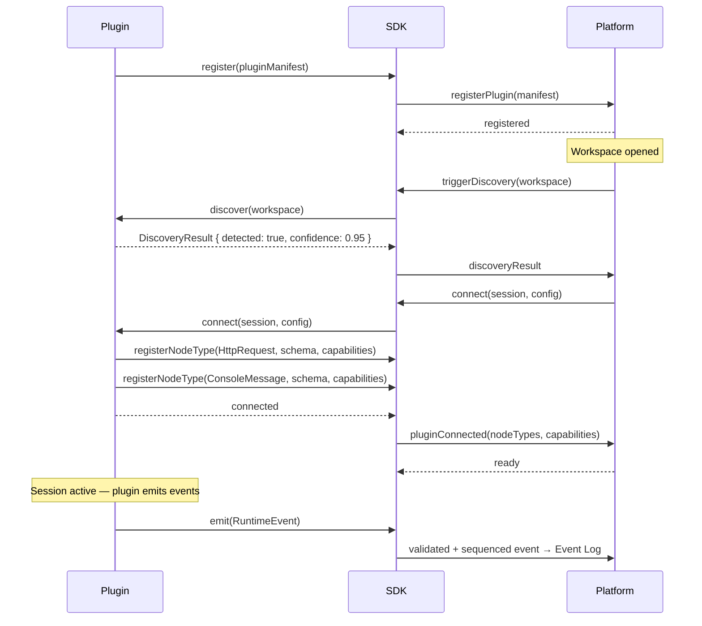
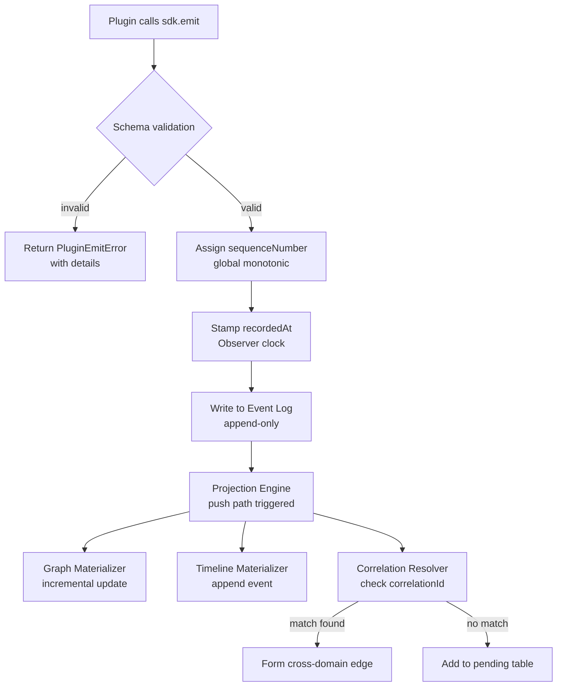
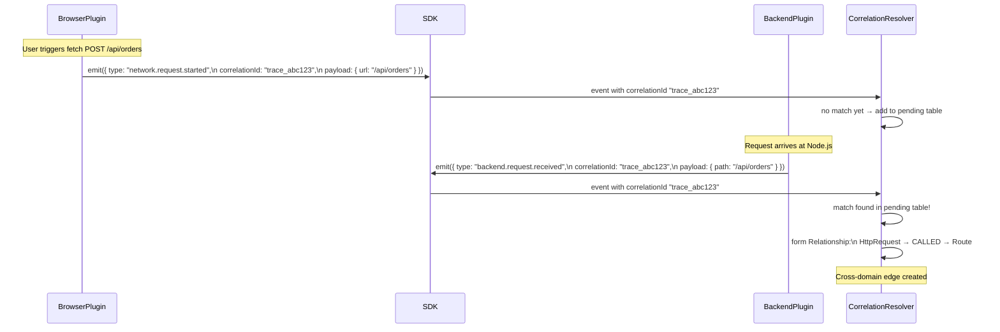

# RFC-0009: Plugin SDK

| Field      | Value                                              |
|------------|----------------------------------------------------|
| RFC        | 0009                                               |
| Status     | Draft                                              |
| Version    | 0.1                                                |
| Category   | Platform SDK                                       |
| Authors    | Founding Team                                      |
| Depends On | RFC-0001 (Glossary), RFC-0003 (ROM), RFC-0004 (REM) |

---

## Abstract

The Plugin SDK is the sole authorized interface between a runtime environment and Observer OS. Every observable runtime — browser, Node.js backend, PostgreSQL database, Docker container, or any future system — becomes visible to Observer by implementing this SDK. The SDK defines what a plugin must do (emit typed events), what it must not do (write to the Runtime Graph directly), and how the platform and plugin interact throughout their shared lifecycle.

The Plugin SDK is not a convenience wrapper. It is an architectural contract. Every guarantee Observer makes about isolation, replay determinism, and cross-domain correlation is enforced at this boundary.

---

## Motivation

Observer's event-sourced architecture requires a clean, enforced separation between runtime instrumentation and runtime representation. Without this boundary:

- A buggy plugin could corrupt the Runtime Graph state of another plugin's domain.
- Replay would be non-deterministic if plugins could bypass the Event Log.
- Cross-domain correlation would require plugins to know about each other — creating tight coupling across unrelated runtimes.

The Plugin SDK establishes and enforces this boundary. Plugins produce events. The platform produces projections. Never the reverse.

---

## Goals

1. Define an unambiguous contract for all Observer plugins.
2. Enforce plugin isolation — one plugin's failure cannot affect another's domain.
3. Enable cross-domain correlation without requiring inter-plugin awareness.
4. Support discovery-first plugin design (auto-detect runtime, minimize configuration).
5. Allow plugin schema evolution without breaking existing sessions.
6. Provide a typed, versioned, stable SDK API that plugin authors can rely on.

## Non-Goals

| Excluded concern | Where defined |
|-----------------|--------------|
| Runtime Graph structure | RFC-0003 (ROM) |
| Event schema taxonomy | RFC-0004 (REM) |
| Projection Engine internals | RFC-0006 |
| Session lifecycle | RFC-0007 |
| Browser-specific instrumentation | RFC-0010 |
| UI for plugin management | RFC-0011 |

---

## Design

### The Fundamental Plugin Contract

```
Plugin                          Observer Platform
  │                                    │
  │  sdk.emit(RuntimeEvent)            │
  │ ─────────────────────────────────► │
  │                                    │  validate event
  │                                    │  assign sequenceNumber
  │                                    │  write to Event Log
  │                                    │  Projection Engine processes
  │                                    │  Runtime Graph updated
  │                                    │
  │  ← plugin never sees the graph ──  │
```

A plugin has **one operation that matters**: `sdk.emit()`. Everything else — graph projection, timeline construction, context assembly, session management — is the platform's responsibility. Plugins are pure producers.

### Why Plugins Cannot Write the Graph Directly

If plugins could write the Runtime Graph directly:

1. **Replay breaks**: The graph state at any point would not be reconstructable from events alone. Replay requires that events are the only input to graph state.

2. **Isolation breaks**: Plugin A writing to the graph could clobber Plugin B's node if they share a node type or make a programming error.

3. **Ordering breaks**: Two plugins writing simultaneously produce undefined graph state without a global sequencing mechanism. The Event Log + Projection Engine provides that mechanism.

The constraint is not restrictive — it is what makes every other Observer guarantee possible.

---

## Architecture

### Plugin Lifecycle

```mermaid
stateDiagram-v2
    [*] --> REGISTERED : Plugin installed / declared

    REGISTERED --> DISCOVERING : Workspace opened
    DISCOVERING --> CONNECTED : Domain detected; connect() succeeded
    DISCOVERING --> UNAVAILABLE : Domain not detected
    DISCOVERING --> CONFIG_REQUIRED : Detection succeeded but config missing

    CONNECTED --> ACTIVE : Session started
    ACTIVE --> SUSPENDED : Session paused
    SUSPENDED --> ACTIVE : Session resumed
    ACTIVE --> DEGRADED : Plugin health check failed
    DEGRADED --> ACTIVE : Health restored
    ACTIVE --> DISCONNECTED : disconnect() called or fatal error
    CONNECTED --> DISCONNECTED : disconnect() called

    DISCONNECTED --> DISCOVERING : Reconnect attempt
    UNAVAILABLE --> DISCOVERING : Manual retry or Workspace rescan
    CONFIG_REQUIRED --> DISCOVERING : Config provided
    DISCONNECTED --> [*] : Plugin uninstalled
```



### Plugin Registration and Connect Flow



---

## Interfaces

### Core Plugin Interface

```typescript
interface ObserverPlugin {
  // Identity — must be stable across versions
  readonly id: string;             // reverse-domain: "com.example.my-plugin"
  readonly name: string;           // "My Plugin"
  readonly version: string;        // semver: "1.2.3"
  readonly sdkVersion: string;     // SDK semver this plugin targets
  readonly runtimeType: RuntimeType;

  // Lifecycle
  discover(workspace: Workspace): Promise<DiscoveryResult>;
  connect(session: Session, config?: PluginConfig): Promise<void>;
  disconnect(): Promise<void>;
  onSessionPause?(): Promise<void>;
  onSessionResume?(): Promise<void>;
  onHealthCheck?(): Promise<HealthStatus>;

  // Schema
  getNodeTypes(): NodeTypeRegistration[];
}

type RuntimeType =
  | "browser"
  | "nodejs"
  | "python"
  | "go"
  | "java"
  | "database"
  | "container"
  | "terminal"
  | "custom";
```

### Discovery

```typescript
interface DiscoveryResult {
  detected: boolean;
  confidence: number;          // 0.0–1.0
  detectedRuntime?: {
    name: string;              // "Chrome 120", "Node.js 20.10", "PostgreSQL 16"
    version?: string;
    details?: Record<string, unknown>;
  };
  requiredConfig?: ConfigField[];  // fields that must be provided before connect()
  reason?: string;                 // why detected or not detected
}

interface ConfigField {
  key: string;
  label: string;
  type: "string" | "number" | "boolean" | "secret";
  required: boolean;
  default?: unknown;
}
```

**Discovery resolution when multiple plugins claim the same domain:**

1. Highest `confidence` score wins.
2. Ties: platform presents choice to developer.
3. Developer choice persists for the Workspace.
4. Discovery failures are surfaced explicitly — never silently ignored.

### Node Type Registration

```typescript
interface NodeTypeRegistration {
  type: string;                    // namespaced: "observer.browser/HttpRequest"
  displayName: string;             // "HTTP Request"
  description: string;
  schema: JSONSchema;              // JSON Schema for metadata field validation
  schemaVersion: string;           // semver
  capabilities: CapabilityType[];  // which capabilities this node type supports
  upcasters?: Upcaster[];          // schema migration functions
}

interface Upcaster {
  fromVersion: string;
  toVersion: string;
  upcast(event: RuntimeEvent): RuntimeEvent;
}

type CapabilityType =
  | "WATCH"
  | "SNAPSHOT"
  | "DIFF"
  | "EXPAND"
  | "INSPECT"
  | "REPLAY"
  | "TIMELINE"
  | "SEARCH"
  | "RECORD";
```

**Namespace convention:** `observer.{domain}/{TypeName}`

| Domain | Namespace prefix | Example |
|--------|-----------------|---------|
| Browser | `observer.browser` | `observer.browser/HttpRequest` |
| React | `observer.react` | `observer.react/Component` |
| Node.js | `observer.nodejs` | `observer.nodejs/HttpServer` |
| PostgreSQL | `observer.postgresql` | `observer.postgresql/Query` |
| Docker | `observer.docker` | `observer.docker/Container` |
| Custom | `com.company.plugin` | `com.acme.myruntime/Widget` |

### Event Emission

```typescript
interface ObserverSDK {
  // Primary emission — fire-and-forget from plugin perspective
  emit(event: EmitEvent): void;

  // Batch emission for high-frequency scenarios (browser frame events, etc.)
  emitBatch(events: EmitEvent[]): void;

  // Node ID generation utility
  generateNodeId(type: string, stableKey: string): NodeId;

  // Plugin diagnostics (separate from runtime events)
  log(level: "debug" | "info" | "warn" | "error", message: string, data?: unknown): void;

  // Runtime access
  getConfig(): PluginConfig;
  getSession(): SessionInfo;
  isConnected(): boolean;
}

interface EmitEvent {
  type: string;                         // must match registered event taxonomy
  sourceNodeId: NodeId;                 // node this event originated from
  affectedNodeIds?: NodeId[];           // other nodes affected
  occurredAt: number;                   // plugin clock (ms since epoch)
  payload: Record<string, unknown>;     // node-type-specific data
  causedByEventId?: EventId;            // causal predecessor
  correlationId?: string;               // for cross-domain linking
  severity?: "DEBUG" | "INFO" | "WARN" | "ERROR" | "FATAL";
}
```

### Event Emission Pipeline



**Invalid events are rejected with a typed error — never silently dropped.** This is a hard invariant: plugins must know when their events fail validation so they can fix their instrumentation.

---

## Node ID Generation

Plugins are responsible for generating stable node IDs. The same logical runtime entity must produce the same node ID across plugin reconnects and session restarts.

```typescript
// SDK utility for deterministic ID generation
const nodeId = sdk.generateNodeId(
  "observer.browser/HttpRequest",
  `${method}:${url}:${timestamp}`
);

// Format produced: {workspace_prefix}_{domain_prefix}_{type_prefix}_{hash}
// Example: ws1_browser_httpreq_7f2a91b3
```

**Stability rules:**
- A mounted React component at the same fiber path → same node ID
- An HTTP request with the same method+URL+initiator → different node IDs (requests are distinct events)
- A PostgreSQL connection pool → same node ID (it persists across queries)

---

## Cross-Domain Correlation

Cross-domain edges (e.g., browser `HttpRequest` → backend `Route`) are formed by the Projection Engine when events from different plugins share a `correlationId`. Plugins do NOT need to know about each other.



**How plugins inject correlation IDs:**

```typescript
// Browser plugin: inject trace ID into outgoing fetch
const correlationId = crypto.randomUUID();

const originalFetch = window.fetch;
window.fetch = async (input, init = {}) => {
  init.headers = {
    ...init.headers,
    "X-Observer-Trace-Id": correlationId
  };
  sdk.emit({
    type: "observer.browser/network.request.started",
    sourceNodeId: requestNodeId,
    correlationId,
    occurredAt: performance.now(),
    payload: { method: "POST", url: "/api/orders" }
  });
  return originalFetch(input, init);
};

// Backend plugin: read trace ID from incoming request
app.use((req, res, next) => {
  const correlationId = req.headers["x-observer-trace-id"];
  if (correlationId) {
    sdk.emit({
      type: "observer.nodejs/backend.request.received",
      sourceNodeId: routeNodeId,
      correlationId,          // ← same ID, different plugin, different domain
      occurredAt: Date.now(),
      payload: { path: req.path, method: req.method }
    });
  }
  next();
});
```

---

## Plugin Isolation

```
┌────────────────────────────────────────────────────────────┐
│                    Observer Platform                        │
│                                                            │
│  ┌──────────────────┐    ┌─────────────────────────────┐  │
│  │  Plugin A        │    │  Plugin B                   │  │
│  │  (Browser)       │    │  (PostgreSQL)               │  │
│  │                  │    │                             │  │
│  │  write namespace │    │  write namespace            │  │
│  │  "browser.*"     │    │  "postgresql.*"             │  │
│  │                  │    │                             │  │
│  │  sdk.emit() ─────┼────┼──► Event Log               │  │
│  │                  │    │  sdk.emit() ────────────────┼──► Event Log
│  │                  │    │                             │  │
│  │  ✗ CANNOT read   │    │  ✗ CANNOT read              │  │
│  │    graph         │    │    browser nodes            │  │
│  │  ✗ CANNOT write  │    │  ✗ CANNOT write             │  │
│  │    graph         │    │    browser nodes            │  │
│  └──────────────────┘    └─────────────────────────────┘  │
└────────────────────────────────────────────────────────────┘
```

**Isolation guarantees:**
- Plugin A cannot read or modify nodes owned by Plugin B.
- A plugin crash is isolated: platform marks the domain as DEGRADED, all other plugins continue.
- Events from Plugin A with Plugin B's domain prefix are rejected at validation.
- Plugins cannot access the filesystem, network, or other plugins except through the SDK.

---

## Schema Evolution

Plugin metadata schemas will change. Observer handles this without breaking existing sessions.

```typescript
// Plugin v1: simple schema
registerNodeType({
  type: "observer.myapp/Widget",
  schemaVersion: "1.0.0",
  schema: {
    type: "object",
    properties: {
      widgetId: { type: "string" },
      label: { type: "string" }
    }
  }
});

// Plugin v2: added "category" field
registerNodeType({
  type: "observer.myapp/Widget",
  schemaVersion: "2.0.0",
  schema: {
    type: "object",
    properties: {
      widgetId: { type: "string" },
      label: { type: "string" },
      category: { type: "string" }   // new field
    }
  },
  upcasters: [
    {
      fromVersion: "1.0.0",
      toVersion: "2.0.0",
      upcast(event) {
        return {
          ...event,
          payload: {
            ...event.payload,
            category: "default"      // backfill default for old events
          }
        };
      }
    }
  ]
});
```

Old events in the Event Log are upcasted at **projection time** — the Event Log is never modified. When the Projection Engine processes a v1.0 event against a v2.0 schema, it applies the upcaster first.

**Schema versioning rules:**
- **Patch (1.0.x → 1.0.y)**: Bug fix only. No field changes.
- **Minor (1.0.x → 1.1.0)**: Additive. New optional fields. Backward-compatible. No upcaster required.
- **Major (1.x.x → 2.0.0)**: Breaking. Renamed/removed fields. Upcaster required.

---

## Plugin Distribution

```
observer-plugin-{name}/
├── package.json          (npm package manifest)
├── observer.plugin.json  (Observer plugin manifest)
├── src/
│   └── index.ts          (plugin entry point)
└── README.md
```

**`observer.plugin.json`:**
```json
{
  "id": "com.example.my-observer-plugin",
  "name": "My Plugin",
  "version": "1.0.0",
  "sdkVersion": "^1.0.0",
  "runtimeType": "nodejs",
  "entryPoint": "./dist/index.js",
  "description": "Observes the MyRuntime environment",
  "author": "Example Corp",
  "repository": "https://github.com/example/observer-plugin-myruntime"
}
```

**Plugin registry:** Open question — see Open Questions.

---

## Examples

### Minimal Plugin Skeleton (TypeScript)

```typescript
import { ObserverPlugin, ObserverSDK, Workspace, Session, DiscoveryResult } from "@observer-os/sdk";

export class MyRuntimePlugin implements ObserverPlugin {
  id = "com.example.myruntime-observer";
  name = "MyRuntime Observer";
  version = "1.0.0";
  sdkVersion = "1.0.0";
  runtimeType = "custom" as const;

  private sdk!: ObserverSDK;

  async discover(workspace: Workspace): Promise<DiscoveryResult> {
    // Auto-detect: is MyRuntime running in this workspace?
    const detected = await this.detectMyRuntime(workspace.rootPath);
    return {
      detected,
      confidence: detected ? 0.9 : 0,
      detectedRuntime: detected ? { name: "MyRuntime", version: "3.0" } : undefined
    };
  }

  async connect(session: Session, sdk: ObserverSDK): Promise<void> {
    this.sdk = sdk;
    sdk.registerNodeType({
      type: "com.example.myruntime/Widget",
      displayName: "Widget",
      description: "A MyRuntime widget",
      schemaVersion: "1.0.0",
      schema: { /* JSON Schema */ },
      capabilities: ["WATCH", "SNAPSHOT", "INSPECT", "TIMELINE"]
    });
    this.attachInstrumentation();
  }

  async disconnect(): Promise<void> {
    this.detachInstrumentation();
  }

  getNodeTypes() {
    return [{ type: "com.example.myruntime/Widget", /* ... */ }];
  }

  private attachInstrumentation(): void {
    MyRuntime.onWidgetCreate((widget) => {
      const nodeId = this.sdk.generateNodeId("com.example.myruntime/Widget", widget.id);
      this.sdk.emit({
        type: "com.example.myruntime/widget.created",
        sourceNodeId: nodeId,
        occurredAt: Date.now(),
        payload: { widgetId: widget.id, label: widget.label }
      });
    });
  }

  private detachInstrumentation(): void { /* remove hooks */ }
  private async detectMyRuntime(rootPath: string): Promise<boolean> { /* ... */ }
}
```

### Node.js HTTP Plugin (abbreviated)

```typescript
import http from "http";
import { ObserverPlugin, ObserverSDK } from "@observer-os/sdk";

export class NodeHttpPlugin implements ObserverPlugin {
  id = "io.observeros.nodejs-http";
  runtimeType = "nodejs" as const;
  // ...

  async connect(session: Session, sdk: ObserverSDK): Promise<void> {
    const originalEmit = http.Server.prototype.emit;
    http.Server.prototype.emit = function(event, req, res) {
      if (event === "request") {
        const correlationId = req.headers["x-observer-trace-id"] as string;
        const nodeId = sdk.generateNodeId("observer.nodejs/HttpRequest", `${req.method}:${req.url}:${Date.now()}`);
        sdk.emit({
          type: "observer.nodejs/backend.request.received",
          sourceNodeId: nodeId,
          correlationId,
          occurredAt: Date.now(),
          payload: { method: req.method, url: req.url, headers: req.headers }
        });
      }
      return originalEmit.apply(this, [event, req, res]);
    };
  }
}
```

---

## Tradeoffs

### Emit-Only vs. Direct Graph Writes

**Direct graph writes** would be simpler for plugin authors — just call `graph.upsertNode(...)`. But it breaks replay determinism, enables cross-plugin corruption, and requires plugins to understand graph schema rather than just their own event schema.

**Emit-only** concentrates graph authority in the Projection Engine. Plugin authors write simpler, more isolated code. The complexity cost is borne by the platform once, not by every plugin author.

### Synchronous vs. Asynchronous Emit

`sdk.emit()` is synchronous from the plugin's perspective (fire-and-forget). The SDK buffers events and delivers them to the Event Log asynchronously. This means:

- Plugin instrumentation code is not blocked by Event Log I/O.
- A slow Event Log does not stall the instrumented runtime.
- Backpressure is handled by the SDK buffer, not by the plugin.

**Tradeoff**: Events may arrive slightly out of wall-clock order during burst conditions. The `sequenceNumber` (assigned by the platform, not the plugin) is the canonical ordering — `occurredAt` is display metadata only.

### Plugin-Assigned IDs vs. Platform-Assigned IDs

Plugins assign node IDs because they have the context to make IDs stable (same logical entity = same ID across reconnects). The platform cannot know that "the PostgreSQL connection pool at port 5432" is the same entity across two plugin connections.

**Risk**: Plugins may generate unstable IDs. The SDK provides `generateNodeId(type, stableKey)` to make stability easy. ID instability in a plugin is a bug in that plugin, not in the platform.

---

## Future Work

- **Plugin marketplace / registry** — public registry of verified Observer plugins
- **Plugin testing framework** — `@observer-os/plugin-test` for unit testing event emission
- **Language SDKs** — Python SDK, Go SDK, Java SDK
- **Hot reload** — plugin reconnect without Session restart during development
- **Capability negotiation protocol** — dynamic capability availability changes during session
- **Plugin performance profiling** — SDK-level measurement of plugin instrumentation overhead

---

## Open Questions

| # | Question | Impact |
|---|----------|--------|
| 1 | **"Observer" naming collision**: should the plugin type be renamed to "Probe" or "Sensor" to avoid collision with "Observer OS" (the platform)? | RFC-0001 Glossary, all plugin docs |
| 2 | **Plugin registry**: should Observer OS maintain a first-party plugin registry, or delegate to npm/PyPI with a naming convention? | Distribution |
| 3 | **SDK versioning**: how many SDK major versions should the platform support simultaneously? | Upgrade path |
| 4 | **Synthetic events**: should plugins be able to emit "synthetic" events (not derived from real instrumentation, but constructed for testing or simulation)? | Replay, testing |
| 5 | **Plugin process model**: should plugins run in the same process as the Observer core, or in isolated child processes? | Isolation, performance |
| 6 | **Capability negotiation**: should capability availability be static (declared at connect time) or dynamic (can change while session is active)? | Runtime Explorer |

---

## References

- RFC-0001: Observer Glossary
- RFC-0003: Runtime Object Model (ROM)
- RFC-0004: Runtime Event Model (REM)
- RFC-0006: Projection Engine
- RFC-0010: Browser Observer (reference implementation)
