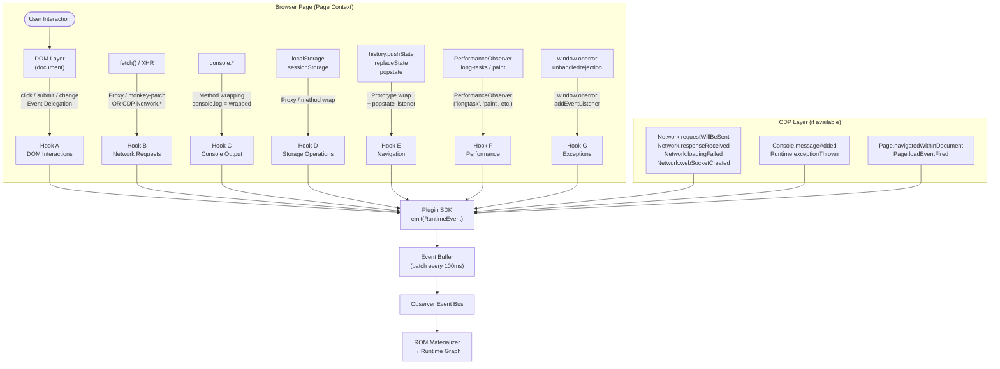
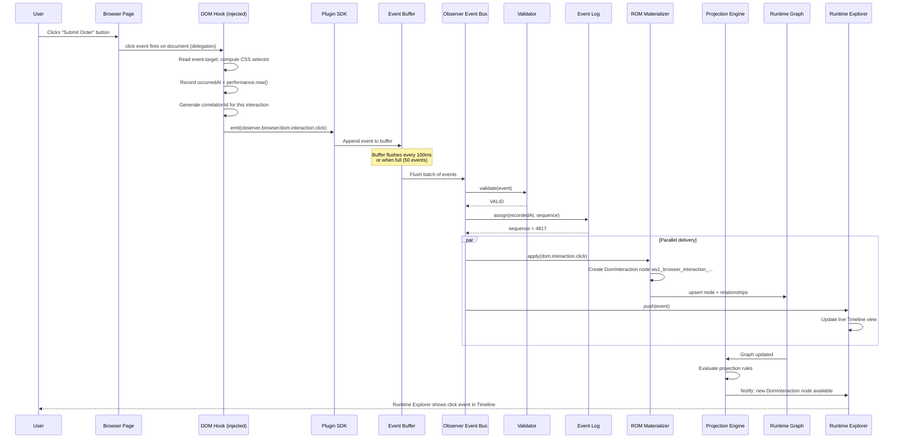
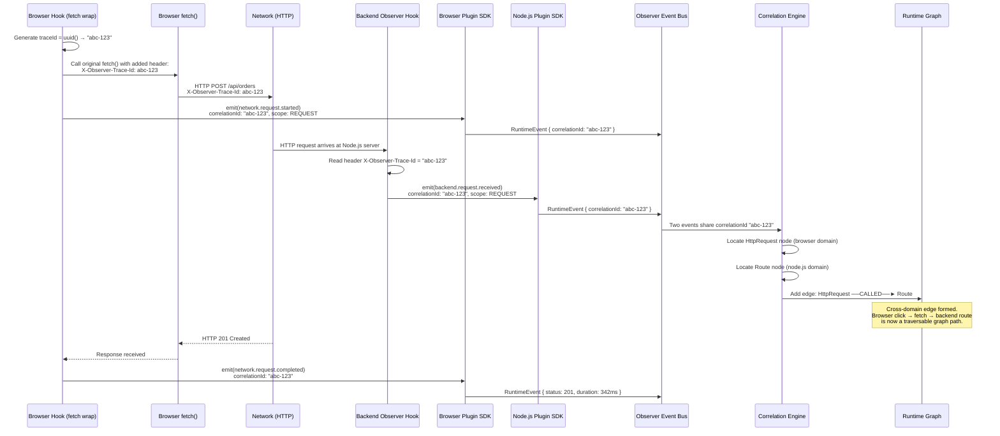
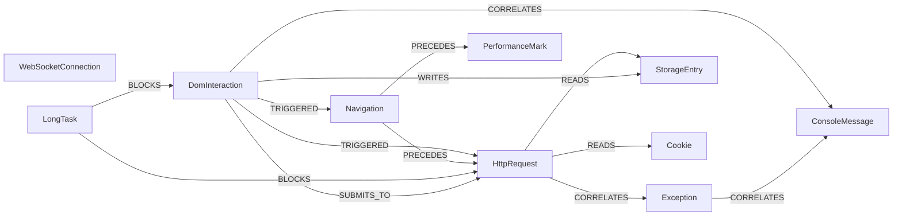

# RFC-0010: Browser Observer — Reference Implementation of the Observer Plugin SDK

| Field      | Value                                                                                              |
|------------|----------------------------------------------------------------------------------------------------|
| RFC        | 0010                                                                                               |
| Status     | Draft                                                                                              |
| Version    | 0.1                                                                                               |
| Category   | Reference Implementation                                                                           |
| Authors    | Founding Team                                                                                      |
| Depends On | RFC-0001 (Glossary), RFC-0003 (ROM), RFC-0004 (REM), RFC-0009 (Plugin SDK)                        |

---

## Abstract

The Browser Observer is Observer's reference implementation of the Plugin SDK (RFC-0009). It instruments the browser runtime Domain, capturing DOM interactions, network activity, console output, JavaScript exceptions, browser storage, page navigation, and Web Vitals — and emitting all of these as structured RuntimeEvents that materialize into the Runtime Graph.

The Browser Observer is simultaneously:

1. **A production plugin** — it is the primary mechanism by which Observer understands frontend behavior in a real web application.
2. **The canonical Plugin SDK example** — every Plugin SDK feature is demonstrated here. Plugin authors building the React Observer, the Node.js Observer, or any future Domain plugin should read this document first.

This RFC specifies the complete Browser Domain definition, the full taxonomy of Browser Node types and Browser Event types, the instrumentation approach for each capture category, the cross-domain correlation protocol, sensitive data handling rules, performance constraints, and six concrete worked examples from raw browser signal to Runtime Graph edge.

---

## Motivation

Frontend behavior is the most critical and least understood layer of a modern web application. When a user reports "the order didn't go through," the failure could be in:

- A DOM form validation bug that silently blocked submission
- A `fetch` call that failed with a network error
- A 422 response from the backend that the frontend mishandled
- A JavaScript exception thrown in the event handler
- A race condition in state management that caused the wrong request body

Today, a developer investigating this must open Chrome DevTools, reproduce the failure manually, and piece together evidence from four separate panels: Network, Console, Sources, and Application. The information exists. The structure — causal links between a click, a network request, a response, a state update, and a React render — does not.

The Browser Observer makes that structure first-class. Every click, every request, every console message, every exception is a typed RuntimeNode. Their causal relationships are edges in the Runtime Graph. An AI Consumer receiving the Runtime Graph can answer "what exactly happened when the order failed?" with full, structured, causal evidence — not a log file.

This is the problem the Browser Observer solves.

---

## Goals

1. Define the complete Browser Domain — every category of browser runtime state that Observer captures.
2. Specify the full Browser Node type taxonomy with field-level schema for each type.
3. Specify the complete Browser Event type taxonomy, covering every observable browser signal.
4. Define the instrumentation approach for each capture category, including the tradeoffs between CDP, browser extension, and injected script.
5. Specify the cross-domain correlation protocol: how browser-side events link to backend events through `X-Observer-Trace-Id` headers.
6. Define sensitive data handling: what is redacted by default, what is opt-in, and how redaction decisions are made.
7. Establish performance constraints that ensure the Browser Observer adds no perceptible overhead to the instrumented page.
8. Serve as the definitive reference implementation that Plugin SDK authors learn from.

---

## Non-Goals

The Browser Observer does not:

| Excluded Concern | Where It Is Handled |
|------------------|---------------------|
| React component tree, props, state, hooks | React Observer (separate plugin) |
| Angular or Vue component lifecycle | Framework-specific Observers (future) |
| Server-side rendering capture | Backend Observer (Node.js, Deno, Bun) |
| Browser automation or synthetic testing | Future: Test Observer |
| Performance profiling and CPU flame graphs | Future: Profiler Observer |
| Memory heap snapshots | Future: Memory Observer |
| Service Worker instrumentation | Open question — see Section 11 |
| WebRTC data channels | Open question — see Section 11 |
| Modifying, blocking, or replaying browser requests | Outside Observer's passive-only mandate |
| Writing directly to the Runtime Graph | Prohibited by Plugin SDK contract |

---

## Design

### The Core Constraint: Plugins Only Emit Events

The Browser Observer is bound by the same constraint as every Observer plugin: it **never writes to the Runtime Graph directly**. It only emits RuntimeEvents via the Plugin SDK's `emit()` function. The Runtime Graph is materialized by the platform's ROM Materializer from those events.

This is not a limitation. It is the architectural principle that makes Observer's Runtime Graph correct, replayable, and auditable. An event log is the source of truth. The graph is derived.

The Browser Observer is also strictly **passive**. It does not modify page behavior, intercept responses, block requests, or alter the DOM. Instrumentation is observation-only.

### The Browser Domain

The Browser Domain is the set of observable runtime state exposed by the Browser Observer. It has six categories:

```
Browser Domain
├── Network
│   ├── HTTP Requests (fetch, XMLHttpRequest)
│   ├── WebSocket Connections
│   └── EventSource Streams (future)
├── DOM
│   ├── User Interactions (click, submit, change, input)
│   └── Mutations (created, destroyed — key elements only)
├── Console
│   └── All console.log / warn / error / debug / info output
├── Exceptions
│   ├── Unhandled Errors (window.onerror)
│   └── Unhandled Promise Rejections (unhandledrejection)
├── Storage
│   ├── localStorage (reads, writes, deletes, clears)
│   ├── sessionStorage (reads, writes, deletes, clears)
│   ├── Cookies (set, deleted)
│   └── IndexedDB (future — see Open Questions)
├── Navigation
│   ├── Page Loads (load, DOMContentLoaded)
│   ├── SPA Navigation (history.pushState, replaceState)
│   ├── Hash Changes (hashchange)
│   └── Back/Forward (popstate)
└── Performance
    ├── Web Vitals (LCP, FID, CLS, TTFB, INP)
    └── Long Tasks (PerformanceObserver)
```

### Instrumentation Approach

> **Open Question**: The primary instrumentation mechanism is unresolved. See Section 11.

The Browser Observer supports three instrumentation mechanisms, and may use multiple simultaneously:

**Mechanism A — Injected Script (In-Page Instrumentation)**

A JavaScript module injected into the page's execution context. This script wraps browser APIs (monkey-patching `fetch`, `console.*`, `localStorage`, `history.pushState`) to intercept calls and emit events. The injected script runs with full page-level access.

*Advantages*: Works in any browser, no extension required, captures timing from inside the call stack.
*Disadvantages*: Monkey-patching is fragile against page code that caches original references before injection; detected and blocked by some CSP policies.

**Mechanism B — Chrome DevTools Protocol (CDP)**

The Browser Observer connects to the browser's CDP endpoint (exposed at `ws://localhost:9222/json` when the browser is launched with `--remote-debugging-port=9222`) and subscribes to CDP domains: `Network.*`, `Runtime.*`, `Console.*`, `Page.*`, `Log.*`.

*Advantages*: No page code injection; authoritative data from the browser engine itself; cannot be blocked by application code.
*Disadvantages*: Requires browser launched with remote debugging enabled; Chrome/Chromium only for full feature parity; CDP connection is asynchronous and may miss early-page events.

**Mechanism C — Browser Extension**

A browser extension with `webRequest`, `debugger`, `storage`, and `tabs` permissions. The extension can observe network requests (including headers and bodies with `webRequestBody` permission), tab navigation, and storage changes without page injection.

*Advantages*: Works without CDP; persists across navigations; can capture events from pages with strict CSP.
*Disadvantages*: Requires user installation; extension review and signing overhead; limited access to JavaScript execution context (cannot capture console messages or in-page exceptions directly without a content script).

**Default Strategy**: The Browser Observer uses Mechanism A (injected script) as the baseline, with Mechanism B (CDP) as an enhancement when available. Mechanism C (browser extension) is the deployment target for non-developer users (QA, staging environment monitoring). The plugin's `discover()` implementation detects which mechanisms are available and reports capability accordingly.

Each instrumentation category below specifies which mechanism(s) capture it.

---

## Architecture

### Browser Observer Instrumentation Map

The following diagram shows where each instrumentation hook sits relative to the browser's execution model:



### Full Event Flow: User Click to Runtime Explorer



### Cross-Domain Correlation Flow

The following sequence shows how a browser `fetch` call and a backend HTTP handler are linked into a single cross-domain edge in the Runtime Graph:



### Browser Observer Class Structure

```mermaid
classDiagram
    class BrowserObserver {
        +pluginId: String
        +version: String
        +domainId: "observer.browser"
        +config: BrowserObserverConfig
        +connect(workspace: Workspace) Promise~ConnectionResult~
        +discover(workspace: Workspace) Promise~DiscoveryResult~
        +disconnect() Promise~void~
        -hooks: InstrumentationHook[]
        -buffer: EventBuffer
        -sdk: PluginSDK
        -installHooks() void
        -teardownHooks() void
    }

    class BrowserObserverConfig {
        +captureRequestBodies: Boolean
        +captureResponseBodies: Boolean
        +captureStorageValues: Boolean
        +redactHeaders: String[]
        +redactStorageKeys: RegExp[]
        +redactQueryParams: String[]
        +redactFormFields: String[]
        +maxBodySizeBytes: Number
        +batchIntervalMs: Number
        +batchMaxSize: Number
        +domSelectorDepth: Number
        +ignoredUrls: RegExp[]
        +ignoredConsoleLevels: ConsoleLevels[]
    }

    class EventBuffer {
        +maxSize: Number
        +flushIntervalMs: Number
        +pending: RuntimeEvent[]
        +append(event: RuntimeEvent) void
        +flush() void
        +forceFlush() void
    }

    class DomInteractionHook {
        +eventTypes: ["click", "submit", "change", "input"]
        +install() void
        +teardown() void
        -handleEvent(e: Event) void
        -computeSelector(el: Element) String
        -extractValue(el: Element) String?
    }

    class NetworkHook {
        +mode: "proxy" | "cdp" | "both"
        +install() void
        +teardown() void
        -wrapFetch() void
        -wrapXHR() void
        -onCdpNetworkEvent(event: CDPEvent) void
        -injectTraceHeader(headers: Headers, traceId: String) Headers
    }

    class ConsoleHook {
        +levels: ["log", "warn", "error", "debug", "info"]
        +install() void
        +teardown() void
        -wrapMethod(level: String) void
    }

    class ExceptionHook {
        +install() void
        +teardown() void
        -onWindowError(e: ErrorEvent) void
        -onUnhandledRejection(e: PromiseRejectionEvent) void
    }

    class StorageHook {
        +targets: ["localStorage", "sessionStorage"]
        +install() void
        +teardown() void
        -proxyStorage(target: Storage, name: String) void
        -shouldRedactKey(key: String) Boolean
    }

    class NavigationHook {
        +install() void
        +teardown() void
        -wrapHistoryMethod(name: String) void
        -onPopState(e: PopStateEvent) void
        -onHashChange(e: HashChangeEvent) void
        -onLoad(e: Event) void
    }

    class PerformanceHook {
        +observers: PerformanceObserver[]
        +install() void
        +teardown() void
        -observeWebVitals() void
        -observeLongTasks() void
        -onEntry(entry: PerformanceEntry) void
    }

    class HttpRequestNode {
        +id: NodeId
        +type: "observer.browser/HttpRequest"
        +method: String
        +url: String
        +status: Number?
        +duration: Number?
        +requestHeaders: Map~String,String~
        +responseHeaders: Map~String,String~
        +requestBody: String?
        +responseBody: String?
        +initiator: "fetch" | "xhr" | "beacon"
        +initiatorStack: String[]?
        +correlationId: String
    }

    class WebSocketConnectionNode {
        +id: NodeId
        +type: "observer.browser/WebSocketConnection"
        +url: String
        +protocol: String?
        +state: "connecting" | "open" | "closing" | "closed"
        +messageCount: Number
        +openedAt: Timestamp?
        +closedAt: Timestamp?
        +closeCode: Number?
    }

    class ConsoleMessageNode {
        +id: NodeId
        +type: "observer.browser/ConsoleMessage"
        +level: "log" | "warn" | "error" | "debug" | "info"
        +message: String
        +args: Any[]
        +stack: StackFrame[]?
        +source: String?
        +lineNumber: Number?
    }

    class ExceptionNode {
        +id: NodeId
        +type: "observer.browser/Exception"
        +message: String
        +name: String
        +stack: StackFrame[]
        +type_: "error" | "rejection"
        +source: String?
        +lineNumber: Number?
        +columnNumber: Number?
        +caught: Boolean
    }

    class DomInteractionNode {
        +id: NodeId
        +type: "observer.browser/DomInteraction"
        +interactionType: "click" | "submit" | "change" | "input"
        +target: String
        +targetTagName: String
        +targetText: String?
        +value: String?
        +coordinates: Coordinates?
        +isTrusted: Boolean
        +page: String
    }

    class NavigationNode {
        +id: NodeId
        +type: "observer.browser/Navigation"
        +navigationType: "load" | "push" | "replace" | "hash" | "popstate"
        +from: String?
        +to: String
        +duration: Number?
        +state: Any?
    }

    class CookieNode {
        +id: NodeId
        +type: "observer.browser/Cookie"
        +name: String
        +domain: String?
        +path: String
        +secure: Boolean
        +httpOnly: Boolean
        +sameSite: "Strict" | "Lax" | "None"?
        +expires: Timestamp?
        +operation: "set" | "deleted"
    }

    class StorageEntryNode {
        +id: NodeId
        +type: "observer.browser/StorageEntry"
        +storage: "local" | "session"
        +key: String
        +value: String?
        +previousValue: String?
        +operation: "set" | "get" | "remove" | "clear"
        +redacted: Boolean
    }

    class PerformanceMarkNode {
        +id: NodeId
        +type: "observer.browser/PerformanceMark"
        +name: String
        +value: Number
        +rating: "good" | "needs-improvement" | "poor"
        +vitalType: "LCP" | "FID" | "CLS" | "TTFB" | "INP" | "custom"
        +attribution: Any?
    }

    class LongTaskNode {
        +id: NodeId
        +type: "observer.browser/LongTask"
        +duration: Number
        +startTime: Number
        +attribution: LongTaskAttribution[]
        +containerType: "window" | "iframe" | "embed" | "object"?
    }

    BrowserObserver --> BrowserObserverConfig
    BrowserObserver --> EventBuffer
    BrowserObserver --> DomInteractionHook
    BrowserObserver --> NetworkHook
    BrowserObserver --> ConsoleHook
    BrowserObserver --> ExceptionHook
    BrowserObserver --> StorageHook
    BrowserObserver --> NavigationHook
    BrowserObserver --> PerformanceHook
```



### Browser Domain Node Relationship Map



### Sensitive Data Redaction Decision Tree

```mermaid
flowchart TD
    START([Captured value]) --> Q1{Is it an\nAuthorization header?\nAuthorization, Cookie,\nX-API-Key, Bearer}
    Q1 -->|Yes| REDACT_ALWAYS[REDACT — always\nreplace with &quot;[REDACTED]&quot;]
    Q1 -->|No| Q2{Is it a\nrequest/response body?}
    Q2 -->|Yes| Q3{Is captureRequestBodies\nor captureResponseBodies\nenabled in config?}
    Q3 -->|No — default| REDACT_BODY[REDACT — body\nnot captured by default]
    Q3 -->|Yes| Q4{Does body exceed\nmaxBodySizeBytes?}
    Q4 -->|Yes| TRUNCATE[TRUNCATE — capture first\nmaxBodySizeBytes bytes\nappend &quot;...[TRUNCATED]&quot;]
    Q4 -->|No| CAPTURE_BODY[CAPTURE body\nstill apply field-level\nredaction below]

    Q2 -->|No| Q5{Is it a form field value?}
    Q5 -->|Yes| Q6{Is field type=password\nor name matches:\npassword, token, secret,\napi_key, auth, credential?}
    Q6 -->|Yes| REDACT_ALWAYS
    Q6 -->|No| Q7{Is field name in\nconfig.redactFormFields?}
    Q7 -->|Yes| REDACT_ALWAYS
    Q7 -->|No| CAPTURE_FIELD[CAPTURE field value]

    Q5 -->|No| Q8{Is it a\nstorage value?\nlocalStorage / sessionStorage}
    Q8 -->|Yes| Q9{Is captureStorageValues\nenabled in config?}
    Q9 -->|No — default| REDACT_STORAGE[REDACT — storage values\nnot captured by default]
    Q9 -->|Yes| Q10{Does key match\nconfig.redactStorageKeys\nRegExp patterns?}
    Q10 -->|Yes| REDACT_ALWAYS
    Q10 -->|No| CAPTURE_STORAGE[CAPTURE storage value]

    Q8 -->|No| Q11{Is it a URL\nquery parameter?}
    Q11 -->|Yes| Q12{Is param name in\nconfig.redactQueryParams?\nDefault: token, key, password,\nsecret, auth, api_key}
    Q12 -->|Yes| REDACT_PARAM[REDACT param value\nin URL\nkeep param name visible]
    Q12 -->|No| CAPTURE_URL[CAPTURE full URL\nincluding param value]
    Q11 -->|No| CAPTURE_OTHER[CAPTURE value as-is]

    style REDACT_ALWAYS fill:#ffcccc,stroke:#cc0000
    style REDACT_BODY fill:#ffcccc,stroke:#cc0000
    style REDACT_STORAGE fill:#ffcccc,stroke:#cc0000
    style REDACT_PARAM fill:#ffcccc,stroke:#cc0000
    style CAPTURE_BODY fill:#ccffcc,stroke:#006600
    style CAPTURE_FIELD fill:#ccffcc,stroke:#006600
    style CAPTURE_STORAGE fill:#ccffcc,stroke:#006600
    style CAPTURE_URL fill:#ccffcc,stroke:#006600
    style CAPTURE_OTHER fill:#ccffcc,stroke:#006600
    style TRUNCATE fill:#ffffcc,stroke:#cc9900
```

---

## Interfaces

### Browser Node Type Taxonomy

The complete set of Runtime Node types produced by the Browser Observer. All type identifiers are namespaced under `observer.browser/`.

| Node Type | What It Represents | Key Fields |
|-----------|-------------------|------------|
| `observer.browser/HttpRequest` | A single HTTP request/response cycle initiated from the browser | `method`, `url`, `status`, `duration`, `requestHeaders`, `responseHeaders`, `requestBody`*, `responseBody`*, `initiator`, `correlationId` |
| `observer.browser/WebSocketConnection` | A WebSocket connection lifecycle | `url`, `protocol`, `state`, `messageCount`, `openedAt`, `closedAt`, `closeCode` |
| `observer.browser/ConsoleMessage` | A single call to any `console.*` method | `level`, `message`, `args`, `stack`, `source`, `lineNumber` |
| `observer.browser/Exception` | An unhandled error or unhandled promise rejection | `message`, `name`, `stack`, `type` (error/rejection), `source`, `lineNumber`, `columnNumber`, `caught` |
| `observer.browser/DomInteraction` | A user interaction with a DOM element | `interactionType` (click/submit/change/input), `target` (CSS selector), `targetTagName`, `targetText`, `value`*, `coordinates`, `isTrusted`, `page` |
| `observer.browser/Navigation` | A page navigation event | `navigationType` (load/push/replace/hash/popstate), `from`, `to`, `duration`, `state` |
| `observer.browser/Cookie` | A browser cookie set or deleted | `name`, `domain`, `path`, `secure`, `httpOnly`, `sameSite`, `expires`, `operation` |
| `observer.browser/StorageEntry` | A localStorage or sessionStorage operation | `storage` (local/session), `key`, `value`*, `previousValue`*, `operation` (set/get/remove/clear), `redacted` |
| `observer.browser/PerformanceMark` | A Web Vitals measurement or custom performance mark | `name`, `value`, `rating` (good/needs-improvement/poor), `vitalType` (LCP/FID/CLS/TTFB/INP/custom), `attribution` |
| `observer.browser/LongTask` | A browser main-thread long task (>50ms) | `duration`, `startTime`, `attribution`, `containerType` |

*\* Captured only when explicitly enabled in config or always redacted by default.*

### Browser Event Type Taxonomy

The complete set of RuntimeEvent types emitted by the Browser Observer. All event types are namespaced under `observer.browser/`.

**DOM Events**

| Event Type | Emitted When | Severity | Node Created/Updated |
|------------|-------------|----------|----------------------|
| `observer.browser/dom.interaction.click` | User clicks any non-disabled element | INFO | Creates `DomInteraction` |
| `observer.browser/dom.interaction.submit` | A form is submitted | INFO | Creates `DomInteraction` |
| `observer.browser/dom.interaction.change` | A form input value changes (on blur) | INFO | Creates `DomInteraction` |
| `observer.browser/dom.mutation.created` | A watched element is added to the DOM | DEBUG | Creates `DomInteraction` |
| `observer.browser/dom.mutation.destroyed` | A watched element is removed from the DOM | DEBUG | Updates existing node |

**Network Events**

| Event Type | Emitted When | Severity | Node Created/Updated |
|------------|-------------|----------|----------------------|
| `observer.browser/network.request.started` | `fetch()` or `XHR.send()` called | INFO | Creates `HttpRequest` (ACTIVE) |
| `observer.browser/network.request.completed` | Response received, status 2xx–3xx | INFO | Updates `HttpRequest` (COMPLETED) |
| `observer.browser/network.request.failed` | Response received, status 4xx–5xx | WARN/ERROR | Updates `HttpRequest` (FAILED) |
| `observer.browser/network.request.aborted` | Request cancelled by client (AbortController) | INFO | Updates `HttpRequest` (ABORTED) |
| `observer.browser/network.websocket.opened` | WebSocket connection established | INFO | Creates `WebSocketConnection` (OPEN) |
| `observer.browser/network.websocket.message.received` | WebSocket message received from server | DEBUG | Updates `WebSocketConnection` |
| `observer.browser/network.websocket.message.sent` | WebSocket message sent by page | DEBUG | Updates `WebSocketConnection` |
| `observer.browser/network.websocket.closed` | WebSocket connection closed | INFO | Updates `WebSocketConnection` (CLOSED) |

**Console Events**

| Event Type | Emitted When | Severity | Node Created |
|------------|-------------|----------|--------------|
| `observer.browser/console.log` | `console.log()` called | DEBUG | Creates `ConsoleMessage` |
| `observer.browser/console.warn` | `console.warn()` called | WARN | Creates `ConsoleMessage` |
| `observer.browser/console.error` | `console.error()` called | ERROR | Creates `ConsoleMessage` |
| `observer.browser/console.debug` | `console.debug()` called | DEBUG | Creates `ConsoleMessage` |

**Exception Events**

| Event Type | Emitted When | Severity | Node Created |
|------------|-------------|----------|--------------|
| `observer.browser/exception.unhandled` | `window.onerror` fires | ERROR | Creates `Exception` |
| `observer.browser/exception.promise_rejection` | `unhandledrejection` fires | ERROR | Creates `Exception` |

**Navigation Events**

| Event Type | Emitted When | Severity | Node Created/Updated |
|------------|-------------|----------|----------------------|
| `observer.browser/navigation.started` | Navigation begins (before DOM is ready) | INFO | Creates `Navigation` (ACTIVE) |
| `observer.browser/navigation.completed` | `load` event fires; SPA route committed | INFO | Updates `Navigation` (COMPLETED) |
| `observer.browser/navigation.failed` | Navigation error (404, network failure) | ERROR | Updates `Navigation` (FAILED) |

**Storage Events**

| Event Type | Emitted When | Severity | Node Created/Updated |
|------------|-------------|----------|----------------------|
| `observer.browser/storage.set` | `localStorage.setItem()` or `sessionStorage.setItem()` | INFO | Creates/Updates `StorageEntry` |
| `observer.browser/storage.get` | `localStorage.getItem()` or `sessionStorage.getItem()` | DEBUG | Reads `StorageEntry` (no mutation) |
| `observer.browser/storage.remove` | `localStorage.removeItem()` | INFO | Destroys `StorageEntry` |
| `observer.browser/storage.clear` | `localStorage.clear()` called | INFO | Destroys all `StorageEntry` for storage |

**Performance Events**

| Event Type | Emitted When | Severity | Node Created |
|------------|-------------|----------|--------------|
| `observer.browser/performance.vital` | LCP, FID, CLS, TTFB, or INP measurement available | INFO/WARN | Creates `PerformanceMark` |
| `observer.browser/performance.long_task` | A task >50ms is observed on the main thread | WARN | Creates `LongTask` |

### Instrumentation Hook Specifications

#### DOM Interactions — Hook A

```typescript
/**
 * Installs a single delegated event listener on document.
 * Captures clicks, form submissions, and input changes.
 *
 * Mechanism: Injected script (Mechanism A)
 * Performance: < 0.1ms per event (selector computation is synchronous but bounded)
 */
function installDomInteractionHook(sdk: PluginSDK, config: BrowserObserverConfig): Teardown {
  const OBSERVED_TYPES = ['click', 'submit', 'change'] as const;

  function handleEvent(e: Event): void {
    const target = e.target as Element;
    if (!target) return;

    const selector = computeStableSelector(target, config.domSelectorDepth);
    const interactionType = e.type as DomInteractionType;

    // Redact value for sensitive inputs
    let value: string | undefined;
    if (interactionType === 'change' && target instanceof HTMLInputElement) {
      value = shouldRedactInput(target, config) ? '[REDACTED]' : target.value;
    }

    const node: DomInteractionNode = {
      id: generateNodeId('interaction', selector),
      type: 'observer.browser/DomInteraction',
      interactionType,
      target: selector,
      targetTagName: target.tagName.toLowerCase(),
      targetText: getElementText(target),
      value,
      coordinates: e instanceof MouseEvent
        ? { x: e.clientX, y: e.clientY, viewportX: e.clientX, viewportY: e.clientY }
        : undefined,
      isTrusted: e.isTrusted,
      page: window.location.pathname,
    };

    sdk.emit({
      type: `observer.browser/dom.interaction.${interactionType}`,
      sourceNode: node.id,
      affectedNodes: [node.id],
      occurredAt: performance.now(),
      severity: 'INFO',
      payload: { schemaVersion: '1.0', data: node },
    });
  }

  for (const type of OBSERVED_TYPES) {
    document.addEventListener(type, handleEvent, { capture: true, passive: true });
  }

  return () => {
    for (const type of OBSERVED_TYPES) {
      document.removeEventListener(type, handleEvent, { capture: true });
    }
  };
}
```

**CSS Selector Stability**: The `computeStableSelector` function builds a selector in preference order:
1. `#element-id` — if a non-generated `id` attribute is present
2. `[data-testid="..."]` — if a `data-testid` attribute is present
3. `[data-observer-id="..."]` — if a `data-observer-id` attribute is present
4. `button.class-name:nth-of-type(2)` — positional fallback, bounded by `domSelectorDepth`

Generated IDs (UUIDs, numeric IDs like `id="3"`) are not used as stable anchors because they change across page loads.

#### Network Requests — Hook B

```typescript
/**
 * Wraps window.fetch and XMLHttpRequest to capture request/response lifecycle.
 * Injects X-Observer-Trace-Id header on all outbound requests for cross-domain correlation.
 *
 * Mechanism: Injected script (Mechanism A) primary; CDP Network.* (Mechanism B) supplements
 * Performance: < 1ms overhead per request (header injection + timing record)
 */
function installNetworkHook(sdk: PluginSDK, config: BrowserObserverConfig): Teardown {
  const originalFetch = window.fetch.bind(window);

  window.fetch = async function observedFetch(
    input: RequestInfo | URL,
    init?: RequestInit
  ): Promise<Response> {
    const traceId = generateUUID();
    const url = resolveUrl(input);
    const method = (init?.method ?? 'GET').toUpperCase();
    const startTime = performance.now();
    const nodeId = generateNodeId('httpreq', `${Date.now()}_${hashUrl(url)}`);

    // Inject correlation header
    const headers = new Headers(init?.headers);
    headers.set('X-Observer-Trace-Id', traceId);

    // Emit request.started
    sdk.emit({
      type: 'observer.browser/network.request.started',
      sourceNode: nodeId,
      affectedNodes: [nodeId],
      occurredAt: startTime,
      correlationId: { value: traceId, scope: 'REQUEST' },
      severity: 'INFO',
      payload: {
        schemaVersion: '1.2',
        data: {
          method,
          url,
          requestHeaders: headersToObject(headers, config),
          requestBody: config.captureRequestBodies
            ? await readBody(init?.body, config.maxBodySizeBytes)
            : undefined,
          initiator: 'fetch',
          initiatorStack: captureStack(),
        },
      },
    });

    try {
      const response = await originalFetch(input, { ...init, headers });
      const duration = performance.now() - startTime;
      const eventType = response.ok
        ? 'observer.browser/network.request.completed'
        : 'observer.browser/network.request.failed';

      sdk.emit({
        type: eventType,
        sourceNode: nodeId,
        affectedNodes: [nodeId],
        occurredAt: startTime + duration,
        correlationId: { value: traceId, scope: 'REQUEST' },
        severity: response.ok ? 'INFO' : response.status >= 500 ? 'ERROR' : 'WARN',
        payload: {
          schemaVersion: '1.2',
          data: {
            status: response.status,
            statusText: response.statusText,
            duration,
            responseHeaders: headersToObject(response.headers, config),
            responseBody: config.captureResponseBodies
              ? await readResponseBody(response.clone(), config.maxBodySizeBytes)
              : undefined,
          },
        },
      });

      return response;
    } catch (error) {
      sdk.emit({
        type: 'observer.browser/network.request.failed',
        sourceNode: nodeId,
        affectedNodes: [nodeId],
        occurredAt: performance.now(),
        correlationId: { value: traceId, scope: 'REQUEST' },
        severity: 'ERROR',
        payload: {
          schemaVersion: '1.2',
          data: {
            error: (error as Error).message,
            duration: performance.now() - startTime,
          },
        },
      });
      throw error;
    }
  };

  return () => { window.fetch = originalFetch; };
}
```

#### Console Output — Hook C

```typescript
/**
 * Wraps console.* methods to capture all output.
 * Preserves original method behavior — wrapped methods still call through.
 *
 * Mechanism: Injected script (Mechanism A)
 * Performance: < 0.05ms per call
 */
function installConsoleHook(sdk: PluginSDK, config: BrowserObserverConfig): Teardown {
  const LEVELS = ['log', 'warn', 'error', 'debug', 'info'] as const;
  const originals = {} as Record<string, (...args: unknown[]) => void>;

  for (const level of LEVELS) {
    if (config.ignoredConsoleLevels?.includes(level)) continue;
    originals[level] = console[level].bind(console);

    console[level] = function observedConsole(...args: unknown[]) {
      originals[level](...args);  // Always call through first

      const nodeId = generateNodeId('console', `${Date.now()}_${seq++}`);
      const message = args.map(serializeArg).join(' ');

      sdk.emit({
        type: `observer.browser/console.${level}`,
        sourceNode: nodeId,
        affectedNodes: [nodeId],
        occurredAt: performance.now(),
        severity: levelToSeverity(level),
        payload: {
          schemaVersion: '1.0',
          data: {
            level,
            message,
            args: args.map(safeSerialize),
            stack: level === 'error' ? captureStack() : undefined,
            source: captureSource(),
          },
        },
      });
    };
  }

  return () => {
    for (const level of LEVELS) {
      if (originals[level]) console[level] = originals[level];
    }
  };
}
```

#### Exceptions — Hook G

```typescript
/**
 * Captures unhandled errors and unhandled promise rejections.
 *
 * Mechanism: Injected script (Mechanism A) + CDP Runtime.exceptionThrown (Mechanism B)
 * Performance: Zero overhead on the happy path; fires only on errors
 */
function installExceptionHook(sdk: PluginSDK): Teardown {
  function onWindowError(e: ErrorEvent): void {
    const nodeId = generateNodeId('exception', `${Date.now()}_${hashString(e.message)}`);
    sdk.emit({
      type: 'observer.browser/exception.unhandled',
      sourceNode: nodeId,
      affectedNodes: [nodeId],
      occurredAt: performance.now(),
      severity: 'ERROR',
      payload: {
        schemaVersion: '1.0',
        data: {
          message: e.message,
          name: e.error?.name ?? 'Error',
          stack: parseStack(e.error?.stack),
          type: 'error',
          source: e.filename,
          lineNumber: e.lineno,
          columnNumber: e.colno,
          caught: false,
        },
      },
    });
  }

  function onUnhandledRejection(e: PromiseRejectionEvent): void {
    const reason = e.reason;
    const nodeId = generateNodeId('exception', `${Date.now()}_${hashString(String(reason))}`);
    sdk.emit({
      type: 'observer.browser/exception.promise_rejection',
      sourceNode: nodeId,
      affectedNodes: [nodeId],
      occurredAt: performance.now(),
      severity: 'ERROR',
      payload: {
        schemaVersion: '1.0',
        data: {
          message: reason?.message ?? String(reason),
          name: reason?.name ?? 'UnhandledRejection',
          stack: parseStack(reason?.stack),
          type: 'rejection',
          caught: false,
        },
      },
    });
  }

  window.addEventListener('error', onWindowError);
  window.addEventListener('unhandledrejection', onUnhandledRejection);

  return () => {
    window.removeEventListener('error', onWindowError);
    window.removeEventListener('unhandledrejection', onUnhandledRejection);
  };
}
```

#### Storage — Hook D

```typescript
/**
 * Proxies localStorage and sessionStorage to capture reads, writes, deletes, and clears.
 *
 * Mechanism: Injected script (Mechanism A) — Proxy or method wrapping
 * Note: Native Proxy on Storage is blocked in some browsers; fall back to method wrapping.
 */
function installStorageHook(sdk: PluginSDK, config: BrowserObserverConfig): Teardown {
  const teardowns: Teardown[] = [];

  for (const [storageName, storage] of [['local', localStorage], ['session', sessionStorage]] as const) {
    teardowns.push(proxyStorage(sdk, config, storageName, storage));
  }

  return () => teardowns.forEach(t => t());
}

function proxyStorage(
  sdk: PluginSDK,
  config: BrowserObserverConfig,
  storageName: 'local' | 'session',
  storage: Storage
): Teardown {
  const origSetItem = storage.setItem.bind(storage);
  const origGetItem = storage.getItem.bind(storage);
  const origRemoveItem = storage.removeItem.bind(storage);
  const origClear = storage.clear.bind(storage);

  storage.setItem = function(key: string, value: string): void {
    const redacted = shouldRedactStorageKey(key, config);
    const prevValue = origGetItem(key);
    origSetItem(key, value);

    const nodeId = generateNodeId('storage', `${storageName}_${hashString(key)}`);
    sdk.emit({
      type: 'observer.browser/storage.set',
      sourceNode: nodeId,
      affectedNodes: [nodeId],
      occurredAt: performance.now(),
      severity: 'INFO',
      payload: {
        schemaVersion: '1.0',
        data: {
          storage: storageName,
          key,
          value: redacted ? '[REDACTED]' : (config.captureStorageValues ? value : undefined),
          previousValue: redacted ? '[REDACTED]' : (config.captureStorageValues ? prevValue : undefined),
          operation: 'set',
          redacted,
        },
      },
    });
  };

  // ... similar wrapping for getItem, removeItem, clear

  return () => {
    storage.setItem = origSetItem;
    storage.getItem = origGetItem;
    storage.removeItem = origRemoveItem;
    storage.clear = origClear;
  };
}
```

#### Navigation — Hook E

```typescript
/**
 * Captures SPA navigations (pushState, replaceState), popstate, hashchange, and initial page load.
 *
 * Mechanism: Injected script (Mechanism A) + CDP Page.* (Mechanism B)
 */
function installNavigationHook(sdk: PluginSDK): Teardown {
  const origPushState = history.pushState.bind(history);
  const origReplaceState = history.replaceState.bind(history);
  let currentUrl = window.location.href;

  function emitNavigation(type: NavigationType, from: string, to: string, state?: unknown): void {
    const nodeId = generateNodeId('nav', `${Date.now()}_${hashUrl(to)}`);
    sdk.emit({
      type: `observer.browser/navigation.started`,
      sourceNode: nodeId,
      affectedNodes: [nodeId],
      occurredAt: performance.now(),
      severity: 'INFO',
      payload: {
        schemaVersion: '1.0',
        data: { navigationType: type, from, to, state: state ?? null },
      },
    });
    currentUrl = to;
  }

  history.pushState = function wrappedPushState(state, title, url) {
    const from = currentUrl;
    origPushState(state, title, url);
    emitNavigation('push', from, String(url ?? window.location.href), state);
  };

  history.replaceState = function wrappedReplaceState(state, title, url) {
    const from = currentUrl;
    origReplaceState(state, title, url);
    emitNavigation('replace', from, String(url ?? window.location.href), state);
  };

  const onPopState = (e: PopStateEvent) =>
    emitNavigation('popstate', currentUrl, window.location.href, e.state);
  const onHashChange = (e: HashChangeEvent) =>
    emitNavigation('hash', e.oldURL, e.newURL);
  const onLoad = () =>
    emitNavigation('load', '', window.location.href);

  window.addEventListener('popstate', onPopState);
  window.addEventListener('hashchange', onHashChange);
  window.addEventListener('load', onLoad);

  return () => {
    history.pushState = origPushState;
    history.replaceState = origReplaceState;
    window.removeEventListener('popstate', onPopState);
    window.removeEventListener('hashchange', onHashChange);
    window.removeEventListener('load', onLoad);
  };
}
```

#### Web Vitals and Long Tasks — Hook F

```typescript
/**
 * Uses the PerformanceObserver API to capture Web Vitals and long tasks.
 *
 * Mechanism: Injected script (Mechanism A) — PerformanceObserver is a standard web API
 * Performance: Callbacks fired only on performance events; zero hot-path overhead
 */
function installPerformanceHook(sdk: PluginSDK): Teardown {
  const observers: PerformanceObserver[] = [];

  // Web Vitals via web-vitals library integration or direct PerformanceObserver
  const vitalObserver = new PerformanceObserver((list) => {
    for (const entry of list.getEntries()) {
      const vital = classifyVital(entry);
      if (!vital) continue;

      const nodeId = generateNodeId('vital', `${entry.name}_${Date.now()}`);
      sdk.emit({
        type: 'observer.browser/performance.vital',
        sourceNode: nodeId,
        affectedNodes: [nodeId],
        occurredAt: entry.startTime,
        severity: vital.rating === 'poor' ? 'WARN' : 'INFO',
        payload: {
          schemaVersion: '1.0',
          data: {
            name: entry.name,
            value: vital.value,
            rating: vital.rating,
            vitalType: vital.type,
            attribution: vital.attribution,
          },
        },
      });
    }
  });

  try {
    vitalObserver.observe({ type: 'largest-contentful-paint', buffered: true });
    vitalObserver.observe({ type: 'layout-shift', buffered: true });
    vitalObserver.observe({ type: 'first-input', buffered: true });
    vitalObserver.observe({ type: 'navigation', buffered: true });
    observers.push(vitalObserver);
  } catch { /* Browser may not support all entry types */ }

  // Long Tasks
  const longTaskObserver = new PerformanceObserver((list) => {
    for (const entry of list.getEntries()) {
      if (entry.duration < 50) continue;

      const nodeId = generateNodeId('longtask', `${entry.startTime}`);
      sdk.emit({
        type: 'observer.browser/performance.long_task',
        sourceNode: nodeId,
        affectedNodes: [nodeId],
        occurredAt: entry.startTime,
        severity: 'WARN',
        payload: {
          schemaVersion: '1.0',
          data: {
            duration: entry.duration,
            startTime: entry.startTime,
            attribution: (entry as PerformanceLongTaskTiming).attribution ?? [],
          },
        },
      });
    }
  });

  try {
    longTaskObserver.observe({ type: 'longtask', buffered: true });
    observers.push(longTaskObserver);
  } catch { /* Not supported in all browsers */ }

  return () => observers.forEach(o => o.disconnect());
}
```

### Discovery Implementation

```typescript
/**
 * The discover() method is called by Observer when a Workspace is opened.
 * It returns a confidence score and detected capabilities.
 *
 * High confidence (>0.8): CDP available or extension detected, browser tabs found
 * Medium confidence (0.5-0.8): Tab URLs match workspace pattern but no CDP
 * Low confidence (<0.5): No clear browser signal detected
 */
async function discover(workspace: Workspace): Promise<DiscoveryResult> {
  const signals: DiscoverySignal[] = [];

  // 1. Detect CDP availability
  try {
    const cdpTargets = await fetch('http://localhost:9222/json/list').then(r => r.json());
    const matchingTabs = cdpTargets.filter((t: CDPTarget) =>
      t.type === 'page' && matchesWorkspaceUrl(t.url, workspace)
    );
    if (matchingTabs.length > 0) {
      signals.push({ type: 'cdp_available', confidence: 0.95, data: { tabs: matchingTabs } });
    }
  } catch {
    signals.push({ type: 'cdp_unavailable', confidence: 0.0 });
  }

  // 2. Detect Observer browser extension
  // Extensions register themselves via window.postMessage or a custom event
  const extensionDetected = await detectExtension();
  if (extensionDetected) {
    signals.push({ type: 'extension_present', confidence: 0.90 });
  }

  // 3. Check for localhost or workspace URL patterns in open browser tabs
  // (via CDP /json/list or extension tab enumeration)
  const workspaceUrls = workspace.getUrlPatterns();
  if (workspaceUrls.length > 0) {
    signals.push({ type: 'workspace_url_match', confidence: 0.70, data: { urls: workspaceUrls } });
  }

  // 4. Check for package.json indicating a web application
  const hasWebDeps = await workspace.hasFile('package.json') &&
    await workspace.packageJsonContains(['react', 'vue', 'angular', 'svelte', 'next', 'vite']);
  if (hasWebDeps) {
    signals.push({ type: 'web_project_detected', confidence: 0.60 });
  }

  const confidence = Math.max(...signals.map(s => s.confidence), 0);
  const mechanism = signals.find(s => s.type === 'cdp_available')
    ? 'cdp+injected'
    : signals.find(s => s.type === 'extension_present')
    ? 'extension'
    : 'injected';

  return {
    domainId: 'observer.browser',
    pluginId: 'browser-observer',
    confidence,
    capabilities: getCapabilitiesForMechanism(mechanism),
    config: buildDefaultConfig(workspace),
    signals,
  };
}
```

### Node ID Strategy

Node IDs are constructed to be both unique and stable where possible. "Stable" means the same logical resource produces the same ID across page reloads within the same workspace.

| Node Type | ID Format | Stability |
|-----------|-----------|-----------|
| `HttpRequest` | `ws_{id}_browser_httpreq_{timestamp}_{url_hash}` | Per-request (unique per request) |
| `WebSocketConnection` | `ws_{id}_browser_ws_{url_hash}_{timestamp}` | Per-connection |
| `DomInteraction` | `ws_{id}_browser_interaction_{selector_hash}_{timestamp}` | Per-interaction (unique per event) |
| `ConsoleMessage` | `ws_{id}_browser_console_{timestamp}_{seq}` | Per-message |
| `Exception` | `ws_{id}_browser_exception_{timestamp}_{error_hash}` | Per-occurrence |
| `Navigation` | `ws_{id}_browser_nav_{timestamp}_{url_hash}` | Per-navigation |
| `Cookie` | `ws_{id}_browser_cookie_{name_hash}_{domain_hash}` | **Stable** — same cookie = same ID |
| `StorageEntry` | `ws_{id}_browser_storage_{local\|session}_{key_hash}` | **Stable** — same key = same ID |
| `PerformanceMark` | `ws_{id}_browser_vital_{vital_type}_{page_hash}` | Per page load |
| `LongTask` | `ws_{id}_browser_longtask_{start_time}` | Per task |

`url_hash` is a deterministic 8-character hash of the URL with query parameters and fragments stripped. `selector_hash` is a deterministic hash of the CSS selector string. `error_hash` combines the error message and first stack frame.

### Performance Constraints

The Browser Observer operates under strict performance constraints. Frontend performance is load-bearing — instrumentation that degrades user experience is unacceptable.

| Constraint | Limit | Mechanism |
|------------|-------|-----------|
| Per-request overhead | < 2ms total | Async emit; no synchronous IPC on request path |
| Per-DOM-event overhead | < 0.5ms | Single delegated listener; no per-element listeners |
| Event batching interval | 100ms | Buffer flushes every 100ms; emergency flush at 50 events |
| Non-critical DOM observations | Deferred | Uses `requestIdleCallback` for DOM mutation observers |
| Synchronous storage wrapping | < 0.1ms | Thin wrapper; no serialization on write path |
| Memory overhead (buffer) | < 2MB | Buffer evicts oldest events when full; max 500 pending |
| Long task attribution | No overhead | PerformanceObserver fires on idle thread |

**Critical rendering path rule**: No Browser Observer code runs synchronously on the main thread in a way that could delay a paint, a layout, or a response. All IPC with the Observer host process is asynchronous. Event emission is non-blocking.

### Cross-Plugin Coordination: Browser Observer and React Observer

The Browser Observer operates at the DOM level. The React Observer (a separate plugin) operates at the React fiber level. They are designed to complement each other, not duplicate each other.

When a user clicks a button that triggers a React `onClick` handler:

1. **Browser Observer** emits `dom.interaction.click` with `correlationId: "interaction_abc"`.
2. **React Observer** emits `react/component.event_handler.called` with `correlationId: "interaction_abc"`.
3. The Projection Engine matches the two events by `correlationId` and forms the edge: `DomInteraction ──TRIGGERED──► ReactEventHandler`.

The `correlationId` that links them is the native DOM event object's identity — both plugins observe the same `Event` object. The Browser Observer generates the correlation ID when it captures the click and stores it on the event via a WeakMap. The React Observer reads it from the same WeakMap when the React fiber processes the event.

This is the canonical cross-plugin correlation example for the Plugin SDK documentation.

---

## Examples

### Example 1: User Clicks "Submit Order" Button → POST /api/orders

**Scenario**: User clicks the "Place Order" button. A React form handler fires, calls `fetch('/api/orders', ...)`, and the request succeeds with a 201 response.

**Step 1: DOM Click → DomInteraction Node**

Raw browser signal: `click` event fires on `#btn-submit-order`.

RuntimeEvent emitted:
```json
{
  "id": "evt_ws1_browser_01HN2VB3DOM01",
  "type": "observer.browser/dom.interaction.click",
  "domain": "browser",
  "sourceNode": "ws1_browser_interaction_a3f9_1700000100000",
  "affectedNodes": ["ws1_browser_interaction_a3f9_1700000100000"],
  "occurredAt": "2024-11-15T14:23:01.100000Z",
  "recordedAt": "2024-11-15T14:23:01.102841Z",
  "sequence": 4817,
  "causedBy": null,
  "correlationId": null,
  "severity": "INFO",
  "payload": {
    "schemaVersion": "1.0",
    "data": {
      "interactionType": "click",
      "target": "#btn-submit-order",
      "targetTagName": "button",
      "targetText": "Place Order",
      "coordinates": { "x": 312, "y": 480 },
      "isTrusted": true,
      "page": "/checkout"
    }
  }
}
```

RuntimeNode created:
```json
{
  "id": "ws1_browser_interaction_a3f9_1700000100000",
  "type": "observer.browser/DomInteraction",
  "status": "COMPLETED",
  "interactionType": "click",
  "target": "#btn-submit-order",
  "targetText": "Place Order",
  "page": "/checkout"
}
```

**Step 2: fetch() → HttpRequest Node**

Raw browser signal: `fetch('/api/orders', { method: 'POST', ... })` called inside React handler.

RuntimeEvent emitted:
```json
{
  "id": "evt_ws1_browser_01HN2VB3NET01",
  "type": "observer.browser/network.request.started",
  "domain": "browser",
  "sourceNode": "ws1_browser_httpreq_1700000100112_7f2a",
  "affectedNodes": ["ws1_browser_httpreq_1700000100112_7f2a"],
  "occurredAt": "2024-11-15T14:23:01.112000Z",
  "causedBy": "evt_ws1_browser_01HN2VB3DOM01",
  "correlationId": { "value": "trace_abc123", "scope": "REQUEST" },
  "severity": "INFO",
  "payload": {
    "schemaVersion": "1.2",
    "data": {
      "method": "POST",
      "url": "https://api.example.com/api/orders",
      "requestHeaders": {
        "Content-Type": "application/json",
        "X-Observer-Trace-Id": "trace_abc123",
        "Authorization": "[REDACTED]"
      },
      "requestBody": "[NOT CAPTURED — captureRequestBodies: false]",
      "initiator": "fetch",
      "initiatorStack": ["handleSubmit (OrderForm.tsx:47)", "onClick (OrderForm.tsx:31)"]
    }
  }
}
```

RuntimeNode created:
```json
{
  "id": "ws1_browser_httpreq_1700000100112_7f2a",
  "type": "observer.browser/HttpRequest",
  "status": "ACTIVE",
  "method": "POST",
  "url": "https://api.example.com/api/orders",
  "correlationId": "trace_abc123"
}
```

**Step 3: 201 Response → HttpRequest Node Completed**

```json
{
  "id": "evt_ws1_browser_01HN2VB3NET02",
  "type": "observer.browser/network.request.completed",
  "sourceNode": "ws1_browser_httpreq_1700000100112_7f2a",
  "affectedNodes": ["ws1_browser_httpreq_1700000100112_7f2a"],
  "occurredAt": "2024-11-15T14:23:01.442000Z",
  "causedBy": "evt_ws1_browser_01HN2VB3NET01",
  "correlationId": { "value": "trace_abc123", "scope": "REQUEST" },
  "severity": "INFO",
  "payload": {
    "schemaVersion": "1.2",
    "data": {
      "status": 201,
      "statusText": "Created",
      "duration": 330,
      "responseHeaders": { "Content-Type": "application/json", "X-Request-Id": "trace_abc123" }
    }
  }
}
```

Relationships formed:
```
DomInteraction (#btn-submit-order) ──TRIGGERED──► HttpRequest (POST /api/orders)
HttpRequest (browser) ──CALLED──► Route (backend, via correlationId match)
```

---

### Example 2: Fetch Request Fails with Network Error

**Scenario**: User is on a slow mobile connection. `fetch('/api/orders')` fails with `TypeError: Failed to fetch` (no network response received).

RuntimeEvent emitted:
```json
{
  "id": "evt_ws1_browser_01HN2VB3NET03",
  "type": "observer.browser/network.request.failed",
  "domain": "browser",
  "sourceNode": "ws1_browser_httpreq_1700000200000_8c3b",
  "affectedNodes": ["ws1_browser_httpreq_1700000200000_8c3b"],
  "occurredAt": "2024-11-15T14:25:30.000000Z",
  "causedBy": "evt_ws1_browser_01HN2VB3NET_START",
  "correlationId": { "value": "trace_xyz789", "scope": "REQUEST" },
  "severity": "ERROR",
  "payload": {
    "schemaVersion": "1.2",
    "data": {
      "error": "Failed to fetch",
      "errorType": "NetworkError",
      "duration": 30000,
      "status": null,
      "url": "https://api.example.com/api/orders",
      "method": "POST",
      "timedOut": false,
      "aborted": false
    }
  }
}
```

RuntimeNode updated:
```json
{
  "id": "ws1_browser_httpreq_1700000200000_8c3b",
  "type": "observer.browser/HttpRequest",
  "status": "FAILED",
  "method": "POST",
  "url": "https://api.example.com/api/orders",
  "error": "Failed to fetch",
  "duration": 30000
}
```

Note: Because no HTTP response was received, no backend Observer event will carry `correlationId: "trace_xyz789"`. The Projection Engine will leave the `HttpRequest` node with no cross-domain edge. This is a correct representation of network-level failure — no backend node exists to link to.

---

### Example 3: React Component Throws Unhandled Exception

**Scenario**: The `OrderConfirmation` React component throws a `TypeError` during render because `order.id` is `undefined`. React does not have an ErrorBoundary at this level. The error propagates to `window.onerror`.

Raw browser signal: `window.onerror` fires.

RuntimeEvent emitted:
```json
{
  "id": "evt_ws1_browser_01HN2VB3EXC01",
  "type": "observer.browser/exception.unhandled",
  "domain": "browser",
  "sourceNode": "ws1_browser_exception_1700000300000_d4e2",
  "affectedNodes": ["ws1_browser_exception_1700000300000_d4e2"],
  "occurredAt": "2024-11-15T14:26:15.882000Z",
  "causedBy": null,
  "correlationId": null,
  "severity": "ERROR",
  "payload": {
    "schemaVersion": "1.0",
    "data": {
      "message": "Cannot read properties of undefined (reading 'id')",
      "name": "TypeError",
      "type": "error",
      "caught": false,
      "source": "https://app.example.com/static/js/main.chunk.js",
      "lineNumber": 1,
      "columnNumber": 28491,
      "stack": [
        { "function": "OrderConfirmation", "file": "src/components/OrderConfirmation.tsx", "line": 23, "col": 18 },
        { "function": "renderWithHooks",   "file": "node_modules/react-dom/cjs/react-dom.development.js", "line": 14985, "col": 18 },
        { "function": "mountIndeterminateComponent", "file": "node_modules/react-dom/cjs/react-dom.development.js", "line": 17811, "col": 13 }
      ]
    }
  }
}
```

RuntimeNode created:
```json
{
  "id": "ws1_browser_exception_1700000300000_d4e2",
  "type": "observer.browser/Exception",
  "status": "ACTIVE",
  "message": "Cannot read properties of undefined (reading 'id')",
  "name": "TypeError",
  "type": "error",
  "caught": false,
  "source": "src/components/OrderConfirmation.tsx",
  "lineNumber": 23
}
```

**Note on causality**: The Browser Observer cannot know which `fetch` response or state update caused the component to receive an undefined `order`. The `causedBy` is `null` at the Browser Observer level. The React Observer, if active, would emit a `react/component.error` event with a `causedBy` pointing to the state update event — establishing the causal link at the React layer. The Context Engine then assembles both events into a unified causal chain.

---

### Example 4: SPA Navigation from /home to /orders

**Scenario**: User clicks a "View Orders" link. The React Router SPA calls `history.pushState({}, '', '/orders')` without a full page reload.

**Step 1: Navigation Started**

```json
{
  "id": "evt_ws1_browser_01HN2VB3NAV01",
  "type": "observer.browser/navigation.started",
  "domain": "browser",
  "sourceNode": "ws1_browser_nav_1700000400000_c7d1",
  "affectedNodes": ["ws1_browser_nav_1700000400000_c7d1"],
  "occurredAt": "2024-11-15T14:27:10.200000Z",
  "causedBy": "evt_ws1_browser_01HN2VB3DOM02",
  "severity": "INFO",
  "payload": {
    "schemaVersion": "1.0",
    "data": {
      "navigationType": "push",
      "from": "https://app.example.com/home",
      "to": "https://app.example.com/orders",
      "state": null
    }
  }
}
```

**Step 2: Navigation Completed**

For SPA navigations, "completed" is defined as: React Router has committed the route change and the target component has mounted. The React Observer emits the `component.mounted` event; the Browser Observer emits `navigation.completed` after the first paint following the history change (detected via `PerformanceObserver` `navigation` entries or a post-`pushState` `requestAnimationFrame` callback).

```json
{
  "id": "evt_ws1_browser_01HN2VB3NAV02",
  "type": "observer.browser/navigation.completed",
  "domain": "browser",
  "sourceNode": "ws1_browser_nav_1700000400000_c7d1",
  "affectedNodes": ["ws1_browser_nav_1700000400000_c7d1"],
  "occurredAt": "2024-11-15T14:27:10.340000Z",
  "causedBy": "evt_ws1_browser_01HN2VB3NAV01",
  "severity": "INFO",
  "payload": {
    "schemaVersion": "1.0",
    "data": {
      "navigationType": "push",
      "from": "https://app.example.com/home",
      "to": "https://app.example.com/orders",
      "duration": 140,
      "state": null
    }
  }
}
```

RuntimeNode created and updated:
```json
{
  "id": "ws1_browser_nav_1700000400000_c7d1",
  "type": "observer.browser/Navigation",
  "status": "COMPLETED",
  "navigationType": "push",
  "from": "https://app.example.com/home",
  "to": "https://app.example.com/orders",
  "duration": 140
}
```

Relationships:
```
DomInteraction (link click) ──TRIGGERED──► Navigation (/home → /orders)
Navigation ──PRECEDES──► HttpRequest (GET /api/orders — any subsequent data fetch)
```

---

### Example 5: localStorage Write with Redaction

**Scenario**: After login, the application writes a JWT token to `localStorage` under the key `"auth_token"`. The Browser Observer is configured with default settings (`captureStorageValues: false`, `redactStorageKeys: [/token/, /auth/, /secret/, /password/]`).

Raw browser signal: `localStorage.setItem('auth_token', 'eyJhbGciOiJ...')` called.

RuntimeEvent emitted:
```json
{
  "id": "evt_ws1_browser_01HN2VB3STO01",
  "type": "observer.browser/storage.set",
  "domain": "browser",
  "sourceNode": "ws1_browser_storage_local_a1b2c3d4",
  "affectedNodes": ["ws1_browser_storage_local_a1b2c3d4"],
  "occurredAt": "2024-11-15T14:28:00.100000Z",
  "causedBy": "evt_ws1_browser_01HN2VB3NET_LOGIN",
  "severity": "INFO",
  "payload": {
    "schemaVersion": "1.0",
    "data": {
      "storage": "local",
      "key": "auth_token",
      "value": "[REDACTED]",
      "previousValue": "[REDACTED]",
      "operation": "set",
      "redacted": true,
      "redactReason": "key matches redactStorageKeys pattern /token/"
    }
  }
}
```

RuntimeNode created:
```json
{
  "id": "ws1_browser_storage_local_a1b2c3d4",
  "type": "observer.browser/StorageEntry",
  "status": "ACTIVE",
  "storage": "local",
  "key": "auth_token",
  "value": "[REDACTED]",
  "redacted": true
}
```

**Contrast — Non-sensitive write**: If the application writes `localStorage.setItem('theme', 'dark')` with `captureStorageValues: true`, the event payload would contain `"value": "dark", "redacted": false`.

**Stable Node ID**: The `StorageEntry` node ID `ws1_browser_storage_local_a1b2c3d4` is derived from `hash("local:auth_token")`. If the same key is written again after a page reload, the same node ID is produced, and the existing node is updated rather than a new node created. This is the "stable where possible" ID strategy.

---

### Example 6: WebSocket Message Received

**Scenario**: A live-updating dashboard has an open WebSocket connection to `wss://ws.example.com/live`. The server pushes a `price_update` message.

**Step 1: WebSocket Opened** (captured when `new WebSocket(url)` is called and `onopen` fires)

```json
{
  "id": "evt_ws1_browser_01HN2VB3WS01",
  "type": "observer.browser/network.websocket.opened",
  "domain": "browser",
  "sourceNode": "ws1_browser_ws_7g8h_1700000500000",
  "affectedNodes": ["ws1_browser_ws_7g8h_1700000500000"],
  "occurredAt": "2024-11-15T14:29:00.000000Z",
  "severity": "INFO",
  "payload": {
    "schemaVersion": "1.0",
    "data": {
      "url": "wss://ws.example.com/live",
      "protocol": "price-feed-v2",
      "readyState": 1
    }
  }
}
```

**Step 2: Message Received**

```json
{
  "id": "evt_ws1_browser_01HN2VB3WS02",
  "type": "observer.browser/network.websocket.message.received",
  "domain": "browser",
  "sourceNode": "ws1_browser_ws_7g8h_1700000500000",
  "affectedNodes": ["ws1_browser_ws_7g8h_1700000500000"],
  "occurredAt": "2024-11-15T14:29:05.340000Z",
  "causedBy": "evt_ws1_browser_01HN2VB3WS01",
  "severity": "DEBUG",
  "payload": {
    "schemaVersion": "1.0",
    "data": {
      "direction": "received",
      "messageSizeBytes": 84,
      "messageType": "text",
      "data": "[NOT CAPTURED — captureWebSocketMessages: false]",
      "messageCount": 1,
      "url": "wss://ws.example.com/live"
    }
  }
}
```

RuntimeNode updated:
```json
{
  "id": "ws1_browser_ws_7g8h_1700000500000",
  "type": "observer.browser/WebSocketConnection",
  "status": "ACTIVE",
  "url": "wss://ws.example.com/live",
  "protocol": "price-feed-v2",
  "state": "open",
  "messageCount": 1
}
```

**Note on message capture**: WebSocket message bodies are not captured by default. They can be large, high-frequency, and may contain sensitive financial or user data. To enable body capture: `config.captureWebSocketMessages: true`, combined with `config.maxMessageSizeBytes` and per-message redaction rules. This follows the same opt-in pattern as HTTP body capture.

---

## Tradeoffs

### 1. CDP vs. Browser Extension vs. Injected Script

| Dimension | CDP | Browser Extension | Injected Script |
|-----------|-----|-------------------|-----------------|
| **Browser support** | Chromium only (full); Firefox partial | All browsers (with extension) | All browsers |
| **Setup required** | Launch browser with `--remote-debugging-port` | Install extension | None (Observer injects on attach) |
| **Network capture** | Complete: headers, bodies, timing | Complete via `webRequest` API | Limited: must monkey-patch `fetch`/XHR |
| **Console capture** | `Console.messageAdded` CDP event | Via content script | `console.*` wrapping |
| **Exception capture** | `Runtime.exceptionThrown` CDP event | Via content script | `window.onerror` |
| **Page modification** | None — pure observation | Content script injected | Script injected into page |
| **CSP bypass** | Yes — CDP ignores CSP | Partially — content scripts obey page CSP | Blocked by strict CSP with no `unsafe-eval` |
| **Performance impact** | CDP events are async; minimal page impact | Extension overhead per page | Thin wrappers; < 2ms per request |
| **Timing accuracy** | High — browser engine timestamps | Medium — extension receives events after dispatch | High — timestamps at call site |
| **Dev-only vs. CI** | Dev-only (requires debugger port) | Works in CI (headless with extension) | Works anywhere |

**Recommended default**: Injected script for universality and zero-setup. CDP when available for complete network body capture and for environments where monkey-patching is risky (CSP-strict pages, performance-critical SPAs).

### 2. Full Body Capture vs. Redact-by-Default

Capturing request and response bodies provides maximum debuggability. A developer investigating a 422 error can see exactly what was sent and what the server rejected.

The risks:
- **Security**: Request bodies may contain passwords, tokens, PII. Response bodies may contain personal data regulated by GDPR/CCPA.
- **Performance**: Large bodies (file uploads, GraphQL responses) add megabytes to the session event log.
- **Noise**: High-frequency APIs (WebSocket frames, polling endpoints) produce enormous body volume.

**Decision**: Redact by default. Bodies are not captured unless `captureRequestBodies` or `captureResponseBodies` is explicitly set to `true`. When enabled, `maxBodySizeBytes` (default: 64KB) truncates large bodies. Field-level redaction (Authorization headers, password fields) is applied even when body capture is enabled.

### 3. Synchronous Hooks vs. Async Hooks

The Browser Observer's DOM and storage hooks run synchronously — they are called in the same microtask as the original API call. This guarantees causal ordering: the Observer event always reflects the precise moment the API was called.

The cost: any blocking work in the hook delays the caller. The Browser Observer avoids this by:
- Doing zero serialization on the synchronous path (record minimal data only)
- Pushing to an in-memory buffer synchronously
- Doing all serialization, SDK calls, and IPC asynchronously in the 100ms batch flush

Alternative: Make hooks fully asynchronous (schedule via `queueMicrotask` or `setTimeout`). This removes all synchronous overhead but introduces ordering uncertainty — a `fetch` that completes before the hook's microtask fires could cause `request.completed` to arrive before `request.started` in theory. The synchronous hook approach is chosen for ordering correctness.

### 4. DOM Selector Stability

CSS selectors for DOM elements are inherently unstable. A component re-rendered with a different `nth-child` position produces a different selector. The Browser Observer uses a selector stability hierarchy:

1. `#id` — if present and not generated
2. `[data-testid]` — if present
3. `[data-observer-id]` — if present (developer-placed)
4. `[aria-label]` — if present (semantic anchor)
5. `tagname.classnames:nth-of-type(n)` — positional fallback

The fallback position selector is only guaranteed stable within a single page load. Across page reloads, elements may shift position. Observer reports this in the node's `selectorStability: "positional"` field. Consumers (Runtime Explorer, Context Engine) should surface this uncertainty to the developer rather than silently treating the ID as stable.

The correct long-term solution is for applications to add `data-testid` or `data-observer-id` attributes to interactive elements. The Browser Observer can optionally emit a diagnostic event when it falls back to positional selectors, prompting the developer to add stable anchors.

### 5. Monkey-Patching vs. Proxy vs. CDP for API Interception

| Approach | `fetch` / XHR | `localStorage` | `console.*` |
|----------|--------------|----------------|-------------|
| **Monkey-patch** (replace method on prototype) | Works; fragile if page caches original | Works; fragile | Works; lowest risk |
| **Proxy** (ES6 `Proxy` object) | Works for `fetch` (function proxy); XHR prototype is non-configurable in some environments | Works in modern browsers; not supported in IE11 | Not applicable (direct method reference) |
| **CDP** | `Network.*` domain: complete, authoritative | Not supported via CDP | `Console.messageAdded`: complete, authoritative |

**Decision by category**:
- `fetch`: Proxy approach, falling back to monkey-patch
- `XMLHttpRequest`: Monkey-patch (XHR prototype is reliably wrappable)
- `localStorage` / `sessionStorage`: Method wrapping (Storage interface is not Proxy-able in all browsers)
- `console.*`: Method wrapping (lowest overhead, most reliable)
- Network timing and bodies when CDP available: Use CDP `Network.*` domain for completeness

---

## Future Work

### Service Worker Instrumentation

Service Workers run in a separate execution context and intercept `fetch` calls before they reach the network. Requests intercepted by Service Workers are currently invisible to the Browser Observer's `fetch` hook (the hook sees the call to the Service Worker's cache, not the underlying network request). A future Service Worker Observer extension would:
- Inject instrumentation into Service Worker registration via `navigator.serviceWorker`
- Capture `fetch` events inside the Service Worker context
- Emit `network.request.started` events from the Service Worker layer, distinguishing cache hits from network calls

### IndexedDB Instrumentation

IndexedDB is the browser's structured database. Applications (and service workers) use it for offline data storage, caching, and large datasets. IndexedDB instrumentation requires wrapping the IDBFactory, IDBDatabase, and IDBObjectStore APIs — a non-trivial surface. Planned as a `StorageEntry` extension with `storage: "indexeddb"` type, capturing key, objectStore, operation, and value (with redaction support).

### EventSource / Server-Sent Events

SSE connections (`new EventSource(url)`) are not currently captured. The `EventSource` API is simpler than WebSockets and follows the same wrapping pattern. EventSource nodes would be a subtype of network observation, with individual message events captured similarly to WebSocket messages.

### Cross-Origin Request Handling

Currently, the Browser Observer captures `X-Observer-Trace-Id` headers on all outbound requests, including cross-origin ones. Cross-origin requests subject to CORS may reject the custom header if the server's `Access-Control-Allow-Headers` does not include `X-Observer-Trace-Id`. The Browser Observer should detect CORS preflight failures attributable to the trace header and suppress header injection for those origins, falling back to URL-parameter correlation (`?_obs_trace=...`) or accepting that cross-origin requests to third-party APIs will not form cross-domain edges.

### Third-Party Script Instrumentation

Third-party scripts (analytics, ads, chat widgets) also make network requests and access storage. Currently, the Browser Observer instruments them via the same page-level hooks (all `fetch` calls on the page are intercepted). A future configuration option `observeThirdPartyOrigins: RegExp[]` would allow selectively including or excluding specific origins, reducing noise from high-frequency analytics beacons.

### WebRTC Data Channels

WebRTC data channels (`RTCDataChannel`) are a peer-to-peer transport used in video conferencing, gaming, and collaborative applications. They are not currently captured. WebRTC instrumentation would require wrapping `RTCPeerConnection` creation and monitoring `datachannel` events. This is scoped to a future `WebRTC Observer` or an optional extension to the Browser Observer with `captureWebRTC: true`.

### Distributed Tracing Integration

When the application already uses OpenTelemetry for distributed tracing (W3C `traceparent` headers), the Browser Observer should detect the existing trace context on outgoing requests and use the `traceparent` trace ID as the Observer `correlationId` rather than generating a separate `X-Observer-Trace-Id`. This avoids duplicate correlation headers and allows Observer to participate in existing OTel deployments without interference.

---

## Open Questions

| # | Question | Impact | Status |
|---|----------|--------|--------|
| 1 | **Primary instrumentation mechanism**: Should the Browser Observer default to CDP (when available), injected script, or browser extension? The choice affects which browsers are supported in the initial release and what setup is required. | Architecture, Setup UX | Open — requires decision before implementation begins |
| 2 | **Service Worker instrumentation**: Should the Browser Observer attempt to instrument Service Workers in the initial release? Service Workers intercept fetch calls that are currently invisible to the page-level hook. | Completeness, Complexity | Open |
| 3 | **WebRTC data channels**: Should WebRTC `RTCDataChannel` messages be observed? WebRTC is used in real-time communication apps but is niche enough that it may be deferred to a plugin extension. | Scope | Open |
| 4 | **Cross-origin request correlation**: How should the Browser Observer handle cross-origin requests where the `X-Observer-Trace-Id` header is rejected by CORS policy? Fallback to URL parameter? URL fragment? Accept loss of cross-domain correlation for third-party origins? | Cross-domain correlation correctness | Open |
| 5 | **Third-party script observation**: Should requests made by third-party scripts (Google Analytics, Intercom, Stripe) be captured? By default they are (all page-level `fetch` calls are intercepted), but this produces significant noise. Should third-party origins be excluded by default? | Signal-to-noise ratio | Open — recommend exclude by default with opt-in |
| 6 | **IndexedDB in initial release**: IndexedDB is a significant instrumentation surface. Should it be deferred to v2, or should read/write operations on key object stores be captured in v1 behind a feature flag? | Scope | Open |
| 7 | **Console message body size**: Console messages can be arbitrarily large (developers logging entire response objects). Should the Browser Observer apply a size limit (e.g., 10KB per message) by default? What is the right default? | Storage efficiency, Debuggability | Open |
| 8 | **WebSocket message body capture**: WebSocket messages can be high-frequency (60/second for game state updates) and large. Should message body capture be disabled by default even when `captureWebSocketMessages: true` is set for connections above a message-per-second threshold? | Performance, Data volume | Open |

---

## References

- RFC-0001: Observer Glossary — The Language of Runtime Intelligence
- RFC-0003: Runtime Object Model (ROM)
- RFC-0004: Runtime Event Model (REM)
- RFC-0009: Plugin SDK (forthcoming)
- Chrome DevTools Protocol — Network Domain: https://chromedevtools.github.io/devtools-protocol/tot/Network/
- Chrome DevTools Protocol — Runtime Domain: https://chromedevtools.github.io/devtools-protocol/tot/Runtime/
- W3C PerformanceObserver API: https://www.w3.org/TR/performance-timeline/
- web-vitals library (Google): https://github.com/GoogleChrome/web-vitals
- W3C Long Tasks API: https://www.w3.org/TR/longtasks/
- W3C Trace Context: https://www.w3.org/TR/trace-context/
- MDN — MutationObserver: https://developer.mozilla.org/en-US/docs/Web/API/MutationObserver
- MDN — PerformanceObserver: https://developer.mozilla.org/en-US/docs/Web/API/PerformanceObserver
- MDN — Storage API: https://developer.mozilla.org/en-US/docs/Web/API/Web_Storage_API
- Web Vitals Thresholds (Google): https://web.dev/vitals/
