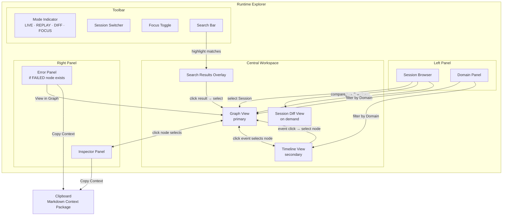
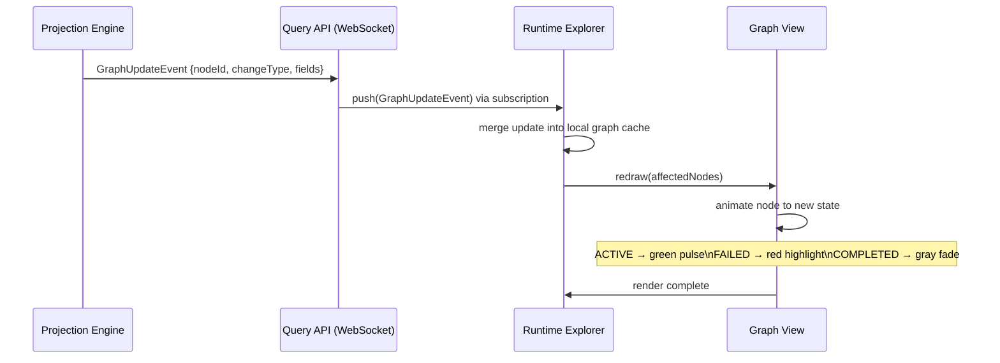
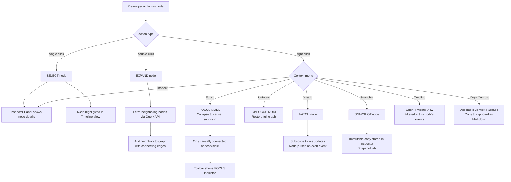
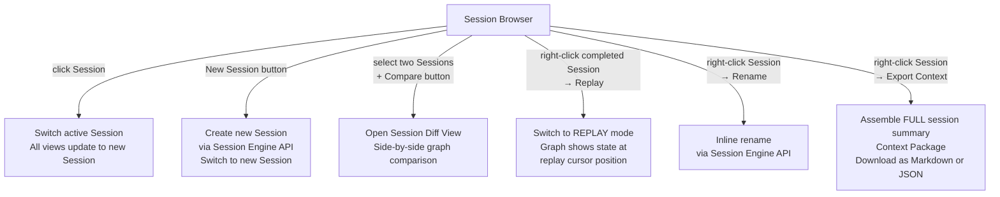
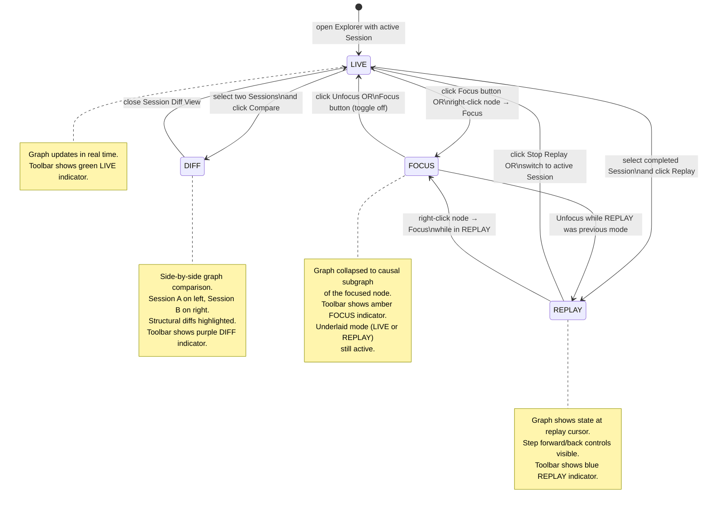
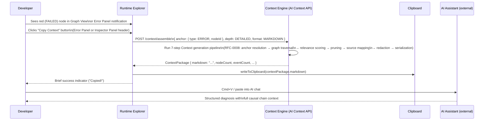

# RFC-0011: Runtime Explorer

| Field      | Value                                                                                                                                                        |
|------------|--------------------------------------------------------------------------------------------------------------------------------------------------------------|
| RFC        | 0011                                                                                                                                                         |
| Status     | Draft                                                                                                                                                        |
| Version    | 0.1                                                                                                                                                          |
| Category   | User Experience                                                                                                                                              |
| Authors    | Founding Team                                                                                                                                                |
| Depends On | RFC-0001 (Glossary), RFC-0003 (ROM), RFC-0005 (Runtime Graph), RFC-0007 (Session Model), RFC-0008 (Context Engine)                                           |

---

## Abstract

The Runtime Explorer is the primary user interface of Observer OS. It is a graph-based runtime navigation interface that gives human developers direct, visual access to the Runtime Graph, Session Timeline, Inspector, and Context packages. It is the interface through which developers navigate a running system, investigate failures, explore causal chains, and copy structured Runtime Intelligence to AI assistants.

The Runtime Explorer is a consumer of Observer's public APIs. It is not a privileged internal component. It reads the Runtime Graph and requests Context Packages through the same Query API and AI Context API that external tools and AI agents use. It maintains only local UI state — selections, filters, layout positions, and focus configuration. All runtime facts it presents originate from those APIs.

The Runtime Explorer is not a log viewer. It is not a terminal. It is not a clone of browser DevTools. Its primary view is the Runtime Graph: a live, navigable, interactive graph of Runtime Nodes and the typed Relationships connecting them. Log lines, raw event streams, and unstructured text are not the primary surface — they are available for inspection of individual nodes but are never the default view.

This document specifies the complete design of the Runtime Explorer: its information architecture, its five primary views, its interaction model, its modes of operation, its error surface, the "Copy Context" workflow that is Observer's core developer value proposition, and the Explorer API contract it exposes to programmatic consumers. It does not specify implementation technology, visual design, or layout dimensions. Those are decisions for the engineering team implementing the Explorer against this RFC.

---

## Motivation

### The Gap Between Runtime Data and Developer Understanding

Observer OS has established a complete pipeline from runtime events to structured Runtime Intelligence: Runtime Events flow into the Event Log, the Projection Engine builds and maintains the Runtime Graph, the Context Engine assembles Context Packages from anchors on that graph. This pipeline produces rich, structured runtime data. But data is not understanding. To close the loop, a human developer must be able to navigate that data, identify what matters, and act on it.

Today, developers use three categories of tools to understand running software:

**Log viewers** (Kibana, Splunk, Datadog logs): chronological text streams. Fast to collect, but require the developer to perform entity resolution (which log line refers to which request?), relationship inference (what caused what?), and correlation (browser error connected to backend failure connected to database timeout) entirely in their head. The developer's cognitive burden is total.

**Distributed tracing UIs** (Jaeger, Zipkin, Tempo): trace and span views. Better than log streams — they show tree structure and timing. But they are scoped to distributed call chains and do not capture DOM events, React component state, database queries outside of APM hooks, or the cross-domain causal chains that Observer OS models explicitly. Traces show the execution path; they do not show the runtime system.

**Browser DevTools**: the strongest existing tool for frontend runtime inspection, but scoped to a single browser tab. Network panel, React DevTools, console, source debugger — each shows one slice of the runtime. The developer manually correlates a network request in the Network panel with a React state update in the DevTools profiler with a server error in the console. No tool joins these views automatically.

Observer OS has already solved the data problem. RFC-0005 defines the Runtime Graph: a unified, cross-domain, typed graph that joins Browser, React, Node.js, PostgreSQL, and every other instrumented Domain into a single structure. RFC-0008 defines the Context Engine: a pipeline that, given a failed node, produces a structured causal chain, source locations, and a Markdown export ready for an AI assistant.

The Runtime Explorer makes this power accessible to humans. It is the UI that proves Observer's data model is comprehensible, navigable, and valuable by a developer sitting at a keyboard.

### Why Graph-First

Every existing developer tool presents runtime data as a tree or a list. Trees are appropriate for hierarchical data (the DOM, the file system, a call stack). Lists are appropriate for ordered sequences (log lines, HTTP requests, database queries). The Runtime Graph is neither: it is a directed, typed, multi-domain graph where a single node may have multiple predecessors and successors, where cross-domain edges (Browser → Node.js, React → Redux, HTTP Request → Database Query) are structural rather than exceptional, and where the most important information is often not in a node's properties but in its position within the causal subgraph.

Presenting a graph as a list forces the developer to mentally reconstruct the relationships that the list has collapsed. Presenting it as a tree forces the developer to choose a root, which hides all the alternative causal paths. Neither representation preserves the information the developer needs.

The Runtime Explorer presents the Runtime Graph as a graph. The developer sees nodes and edges. They navigate by traversal — clicking a node to inspect it, double-clicking to expand its neighbors, right-clicking to focus the view on its causal subgraph. The structure of the runtime is the structure of the interface.

### The Context Copy Workflow as the Core Value Proposition

RFC-0008 established the Context Engine. The Context Engine produces structured, curated Runtime Intelligence. The Runtime Explorer is the interface through which a developer — not an automated agent, not a pipeline, but a human who has just seen an error — requests that Context and puts it to use.

The workflow is:

1. Developer sees a red node in the Runtime Explorer (a failed Runtime Node).
2. Developer clicks "Copy Context."
3. The Context Engine assembles a DETAILED Context Package anchored on that node.
4. The package is copied to the clipboard as Markdown.
5. Developer pastes into an AI assistant (Claude, Copilot, Cursor, any chat interface).
6. The AI has complete, structured, causal-chain context without the developer having assembled anything manually.

This workflow is the primary value of Observer for individual developers. Every UX decision in this RFC is evaluated against whether it makes this workflow faster, more obvious, or more reliable. Views that do not serve this workflow are secondary. Interactions that obscure the failed node or the Copy Context button are incorrect designs regardless of their other merits.

### Explorer as a Peer Consumer

The Runtime Explorer uses the same Observer APIs that external tools use. It does not have privileged access to the Projection Engine, the Event Log, or the Context Engine. It cannot call internal functions that are not exposed through the Query API and AI Context API.

This constraint is a feature, not a limitation. It enforces two guarantees that are architecturally important.

**First**: the Explorer validates the public API. If the public API is sufficient to build the primary user interface of the platform, it is sufficient for any external tool. Gaps in the Explorer's functionality always point to gaps in the API, not to missing internal hooks. This eliminates the class of problems where the official UI is secretly using privileged internal state that third-party developers cannot access.

**Second**: the Explorer's implementation is a live specification of how the API should be used. External tool builders and AI Consumers can read the Explorer's query patterns as reference implementations. The Explorer is documentation that executes.

---

## Goals

1. Define the Runtime Explorer's information architecture: all views, how they connect, and what data each view presents.
2. Specify the five primary views: Graph View, Timeline View, Inspector Panel, Session Browser, and Domain Panel.
3. Define the complete interaction model for the Graph View: click, double-click, right-click operations and their precise behavioral contracts.
4. Specify Focus Mode: definition, activation, deactivation, and the constraint on which nodes remain visible.
5. Specify the four Explorer modes: LIVE, REPLAY, DIFF, and FOCUS.
6. Define the error surface: how FAILED nodes are presented, what the Error Panel shows, and how it connects to the Copy Context workflow.
7. Define the "Copy Context" workflow end-to-end: from developer click to clipboard content.
8. Specify the Session Diff View: what structural and timeline differences are visualized and how.
9. Define the Explorer Query API contract: the TypeScript interface that the Explorer uses to read Runtime Graph data, and that external tools may use identically.
10. Provide five worked examples that demonstrate the Explorer's primary use cases.
11. Define what the Explorer does not specify: implementation technology, visual design, animation, and layout algorithm selection.
12. Document tradeoffs: graph-first vs. timeline-first, privileged vs. peer consumer, rich graph vs. simple list, in-app AI vs. "copy to external AI."

---

## Non-Goals

The Runtime Explorer does not define:

| Excluded Concern                                                      | Where It Is Defined or Deferred                           |
|-----------------------------------------------------------------------|-----------------------------------------------------------|
| Runtime Node and Event schemas                                        | RFC-0003 (ROM), RFC-0004 (REM)                            |
| Runtime Graph traversal algorithms and relationship types             | RFC-0005 (Runtime Graph)                                  |
| How the Runtime Graph is built from events                            | RFC-0006 (Projection Engine)                              |
| Session lifecycle, boundaries, and storage                            | RFC-0007 (Session Model)                                  |
| Context Package schemas and generation pipeline                       | RFC-0008 (Context Engine)                                 |
| The AI Context API used by external AI Consumers                      | RFC-0009 (AI Context API)                                 |
| Graph layout algorithm (force-directed, hierarchical, etc.)           | Explorer implementation team decision                     |
| Implementation technology: Electron, VS Code extension, browser panel | Open question; addressed in Open Questions section        |
| Visual design system, color palette (beyond semantic colors), typography | Product designer's responsibility                       |
| Animation timing, easing, and transition details                      | Explorer implementation team decision                     |
| Specific layout dimensions, breakpoints, or responsive behavior       | Explorer implementation team decision                     |
| Offline mode or persistence of UI state across restarts               | Future: Workspace Persistence RFC                         |
| Multi-user collaboration (shared graph views, presence indicators)    | Future: Collaboration RFC                                 |
| Plugin SDK for extending the Explorer with custom views               | Future: RFC-0012 (Plugin SDK)                             |
| Embedded AI assistant within the Explorer UI                          | Deferred; addressed in Tradeoffs and Open Questions       |
| Authentication and access control                                     | Future: Security RFC                                      |

---

## Design

### Philosophy: What the Explorer Shows

The Runtime Explorer is organized around three tiers of runtime information, presented in order of primacy.

**Primary: the Runtime Graph.** The default and dominant view of the Explorer is the Runtime Graph for the active Session. The developer opens the Explorer and sees nodes and the edges connecting them. Node color communicates Domain and status. Edge labels communicate Relationship type. The graph is live — it updates in real time as new Runtime Events arrive and the Projection Engine updates the graph. This is not a tree with a forced root. It is a graph navigated by traversal.

**Secondary: the Timeline.** When a developer wants to understand the chronological sequence of events — not just the current structural state — they switch to or open the Timeline View. The Timeline shows Runtime Events in the active Session grouped by Domain in swim lanes. It is chronological. It is filterable. Clicking an event in the Timeline selects the corresponding node in the Graph View. The Timeline is a navigation surface for the graph, not a replacement for it.

**On-demand: Context Packages.** When a developer selects a node (especially a failed node), the Inspector Panel shows assembled Context for that node. The developer can request a DETAILED or FULL Context Package with a button click. The assembled Context is copyable to clipboard. Context Packages are not continuously visible — they are assembled and displayed when the developer asks for them, because they are dense structured documents, not live dashboards.

**Never: raw log output as the primary interface.** The Explorer does not present raw log lines as its primary view. Log lines are unstructured text. They require the developer to perform entity resolution, relationship inference, and correlation manually. Observer has already done that work at the API level. The Explorer presents the result of that work — the Runtime Graph — not the raw input to it.

---

## Architecture

### Information Architecture



### Explorer as API Consumer

```
Observer OS Internal                    Runtime Explorer

┌──────────────────────────────────┐   ┌────────────────────────────────────────┐
│  Runtime Events                  │   │  UI State (local only)                 │
│       │                          │   │  - selectedNodeId                      │
│       ▼                          │   │  - focusedNodeId                       │
│  Event Log                       │   │  - graphLayoutPositions                │
│       │                          │   │  - activeSessionId                     │
│       ▼                          │   │  - activeMode (LIVE/REPLAY/DIFF/FOCUS) │
│  Projection Engine               │   │  - timelineFilters                     │
│       │                          │   │  - searchQuery                         │
│       ▼                          │   └───────────────┬────────────────────────┘
│  Runtime Graph ◄─────────────────────────────────────┘
│       │          Query API        │
│       │                          │   ┌────────────────────────────────────────┐
│  Context Engine ◄────────────────────│  Explorer requests:                    │
│       │         AI Context API   │   │  - GET /graph/sessions/:id/nodes       │
│                                  │   │  - SUBSCRIBE /graph/sessions/:id/live  │
│                                  │   │  - POST /context/assemble              │
│                                  │   │  - GET /sessions                       │
│                                  │   │  - GET /timeline/sessions/:id/events   │
└──────────────────────────────────┘   └────────────────────────────────────────┘
```

The Explorer maintains no runtime state of its own. Every node property, every edge, every event, and every context package it displays is fetched from or pushed by the Observer public API. The Explorer's local state is limited to UI concerns: which node is selected, what the layout positions are, which mode is active, what filters are applied. If the Explorer is closed and reopened, it reconstructs its view entirely from the API.

### Live Graph Update Flow



The Explorer subscribes to a live session stream when a Session is active and in LIVE mode. The Projection Engine pushes GraphUpdateEvents through the Query API WebSocket. The Explorer merges these into its local graph cache (an in-memory representation of the nodes and edges it has received) and triggers a re-render of affected nodes. The Explorer does not re-fetch the full graph on each update; it applies incremental patches.

---

## Primary Views

### Graph View (Primary)

The Graph View is the default view of the Runtime Explorer. It renders the Runtime Graph for the active Session as an interactive node-link diagram.

**Node rendering:**
- Nodes are colored by Domain (one consistent color per Domain, configurable in workspace settings).
- Node status overrides Domain color for status-bearing nodes:
  - `ACTIVE`: green fill or green border ring (the implementation may choose which to communicate "in-flight")
  - `FAILED`: red fill, larger default size, slightly elevated visual weight
  - `COMPLETED`: desaturated / gray, reduced visual weight
  - `PENDING`: yellow / amber
- Node shape may vary by node type (e.g., circle for generic nodes, rectangle for HTTP requests, hexagon for database queries) — specific shapes are a visual design decision, not specified in this RFC.
- Watched nodes (see Interaction Model) pulse on each update.

**Edge rendering:**
- Edges are directional (arrows indicating the direction of causality or calling convention).
- Edges are labeled with the Relationship type: `TRIGGERED`, `CALLED`, `RETURNED`, `FAILED`, `UPDATED`, `QUERIED`, etc.
- Label visibility scales with zoom level; at low zoom levels, labels are hidden to reduce clutter.

**Live behavior:**
- In LIVE mode, the graph updates incrementally as GraphUpdateEvents arrive.
- New nodes animate in; status changes animate the node color transition.
- The graph layout re-runs on new nodes (subject to the layout algorithm's stability guarantees, which are an implementation concern).
- An activity indicator (e.g., a small blinking dot in the toolbar) communicates that live events are arriving.

**Viewport:**
- The graph is pannable by drag.
- The graph is zoomable by scroll wheel or pinch gesture.
- "Fit to Screen" button resets the viewport to contain all visible nodes.
- "Center on Selection" button pans to keep the selected node in the center of the viewport.

**Graph View Interaction Model:**



### Timeline View (Secondary)

The Timeline View shows the chronological sequence of Runtime Events within the active Session, organized by Domain in swim lanes.

**Swim lanes:**
- One swim lane per active Domain: Browser, React, Node.js, PostgreSQL, and any other instrumented Domain.
- Lane order is configurable by the developer.
- Each lane shows events as horizontal bars (for events with duration) or points (for instantaneous events) on a shared time axis.

**Event representation:**
- Events are colored by severity: informational (default), warning (amber), error (red).
- Events are labeled with their `eventType` and a shortened description of the node they affect.
- Events with `causedBy` links are connected by faint causal lines across swim lanes (showing cross-domain causality visually).

**Filters:**
- Filter by Domain (hide/show swim lanes).
- Filter by EventType (e.g., show only `HTTP_REQUEST_FAILED` events).
- Filter by severity level.
- Filter by time range (drag to select a range on the time axis).
- Filter by node: show only events that belong to a specific node (set by clicking "Timeline" in the Graph View right-click menu).

**Causal chain visualization:**
- Clicking a "Show Cause Chain" button for an event highlights the complete causal path in the Timeline (all events connected by `causedBy` links, traced back to the root event).
- Highlighted causal paths are visually distinct (bold border or background tint) from non-highlighted events.

**Selection synchronization:**
- Clicking an event in the Timeline selects the corresponding Runtime Node in the Graph View. The Graph View pans to center on that node.
- Selecting a node in the Graph View highlights all events belonging to that node in the Timeline.
- This bidirectional selection synchronization is a first-class behavior, not an enhancement. The Timeline and Graph View are two views of the same selection state.

### Inspector Panel (Right Side)

The Inspector Panel shows the complete detail of the selected Runtime Node. It is the panel the developer reads to understand what a specific node is.

**Header:**
- Node ID (abbreviated display), type, and current status badge.
- Domain indicator.
- Timestamps: created at, last updated at, completed at (if applicable).

**Tabs:**

**Properties tab** — displays all metadata fields of the RuntimeNode (RFC-0003 schema). Fields are presented as a key-value table. Long values (stack traces, large JSON payloads) are collapsible. Sensitive values that were redacted by the Context Engine are shown as `[REDACTED]` with the redaction rule ID.

**Events tab** — chronological list of Runtime Events that reference this node. Each event shows: `eventType`, timestamp, domain, and key delta fields (what changed). Events are sorted newest-first by default. The "Show in Timeline" link opens the Timeline View filtered to this node.

**Relationships tab** — list of edges connecting this node to other nodes in the Runtime Graph. Each row shows: Relationship type, direction (outbound / inbound), target node ID and type, and a "View in Graph" link that selects the target node. This tab is the primary way to navigate outward from a node to its neighbors without expanding the graph.

**Context tab** — assembled Context Package for this node. By default, shows a SURFACE context (assembled automatically when the node is selected if the node is in state `FAILED` or `WARNING`). A "Generate DETAILED Context" button triggers a DETAILED context assembly from the Context Engine. A "Generate FULL Context" button triggers a FULL assembly. Each assembled package is shown inline in Markdown rendering with a "Copy" button.

**"Copy as Context" button (persistent in panel header):**
- Always visible regardless of active tab.
- Clicking assembles a DETAILED Context Package for the selected node via the AI Context API.
- The assembled package is placed on the clipboard in Markdown format.
- A brief success indicator confirms the copy.
- If the node is FAILED, the context is anchored on the error (triggering the ERROR anchor type from RFC-0008, which produces a full causal chain).

### Session Browser (Left Sidebar)

The Session Browser lists all Sessions in the current Workspace, ordered by most-recently-active. It is the developer's primary control for switching the context of the entire Explorer.

**Session list item shows:**
- Session name (auto-generated or developer-named).
- Session status badge: ACTIVE (green dot), COMPLETED (gray), REPLAYING (blue arrow).
- Duration (for completed sessions) or elapsed time (for active sessions).
- Domain count and node count (summary indicators).
- Error count, if any FAILED nodes exist in the session (red badge).

**Active Session** is highlighted. All other views (Graph View, Timeline, Inspector) reflect the active Session.

**Interactions:**



**Session comparison entry point:** A developer checks both checkboxes on two session list items and clicks the "Compare" button that appears. This opens the Session Diff View. The Session Browser remains accessible to change the comparison targets.

### Domain Panel

The Domain Panel is a compact section within the left sidebar (below the Session Browser) showing the Domains currently active in the Workspace.

**Per-Domain display:**
- Domain name and icon.
- Connection status: CONNECTED (green dot), DEGRADED (yellow dot), DISCONNECTED (red dot).
- Event count (total events received in the active Session from this Domain).
- Node count (total Runtime Nodes currently in the graph from this Domain).

**Interactions:**
- Clicking a Domain toggles a Domain filter on the Graph View: only nodes from that Domain are shown. All other nodes are dimmed or hidden (configurable; full hide vs. dim is a UX preference to determine in implementation).
- Multiple Domains may be active in the filter simultaneously; clicking a second Domain adds it to the filter rather than replacing the first selection.
- Clicking "All Domains" (a fixed button at the top of the Domain Panel) clears the Domain filter.
- An orange "DEGRADED" or red "DISCONNECTED" status is also surfaced in the Toolbar as a small Domain health indicator, so it remains visible even when the sidebar is collapsed.

---

## Explorer Modes



**LIVE Mode** is the default mode when an active Session exists. The Explorer subscribes to the live graph stream from the Projection Engine. Updates arrive in real time. The toolbar shows a green "LIVE" indicator. New nodes and edges appear as Runtime Events are processed.

**REPLAY Mode** activates when the developer selects a completed Session and triggers replay. The Explorer does not re-subscribe to the live stream. Instead, it requests the full graph state at a specific event sequence number from the Query API. Step controls (Previous Event, Next Event, Jump to Time, Scrub Timeline) allow the developer to move through the recorded event history. The graph shows exactly the state it was in at the replay cursor position. Replay Mode is read-only: no interactions that require a live Session (WATCH, new Snapshots) are available.

**DIFF Mode** activates when the developer initiates a Session comparison from the Session Browser. The central workspace splits into two panels showing the Runtime Graph for Session A (left) and Session B (right). Structural differences are highlighted: nodes present in B but not A are shown in green; nodes present in A but not B are shown in red; nodes present in both with changed state are shown in yellow. A Timeline Diff panel shows events that occurred in B but did not occur in A (by EventType + node match), and vice versa. DIFF Mode is read-only.

**FOCUS Mode** is an overlay on LIVE or REPLAY mode. It does not change the active Session or the underlying mode; it filters what is visible. When FOCUS Mode is active, only the focused node and its causally connected subgraph are shown. Nodes outside the causal subgraph are removed from the viewport. Focus Mode is additive with LIVE — the visible subgraph still updates in real time if LIVE was the previous mode.

---

## Error Surface

### Failed Node Visibility

FAILED nodes are the most important nodes in the Explorer. They represent observable failures in the running system. They receive elevated visual treatment:

- Larger default render size relative to non-failed nodes.
- Red fill (status color overrides Domain color).
- Elevated visual weight in the graph layout (layout algorithm is encouraged to place FAILED nodes centrally, though the specific heuristic is an implementation decision).
- A small error icon or badge (e.g., a circle with an exclamation mark) visible at all zoom levels.

### Error Panel

When any FAILED node exists in the current Session's Runtime Graph, a non-intrusive Error Panel appears at the bottom of the screen (or in an alternative low-distraction location that does not cover the Graph View). The Error Panel is:

- **Non-blocking**: it does not interrupt developer flow or require dismissal.
- **Dismissible**: a close button removes it for the current Session.
- **Always accessible**: if dismissed, it is accessible via a persistent "Errors" indicator in the toolbar.

**Error Panel content for each FAILED node:**
- Node type and identifier (e.g., "HttpRequest POST /api/orders").
- Error message (truncated to one line; full message visible in Inspector Panel).
- Timestamp.
- Two action buttons: "View in Graph" (selects and centers the node in the Graph View) and "Copy Context" (assembles and copies the DETAILED Context Package anchored on this error).

If multiple FAILED nodes exist, the Error Panel shows a compact list. Clicking any item expands it to show the full action buttons.

### Context Copy Flow

The primary developer workflow in Observer is:



The developer performs exactly two actions: clicks "Copy Context" and pastes into AI. The Context Engine performs the relevance filtering, causal chain reconstruction, source mapping, and redaction. The AI receives structured, complete context without the developer assembling anything.

This is the workflow that the entire Explorer architecture is optimized to enable. The "Copy Context" button must be:
- Reachable in at most two clicks from any state (never buried in menus).
- Visible without any prior navigation (Error Panel surfaces it automatically when FAILED nodes exist).
- Always functional for FAILED nodes (automatic context generation triggers from RFC-0008 mean SURFACE context is already assembled; DETAILED context is generated on-demand in < 200ms for most graphs).

---

## Search

The Search Bar in the toolbar supports both full-text and structured search across all Runtime Nodes in the active Session's Runtime Graph.

**Structured query syntax:**

| Syntax                         | Matches                                                      |
|--------------------------------|--------------------------------------------------------------|
| `type:HttpRequest`             | Nodes with `nodeType` = `HttpRequest`                        |
| `status:FAILED`                | Nodes with `status` = `FAILED`                               |
| `domain:postgresql`            | Nodes from the PostgreSQL Domain                             |
| `url:/api/orders`              | Nodes with a `url` field containing `/api/orders`            |
| `exception:TypeError`          | Nodes with an error field matching `TypeError`               |
| `field:userId value:abc123`    | Nodes with metadata field `userId` containing `abc123`       |
| `type:HttpRequest status:FAILED` | Conjunction: both conditions must match                    |
| `"order placement"`            | Full-text match across all string fields                     |

**Search behavior:**
- Results are shown as a ranked list in a Search Results Overlay (a transient panel that does not replace the Graph View).
- Matching nodes are simultaneously highlighted in the Graph View (non-matching nodes are dimmed, not hidden, so the graph structure remains visible).
- Clicking a search result selects that node (centering it in the Graph View and loading it in the Inspector Panel) and closes the Search Results Overlay.
- The Search Results Overlay can be dismissed with Escape or by clicking outside it.
- Search runs against the Explorer's local graph cache (the nodes already loaded from the API). A "Search All" option triggers a server-side search via the Query API for nodes not yet loaded.

---

## Session Diff View

The Session Diff View activates when a developer selects two Sessions for comparison. It is a distinct workspace layout — a full-width view that replaces the normal Graph + Inspector layout.

**Layout:**
- Left panel: Runtime Graph for Session A (the reference / older Session).
- Right panel: Runtime Graph for Session B (the comparison / newer Session).
- Center divider with a drag handle to resize panels.
- Bottom panel: Timeline Diff (described below).

**Graph diff highlighting:**
- Nodes present in both Sessions with identical state: shown in default colors.
- Nodes present in B but absent in A (new nodes): shown with a green tint in the B panel and marked with a "+" badge.
- Nodes present in A but absent in B (removed nodes): shown with a red tint in the A panel and marked with a "-" badge.
- Nodes present in both but with different state (e.g., different status, changed field values): shown with a yellow tint in both panels.

**Node alignment:** The Explorer matches nodes across Sessions by node identity (nodeId). If the same logical operation (e.g., the same HTTP request path) generated different node IDs across Sessions (which is expected — IDs are unique per event), the developer can explicitly link two nodes by selecting one in A and one in B and clicking "Link." Linked nodes are visually connected across panels and compared field-by-field in a diff panel at the bottom of the Inspector.

**Timeline Diff:**
- Shows the two Session Timelines stacked (A above, B below) on a shared relative time axis (both Sessions start at T=0 for comparison).
- Events with matching EventType + Domain + node-type that occurred in both Sessions are shown in default color.
- Events present in B but not A are highlighted green in the B row.
- Events present in A but not B are highlighted red in the A row.

---

## Configuration Surface

The Explorer exposes configuration for Workspace-scoped settings. Configuration is accessed via a "Settings" button in the Toolbar. It does not interrupt the primary investigation workflow.

**Settings categories:**

**Session settings:** Default session naming convention (auto-generated name format), maximum session duration, auto-close idle sessions.

**Redaction rules:** Define which fields are redacted in Context Packages generated by the Explorer. Applies to the `RedactionConfig` field when the Explorer assembles ContextRequests. Operators who need to adjust global redaction rules do so through the Observer OS administration interface (outside the Explorer's scope).

**Domain configuration:** Which Domains are expected to be active for this Workspace. Domains listed here but not reporting events will show as DISCONNECTED in the Domain Panel (distinguishing "not yet seen" from "actively failing to connect").

**Graph display:** Configurable per-Domain colors (overriding the defaults). Node label verbosity (short / full ID). Edge label visibility at various zoom levels.

**Plugin management:** List of installed Observer OS plugins (each plugin corresponds to a Domain Probe). Enable/disable, version displayed. Link to plugin documentation. Installing new plugins is outside the scope of the Explorer; that is an Observer OS administration function.

**Keyboard shortcuts:** Reference list of all keyboard shortcuts (read-only; customization is a future enhancement).

---

## Accessibility

The Runtime Explorer must meet the following accessibility requirements. These are non-negotiable constraints on the implementation, not enhancements.

**Keyboard navigation:**
- All primary interactions are keyboard-accessible: Tab to navigate between panels, Enter to activate a focused element, Escape to cancel or dismiss overlays.
- Arrow keys navigate within lists (Session Browser, Timeline events, search results, Inspector Panel tabs).
- Dedicated keyboard shortcuts for high-frequency actions (the specific bindings are an implementation decision, but must include at minimum: Copy Context, Focus Mode toggle, New Session, switch to Graph View, switch to Timeline View).
- The right-click context menu on graph nodes is also accessible via a keyboard shortcut (e.g., Shift+F10 or a platform-appropriate equivalent) when a node is selected.

**Screen reader support:**
- Inspector Panel Properties, Events, Relationships, and Context tabs must have appropriate ARIA roles and labels.
- FAILED node status changes must generate an accessible announcement (ARIA live region) so developers using screen readers are notified of errors without needing to poll the graph visually.
- Session Browser list items must have accessible labels that include session name, status, duration, and error count.
- Error Panel items must have accessible labels.

**Graph View accessibility:**
- The graph visualization is inherently visual. Keyboard navigation within the graph (Tab through nodes, Enter to select, arrow keys to navigate to connected nodes) is required.
- An alternative "Node List" mode shows all visible nodes as a flat, screen-readable list with the same selection and inspection capabilities as the graph. This mode is toggled via an accessibility button or keyboard shortcut.
- Node status changes in the graph generate accessible status announcements.

**High contrast mode:**
- A high-contrast display mode is available in settings. In high contrast mode, node status colors use patterns (e.g., hatching) in addition to color, ensuring status is distinguishable without relying solely on color differentiation.
- Edge labels are always shown in high contrast mode regardless of zoom level.

---

## Explorer Query API Contract

The Explorer is a consumer of Observer's Query API. The following TypeScript interfaces define the API surface the Explorer uses. External tools and AI agents may use identical interfaces. There is no Explorer-private API.

```typescript
// ─── Session Operations ────────────────────────────────────────────────────────

interface SessionsListResponse {
  sessions: SessionSummary[];
}

interface SessionSummary {
  sessionId: string;              // e.g. "sess_01j8x4k2m3n4p5q6r7s8t9u0v"
  name: string;
  status: "ACTIVE" | "COMPLETED" | "REPLAYING";
  startedAt: string;              // ISO 8601
  endedAt?: string;               // ISO 8601; absent if ACTIVE
  durationMs?: number;
  domainCount: number;
  nodeCount: number;
  eventCount: number;
  failedNodeCount: number;
}

// GET /sessions
// Returns: SessionsListResponse

// POST /sessions
// Body: { name?: string }
// Returns: { sessionId: string }

// ─── Graph Operations ──────────────────────────────────────────────────────────

interface GraphSnapshotRequest {
  sessionId: string;
  atSequence?: number;            // omit for current state; set for REPLAY mode
  domainFilter?: string[];        // e.g. ["browser", "react"]; omit for all domains
}

interface GraphSnapshotResponse {
  sessionId: string;
  sequence: number;
  nodes: RuntimeNodeSummary[];
  edges: RuntimeEdgeSummary[];
}

interface RuntimeNodeSummary {
  nodeId: string;
  nodeType: string;
  domain: string;
  status: "PENDING" | "ACTIVE" | "COMPLETED" | "FAILED";
  label: string;                  // human-readable short description
  metadata: Record<string, unknown>;
  createdAt: string;
  updatedAt: string;
}

interface RuntimeEdgeSummary {
  edgeId: string;
  sourceNodeId: string;
  targetNodeId: string;
  relationship: string;           // e.g. "TRIGGERED", "CALLED", "FAILED", "QUERIED"
  createdAt: string;
}

// GET /graph/sessions/:sessionId/snapshot?atSequence=&domainFilter=
// Returns: GraphSnapshotResponse

// ─── Node Expansion ────────────────────────────────────────────────────────────

interface NodeNeighborsResponse {
  nodeId: string;
  neighbors: RuntimeNodeSummary[];
  edges: RuntimeEdgeSummary[];
}

// GET /graph/sessions/:sessionId/nodes/:nodeId/neighbors
// Returns: NodeNeighborsResponse
// Used by Graph View EXPAND (double-click) interaction.

// ─── Node Detail ───────────────────────────────────────────────────────────────

interface NodeDetailResponse {
  node: RuntimeNodeDetail;
}

interface RuntimeNodeDetail extends RuntimeNodeSummary {
  events: NodeEventSummary[];
  relationships: NodeRelationshipSummary[];
}

interface NodeEventSummary {
  eventId: string;
  eventType: string;
  occurredAt: string;
  domain: string;
  deltaFields: Record<string, { before: unknown; after: unknown }>;
  causedByEventId?: string;
}

interface NodeRelationshipSummary {
  relationship: string;
  direction: "OUTBOUND" | "INBOUND";
  peerNodeId: string;
  peerNodeType: string;
  peerNodeLabel: string;
}

// GET /graph/sessions/:sessionId/nodes/:nodeId
// Returns: NodeDetailResponse

// ─── Live Subscription ────────────────────────────────────────────────────────

// WebSocket: WS /graph/sessions/:sessionId/live
// Server pushes: GraphUpdateEvent[]

interface GraphUpdateEvent {
  type: "NODE_ADDED" | "NODE_UPDATED" | "NODE_REMOVED" | "EDGE_ADDED" | "EDGE_REMOVED";
  sequence: number;
  occurredAt: string;
  payload: RuntimeNodeSummary | RuntimeEdgeSummary;
}

// ─── Timeline Operations ───────────────────────────────────────────────────────

interface TimelineRequest {
  sessionId: string;
  domainFilter?: string[];
  eventTypeFilter?: string[];
  severityFilter?: ("INFO" | "WARNING" | "ERROR")[];
  nodeIdFilter?: string;
  fromTime?: string;              // ISO 8601
  toTime?: string;                // ISO 8601
  limit?: number;                 // default 500
  cursor?: string;                // pagination
}

interface TimelineResponse {
  events: TimelineEvent[];
  nextCursor?: string;
}

interface TimelineEvent {
  eventId: string;
  eventType: string;
  domain: string;
  severity: "INFO" | "WARNING" | "ERROR";
  occurredAt: string;
  durationMs?: number;
  nodeId: string;
  nodeType: string;
  nodeLabel: string;
  causedByEventId?: string;
  summary: string;                // one-line human-readable summary
}

// GET /timeline/sessions/:sessionId/events (with query params from TimelineRequest)
// Returns: TimelineResponse

// ─── Search ───────────────────────────────────────────────────────────────────

interface SearchRequest {
  sessionId: string;
  query: string;                  // structured or full-text query string
  limit?: number;                 // default 50
}

interface SearchResponse {
  results: SearchResult[];
  totalCount: number;
}

interface SearchResult {
  nodeId: string;
  nodeType: string;
  domain: string;
  status: string;
  label: string;
  matchedFields: string[];        // which fields matched the query
  relevanceScore: number;         // 0.0–1.0
}

// POST /search/nodes
// Body: SearchRequest
// Returns: SearchResponse

// ─── Context Assembly (via AI Context API) ────────────────────────────────────

// The Explorer uses the AI Context API (RFC-0009) for context assembly.
// These types mirror the ContextRequest schema defined in RFC-0008.

interface ExplorerContextRequest {
  sessionId: string;
  anchor: {
    type: "ERROR" | "NODE" | "TIME_RANGE";
    nodeId?: string;
    fromTime?: string;
    toTime?: string;
  };
  depth: "SURFACE" | "DETAILED" | "FULL";
  format: "MARKDOWN" | "JSON";
}

// POST /context/assemble
// Body: ExplorerContextRequest
// Returns: ContextPackage (RFC-0008 schema)
// Used by "Copy Context" button in Inspector Panel and Error Panel.

// ─── Session Diff ─────────────────────────────────────────────────────────────

interface SessionDiffRequest {
  sessionIdA: string;
  sessionIdB: string;
}

interface SessionDiffResponse {
  addedNodes: RuntimeNodeSummary[];   // in B, not in A
  removedNodes: RuntimeNodeSummary[]; // in A, not in B
  changedNodes: NodeDiff[];
  addedEdges: RuntimeEdgeSummary[];
  removedEdges: RuntimeEdgeSummary[];
}

interface NodeDiff {
  nodeId: string;                 // matched by nodeId across sessions
  nodeType: string;
  changedFields: Record<string, { inA: unknown; inB: unknown }>;
  statusChanged: boolean;
  statusInA: string;
  statusInB: string;
}

// POST /graph/diff
// Body: SessionDiffRequest
// Returns: SessionDiffResponse
```

---

## Examples

### Example 1: Developer Debugs a Failed Network Request

**Scenario:** A developer is working on an e-commerce checkout flow. They submit an order and notice the UI shows a generic error message. They open the Runtime Explorer.

**Step 1 — Error surface:** The Error Panel at the bottom of the Explorer shows: `HttpRequest FAILED: POST /api/orders — 500 Internal Server Error — 14:31:22`. Two buttons are visible: "View in Graph" and "Copy Context."

**Step 2 — View in Graph:** The developer clicks "View in Graph." The Graph View centers on the FAILED HttpRequest node (red, visually prominent). The developer can immediately see the causal chain in the graph: `UserCheckoutForm (React)` → `TRIGGERED` → `HttpRequest POST /api/orders` → `CALLED` → `OrderController.createOrder (Node.js)` → `QUERIED` → `orders.insert (PostgreSQL)`. The path from user action to database failure is visible as a sequence of edges in the graph.

**Step 3 — Inspect:** The developer clicks the `orders.insert` node. The Inspector Panel shows the Properties tab: SQL query text, execution time (87ms), error message ("duplicate key value violates unique constraint 'orders_idempotency_key_idx'"), and the PostgreSQL error code `23505`.

**Step 4 — Copy Context:** The developer clicks "Copy Context" in the Inspector Panel header. The Context Engine assembles a DETAILED Context Package anchored on the `orders.insert` node with ERROR anchor type. The causal chain (4 nodes), source locations (`OrderRepository.ts:88`, `OrderController.ts:41`, `UserCheckoutForm.tsx:112`), and the full error are included. The package is copied to the clipboard as Markdown.

**Step 5 — AI assistance:** The developer pastes into Claude. Claude receives: the error type, the constraint name, the source locations, the causal chain showing which component initiated the request, and the full SQL statement. Claude identifies that the idempotency key is generated client-side and the client is retrying on network timeout without changing the key. The developer has a diagnosis in under 60 seconds of using the Explorer, without reading a single log file.

---

### Example 2: Developer Uses Focus Mode for a React Re-render Cascade

**Scenario:** A developer is investigating why a sidebar component re-renders 14 times when the user switches tabs. The Runtime Graph for the Session has 240 nodes across Browser, React, Redux, and Node.js Domains.

**Step 1 — Identify the problem node:** The developer searches `type:ReactComponent label:Sidebar` in the Search Bar. One node is returned and highlighted in the Graph View.

**Step 2 — Activate Focus Mode:** The developer right-clicks the Sidebar node → "Focus." The graph collapses from 240 nodes to 19 nodes: the Sidebar component, its direct parents, its Redux selectors, the Redux store slices it reads from, and the action that triggered the first re-render. The 221 unrelated nodes are removed from the viewport.

**Step 3 — Trace the re-render chain:** In the focused graph, the developer sees the `UPDATED` edges: `TabSwitchAction` → `navigationSlice (Redux)` → `layoutReducer` → `ThemeContext` → `Sidebar`. The Sidebar subscribes to `ThemeContext`, which is updated by `layoutReducer` on every tab switch even when the theme has not changed. The 14 re-renders correspond to 14 sub-events within the layout reducer update.

**Step 4 — Inspect the ThemeContext node:** The developer clicks `ThemeContext`. The Inspector Panel shows the Events tab: 14 `CONTEXT_VALUE_CHANGED` events, each with `deltaFields` showing the `currentTheme` field changing from `"light"` to `"light"` — no actual change. The reducer is triggering a context update with an equivalent object rather than the same reference.

**Step 5 — Copy Context and diagnose:** The developer clicks "Copy Context" on the `ThemeContext` node. The assembled Context Package includes the selector chain, the source location of the layoutReducer (`layoutReducer.ts:34`), and the 14 event deltas showing the spurious updates. Pasting into an AI assistant confirms the diagnosis: the reducer is creating a new object on every dispatch rather than returning the same reference when the theme is unchanged. The fix is a referential equality check.

Total time in Explorer: 4 minutes. No log files opened.

---

### Example 3: Developer Replays a Completed Session to Reproduce a Bug

**Scenario:** A QA engineer filed a bug report: "Order confirmation page shows wrong item count." The developer who built the feature cannot reproduce it locally. A session was recorded by the QA engineer's Observer-instrumented browser.

**Step 1 — Open the session:** The developer opens the Runtime Explorer. In the Session Browser, they find the QA engineer's session: "QA Session 2026-06-28 / order-flow-test" (COMPLETED, 8 minutes, 3 FAILED nodes). They click it to load it.

**Step 2 — Switch to Replay Mode:** The developer right-clicks the session → "Replay." The Explorer switches to REPLAY mode (blue indicator in toolbar). The graph shows the state of the runtime at T=0 (session start). Step controls appear in the toolbar.

**Step 3 — Navigate to the order confirmation event:** The developer opens the Timeline View. They filter by `domain:react` and `label:OrderConfirmation`. They see the `OrderConfirmationPage` component mount event at T=4:12. They click the step-to-event button. The graph advances to that point. The `OrderConfirmationPage` React node is now visible.

**Step 4 — Inspect the node's state at that moment:** The developer selects the `OrderConfirmationPage` node. The Inspector Panel shows Properties: `itemCount: 1`, `orderId: "ord_8821"`. But the Timeline shows that immediately before the mount, a `cart.items` Redux state had `items: [item1, item2, item3]` (3 items). The developer can now see the bug: the `OrderConfirmationPage` is reading `cart.items.length` from a different Redux slice path than the one the cart populated.

**Step 5 — Copy Context for the bug report:** The developer clicks "Copy Context" on the `OrderConfirmationPage` node. They paste the Context Package into the GitHub issue. The issue now includes the causal chain, the state delta, and the source location — the full reproduction context embedded in the issue without manual description.

---

### Example 4: Developer Compares Two Sessions to Find a Regression

**Scenario:** A performance regression was reported in CI: the product listing page load time increased from 340ms to 890ms between commits `a1b2c3` and `d4e5f6`. The developer has two Observer sessions: one recorded against the `a1b2c3` build and one against `d4e5f6`.

**Step 1 — Initiate comparison:** In the Session Browser, the developer checks both sessions and clicks "Compare." The Explorer switches to DIFF Mode. The left panel shows the `a1b2c3` Session graph; the right shows `d4e5f6`.

**Step 2 — Observe structural diff:** The Session Diff View highlights three yellow nodes in the right panel (`d4e5f6`): `ProductRepository.findByCategory`, `CategoryCache`, and `RedisClient.get`. These nodes exist in both sessions but have changed state. A new red node appears in the right panel: `CategoryCache` has status `FAILED` in `d4e5f6` (cache miss) but `COMPLETED` in `a1b2c3`.

**Step 3 — Timeline diff:** The Timeline Diff panel shows two events in `d4e5f6` that did not occur in `a1b2c3`: `CACHE_MISS` for `CategoryCache` and `DB_QUERY_STARTED` for a `products.findByCategory` query that takes 620ms. In `a1b2c3`, neither event occurred — the cache hit returned immediately.

**Step 4 — Root cause identified:** The developer selects the `CategoryCache` node in the `d4e5f6` panel. The Inspector shows the Properties tab: `ttlSeconds: 0`. The cache TTL was set to 0 (immediate expiry) in `d4e5f6`. The developer searches the diff between commits and finds that a config file change accidentally set `CATEGORY_CACHE_TTL=0`. The 890ms load time is the cold-database path with cache disabled. The regression is found in 6 minutes without running either build locally.

---

### Example 5: AI Agent Uses the Explorer API Programmatically

**Scenario:** An automated CI agent integrated with Observer OS checks each pull request for performance regressions. It does not use the visual Explorer UI — it calls the Explorer Query API directly, using the same interfaces the UI uses.

**Agent workflow:**

```typescript
// 1. Find the two sessions corresponding to base branch and PR branch
const sessions = await fetch('/sessions').then(r => r.json() as SessionsListResponse);
const baseSession = sessions.sessions.find(s => s.name === `ci-base-${prNumber}`);
const prSession   = sessions.sessions.find(s => s.name === `ci-pr-${prNumber}`);

// 2. Request a Session Diff
const diff = await fetch('/graph/diff', {
  method: 'POST',
  body: JSON.stringify({ sessionIdA: baseSession.sessionId, sessionIdB: prSession.sessionId })
}).then(r => r.json() as SessionDiffResponse);

// 3. Check for newly failed nodes
const newFailures = diff.addedNodes.filter(n => n.status === 'FAILED');

// 4. For each new failure, assemble a SURFACE Context Package
for (const failedNode of newFailures) {
  const context = await fetch('/context/assemble', {
    method: 'POST',
    body: JSON.stringify({
      sessionId: prSession.sessionId,
      anchor: { type: 'ERROR', nodeId: failedNode.nodeId },
      depth: 'SURFACE',
      format: 'MARKDOWN'
    })
  }).then(r => r.json());

  // 5. Post the assembled context as a PR comment
  await postPRComment(prNumber, context.markdown);
}
```

The agent uses exactly the same API surface as the Runtime Explorer UI. There are no special agent endpoints or privileged hooks. The Agent reads the Runtime Graph via the Query API, requests Context Packages via the AI Context API, and posts the Markdown output to the PR. The developer receives structured runtime intelligence on the PR without opening the Explorer.

---

## Tradeoffs

### Graph-First vs. Timeline-First as the Primary View

The central tradeoff in the Explorer's visual design is whether the primary view is the graph (spatial, structural, relationship-oriented) or the timeline (temporal, sequential, event-oriented).

**Timeline-first** mirrors existing tools: log viewers, distributed tracing UIs, and browser DevTools Network panels all lead with chronological sequence. Developers are trained on chronological reading. A timeline is easy to scan. Events in a timeline can be linked to their cause.

**Graph-first** is less familiar but more accurate to the data model. The Runtime Graph is not a sequence; it is a structure. The most important fact about a failed network request is not when it failed but what caused it to fail. Cause is encoded in graph edges, not in event timestamps. A graph makes causal relationships directly visible; a timeline hides them behind timestamps and requires the developer to infer causality from proximity.

**Decision**: graph-first. The Explorer's primary view is the graph. The Timeline is a secondary view, accessible with one click, and synchronized with the graph (clicking a Timeline event selects the corresponding graph node). The Timeline is essential for temporal reasoning; it is not the primary surface for causal reasoning. The Explorer's value proposition is causal navigation — understanding not just when things happened, but why they happened — and the graph is the right representation for that task.

**Acknowledged cost**: developers unfamiliar with graph navigation have a learning curve. The Explorer must include onboarding affordances (e.g., a first-run tour, a "what is this graph?" tooltip) to reduce this friction. The learning curve is an acceptable cost for the structural correctness of the representation.

### Explorer as Peer Consumer vs. Privileged Internal Consumer

The Explorer could be implemented as an internal component of Observer OS with direct access to the Projection Engine, Event Log, and Context Engine internals. This would make the Explorer faster (no API serialization overhead), simpler to implement (no API layer between component and data), and easier to extend (internal APIs can be changed freely).

**Decision**: peer consumer, same public API as external tools. The Explorer is implemented as a consumer of the same Query API and AI Context API available to all external consumers.

**Rationale:**

The "same API" constraint ensures that the Explorer is a proof of concept for external developers. If the Explorer's primary workflow requires an API call that does not exist, that API call gets added — for everyone. If the Explorer discovers that the Query API is too slow for a use case, that performance problem gets fixed — for everyone. If the Explorer's implementation diverges from the public API surface, it signals that the public API is insufficient. All of these are features, not bugs.

The serialization overhead is real (a local function call is faster than an HTTP or WebSocket round-trip) but acceptable for the Explorer's workload. The Explorer does not require sub-millisecond API responses; it requires < 200ms for node detail requests and real-time live graph updates via WebSocket subscription. Both are achievable over local or network transport.

### Rich Interactive Graph vs. Simple List

A force-directed graph with pan, zoom, expand, focus, and live updates is significantly more complex to implement than a flat list of nodes. Graph layout algorithms are non-trivial. Large graphs (100+ nodes) have performance implications. Graph navigation has a learning curve.

A flat list (sorted by status, then domain, then type) would be trivially implementable, familiar to developers, and performant at any node count.

**Decision**: graph. The Runtime Graph is a graph. Displaying it as a list collapses its most important information — the relationships. A list of 100 nodes with no structural connection provides less value than a graph of 20 nodes with edges that show which nodes are causally connected. The Explorer's value comes from the graph representation, not from the node inventory.

**Mitigation for complexity**: Focus Mode dramatically reduces the visible node count for investigation workflows (the developer investigating a specific bug rarely needs to see all 240 nodes simultaneously). Search highlighting filters the view without leaving the graph. The "Node List" accessibility mode provides a list representation for developers who need it, without making the list the primary view.

### In-App AI Integration vs. "Copy to External AI"

The Explorer could embed an AI assistant panel directly: a chat interface where the developer types a question and the Observer AI (backed by Claude or another model) answers it using the live Runtime Graph as context.

**"Copy to external AI"** is simpler to implement: the Explorer assembles a Context Package, puts it on the clipboard, and the developer pastes it into any AI assistant they use. No model integration required. No API keys in the Explorer. No per-query costs charged through Observer.

**Decision**: "Copy to external AI" for v0.1. In-app AI is deferred. The "copy" workflow is the correct MVP because:

1. It delivers the core value (structured context for AI) without the Explorer needing to know which AI model to use, how to authenticate to it, how to handle token limits, or how to present AI responses.
2. It works with any AI assistant the developer already uses: Claude, GitHub Copilot Chat, Cursor, any chat interface.
3. It keeps Observer's role clear: Observer produces structured Runtime Intelligence; AI reasoning is the consumer's concern.
4. It ships faster.

In-app AI is a natural evolution (see Future Work). The "copy" workflow and the in-app AI workflow share the same underlying mechanism: both call `POST /context/assemble`. Moving from "copy to clipboard" to "send to embedded model" is a UI change, not an architecture change.

### Desktop App vs. VS Code Panel vs. Browser DevTools Panel

The Explorer's implementation target is unresolved (see Open Questions). Each has different constraints:

**Standalone Electron app:** Maximum control over UI, no host environment constraints. Best for complex graph rendering. Requires separate install and a separate window. Cannot be docked alongside the code editor.

**VS Code extension / panel:** Integrated into the developer's primary editor. The Context Package workflow is optimized: the developer can open the Explorer in a side panel and paste context into a Copilot Chat window without leaving VS Code. Constrained by VS Code's extension panel capabilities (webview APIs, performance of webview-hosted graph libraries).

**Browser DevTools panel:** Available immediately without install for web developers. Collocated with the browser's own network and console panels. Constrained to the browser context; cannot easily show Node.js or database domains without a relay mechanism.

**All three:** The Explorer API contract specified in this RFC is implementation-neutral. Building thin clients for VS Code, browser DevTools, and a standalone app that all call the same Observer Query API is architecturally feasible. Whether the team has capacity to build and maintain three clients is a resourcing question outside the scope of this RFC.

---

## Future Work

| Item                            | Target RFC / Phase | Description                                                                                                                                                   |
|---------------------------------|--------------------|---------------------------------------------------------------------------------------------------------------------------------------------------------------|
| In-App AI Assistant             | Phase 2            | Embedded chat panel that receives assembled Context Packages directly (no clipboard). Developer types question in Explorer; Observer assembles context and sends to AI model; response displayed inline. Requires model integration and API key management. |
| IDE Source Integration          | Future: Plugin SDK | Clicking a source location in the Inspector Panel opens the file and line in the developer's editor. Requires IDE plugin protocol (Language Server Protocol extension or editor-specific protocol). |
| Graph Layout Selection          | Near-term (v0.2)   | Allow developers to switch between available graph layout algorithms (force-directed, hierarchical/Dagre, radial) via a toolbar control. Different layouts suit different graph structures. |
| Graph State Persistence         | Workspace RFC      | Persist graph layout positions, active Session, and focus state across Explorer restarts. Currently all UI state is reconstructed from the API on open.          |
| Shared Sessions / Collaboration | Collaboration RFC  | Multiple developers observe the same live Session simultaneously. Presence indicators show where each developer is looking in the graph. Requires conflict-free shared selection state. |
| Context Export                  | Collaboration RFC  | Export Context Packages as standalone files (`.observer.md`, `.observer.json`) for inclusion in GitHub issues, incident reports, and runbooks.                  |
| Natural Language Search         | Intelligence RFC   | Allow search queries in natural language: "show me all failed requests that touched the orders table." Requires integration with a language model for query parsing. |
| Annotation                      | Phase 2            | Allow developers to annotate nodes and edges within a Session with freeform notes. Annotations are stored by the Session Engine and included in exported Context Packages. |
| Replay Speed Control            | Near-term (v0.2)   | Replay at 2×, 5×, or 10× speed. Useful for long sessions where the developer wants to fast-forward to an event of interest.                                    |
| Context Diff                    | Collaboration RFC  | Compare two Context Packages for the same anchor across two Sessions: "how is this error different from last Thursday's version?" Requires structural diff of ContextPackage schema. |
| Plugin View Extensions          | Plugin SDK RFC     | Allow Domain Probe plugins to contribute custom Inspector Panel tabs for their Domain's node types. E.g., the PostgreSQL plugin contributes a "Query Plan" tab that renders `EXPLAIN ANALYZE` output graphically. |
| Mobile / Responsive Layout      | Phase 3            | Explorer layout adapted for tablet or narrow-viewport environments. Lower priority than desktop; most debugging work occurs at a full keyboard. |

---

## Open Questions

| # | Question                                                                                                                                                                                                                      | Impact                                                                         | Status |
|---|-------------------------------------------------------------------------------------------------------------------------------------------------------------------------------------------------------------------------------|--------------------------------------------------------------------------------|--------|
| 1 | **Primary implementation target**: should the first shipped Explorer be a standalone Electron application, a VS Code extension, a browser DevTools panel, or a web application served by the Observer OS process? Each choice has different build constraints, distribution mechanisms, and user workflow integrations. | Entire implementation plan; resource allocation for UI platform-specific work | Open   |
| 2 | **Embedded AI assistant**: should v0.1 include an embedded AI chat panel (sending Context Packages directly to a configured model), or exclusively the "copy to clipboard" workflow? The copy workflow is simpler and model-agnostic; the embedded assistant is more fluid but requires model integration decisions. | User experience of the primary workflow; time to ship v0.1 | Open   |
| 3 | **Graph layout algorithm for large graphs**: what layout algorithm should the Explorer use for sessions with 100+ nodes? Force-directed layouts (e.g., d3-force) are familiar and handle arbitrary graphs but have stability and performance issues at scale. Hierarchical layouts (e.g., Dagre) are more readable for DAG-shaped causal graphs but assume a directed structure. How should the Explorer handle graphs that are neither DAGs nor small? | Developer experience with complex sessions; implementation complexity and performance | Open |
| 4 | **Focus Mode persistence across Session switches**: if a developer activates Focus Mode while investigating a node in Session A, then switches to Session B, should Focus Mode deactivate automatically, or should it attempt to find the same node in Session B and focus on it? The former is predictable; the latter is useful for cross-session comparison of the same component. | Interaction model consistency; cross-session investigation workflow | Open |
| 5 | **Graph layout persistence**: should node positions in the graph layout be persisted per Session, so that the developer returns to the same layout they left? This improves continuity but requires storage and may conflict with the live layout updates as new nodes arrive. | Developer continuity across Explorer sessions; storage requirements | Open |
| 6 | **Session naming**: should Sessions be named automatically (e.g., "Session 2026-06-28 14:10 / browser+react+node") or require developer input at creation? Auto-naming reduces friction but may produce sessions that are hard to distinguish in the Session Browser. Developer-named sessions are more meaningful but add a step to session creation. | Session Browser usability; new session friction | Open |
| 7 | **Error Panel location**: the RFC specifies the Error Panel at the bottom of the screen. For sessions with many FAILED nodes, this panel may become noisy. Alternative: a dedicated "Errors" sidebar tab that shows all FAILED nodes in a list without occupying screen real estate permanently. Which is the correct default? | Error surface prominence vs. screen real estate; developer attention management | Open |
| 8 | **Graph node limit for live sessions**: very active sessions may produce hundreds or thousands of nodes in minutes. Should the Explorer automatically apply a recency filter (show only nodes created in the last N minutes) in LIVE mode to prevent graph overload, or show all nodes and rely on Focus Mode and Domain filters? | Performance and usability with high-event-rate sessions | Open |

---

## References

- RFC-0000: The Observer Philosophy
- RFC-0001: Observer OS Glossary — The Language of Runtime Intelligence
- RFC-0002: Observer OS — Vision and Product Philosophy
- RFC-0003: Runtime Object Model (ROM)
- RFC-0004: Runtime Event Model (REM)
- RFC-0005: Runtime Graph Model (RGM)
- RFC-0006: Projection Engine
- RFC-0007: Session Model
- RFC-0008: Context Engine
- RFC-0009: AI Context API (forthcoming)
- RFC-0012: Plugin SDK (forthcoming)
- [Force-Directed Graph Layout](https://d3js.org/d3-force) — D3 force simulation; the most common graph layout used in web-based graph visualizations; reference for implementation teams evaluating layout algorithms.
- [Dagre Graph Layout](https://github.com/dagrejs/dagre) — hierarchical directed graph layout for JavaScript; appropriate for DAG-shaped Runtime Graphs with clear causality direction.
- [WAI-ARIA Authoring Practices](https://www.w3.org/WAI/ARIA/apg/) — W3C guide for accessible interactive widget patterns; the baseline for the Explorer's keyboard navigation and screen reader support specifications.
- [Jaeger Tracing UI](https://www.jaegertracing.io/) — existing distributed tracing UI; referenced as a prior art comparison for the timeline view design, and as a contrast to the graph-first approach adopted by this RFC.
- [React DevTools](https://react.dev/learn/react-developer-tools) — existing Domain-specific inspector for React component trees; referenced as the state-of-the-art single-Domain inspector that the Runtime Explorer extends to multiple Domains with a unified graph model.
- [The Humane Interface](https://www.goodreads.com/book/show/344726.The_Humane_Interface) — Jef Raskin, 2000; cited for the principle that interface complexity must be proportional to the complexity of the task, not the complexity of the underlying data model — the motivation for Focus Mode and the three-tier information architecture.
