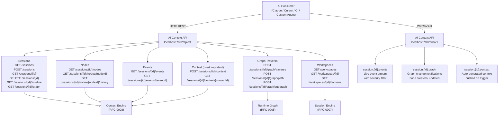
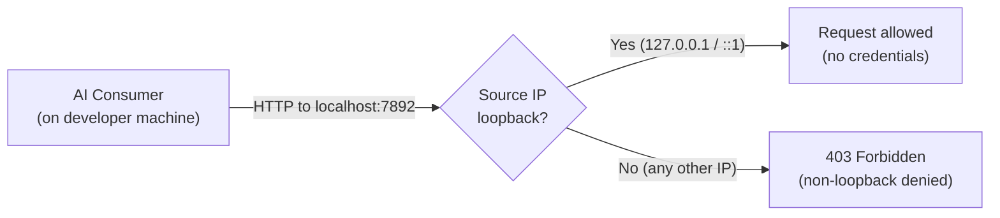
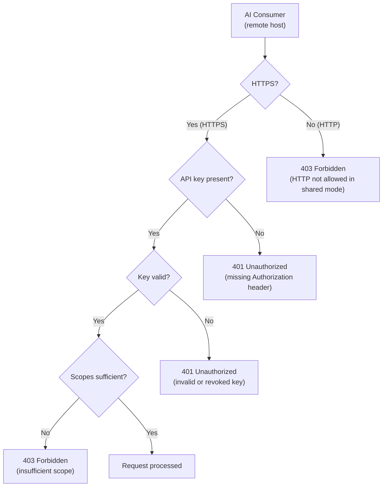
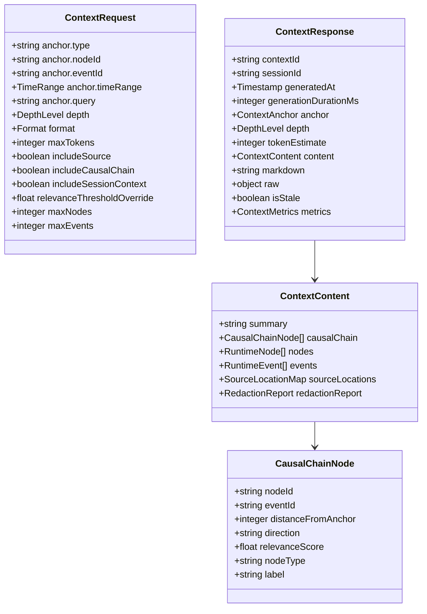
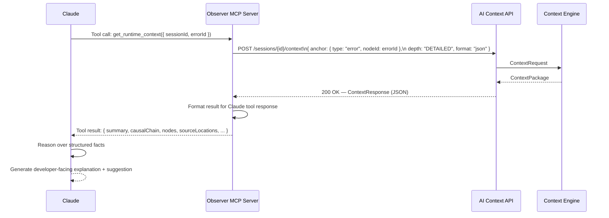
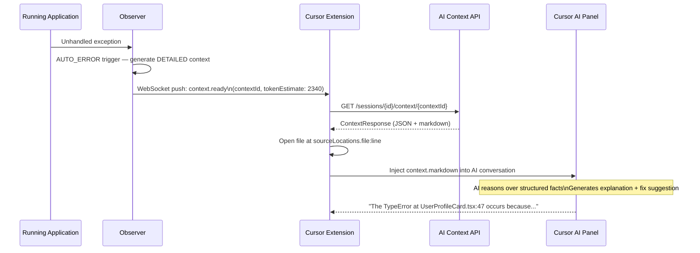

# RFC-0012: AI Context API — External Interface for Runtime Intelligence

| Field      | Value                                                                                                                                          |
|------------|------------------------------------------------------------------------------------------------------------------------------------------------|
| RFC        | 0012                                                                                                                                           |
| Status     | Draft                                                                                                                                          |
| Version    | 0.1                                                                                                                                            |
| Category   | External API                                                                                                                                   |
| Authors    | Founding Team                                                                                                                                  |
| Depends On | RFC-0001 (Glossary), RFC-0006 (Projection Engine), RFC-0007 (Session Model), RFC-0008 (Context Engine)                                         |

---

## Abstract

The AI Context API is Observer's external-facing interface. It is the surface through which AI assistants, IDE extensions, CI/CD pipelines, MCP servers, and any other automated tool access Runtime Intelligence. It wraps the Context Engine (RFC-0008) and the Runtime Graph (RFC-0005) behind a stable, versioned, AI-optimized protocol: REST for request/response operations, WebSocket for live event subscriptions.

This API is not built for any specific AI model. Claude, Cursor, GitHub Copilot, a custom Python agent, or a CI/CD step that posts to a GitHub issue — any system that can call an HTTP endpoint or consume a WebSocket stream is an AI Consumer of the AI Context API. Observer is AI-agnostic by design.

The API has one job: expose structured Runtime Intelligence. AI Consumers do the reasoning. The AI Context API never includes AI-generated content in its responses. Every field in every response body is a structured fact derived from the Runtime Graph or the Event Log. Interpretation, suggestions, and natural language explanations are the AI Consumer's responsibility.

This document specifies the complete design of the AI Context API: its design philosophy, authentication model, endpoint catalog, request and response schemas, WebSocket protocol, error model, versioning strategy, rate limiting rules, security boundaries, integration patterns for Claude/MCP, Cursor, GitHub Actions, and custom agents, and the SDK libraries that wrap the HTTP surface for common languages.

---

## Motivation

### The Integration Problem

Observer OS generates Runtime Intelligence — structured, curated, relevance-ranked packages of runtime facts. That intelligence has no value if it stays inside Observer. Its purpose is to reach AI Consumers: the assistants, tools, and agents that reason over it to help developers faster.

Today, there is no standard protocol for "give me structured runtime context for the error that just happened." Existing integrations are ad hoc:

- AI coding assistants copy-paste stack traces from browser consoles — unstructured, stripped of causal relationships, missing cross-domain context.
- CI/CD pipelines attach raw log files to pull request comments — 10,000 lines of text where 5 lines are relevant.
- Developers manually describe runtime state to AI chat interfaces — imprecise, lossy, time-consuming, and only as good as the developer's memory of what happened.

The AI Context API defines the standard. It is the protocol that any AI Consumer can implement against, with a stable contract that does not require knowing Observer's internal architecture.

### Why a Dedicated External API

Observer's internal subsystems communicate over well-defined internal contracts. The AI Context API is not simply those internal contracts exposed verbatim. It is a purpose-designed external surface with different priorities than the internal architecture:

**Stability over flexibility.** Internal APIs change as implementation evolves. External APIs are versioned contracts that cannot break AI Consumer integrations without a major version increment.

**AI-optimized responses over internal efficiency.** Internal responses are designed for subsystem throughput. External responses include `tokenEstimate` fields, pre-formatted `markdown` fields, `relevanceScore` on each node, and `sequenceNumber` for efficient incremental polling — features that AI Consumers need and internal subsystems do not.

**Safety over power.** External AI Consumers receive read-only access by default. Session creation, workspace configuration, and raw Event Log access require explicit scope grants. Redaction is applied before any data leaves Observer.

**Local-first over cloud-first.** Observer runs on the developer's machine. The AI Context API is localhost by default. No cloud account required. No data leaves the developer's machine unless the developer explicitly opts into remote access.

### The Boundary This API Enforces

The AI Context API enforces Observer's foundational boundary: **Observer produces structured facts; AI Consumers do the reasoning.**

No response from the AI Context API includes:
- Natural language explanations authored by a language model
- Suggestions, recommendations, or "what you should do" content
- Probabilities, predictions, or anomaly scores derived from ML models
- Any content that is not a direct, structured representation of a Runtime Graph fact

AI Consumers that integrate against this API receive a complete, structured picture of what happened at runtime. They apply their own reasoning to that picture.

---

## Goals

1. Define the complete external REST API surface for querying the Runtime Graph, requesting Context Packages, and managing Sessions.
2. Define the WebSocket subscription protocol for live event streams and real-time graph change notifications.
3. Specify AI-optimized response fields (`tokenEstimate`, `relevanceScore`, `markdownContent`, `sequenceNumber`) and their semantics.
4. Define the authentication model: local mode (no credentials) and shared mode (API key, opt-in).
5. Specify rate limiting rules, including differentiated limits for the Context endpoint.
6. Define the error model: HTTP status codes, typed error codes, and error response schema.
7. Specify the API versioning strategy and deprecation policy.
8. Document integration patterns for Claude/MCP, Cursor, GitHub Actions, and custom AI agents.
9. Define the planned SDK library surface for TypeScript/JavaScript, Python, and Go.
10. Specify security boundaries: scope model, redaction guarantees, session isolation, and remote access controls.

---

## Non-Goals

The AI Context API does not define:

| Excluded Concern                                                    | Where It Is Defined                            |
|---------------------------------------------------------------------|------------------------------------------------|
| Context Package assembly and relevance scoring                      | RFC-0008 (Context Engine)                      |
| Runtime Graph structure, traversal, and relationship types          | RFC-0005 (Runtime Graph)                       |
| Session lifecycle, storage, and replay                              | RFC-0007 (Session Model)                       |
| Runtime Event schema and immutability rules                         | RFC-0004 (REM)                                 |
| Runtime Node schema and type taxonomy                               | RFC-0003 (ROM)                                 |
| Plugin instrumentation and Domain probe protocol                    | RFC-0011 (Plugin SDK)                          |
| Visual rendering of Runtime Intelligence                            | RFC-0010 (Runtime Explorer)                    |
| How AI Consumers reason over Context Packages                       | The AI Consumer's responsibility               |
| Model selection, token cost optimization, or prompt engineering     | The AI Consumer's responsibility               |
| Persistent storage format for Context Packages at scale             | Future: Storage RFC                            |
| Distributed Observer spanning multiple machines                     | Future: Distributed Runtime RFC                |
| Natural language anchor resolution                                  | Marked as Future Work in RFC-0008              |
| Workspace administration (redaction rules, source maps, config)     | Future: Admin API RFC                          |
| Billing, metering, or cloud hosting for the Observer API            | Future: Cloud RFC                              |

---

## Design

### Design Philosophy

The AI Context API is designed around four principles. Every endpoint, every response field, and every design decision in this document reflects one or more of these principles.

**Structured responses, always.** No endpoint returns raw log strings, unformatted stack traces, or plain text blobs. Every response is a typed JSON object with a defined schema. AI Consumers receive structured data they can parse, not strings they must parse. This makes the API predictable, testable, and model-agnostic.

**AI-optimized, not UI-optimized.** The response shapes are designed for efficient AI consumption, not for rendering in a browser. Nodes are ordered by `relevanceScore` descending so the most important information appears first in the token stream. `tokenEstimate` fields enable AI Consumers to manage context window budgets. `markdownContent` fields provide pre-formatted content ready for direct injection into an AI conversation. These are not conveniences — they are first-class response requirements.

**Local-first.** The API runs on `localhost:7892` by default. No cloud account, no API key, no network egress. A developer installs Observer, starts a Session, and their AI assistant is already integrated. Remote access (for team workflows, CI/CD, shared sessions) is opt-in and requires explicit configuration.

**Read-only by default.** AI Consumers get read access to Runtime Intelligence. They do not get write access to the Runtime Graph, the Event Log, or workspace configuration. Session creation is a write operation that requires explicit `write:sessions` scope. This principle limits the blast radius of a compromised or misbehaving AI Consumer.

### Base URL

```
Local mode (default):
  HTTP:      http://localhost:7892/api/v1
  WebSocket: ws://localhost:7892/ws/v1

Shared mode (opt-in, HTTPS required):
  HTTP:      https://<host>:<port>/api/v1
  WebSocket: wss://<host>:<port>/ws/v1
```

**Port 7892**: Observer's default port. Configurable in `observer.config.json`. Port 7892 is unregistered with IANA and does not conflict with common development ports (3000, 4000, 5000, 8000, 8080, 8888).

> **Open Question OQ-1**: Is port 7892 the right default? See Open Questions.

### API Surface Overview



---

## Architecture

### Position in the Observer Stack

```
┌─────────────────────────────────────────────────────────┐
│              AI Consumer Layer                          │
│  (Claude / Cursor / GitHub Copilot / Custom Agent)     │
└─────────────────────────┬───────────────────────────────┘
                          │  HTTP REST + WebSocket
┌─────────────────────────▼───────────────────────────────┐
│              AI Context API  (THIS RFC)                 │
│  Authentication · Rate Limiting · Schema Validation     │
│  Response Assembly · WebSocket Broker                   │
└──────┬──────────────────┬──────────────────┬────────────┘
       │                  │                  │
┌──────▼──────┐   ┌───────▼──────┐  ┌───────▼──────────┐
│  Context    │   │  Session     │  │  Runtime Graph   │
│  Engine     │   │  Engine      │  │  (RFC-0005)      │
│  (RFC-0008) │   │  (RFC-0007)  │  │                  │
└──────┬──────┘   └──────────────┘  └──────────────────┘
       │
┌──────▼──────────────────────────────────────────────────┐
│                   Event Log                             │
│         (Append-only · Immutable · Source of Truth)     │
└─────────────────────────────────────────────────────────┘
```

The AI Context API has no domain logic of its own. It is an adapter layer: it validates requests, routes them to the appropriate subsystem, assembles responses with AI-optimized fields, applies the authentication model, enforces rate limits, and manages WebSocket connection state. The intelligence lives in the subsystems below it.

### Request Lifecycle

```mermaid
sequenceDiagram
    participant Consumer as AI Consumer
    participant API as AI Context API
    participant Auth as Auth Middleware
    participant RL as Rate Limiter
    participant CE as Context Engine
    participant RG as Runtime Graph
    participant SessEng as Session Engine

    Consumer->>API: POST /sessions/{id}/context
    API->>Auth: Validate credentials (local: skip; shared: verify API key)
    Auth-->>API: Auth OK / Unauthorized
    API->>RL: Check rate limit (consumer, endpoint, session)
    RL-->>API: Allowed / RateLimited (429)
    API->>SessEng: Validate session exists + is accessible
    SessEng-->>API: Session metadata
    API->>CE: ContextRequest (anchor, depth, format, maxTokens)
    CE->>RG: Subgraph extraction
    RG-->>CE: Candidate nodes + events
    CE->>CE: Score → Prune → Causal chain → Source map → Redact → Assemble
    CE-->>API: ContextPackage
    API->>API: Add tokenEstimate, sequenceNumber, markdownContent
    API-->>Consumer: 200 OK — ContextResponse
```

---

## Authentication

### Local Mode (Default)

When Observer runs on the developer's local machine, the AI Context API requires no authentication. Requests are accepted only from `127.0.0.1` and `::1` (localhost). Any request from a non-loopback address is rejected with `403 Forbidden`.

Local mode is the default for all standard development workflows. There is nothing to configure.



### Shared Mode (Opt-In)

Shared mode enables remote access for team workflows, CI/CD pipelines, and shared session access. It is explicitly opt-in: the developer configures a remote host, enables HTTPS, and generates API keys.

**Enabling shared mode** (`observer.config.json`):

```json
{
  "api": {
    "remote": {
      "enabled": true,
      "host": "0.0.0.0",
      "port": 7893,
      "https": {
        "certFile": "/path/to/cert.pem",
        "keyFile": "/path/to/key.pem"
      }
    }
  }
}
```

**API key authentication**: in shared mode, all requests must include an `Authorization` header:

```
Authorization: Bearer obs_<key>
```

API keys are generated via the Observer CLI:

```bash
observer api-keys create --name "cursor-integration" --scope read:sessions,read:context
observer api-keys create --name "ci-pipeline" --scope read:sessions,read:context,write:sessions
observer api-keys list
observer api-keys revoke obs_abc123
```

**Authentication flow (shared mode)**:



### Scope Model

| Scope              | Grants Access To                                                                    |
|--------------------|------------------------------------------------------------------------------------|
| `read:sessions`    | `GET /sessions`, `GET /sessions/{id}`, `GET /sessions/{id}/timeline`               |
| `read:nodes`       | `GET /sessions/{id}/nodes`, `GET /sessions/{id}/nodes/{nodeId}`, node history       |
| `read:events`      | `GET /sessions/{id}/events`, `GET /sessions/{id}/events/{eventId}`                 |
| `read:context`     | `POST /sessions/{id}/context`, `GET /sessions/{id}/context/{contextId}`            |
| `read:graph`       | `GET /sessions/{id}/graph`, all `graph/traverse`, `graph/path`, `graph/subgraph`   |
| `read:workspaces`  | `GET /workspaces`, `GET /workspaces/{id}`, `GET /workspaces/{id}/domains`           |
| `write:sessions`   | `POST /sessions`, `DELETE /sessions/{id}`                                           |
| `subscribe`        | All WebSocket subscriptions                                                         |

**Default scope for local mode**: all scopes are implicitly granted (no key required).

**Default scope for new API keys**: `read:sessions read:nodes read:events read:context read:graph read:workspaces`. The `write:sessions` and `subscribe` scopes must be explicitly requested.

---

## Rate Limiting

Rate limits are enforced per AI Consumer (by API key in shared mode; by remote IP in local mode with multiple localhost processes). Headers are always returned:

```
X-RateLimit-Limit: 100
X-RateLimit-Remaining: 87
X-RateLimit-Reset: 1751116800
X-RateLimit-Scope: global
```

When a limit is exceeded, the API responds with `429 Too Many Requests` and includes a `Retry-After` header.

### Default Limits

| Endpoint group                  | Local mode          | Shared mode         | Notes                                       |
|---------------------------------|---------------------|---------------------|---------------------------------------------|
| All endpoints (global)          | 100 req/sec         | 10 req/sec          | Token bucket; burst allowed                 |
| `POST /sessions/{id}/context`   | 10 req/sec (burst 5s), then 1 req/sec sustained | 2 req/sec (burst 5s), then 0.2 req/sec sustained | Context generation is expensive             |
| `GET /sessions/{id}/events`     | 50 req/sec          | 5 req/sec           | Polling is less efficient than subscribing  |
| WebSocket subscriptions         | Unlimited (push-based) | Unlimited (push-based) | No per-event rate limit on subscriptions |
| `POST /sessions/{id}/graph/traverse` | 20 req/sec   | 3 req/sec           | Graph traversal is memory-intensive         |

### Rate Limit Rationale for Context Endpoint

Context Package generation runs the full seven-step pipeline (RFC-0008): subgraph extraction, relevance scoring, causal chain reconstruction, source mapping, redaction, and format assembly. For `FULL` depth packages, this can take up to 2 seconds and produce packages of 30–200 KB. A runaway AI Consumer polling the context endpoint in a tight loop would exhaust the developer machine's CPU.

The burst allowance (10 req/sec for 5 seconds) handles legitimate burst scenarios: an AI Consumer that requests `SURFACE`, `DETAILED`, and `FULL` contexts for the same anchor in rapid succession when an error first occurs. The sustained rate of 1 req/sec prevents continuous polling loops.

**The correct pattern is WebSocket subscription, not polling.** AI Consumers that subscribe to `session:{id}:context` receive automatic context packages pushed by Observer when trigger conditions fire, with no polling overhead. The rate limit on the context endpoint is both a resource protection and a signal: if you are hitting this limit, subscribe instead.

---

## API Reference

All request bodies are `application/json`. All response bodies are `application/json`. All timestamps are ISO 8601 UTC with millisecond precision. All IDs are strings.

### Common Response Fields

Every successful response includes:

```json
{
  "requestId": "req_01j9k2m3n4p5q6r7s8t9",
  "timestamp": "2026-06-28T14:23:41.220Z",
  ...
}
```

`requestId` is a unique identifier for this API request, useful for correlating log entries and error reports.

---

### Sessions

#### `GET /sessions`

List all Sessions in the current Workspace, ordered by `startedAt` descending.

**Query parameters**:

| Parameter   | Type    | Default | Description                                                              |
|-------------|---------|---------|--------------------------------------------------------------------------|
| `status`    | string  | —       | Filter by status: `ACTIVE`, `CLOSED`, `ARCHIVED`. Omit for all.         |
| `limit`     | integer | 20      | Maximum Sessions to return. Max 100.                                     |
| `offset`    | integer | 0       | Pagination offset.                                                       |
| `workspaceId` | string | —     | Filter by Workspace ID. Defaults to the observer-detected active workspace. |

**Response `200 OK`**:

```json
{
  "requestId": "req_01j9k2m3n4p5",
  "timestamp": "2026-06-28T14:23:41.220Z",
  "sessions": [
    {
      "sessionId": "sess_01j8x4k2m3n4p5q6r7s8t9u0v",
      "workspaceId": "ws_acme_frontend",
      "name": "Debug: Order submission failure",
      "status": "ACTIVE",
      "startedAt": "2026-06-28T14:10:00.000Z",
      "closedAt": null,
      "durationMs": null,
      "eventCount": 4847,
      "nodeCount": 218,
      "errorCount": 3,
      "domains": ["browser/react", "network", "database"],
      "tags": ["order-flow", "regression"]
    }
  ],
  "total": 14,
  "limit": 20,
  "offset": 0
}
```

---

#### `POST /sessions`

Create a new Session. Requires `write:sessions` scope.

**Request body**:

```json
{
  "workspaceId": "ws_acme_frontend",
  "name": "Investigate: checkout 500 error",
  "tags": ["checkout", "p1"],
  "metadata": {
    "triggeredBy": "ci-pipeline",
    "gitRef": "main@abc1234",
    "testSuite": "e2e-checkout"
  }
}
```

**Response `201 Created`**:

```json
{
  "requestId": "req_01j9k2m3n4p6",
  "timestamp": "2026-06-28T14:25:00.000Z",
  "session": {
    "sessionId": "sess_01j9k2m3n4p5q6r7s8t9u1v",
    "workspaceId": "ws_acme_frontend",
    "name": "Investigate: checkout 500 error",
    "status": "ACTIVE",
    "startedAt": "2026-06-28T14:25:00.000Z",
    "closedAt": null,
    "tags": ["checkout", "p1"],
    "metadata": {
      "triggeredBy": "ci-pipeline",
      "gitRef": "main@abc1234",
      "testSuite": "e2e-checkout"
    }
  }
}
```

---

#### `GET /sessions/{id}`

Get Session metadata and summary statistics.

**Path parameters**: `id` — Session ID.

**Response `200 OK`**:

```json
{
  "requestId": "req_01j9k2m3n4p7",
  "timestamp": "2026-06-28T14:23:41.220Z",
  "session": {
    "sessionId": "sess_01j8x4k2m3n4p5q6r7s8t9u0v",
    "workspaceId": "ws_acme_frontend",
    "name": "Debug: Order submission failure",
    "status": "ACTIVE",
    "startedAt": "2026-06-28T14:10:00.000Z",
    "closedAt": null,
    "durationMs": null,
    "eventCount": 4847,
    "nodeCount": 218,
    "errorCount": 3,
    "domains": ["browser/react", "network", "database"],
    "tags": ["order-flow", "regression"],
    "firstSequenceNumber": 1,
    "lastSequenceNumber": 4847,
    "contextCount": 5,
    "metadata": {}
  }
}
```

---

#### `DELETE /sessions/{id}`

Close and archive a Session. Requires `write:sessions` scope. Triggers automatic `FULL` session summary Context Package generation (RFC-0008, Trigger 3).

**Response `200 OK`**:

```json
{
  "requestId": "req_01j9k2m3n4p8",
  "timestamp": "2026-06-28T14:35:00.000Z",
  "session": {
    "sessionId": "sess_01j8x4k2m3n4p5q6r7s8t9u0v",
    "status": "CLOSED",
    "closedAt": "2026-06-28T14:35:00.000Z",
    "durationMs": 1500000,
    "sessionSummaryContextId": "ctx_01j9k2m3n4p5q6r7"
  }
}
```

---

#### `GET /sessions/{id}/timeline`

Get the Session Timeline: a chronological list of significant Runtime Events, suitable for rendering as a time axis. Designed for AI Consumer digestion, not raw event log access.

**Query parameters**:

| Parameter       | Type    | Default | Description                                                               |
|-----------------|---------|---------|---------------------------------------------------------------------------|
| `severity`      | string  | —       | Comma-separated: `FATAL,ERROR,WARN,INFO,DEBUG,TRACE`. Omit for all.      |
| `nodeTypes`     | string  | —       | Comma-separated node type names. E.g., `HttpRequest,Exception`.           |
| `domains`       | string  | —       | Comma-separated domain names. E.g., `browser/react,network`.              |
| `from`          | string  | —       | ISO 8601 timestamp. Inclusive lower bound on `occurredAt`.                |
| `to`            | string  | —       | ISO 8601 timestamp. Inclusive upper bound on `occurredAt`.                |
| `afterSequence` | integer | 0       | Return only events with `sequenceNumber > afterSequence`. For polling.    |
| `limit`         | integer | 100     | Maximum events to return. Max 1000.                                       |

**Response `200 OK`**:

```json
{
  "requestId": "req_01j9k2m3n4p9",
  "timestamp": "2026-06-28T14:23:41.220Z",
  "sessionId": "sess_01j8x4k2m3n4p5q6r7s8t9u0v",
  "events": [
    {
      "eventId": "evt_01j8x4k_8821",
      "type": "network/request.started",
      "sequenceNumber": 8821,
      "occurredAt": "2026-06-28T14:23:40.881Z",
      "severity": "INFO",
      "affectedNodeId": "node_http_01j8x4k",
      "affectedNodeType": "HttpRequest",
      "domain": "network",
      "summary": "GET /api/users/42 started"
    },
    {
      "eventId": "evt_01j8x4k_8841",
      "type": "runtime/exception.thrown",
      "sequenceNumber": 8841,
      "occurredAt": "2026-06-28T14:23:41.187Z",
      "severity": "ERROR",
      "affectedNodeId": "node_exception_01j8x4k",
      "affectedNodeType": "Exception",
      "domain": "browser/react",
      "summary": "TypeError: Cannot read properties of null (reading 'name') in UserProfileCard.tsx:47"
    }
  ],
  "total": 4847,
  "returned": 2,
  "lastSequenceNumber": 8841,
  "hasMore": true
}
```

`lastSequenceNumber` enables efficient incremental polling: pass `afterSequence=<lastSequenceNumber>` on the next request to receive only new events.

---

#### `GET /sessions/{id}/graph`

Get the full Session Runtime Graph as a JSON object. Suitable for AI Consumers that need the complete structural picture for graph traversal or visualization. For large sessions, prefer `POST /sessions/{id}/graph/subgraph` to extract a bounded subgraph.

**Query parameters**:

| Parameter   | Type    | Default | Description                                                                   |
|-------------|---------|---------|-------------------------------------------------------------------------------|
| `nodeTypes` | string  | —       | Filter to specific node types. Comma-separated.                               |
| `domains`   | string  | —       | Filter to specific domains. Comma-separated.                                  |
| `minRelevance` | float | —      | Exclude nodes below this relevance score (relative to the most recent error). |

**Response `200 OK`**:

```json
{
  "requestId": "req_01j9k2m3n4q0",
  "timestamp": "2026-06-28T14:23:41.220Z",
  "sessionId": "sess_01j8x4k2m3n4p5q6r7s8t9u0v",
  "graph": {
    "nodeCount": 218,
    "edgeCount": 347,
    "nodes": [
      {
        "nodeId": "node_exception_01j8x4k",
        "type": "Exception",
        "status": "FAILED",
        "domain": "browser/react",
        "label": "TypeError: Cannot read properties of null",
        "createdAt": "2026-06-28T14:23:41.187Z",
        "relevanceScore": 1.0,
        "metadata": { "errorType": "TypeError", "component": "UserProfileCard" }
      }
    ],
    "edges": [
      {
        "sourceNodeId": "node_http_01j8x4k",
        "targetNodeId": "node_exception_01j8x4k",
        "type": "TRIGGERED",
        "crossDomain": true
      }
    ]
  },
  "tokenEstimate": 18420
}
```

`tokenEstimate` on the graph response lets the AI Consumer decide whether to fetch the full graph or request a bounded subgraph instead.

---

### Nodes

#### `GET /sessions/{id}/nodes`

List Runtime Nodes in the Session with optional filters.

**Query parameters**:

| Parameter     | Type    | Default | Description                                                           |
|---------------|---------|---------|-----------------------------------------------------------------------|
| `type`        | string  | —       | Node type filter. E.g., `HttpRequest`, `Exception`, `ReactComponent`. |
| `status`      | string  | —       | Node status filter. `ACTIVE`, `COMPLETED`, `FAILED`, `PENDING`.       |
| `domain`      | string  | —       | Domain filter. E.g., `browser/react`, `network`, `database`.          |
| `minRelevance`| float   | —       | Minimum relevance score.                                              |
| `limit`       | integer | 50      | Max nodes to return. Max 500.                                         |
| `offset`      | integer | 0       | Pagination offset.                                                    |

**Response `200 OK`**:

```json
{
  "requestId": "req_01j9k2m3n4q1",
  "timestamp": "2026-06-28T14:23:41.220Z",
  "sessionId": "sess_01j8x4k2m3n4p5q6r7s8t9u0v",
  "nodes": [
    {
      "nodeId": "node_exception_01j8x4k",
      "type": "Exception",
      "status": "FAILED",
      "domain": "browser/react",
      "label": "TypeError: Cannot read properties of null (reading 'name')",
      "createdAt": "2026-06-28T14:23:41.187Z",
      "relevanceScore": 1.0,
      "relationshipCount": 3,
      "sourceLocation": {
        "file": "UserProfileCard.tsx",
        "line": 47,
        "functionName": "renderUserName"
      }
    }
  ],
  "total": 218,
  "returned": 1
}
```

---

#### `GET /sessions/{id}/nodes/{nodeId}`

Get full node detail including all metadata fields and current Relationships.

**Response `200 OK`**:

```json
{
  "requestId": "req_01j9k2m3n4q2",
  "timestamp": "2026-06-28T14:23:41.220Z",
  "node": {
    "nodeId": "node_exception_01j8x4k",
    "type": "Exception",
    "status": "FAILED",
    "domain": "browser/react",
    "label": "TypeError: Cannot read properties of null (reading 'name')",
    "createdAt": "2026-06-28T14:23:41.187Z",
    "updatedAt": "2026-06-28T14:23:41.187Z",
    "relevanceScore": 1.0,
    "metadata": {
      "errorMessage": "TypeError: Cannot read properties of null (reading 'name')",
      "errorType": "TypeError",
      "component": "UserProfileCard",
      "props": { "user": null, "isLoading": false, "userId": "42" },
      "stackFrames": [
        { "file": "UserProfileCard.tsx", "line": 47, "function": "renderUserName" },
        { "file": "UserProfileCard.tsx", "line": 31, "function": "render" }
      ]
    },
    "sourceLocation": {
      "file": "UserProfileCard.tsx",
      "line": 47,
      "column": 12,
      "functionName": "renderUserName",
      "method": "SOURCE_MAP",
      "isBestEffort": false
    },
    "relationships": [
      {
        "type": "TRIGGERED",
        "direction": "INBOUND",
        "relatedNodeId": "node_redux_currentuser_01j8x4j",
        "relatedNodeType": "StoreSlice",
        "crossDomain": false
      }
    ],
    "capabilities": ["Inspect", "Timeline", "Expand"]
  }
}
```

---

#### `GET /sessions/{id}/nodes/{nodeId}/history`

Get the chronological event history for a specific node — all Runtime Events whose `affectedNodeId` matches this node.

**Query parameters**: `limit` (default 50, max 500), `offset` (default 0).

**Response `200 OK`**:

```json
{
  "requestId": "req_01j9k2m3n4q3",
  "timestamp": "2026-06-28T14:23:41.220Z",
  "nodeId": "node_exception_01j8x4k",
  "events": [
    {
      "eventId": "evt_01j8x4k_8841",
      "type": "runtime/exception.thrown",
      "sequenceNumber": 8841,
      "occurredAt": "2026-06-28T14:23:41.187Z",
      "severity": "ERROR",
      "causedBy": "evt_01j8x4k_8836",
      "payload": {
        "errorMessage": "TypeError: Cannot read properties of null (reading 'name')",
        "errorType": "TypeError",
        "handled": false
      }
    }
  ],
  "total": 1,
  "returned": 1
}
```

---

### Events

#### `GET /sessions/{id}/events`

List Runtime Events in the Session. Ordered by `sequenceNumber` ascending. Designed for incremental polling; prefer WebSocket subscriptions for live data.

**Query parameters**:

| Parameter       | Type    | Default | Description                                                              |
|-----------------|---------|---------|--------------------------------------------------------------------------|
| `severity`      | string  | —       | Comma-separated severity levels.                                         |
| `type`          | string  | —       | Event type filter. E.g., `runtime/exception.thrown`.                     |
| `nodeType`      | string  | —       | Filter events by the type of node they affected.                         |
| `domain`        | string  | —       | Filter by domain.                                                        |
| `afterSequence` | integer | 0       | Return only events with `sequenceNumber > afterSequence`.                |
| `limit`         | integer | 100     | Max events to return. Max 1000.                                          |

**Response `200 OK`**: identical in shape to `GET /sessions/{id}/timeline` (see above), with full `payload` fields included.

---

#### `GET /sessions/{id}/events/{eventId}`

Get full event detail including the complete `payload` object.

**Response `200 OK`**:

```json
{
  "requestId": "req_01j9k2m3n4q4",
  "timestamp": "2026-06-28T14:23:41.220Z",
  "event": {
    "eventId": "evt_01j8x4k_8841",
    "type": "runtime/exception.thrown",
    "sequenceNumber": 8841,
    "occurredAt": "2026-06-28T14:23:41.187Z",
    "severity": "ERROR",
    "sessionId": "sess_01j8x4k2m3n4p5q6r7s8t9u0v",
    "workspaceId": "ws_acme_frontend",
    "affectedNodeId": "node_exception_01j8x4k",
    "causedBy": "evt_01j8x4k_8836",
    "domain": "browser/react",
    "payload": {
      "errorMessage": "TypeError: Cannot read properties of null (reading 'name')",
      "errorType": "TypeError",
      "handled": false,
      "component": "UserProfileCard",
      "stackFrames": [
        { "file": "UserProfileCard.tsx", "line": 47, "function": "renderUserName" },
        { "file": "UserProfileCard.tsx", "line": 31, "function": "render" }
      ]
    }
  }
}
```

---

### Context

The Context endpoint is the most important endpoint in the AI Context API. It is the primary mechanism by which AI Consumers obtain a curated, structured, relevance-ranked package of runtime facts for a specific question.

#### `POST /sessions/{id}/context`

Request a Context Package from the Context Engine. The request specifies what the context is about (anchor), how much detail is needed (depth), and what format is preferred.

**Schema**:



**Request body**:

```json
{
  "anchor": {
    "type": "error",
    "nodeId": "node_exception_01j8x4k",
    "eventId": null,
    "timeRange": null,
    "query": null
  },
  "depth": "DETAILED",
  "format": "json",
  "maxTokens": 8000,
  "includeSource": true,
  "includeCausalChain": true,
  "includeSessionContext": false,
  "relevanceThresholdOverride": null,
  "maxNodes": null,
  "maxEvents": null
}
```

**Anchor type values**:

| `anchor.type` | Required fields             | Description                                                         |
|---------------|-----------------------------|---------------------------------------------------------------------|
| `"error"`     | `nodeId` (Exception node)   | Context for an exception or failure. Most common anchor type.       |
| `"node"`      | `nodeId`                    | Context for any Runtime Node (component, query, request, etc.).     |
| `"event"`     | `eventId`                   | Context for a specific Runtime Event.                               |
| `"timeRange"` | `timeRange.from`, `timeRange.to` | Context for all significant activity in a time window.         |
| `"query"`     | `query` (natural language)  | Future work. Returns `ANCHOR_TYPE_NOT_SUPPORTED` in v0.1.          |

**Depth level values**:

| Value       | Package size    | Use case                                                               |
|-------------|-----------------|------------------------------------------------------------------------|
| `"SURFACE"` | 1–5 KB          | Quick triage, token-constrained agents, auto-generated on 5xx          |
| `"DETAILED"`| 5–30 KB         | Standard investigation, most AI agent queries (default)                |
| `"FULL"`    | 30–200 KB       | Deep root cause analysis, session summaries, large-context models      |

**Format values**:

| Value          | Description                                                                        |
|----------------|------------------------------------------------------------------------------------|
| `"json"`       | Structured JSON ContextPackage. Default. Best for programmatic AI consumption.     |
| `"markdown"`   | Pre-formatted Markdown document. Best for injection into AI conversation turns.    |
| `"structured"` | Same as JSON but with additional type metadata for SDK consumers.                  |

**Response `200 OK`**:

```json
{
  "requestId": "req_01j9k2m3n4q5",
  "timestamp": "2026-06-28T14:23:41.220Z",
  "contextId": "ctx_01j8x4k9m2n3p4q5r6s7t8u9v",
  "sessionId": "sess_01j8x4k2m3n4p5q6r7s8t9u0v",
  "generatedAt": "2026-06-28T14:23:41.220Z",
  "generationDurationMs": 33,
  "anchor": {
    "type": "error",
    "nodeId": "node_exception_01j8x4k",
    "label": "TypeError: Cannot read properties of null (reading 'name')"
  },
  "depth": "DETAILED",
  "tokenEstimate": 2340,
  "isStale": false,
  "content": {
    "summary": "TypeError in UserProfileCard.tsx:47 (renderUserName) caused by HttpRequest (GET /api/users/42) returning 404, which set Redux/currentUser to null. 3 nodes affected across 2 domains (browser/react, network).",
    "causalChain": [
      {
        "nodeId": "node_http_01j8x4k",
        "eventId": "evt_01j8x4k_8821",
        "distanceFromAnchor": 3,
        "direction": "PREDECESSOR",
        "relevanceScore": 0.7200,
        "nodeType": "HttpRequest",
        "label": "GET /api/users/42"
      },
      {
        "nodeId": "node_http_res_01j8x4k",
        "eventId": "evt_01j8x4k_8834",
        "distanceFromAnchor": 2,
        "direction": "PREDECESSOR",
        "relevanceScore": 0.8900,
        "nodeType": "HttpResponse",
        "label": "HttpResponse 404"
      },
      {
        "nodeId": "node_redux_currentuser_01j8x4j",
        "eventId": "evt_01j8x4k_8836",
        "distanceFromAnchor": 1,
        "direction": "PREDECESSOR",
        "relevanceScore": 0.9100,
        "nodeType": "StoreSlice",
        "label": "Redux/currentUser"
      },
      {
        "nodeId": "node_exception_01j8x4k",
        "eventId": "evt_01j8x4k_8841",
        "distanceFromAnchor": 0,
        "direction": "PREDECESSOR",
        "relevanceScore": 1.0000,
        "nodeType": "Exception",
        "label": "TypeError: Cannot read properties of null"
      }
    ],
    "nodes": [
      {
        "nodeId": "node_exception_01j8x4k",
        "type": "Exception",
        "status": "FAILED",
        "domain": "browser/react",
        "relevanceScore": 1.0,
        "metadata": {
          "errorMessage": "TypeError: Cannot read properties of null (reading 'name')",
          "errorType": "TypeError",
          "props": { "user": null, "isLoading": false, "userId": "42" }
        }
      },
      {
        "nodeId": "node_redux_currentuser_01j8x4j",
        "type": "StoreSlice",
        "status": "ACTIVE",
        "domain": "browser/redux",
        "relevanceScore": 0.91,
        "metadata": {
          "sliceName": "currentUser",
          "state": { "currentUser": null, "loading": false }
        }
      }
    ],
    "events": [
      {
        "eventId": "evt_01j8x4k_8821",
        "type": "network/request.started",
        "sequenceNumber": 8821,
        "occurredAt": "2026-06-28T14:23:40.881Z",
        "severity": "INFO",
        "affectedNodeId": "node_http_01j8x4k",
        "causedBy": null
      },
      {
        "eventId": "evt_01j8x4k_8841",
        "type": "runtime/exception.thrown",
        "sequenceNumber": 8841,
        "occurredAt": "2026-06-28T14:23:41.187Z",
        "severity": "ERROR",
        "affectedNodeId": "node_exception_01j8x4k",
        "causedBy": "evt_01j8x4k_8836"
      }
    ],
    "sourceLocations": {
      "node_exception_01j8x4k": {
        "file": "UserProfileCard.tsx",
        "line": 47,
        "column": 12,
        "functionName": "renderUserName",
        "method": "SOURCE_MAP",
        "isBestEffort": false
      },
      "node_redux_currentuser_01j8x4j": {
        "file": "userSlice.ts",
        "line": 23,
        "column": 3,
        "functionName": "setCurrentUser",
        "method": "STACK_FRAME",
        "isBestEffort": false
      }
    },
    "redactionReport": {
      "fieldsRedacted": 1,
      "entries": [
        {
          "nodeId": "node_http_01j8x4k",
          "fieldPath": "$.payload.headers.Authorization",
          "reason": "CREDENTIAL",
          "ruleId": "default:auth"
        }
      ],
      "rulesApplied": ["default:auth", "default:cookie", "default:token", "default:secret"]
    }
  },
  "markdown": "# Context: ERROR — TypeError: Cannot read properties of null\n\n**Session**: sess_01j8x4k2m3n4... | **Generated**: 2026-06-28T14:23:41.220Z | **Depth**: DETAILED\n\n## Summary\nTypeError in UserProfileCard.tsx:47...\n\n## Causal Chain\n...",
  "metrics": {
    "totalNodesConsidered": 11,
    "totalNodesPruned": 7,
    "totalEventsConsidered": 23,
    "totalEventsPruned": 18,
    "causalChainDepth": 3,
    "meanRelevanceScore": 0.88
  }
}
```

**AI-optimized response fields**:

| Field | Description |
|-------|-------------|
| `tokenEstimate` | Approximate token count for this response (using a standard tokenizer). AI Consumers use this to track context window budget across multiple API calls. |
| `content.summary` | One-paragraph plain-text summary of what happened, factual and AI-ready. AI Consumers can inject this directly into a system prompt or conversation turn. |
| `markdown` | Pre-formatted Markdown document of the complete context. Present when `format` is `"markdown"` or when the response fits within `maxTokens`. |
| `isStale` | If `true`, the package was served from cache and new events have arrived since generation. The AI Consumer should re-request if freshness is critical. |
| `content.nodes[].relevanceScore` | Score in `[0.0, 1.0]`. AI Consumers with tight token budgets can include only nodes above a minimum relevance score. |

---

#### `GET /sessions/{id}/context/{contextId}`

Retrieve a previously generated Context Package by ID. Useful for fetching a context that was generated automatically (by an `AUTO_ERROR` trigger) without re-generating it.

**Response `200 OK`**: identical shape to the `POST /sessions/{id}/context` response.

**Response `200 OK` with `isStale: true`**: served from cache; includes `staleSince` field with the sequence number at which the package became stale.

---

### Graph Traversal

#### `POST /sessions/{id}/graph/traverse`

Traverse the Runtime Graph from a starting node, following specified Relationship types and direction, up to a configurable depth.

**Request body**:

```json
{
  "startNodeId": "node_btn_click_01j8x4j",
  "direction": "OUTBOUND",
  "relationshipTypes": ["TRIGGERED", "CALLED", "FAILED"],
  "maxHops": 5,
  "nodeTypeFilter": ["HttpRequest", "Exception", "DatabaseQuery"],
  "includeEdges": true
}
```

**Response `200 OK`**:

```json
{
  "requestId": "req_01j9k2m3n4q6",
  "timestamp": "2026-06-28T14:23:41.220Z",
  "startNodeId": "node_btn_click_01j8x4j",
  "traversal": {
    "nodes": [
      { "nodeId": "node_btn_click_01j8x4j", "type": "DOMEvent", "hopCount": 0, "relevanceScore": 1.0 },
      { "nodeId": "node_http_01j8x4k", "type": "HttpRequest", "hopCount": 1, "relevanceScore": 0.85 },
      { "nodeId": "node_exception_01j8x4k", "type": "Exception", "hopCount": 4, "relevanceScore": 0.72 }
    ],
    "edges": [
      { "sourceNodeId": "node_btn_click_01j8x4j", "targetNodeId": "node_http_01j8x4k", "type": "TRIGGERED" }
    ],
    "nodeCount": 3,
    "edgeCount": 1,
    "maxDepthReached": false,
    "truncated": false
  },
  "tokenEstimate": 890
}
```

---

#### `POST /sessions/{id}/graph/path`

Find the shortest path between two Runtime Nodes in the Runtime Graph.

**Request body**:

```json
{
  "fromNodeId": "node_btn_click_01j8x4j",
  "toNodeId": "node_exception_01j8x4k",
  "relationshipTypes": null,
  "maxHops": 10
}
```

**Response `200 OK`**:

```json
{
  "requestId": "req_01j9k2m3n4q7",
  "timestamp": "2026-06-28T14:23:41.220Z",
  "path": {
    "found": true,
    "hopCount": 4,
    "nodes": [
      { "nodeId": "node_btn_click_01j8x4j", "type": "DOMEvent", "hopIndex": 0 },
      { "nodeId": "node_http_01j8x4k", "type": "HttpRequest", "hopIndex": 1 },
      { "nodeId": "node_redux_currentuser_01j8x4j", "type": "StoreSlice", "hopIndex": 2 },
      { "nodeId": "node_react_userprofile", "type": "ReactComponent", "hopIndex": 3 },
      { "nodeId": "node_exception_01j8x4k", "type": "Exception", "hopIndex": 4 }
    ],
    "edges": [
      { "sourceNodeId": "node_btn_click_01j8x4j", "targetNodeId": "node_http_01j8x4k", "type": "TRIGGERED" },
      { "sourceNodeId": "node_http_01j8x4k", "targetNodeId": "node_redux_currentuser_01j8x4j", "type": "UPDATED" },
      { "sourceNodeId": "node_redux_currentuser_01j8x4j", "targetNodeId": "node_react_userprofile", "type": "TRIGGERED" },
      { "sourceNodeId": "node_react_userprofile", "targetNodeId": "node_exception_01j8x4k", "type": "TRIGGERED" }
    ]
  }
}
```

---

#### `POST /sessions/{id}/graph/subgraph`

Extract a bounded subgraph centered on a node. More efficient than `GET /sessions/{id}/graph` for large sessions where only a local neighborhood is needed.

**Request body**:

```json
{
  "centerNodeId": "node_exception_01j8x4k",
  "maxHops": 2,
  "direction": "BOTH",
  "nodeTypeFilter": null,
  "minRelevance": 0.3
}
```

**Response `200 OK`**: identical in shape to `GET /sessions/{id}/graph`, scoped to the extracted subgraph.

---

### Workspaces

#### `GET /workspaces`

List all Observer Workspaces detected on this machine.

**Response `200 OK`**:

```json
{
  "requestId": "req_01j9k2m3n4q8",
  "timestamp": "2026-06-28T14:23:41.220Z",
  "workspaces": [
    {
      "workspaceId": "ws_acme_frontend",
      "name": "acme-frontend",
      "rootPath": "/Users/alice/projects/acme-frontend",
      "activeSessionCount": 1,
      "activeDomains": ["browser/react", "network"]
    }
  ],
  "total": 1
}
```

---

#### `GET /workspaces/{id}`

Get full Workspace metadata.

---

#### `GET /workspaces/{id}/domains`

List all active Domains in a Workspace, including their Observer probe status and health.

**Response `200 OK`**:

```json
{
  "requestId": "req_01j9k2m3n4q9",
  "timestamp": "2026-06-28T14:23:41.220Z",
  "workspaceId": "ws_acme_frontend",
  "domains": [
    {
      "domain": "browser/react",
      "displayName": "React (Browser)",
      "status": "CONNECTED",
      "probeVersion": "2.1.0",
      "lastEventAt": "2026-06-28T14:23:41.187Z",
      "eventCount": 4231,
      "nodeCount": 189
    },
    {
      "domain": "network",
      "displayName": "Network (Browser)",
      "status": "CONNECTED",
      "probeVersion": "2.1.0",
      "lastEventAt": "2026-06-28T14:23:41.103Z",
      "eventCount": 616,
      "nodeCount": 29
    }
  ]
}
```

---

## WebSocket Subscriptions

The WebSocket API enables push-based, real-time delivery of Runtime Events, graph changes, and automatically generated Context Packages. WebSocket is the preferred mechanism for live integrations. Polling the REST events endpoint is less efficient and subject to stricter rate limits.

**Connection URL**: `ws://localhost:7892/ws/v1` (local) or `wss://<host>:<port>/ws/v1` (shared)

**Authentication**: in shared mode, pass the API key as a query parameter or in the `Sec-WebSocket-Protocol` header:

```
ws://localhost:7892/ws/v1?token=obs_abc123
```

### Protocol

All messages are JSON. Each message has a top-level `op` field.

**Client → Server**:

| `op`          | Description                                                         |
|---------------|---------------------------------------------------------------------|
| `subscribe`   | Subscribe to a channel with optional filters                        |
| `unsubscribe` | Unsubscribe from a channel                                          |
| `ping`        | Keepalive ping (server responds with `pong`)                        |

**Server → Client**:

| `op`          | Description                                                         |
|---------------|---------------------------------------------------------------------|
| `subscribed`  | Acknowledgment that a subscription was accepted                     |
| `unsubscribed`| Acknowledgment that a subscription was removed                      |
| `event`       | Pushed message on a subscribed channel                              |
| `error`       | Subscription or connection error                                    |
| `pong`        | Response to client `ping`                                           |

### Channel: `session:{id}:events`

Subscribe to live Runtime Events from a Session as they are appended to the Event Log.

**Subscribe**:

```json
{
  "op": "subscribe",
  "channel": "session:sess_01j8x4k2m3n4p5q6r7s8t9u0v:events",
  "filter": {
    "severity": ["ERROR", "FATAL"],
    "nodeTypes": ["Exception", "HttpRequest"],
    "domains": ["browser/react", "network"]
  }
}
```

All filter fields are optional. Omitting a field means "include all values for that dimension." The filter is applied server-side; only matching events are pushed to the subscriber.

**Server acknowledgment**:

```json
{
  "op": "subscribed",
  "channel": "session:sess_01j8x4k2m3n4p5q6r7s8t9u0v:events",
  "subscriptionId": "sub_01j9k2m3n4r0"
}
```

**Server push (on matching event)**:

```json
{
  "op": "event",
  "channel": "session:sess_01j8x4k2m3n4p5q6r7s8t9u0v:events",
  "subscriptionId": "sub_01j9k2m3n4r0",
  "data": {
    "eventId": "evt_01j8x4k_8841",
    "type": "runtime/exception.thrown",
    "sequenceNumber": 8841,
    "occurredAt": "2026-06-28T14:23:41.187Z",
    "severity": "ERROR",
    "affectedNodeId": "node_exception_01j8x4k",
    "affectedNodeType": "Exception",
    "domain": "browser/react",
    "summary": "TypeError: Cannot read properties of null (reading 'name') in UserProfileCard.tsx:47",
    "causedBy": "evt_01j8x4k_8836"
  }
}
```

### Channel: `session:{id}:graph`

Subscribe to Runtime Graph change notifications. Pushed when nodes are created, updated, or when new edges are added.

**Subscribe**:

```json
{
  "op": "subscribe",
  "channel": "session:sess_01j8x4k2m3n4p5q6r7s8t9u0v:graph",
  "nodeTypes": ["HttpRequest", "Exception", "DatabaseQuery"],
  "changeTypes": ["node.created", "node.updated", "edge.created"]
}
```

**Server push (node update)**:

```json
{
  "op": "event",
  "channel": "session:sess_01j8x4k2m3n4p5q6r7s8t9u0v:graph",
  "subscriptionId": "sub_01j9k2m3n4r1",
  "data": {
    "changeType": "node.updated",
    "nodeId": "node_http_01j8x4k",
    "nodeType": "HttpRequest",
    "previousStatus": "ACTIVE",
    "currentStatus": "FAILED",
    "changedAt": "2026-06-28T14:23:41.103Z",
    "sequenceNumber": 8834,
    "relevanceScore": 0.89
  }
}
```

### Channel: `session:{id}:context`

Subscribe to automatically generated Context Packages. Observer pushes a notification when the Context Engine produces a package via any automatic trigger (RFC-0008: `AUTO_ERROR`, `AUTO_FAILURE`, `AUTO_SESSION_CLOSE`).

**Subscribe**:

```json
{
  "op": "subscribe",
  "channel": "session:sess_01j8x4k2m3n4p5q6r7s8t9u0v:context",
  "triggers": ["error", "failure"],
  "minDepth": "SURFACE"
}
```

`triggers` values: `"error"` (unhandled exceptions), `"failure"` (5xx responses), `"session_close"` (session summary). Omit for all triggers.

**Server push (context ready)**:

```json
{
  "op": "event",
  "channel": "session:sess_01j8x4k2m3n4p5q6r7s8t9u0v:context",
  "subscriptionId": "sub_01j9k2m3n4r2",
  "data": {
    "type": "context.ready",
    "contextId": "ctx_01j8x4k9m2n3p4q5r6s7t8u9v",
    "sessionId": "sess_01j8x4k2m3n4p5q6r7s8t9u0v",
    "trigger": "error",
    "anchor": {
      "type": "error",
      "nodeId": "node_exception_01j8x4k",
      "label": "TypeError: Cannot read properties of null (reading 'name')"
    },
    "depth": "DETAILED",
    "tokenEstimate": 2340,
    "generatedAt": "2026-06-28T14:23:41.220Z",
    "fetchUrl": "/api/v1/sessions/sess_01j8x4k2m3n4p5q6r7s8t9u0v/context/ctx_01j8x4k9m2n3p4q5r6s7t8u9v"
  }
}
```

The push notifies the AI Consumer that a Context Package is available and provides the `fetchUrl` to retrieve it. The full Context Package is not embedded in the push message — it is fetched on demand to avoid overwhelming subscribers with large payloads.

### Unsubscribe

```json
{
  "op": "unsubscribe",
  "channel": "session:sess_01j8x4k2m3n4p5q6r7s8t9u0v:events",
  "subscriptionId": "sub_01j9k2m3n4r0"
}
```

### Connection Management

**Keepalive**: the server sends a `ping` every 30 seconds. Clients must respond with `pong` within 10 seconds or the connection is closed.

**Reconnection**: clients are responsible for reconnecting on disconnect. After reconnection, clients should re-subscribe to all channels and pass `afterSequence` to the events channel to receive any events missed during the disconnection window.

**Max subscriptions per connection**: 10 channels per WebSocket connection.

---

## Error Responses

All error responses use standard HTTP status codes and a consistent error body.

### Error Response Schema

```json
{
  "error": {
    "code": "SESSION_NOT_FOUND",
    "message": "Session sess_01j8x4kxxxxxxx was not found in workspace ws_acme_frontend. Verify the session ID and ensure the session has not been archived.",
    "requestId": "req_01j9k2m3n4q5",
    "timestamp": "2026-06-28T14:23:41.220Z",
    "details": {}
  }
}
```

`message` is human-readable and safe to display to developers. `code` is machine-readable and stable across API versions. `details` is a type-specific object with additional structured information; its schema varies by error code.

### Typed Error Codes

| HTTP Status | Error Code                    | Description                                                                              |
|-------------|-------------------------------|------------------------------------------------------------------------------------------|
| 400         | `INVALID_REQUEST`             | Request body or parameters fail schema validation. `details.fields` lists invalid fields. |
| 400         | `ANCHOR_NOT_FOUND`            | The specified anchor node, event, or time range does not exist in the Session.           |
| 400         | `ANCHOR_TYPE_NOT_SUPPORTED`   | `anchor.type: "query"` is not supported in v0.1.                                        |
| 400         | `INVALID_DEPTH`               | `depth` must be `"SURFACE"`, `"DETAILED"`, or `"FULL"`.                                  |
| 400         | `INVALID_FORMAT`              | `format` must be `"json"`, `"markdown"`, or `"structured"`.                              |
| 401         | `UNAUTHORIZED`                | API key is missing, invalid, or revoked (shared mode only).                              |
| 403         | `FORBIDDEN`                   | API key does not have the required scope for this operation.                             |
| 403         | `NON_LOCALHOST_DENIED`        | Request is from a non-loopback address and shared mode is not enabled.                  |
| 404         | `SESSION_NOT_FOUND`           | Session ID does not exist or is not accessible.                                         |
| 404         | `NODE_NOT_FOUND`              | Node ID does not exist in the specified Session.                                        |
| 404         | `EVENT_NOT_FOUND`             | Event ID does not exist in the specified Session.                                       |
| 404         | `CONTEXT_NOT_FOUND`           | Context ID does not exist in the specified Session.                                     |
| 404         | `WORKSPACE_NOT_FOUND`         | Workspace ID does not exist.                                                             |
| 409         | `SESSION_NOT_ACTIVE`          | Operation requires an active Session but the Session is `CLOSED` or `ARCHIVED`.         |
| 422         | `CONTEXT_GENERATION_FAILED`   | Context Engine pipeline failed. `details.step` names the pipeline step that failed.     |
| 422         | `SUBGRAPH_TRUNCATED`          | Subgraph exceeded `maxNodes` or `maxEvents`. Context was generated with truncated input. |
| 422         | `GRAPH_UNAVAILABLE`           | Runtime Graph for the Session is not available (Session not yet materialized).          |
| 429         | `RATE_LIMITED`                | Rate limit exceeded. `details.retryAfterSeconds` indicates when to retry.               |
| 500         | `INTERNAL_ERROR`              | Unexpected internal error. `details.requestId` for support escalation.                  |
| 503         | `SERVICE_UNAVAILABLE`         | Observer is starting up or a required subsystem is not ready.                           |

### Error Details Schema by Code

**`INVALID_REQUEST`**:
```json
{
  "details": {
    "fields": [
      { "field": "anchor.type", "message": "must be one of: error, node, event, timeRange, query" },
      { "field": "maxTokens", "message": "must be a positive integer" }
    ]
  }
}
```

**`CONTEXT_GENERATION_FAILED`**:
```json
{
  "details": {
    "step": "CAUSAL_CHAIN_RECONSTRUCTION",
    "reason": "Cycle detected in causal chain starting at node_http_01j8x4k"
  }
}
```

**`RATE_LIMITED`**:
```json
{
  "details": {
    "retryAfterSeconds": 3,
    "limit": "1 req/sec sustained for POST /sessions/{id}/context",
    "scope": "context"
  }
}
```

---

## API Versioning

### URL Path Versioning

The API version is encoded in the URL path:

```
/api/v1/sessions
/api/v2/sessions  (future)
```

Breaking changes require a new version. The same Observer binary supports `N` and `N-1` simultaneously. `v1` is never removed while `v2` is the current version.

### Breaking vs. Non-Breaking Changes

**Breaking changes** (require version increment):
- Removing a field from a response body
- Changing a field's type
- Removing an endpoint
- Changing an error code's HTTP status
- Changing required fields in a request body

**Non-breaking changes** (do not require version increment):
- Adding new fields to a response body
- Adding new optional fields to a request body
- Adding new endpoints
- Adding new error codes
- Changing rate limits

### Deprecation

Deprecated endpoints return a `Deprecation` response header and a `Sunset` header:

```
Deprecation: true
Sunset: Sun, 28 Jun 2027 00:00:00 GMT
Link: <https://docs.observer-os.dev/api/v2/sessions>; rel="successor-version"
```

Deprecated endpoints are supported for a minimum of 12 months after the deprecation date.

### Client Version Identification

AI Consumers should identify themselves with a `User-Agent` header:

```
User-Agent: cursor-observer-plugin/1.2.0
User-Agent: github-copilot-observer/0.1.0
User-Agent: my-custom-agent/1.0.0 (observer-sdk-ts/0.3.0)
```

Observer logs client versions for compatibility tracking and deprecation impact analysis.

---

## Integration Patterns

### 1. Claude via MCP Server

The recommended integration for Claude is an MCP (Model Context Protocol) server that wraps the AI Context API. Claude calls the MCP tools; the MCP server translates tool calls to AI Context API requests and returns structured results.

**Architecture**:



**MCP tool definitions** (complete JSON schema):

```json
{
  "tools": [
    {
      "name": "list_active_sessions",
      "description": "List active Observer Sessions in the current workspace. Returns sessions with their ID, name, status, error count, and active domains. Use this first to identify which session to query.",
      "inputSchema": {
        "type": "object",
        "properties": {
          "status": {
            "type": "string",
            "enum": ["ACTIVE", "CLOSED", "ARCHIVED"],
            "description": "Filter by session status. Omit for all sessions."
          },
          "limit": {
            "type": "integer",
            "default": 10,
            "description": "Maximum number of sessions to return."
          }
        },
        "required": []
      }
    },
    {
      "name": "get_runtime_context",
      "description": "Get a structured Context Package for a specific error, node, event, or time range. This is the primary tool for understanding what happened at runtime. Returns a curated, relevance-ranked set of runtime facts including causal chain, source locations, and a plain-text summary. Observer produces structured facts; you do the reasoning.",
      "inputSchema": {
        "type": "object",
        "properties": {
          "sessionId": {
            "type": "string",
            "description": "Observer Session ID. Obtain from list_active_sessions."
          },
          "anchorType": {
            "type": "string",
            "enum": ["error", "node", "event", "timeRange"],
            "description": "What the context is anchored on. Use 'error' for exceptions. Use 'node' for a specific component, request, or query."
          },
          "nodeId": {
            "type": "string",
            "description": "Node ID. Required when anchorType is 'error' or 'node'."
          },
          "eventId": {
            "type": "string",
            "description": "Event ID. Required when anchorType is 'event'."
          },
          "depth": {
            "type": "string",
            "enum": ["SURFACE", "DETAILED", "FULL"],
            "default": "DETAILED",
            "description": "Context depth. SURFACE for quick triage (~1-5KB). DETAILED for standard investigation (~5-30KB). FULL for deep root cause analysis (~30-200KB)."
          },
          "maxTokens": {
            "type": "integer",
            "description": "Maximum token budget for the context package. Observer will prune low-relevance nodes to fit within this budget."
          }
        },
        "required": ["sessionId", "anchorType"]
      }
    },
    {
      "name": "get_session_errors",
      "description": "Get all errors (exceptions and failures) that occurred in a Session, ordered by most recent first. Returns error node IDs that can be passed to get_runtime_context.",
      "inputSchema": {
        "type": "object",
        "properties": {
          "sessionId": { "type": "string" },
          "limit": { "type": "integer", "default": 20 }
        },
        "required": ["sessionId"]
      }
    },
    {
      "name": "traverse_graph",
      "description": "Traverse the Runtime Graph from a node to find connected nodes. Useful for finding all downstream effects of a user action, or all causes of a failure.",
      "inputSchema": {
        "type": "object",
        "properties": {
          "sessionId": { "type": "string" },
          "startNodeId": { "type": "string" },
          "direction": {
            "type": "string",
            "enum": ["OUTBOUND", "INBOUND", "BOTH"],
            "default": "OUTBOUND"
          },
          "maxHops": {
            "type": "integer",
            "default": 5,
            "description": "Maximum graph traversal depth."
          },
          "nodeTypeFilter": {
            "type": "array",
            "items": { "type": "string" },
            "description": "Limit traversal to specific node types. E.g., ['HttpRequest', 'Exception']."
          }
        },
        "required": ["sessionId", "startNodeId"]
      }
    },
    {
      "name": "get_session_timeline",
      "description": "Get a filtered timeline of Runtime Events from a Session. Use to understand the sequence of events leading up to an error, or to survey what happened during a time range.",
      "inputSchema": {
        "type": "object",
        "properties": {
          "sessionId": { "type": "string" },
          "severity": {
            "type": "array",
            "items": { "type": "string", "enum": ["FATAL", "ERROR", "WARN", "INFO", "DEBUG", "TRACE"] },
            "description": "Filter by severity levels. E.g., ['ERROR', 'FATAL']."
          },
          "afterSequence": {
            "type": "integer",
            "description": "Return only events after this sequence number. For incremental fetching."
          },
          "limit": { "type": "integer", "default": 50 }
        },
        "required": ["sessionId"]
      }
    }
  ]
}
```

---

### 2. Cursor / IDE Extension Integration

An IDE extension integrates Observer by detecting errors in the editor and enriching the AI panel with structured runtime context, without requiring the developer to switch tools.

**Workflow**:



**Key integration points**:
- Subscribe to `session:{id}:context` on WebSocket to receive automatic context as soon as errors occur.
- Use `content.sourceLocations` to open the affected file at the exact line.
- Use `content.markdown` for direct injection into the AI conversation turn.
- Use `tokenEstimate` to decide whether to include the full context or just the `content.summary`.

---

### 3. GitHub Actions CI Integration

A CI step requests a Context Package after a test failure, enriches the failure report, and posts it to the pull request comment.

**Example GitHub Actions step**:

```yaml
- name: Attach Observer Context to PR
  if: failure()
  env:
    OBSERVER_SESSION_ID: ${{ env.OBSERVER_SESSION_ID }}
    GITHUB_TOKEN: ${{ secrets.GITHUB_TOKEN }}
    PR_NUMBER: ${{ github.event.pull_request.number }}
  run: |
    # Get the most recent error from the Observer session
    ERRORS=$(curl -sf \
      "http://localhost:7892/api/v1/sessions/${OBSERVER_SESSION_ID}/nodes?type=Exception&status=FAILED&limit=1" \
      | jq -r '.nodes[0].nodeId')

    # Request DETAILED context for the first error
    CONTEXT=$(curl -sf -X POST \
      "http://localhost:7892/api/v1/sessions/${OBSERVER_SESSION_ID}/context" \
      -H "Content-Type: application/json" \
      -d "{
        \"anchor\": { \"type\": \"error\", \"nodeId\": \"${ERRORS}\" },
        \"depth\": \"DETAILED\",
        \"format\": \"markdown\"
      }")

    # Extract the markdown content
    MARKDOWN=$(echo "$CONTEXT" | jq -r '.markdown')
    TOKEN_ESTIMATE=$(echo "$CONTEXT" | jq -r '.tokenEstimate')

    # Post to GitHub PR comment
    gh pr comment "$PR_NUMBER" --body "## Observer Runtime Context

    ${MARKDOWN}

    ---
    *Generated by Observer OS — ${TOKEN_ESTIMATE} tokens*"
```

---

### 4. Custom AI Agent

An autonomous AI agent that watches for errors, requests context, and opens GitHub issues.

```python
import asyncio
import websockets
import httpx
import json

OBSERVER_BASE_URL = "http://localhost:7892/api/v1"
SESSION_ID = "sess_01j8x4k2m3n4p5q6r7s8t9u0v"

async def watch_and_act():
    """Subscribe to context events; act on each error context."""
    ws_url = f"ws://localhost:7892/ws/v1"

    async with websockets.connect(ws_url) as ws:
        # Subscribe to auto-generated context on errors
        await ws.send(json.dumps({
            "op": "subscribe",
            "channel": f"session:{SESSION_ID}:context",
            "triggers": ["error"]
        }))

        ack = json.loads(await ws.recv())
        print(f"Subscribed: {ack['subscriptionId']}")

        async for raw_msg in ws:
            msg = json.loads(raw_msg)
            if msg.get("op") == "event" and msg["data"]["type"] == "context.ready":
                context_id = msg["data"]["contextId"]
                token_estimate = msg["data"]["tokenEstimate"]
                print(f"Context ready: {context_id} (~{token_estimate} tokens)")

                # Fetch the full context package
                async with httpx.AsyncClient() as client:
                    resp = await client.get(
                        f"{OBSERVER_BASE_URL}/sessions/{SESSION_ID}/context/{context_id}"
                    )
                    context = resp.json()

                # The agent reasons over structured facts — Observer provides no reasoning
                summary = context["content"]["summary"]
                causal_chain = context["content"]["causalChain"]
                source_locations = context["content"]["sourceLocations"]
                anchor_node = causal_chain[-1]  # The anchor is last (distance 0)

                # Determine the file + line from source locations
                source = source_locations.get(anchor_node["nodeId"], {})
                file_ref = f"{source.get('file', 'unknown')}:{source.get('line', '?')}"

                print(f"Error at {file_ref}: {summary}")

                # Agent's own reasoning: open a GitHub issue with the structured context
                await open_github_issue(context)

async def open_github_issue(context: dict):
    """Open a GitHub issue with the structured runtime context."""
    title = f"Runtime error: {context['anchor']['label'][:80]}"
    body = context.get("markdown", context["content"]["summary"])
    print(f"Would open issue: {title}")
    # gh issue create --title "..." --body "..."

asyncio.run(watch_and_act())
```

---

## Security

### What the API Protects

**Redaction is unconditional**: the Context Engine (RFC-0008) applies workspace redaction rules before any Context Package reaches the AI Context API layer. The API does not receive unredacted data and therefore cannot leak it. Credentials, secrets, PII, and tokens are replaced with `[REDACTED: <reason>]` before the context is assembled.

**Session isolation**: in shared mode, AI Consumers can only access Sessions that belong to Workspaces their API key has access to. Session IDs from other workspaces return `SESSION_NOT_FOUND`, not `403 Forbidden` — this prevents oracle attacks that enumerate session IDs across workspace boundaries.

**Read-only by default**: AI Consumers cannot modify the Runtime Graph, the Event Log, or workspace configuration through the AI Context API. The only write operations are `POST /sessions` and `DELETE /sessions`, both of which require explicit `write:sessions` scope.

**Rate limiting prevents runaway agents**: an AI agent in a feedback loop that repeatedly requests context could exhaust the local machine's CPU generating large `FULL` depth packages. The differentiated rate limits on the context endpoint prevent this. If an agent is hitting the rate limit consistently, the correct fix is to subscribe via WebSocket instead of polling.

### What the API Does Not Protect Against

**Local access by local processes**: in local mode, any process on the developer's machine can reach `localhost:7892`. Observer does not prevent other local processes from accessing the API. Developers who are concerned about other local processes accessing their runtime data should use the `--local-auth` configuration option (planned; not in v0.1) to add a local bearer token.

**Content of AI Consumer responses**: Observer produces structured facts. What the AI Consumer does with those facts — the suggestions it generates, the code it produces — is outside Observer's control. A misbehaving AI Consumer could receive perfectly accurate runtime context and use it to generate incorrect or harmful suggestions. That is the AI Consumer's responsibility, not Observer's.

---

## Examples

### Example 1: List Active Sessions

```bash
curl -s http://localhost:7892/api/v1/sessions?status=ACTIVE | jq .
```

**Response**:

```json
{
  "requestId": "req_01j9k2m3n4s0",
  "timestamp": "2026-06-28T14:23:41.220Z",
  "sessions": [
    {
      "sessionId": "sess_01j8x4k2m3n4p5q6r7s8t9u0v",
      "workspaceId": "ws_acme_frontend",
      "name": "Debug: Order submission failure",
      "status": "ACTIVE",
      "startedAt": "2026-06-28T14:10:00.000Z",
      "closedAt": null,
      "eventCount": 4847,
      "nodeCount": 218,
      "errorCount": 3,
      "domains": ["browser/react", "network", "database"]
    }
  ],
  "total": 1,
  "limit": 20,
  "offset": 0
}
```

---

### Example 2: Request DETAILED Context Anchored on an Exception

This is the most important API call an AI Consumer makes: requesting structured context for an error.

```bash
curl -s -X POST \
  http://localhost:7892/api/v1/sessions/sess_01j8x4k2m3n4p5q6r7s8t9u0v/context \
  -H "Content-Type: application/json" \
  -d '{
    "anchor": {
      "type": "error",
      "nodeId": "node_exception_01j8x4k"
    },
    "depth": "DETAILED",
    "format": "json",
    "maxTokens": 8000,
    "includeSource": true,
    "includeCausalChain": true
  }' | jq .
```

**Response** (abbreviated — see the full schema in the Context endpoint section above):

```json
{
  "requestId": "req_01j9k2m3n4s1",
  "timestamp": "2026-06-28T14:23:41.220Z",
  "contextId": "ctx_01j8x4k9m2n3p4q5r6s7t8u9v",
  "sessionId": "sess_01j8x4k2m3n4p5q6r7s8t9u0v",
  "depth": "DETAILED",
  "tokenEstimate": 2340,
  "isStale": false,
  "content": {
    "summary": "TypeError in UserProfileCard.tsx:47 (renderUserName) caused by HttpRequest (GET /api/users/42) returning 404, which set Redux/currentUser to null. 3 nodes affected across 2 domains.",
    "causalChain": [
      { "nodeId": "node_http_01j8x4k", "distanceFromAnchor": 3, "nodeType": "HttpRequest", "label": "GET /api/users/42", "relevanceScore": 0.72 },
      { "nodeId": "node_http_res_01j8x4k", "distanceFromAnchor": 2, "nodeType": "HttpResponse", "label": "HttpResponse 404", "relevanceScore": 0.89 },
      { "nodeId": "node_redux_currentuser_01j8x4j", "distanceFromAnchor": 1, "nodeType": "StoreSlice", "label": "Redux/currentUser", "relevanceScore": 0.91 },
      { "nodeId": "node_exception_01j8x4k", "distanceFromAnchor": 0, "nodeType": "Exception", "label": "TypeError: Cannot read properties of null", "relevanceScore": 1.0 }
    ],
    "sourceLocations": {
      "node_exception_01j8x4k": { "file": "UserProfileCard.tsx", "line": 47, "functionName": "renderUserName", "method": "SOURCE_MAP" }
    },
    "redactionReport": { "fieldsRedacted": 1, "entries": [{ "fieldPath": "$.payload.headers.Authorization", "reason": "CREDENTIAL", "ruleId": "default:auth" }] }
  },
  "metrics": { "causalChainDepth": 3, "totalNodesConsidered": 11, "totalNodesPruned": 7, "meanRelevanceScore": 0.88 }
}
```

---

### Example 3: Subscribe to Live Errors via WebSocket

```javascript
// JavaScript — works in Node.js with the 'ws' package, or natively in a browser
const WebSocket = require('ws');

const SESSION_ID = 'sess_01j8x4k2m3n4p5q6r7s8t9u0v';
const ws = new WebSocket('ws://localhost:7892/ws/v1');

ws.on('open', () => {
  // Subscribe to error and fatal events only
  ws.send(JSON.stringify({
    op: 'subscribe',
    channel: `session:${SESSION_ID}:events`,
    filter: {
      severity: ['ERROR', 'FATAL'],
    }
  }));
});

ws.on('message', async (raw) => {
  const msg = JSON.parse(raw);

  if (msg.op === 'subscribed') {
    console.log(`Subscribed (${msg.subscriptionId}) — watching for errors...`);
    return;
  }

  if (msg.op === 'event') {
    const event = msg.data;
    console.log(`[${event.severity}] ${event.type}: ${event.summary}`);
    console.log(`  → Node: ${event.affectedNodeId} (${event.affectedNodeType})`);
    console.log(`  → Seq: ${event.sequenceNumber}`);

    // When we see an error, request detailed context
    if (event.severity === 'ERROR' || event.severity === 'FATAL') {
      const contextResp = await fetch(
        `http://localhost:7892/api/v1/sessions/${SESSION_ID}/context`,
        {
          method: 'POST',
          headers: { 'Content-Type': 'application/json' },
          body: JSON.stringify({
            anchor: { type: 'error', nodeId: event.affectedNodeId },
            depth: 'DETAILED',
            format: 'json',
          })
        }
      );
      const context = await contextResp.json();
      console.log(`\nContext ready (~${context.tokenEstimate} tokens):`);
      console.log(context.content.summary);
      console.log(`Causal chain depth: ${context.metrics.causalChainDepth} hops`);
    }
  }
});

ws.on('close', () => console.log('Disconnected from Observer'));
ws.on('error', (err) => console.error('WebSocket error:', err));
```

---

### Example 4: Traverse Graph from a Button Click (Find All Downstream Failures)

```bash
curl -s -X POST \
  http://localhost:7892/api/v1/sessions/sess_01j8x4k2m3n4p5q6r7s8t9u0v/graph/traverse \
  -H "Content-Type: application/json" \
  -d '{
    "startNodeId": "node_btn_click_01j8x4j",
    "direction": "OUTBOUND",
    "relationshipTypes": ["TRIGGERED", "CALLED", "FAILED"],
    "maxHops": 6,
    "nodeTypeFilter": ["HttpRequest", "Exception", "DatabaseQuery", "HttpResponse"]
  }' | jq '.traversal.nodes | map(select(.relevanceScore >= 0.5))'
```

**Response** (filtered to high-relevance nodes only):

```json
[
  { "nodeId": "node_btn_click_01j8x4j", "type": "DOMEvent", "hopCount": 0, "relevanceScore": 1.0 },
  { "nodeId": "node_http_01j8x4k", "type": "HttpRequest", "hopCount": 1, "relevanceScore": 0.89 },
  { "nodeId": "node_http_res_01j8x4k", "type": "HttpResponse", "hopCount": 2, "relevanceScore": 0.82 },
  { "nodeId": "node_exception_01j8x4k", "type": "Exception", "hopCount": 4, "relevanceScore": 0.72 }
]
```

This traversal answers: "Starting from the user clicking the Submit button, what failed downstream?" The result gives an AI Consumer the complete failure chain in a single call, without requiring the AI Consumer to understand the Runtime Graph's internal traversal logic.

---

### Example 5: Get Session Timeline Filtered to Errors Only

```bash
SESSION=sess_01j8x4k2m3n4p5q6r7s8t9u0v

curl -s \
  "http://localhost:7892/api/v1/sessions/${SESSION}/timeline?severity=ERROR,FATAL&limit=10" \
  | jq '.events[] | { seq: .sequenceNumber, type: .type, at: .occurredAt, summary: .summary }'
```

**Response**:

```json
{ "seq": 8841, "type": "runtime/exception.thrown", "at": "2026-06-28T14:23:41.187Z", "summary": "TypeError: Cannot read properties of null (reading 'name') in UserProfileCard.tsx:47" }
{ "seq": 9102, "type": "network/request.failed", "at": "2026-06-28T14:31:22.005Z", "summary": "POST /api/orders returned 500 (InternalServerError)" }
{ "seq": 9118, "type": "database/query.failed", "at": "2026-06-28T14:31:22.091Z", "summary": "INSERT INTO orders failed: duplicate key value violates unique constraint orders_user_id_idempotency_key_unique" }
```

An AI Consumer can use `lastSequenceNumber` from this response to poll for new errors incrementally, passing `afterSequence=<lastSequenceNumber>` on each subsequent request to receive only new events.

---

### Example 6: Full MCP Tool Definition for Claude Integration

The complete tool definition to register Observer tools in an MCP server configuration. This definition exposes all five Observer tools to Claude with full type annotations and descriptions.

```json
{
  "mcpServers": {
    "observer": {
      "command": "observer",
      "args": ["mcp-server"],
      "env": {
        "OBSERVER_API_BASE": "http://localhost:7892/api/v1"
      }
    }
  }
}
```

And the complete MCP server tool manifest (`observer mcp-server --print-tools`):

```json
{
  "tools": [
    {
      "name": "list_active_sessions",
      "description": "List active Observer Sessions in the current workspace. Returns session IDs, names, error counts, and active domains. Call this first to identify which session to query. Each session represents one bounded developer investigation.",
      "inputSchema": {
        "type": "object",
        "properties": {
          "status": { "type": "string", "enum": ["ACTIVE", "CLOSED", "ARCHIVED"], "description": "Filter sessions by status. Omit to return all." },
          "limit": { "type": "integer", "default": 10, "maximum": 100 }
        },
        "required": []
      }
    },
    {
      "name": "get_runtime_context",
      "description": "Get a curated, structured Context Package for a specific runtime error, node, or event. This is the primary Observer tool. Returns: a one-paragraph summary, ordered causal chain from root cause to error, relevant runtime nodes with relevance scores, source file locations, and redaction report. Observer produces structured facts only — you do the reasoning and generate suggestions based on those facts.",
      "inputSchema": {
        "type": "object",
        "properties": {
          "sessionId": { "type": "string", "description": "Observer Session ID from list_active_sessions." },
          "anchorType": { "type": "string", "enum": ["error", "node", "event", "timeRange"], "description": "What to anchor the context on. Use 'error' for exceptions and failures (most common)." },
          "nodeId": { "type": "string", "description": "Node ID. Required for anchorType 'error' or 'node'. Obtain from get_session_errors or from a context.ready WebSocket push." },
          "eventId": { "type": "string", "description": "Event ID. Required for anchorType 'event'." },
          "depth": { "type": "string", "enum": ["SURFACE", "DETAILED", "FULL"], "default": "DETAILED", "description": "SURFACE: ~1-5KB, quick triage. DETAILED: ~5-30KB, standard investigation. FULL: ~30-200KB, deep root cause analysis." },
          "maxTokens": { "type": "integer", "description": "Token budget cap. Observer prunes low-relevance nodes to fit within this budget." },
          "format": { "type": "string", "enum": ["json", "markdown"], "default": "json" }
        },
        "required": ["sessionId", "anchorType"]
      }
    },
    {
      "name": "get_session_errors",
      "description": "Get all exceptions and failures from a Session, ordered most recent first. Returns node IDs, error messages, source locations, and occurrence times. Use the nodeId values with get_runtime_context to get full causal context.",
      "inputSchema": {
        "type": "object",
        "properties": {
          "sessionId": { "type": "string" },
          "limit": { "type": "integer", "default": 20 }
        },
        "required": ["sessionId"]
      }
    },
    {
      "name": "get_session_timeline",
      "description": "Get a filtered, chronological list of Runtime Events from a Session. Useful for surveying what happened during an investigation, understanding event sequence, or identifying which events preceded an error.",
      "inputSchema": {
        "type": "object",
        "properties": {
          "sessionId": { "type": "string" },
          "severity": { "type": "array", "items": { "type": "string", "enum": ["FATAL", "ERROR", "WARN", "INFO", "DEBUG"] }, "description": "Filter to these severity levels. E.g. ['ERROR', 'FATAL'] for errors only." },
          "nodeTypes": { "type": "array", "items": { "type": "string" }, "description": "Filter to these node types. E.g. ['Exception', 'HttpRequest']." },
          "afterSequence": { "type": "integer", "description": "Return only events with sequence number greater than this value. Use lastSequenceNumber from a previous response for incremental fetching." },
          "limit": { "type": "integer", "default": 50, "maximum": 200 }
        },
        "required": ["sessionId"]
      }
    },
    {
      "name": "traverse_runtime_graph",
      "description": "Traverse the Runtime Graph from a starting node to find connected nodes. Useful for answering questions like: 'What did this button click cause?' (OUTBOUND traversal) or 'What caused this error?' (INBOUND traversal). Returns nodes ordered by hop distance from the start.",
      "inputSchema": {
        "type": "object",
        "properties": {
          "sessionId": { "type": "string" },
          "startNodeId": { "type": "string" },
          "direction": { "type": "string", "enum": ["OUTBOUND", "INBOUND", "BOTH"], "default": "OUTBOUND" },
          "maxHops": { "type": "integer", "default": 5, "maximum": 10 },
          "nodeTypeFilter": { "type": "array", "items": { "type": "string" }, "description": "Limit traversal to these node types." }
        },
        "required": ["sessionId", "startNodeId"]
      }
    }
  ]
}
```

---

## Tradeoffs

### REST + WebSocket vs. GraphQL

**GraphQL** is an attractive option for a graph-shaped data model. It would allow AI Consumers to specify exactly which fields they need and follow graph edges in a single query, reducing round trips.

**Why REST + WebSocket wins for this use case**:

1. **Subscriptions**. GraphQL subscriptions exist but are less widely supported and harder to implement correctly than raw WebSockets. Observer's live event stream is a core use case, not an edge case.

2. **AI tooling compatibility**. AI Consumer SDK tooling (MCP tools, function calling schemas) maps cleanly to REST endpoints with typed request/response bodies. GraphQL queries are strings, which are harder to represent as structured tool schemas and harder for language models to construct correctly.

3. **Caching model**. REST's HTTP caching semantics (`ETag`, `Cache-Control`) apply naturally to resource-scoped endpoints. GraphQL queries are POST requests that bypass HTTP caches by default.

4. **Context endpoint is not a graph query**. The most important operation — `POST /sessions/{id}/context` — is not a data retrieval query; it is a computation request that triggers the Context Engine pipeline. REST POST maps naturally to "execute this computation." GraphQL mutations are less natural for this pattern.

5. **Operational simplicity**. Observer runs locally on the developer's machine. A REST API with WebSocket can be implemented without a GraphQL runtime dependency, keeping Observer's installation footprint small.

**Accepted tradeoff**: AI Consumers that want deeply nested graph data must make multiple REST calls (e.g., get a node, then get its related nodes, then traverse). The Context endpoint mitigates this for the most common pattern (error investigation) by pre-assembling the relevant subgraph in a single response.

---

### Pull (Polling) vs. Push (WebSocket Subscriptions)

**Polling** (repeated `GET /sessions/{id}/events?afterSequence=N`) is simple to implement and stateless. Any HTTP client can poll without managing WebSocket connections.

**Push (WebSocket)** is more efficient but requires a persistent connection and reconnect logic.

**Decision**: support both. WebSocket subscriptions are preferred and are subject to no per-event rate limits. Polling is supported but is subject to rate limiting (50 req/sec local, 5 req/sec remote) and produces more network overhead than push. The rate limits on the events polling endpoint are intentionally set to make WebSocket the clearly better choice for high-frequency consumers without making polling unusable for low-frequency or simple-automation use cases.

**Accepted tradeoff**: AI Consumers that use polling must implement `afterSequence` tracking to avoid re-processing old events. This is a deliberate design — polling without `afterSequence` re-downloads the full event history on every call, which is wasteful. The `afterSequence` parameter is documented on every polling endpoint.

---

### Markdown Context vs. Structured JSON

**Markdown** format (`format: "markdown"`) produces a pre-formatted document ready for direct injection into an AI conversation. It is optimized for human readability and for models that receive long-form context.

**JSON** format (`format: "json"`) produces a machine-parseable structured object optimized for programmatic AI consumption, tool use, and filtering by the AI Consumer.

**Decision**: support both, with `"json"` as the default. Markdown format is useful for direct chat injection; JSON format is better for tool-use-based integrations where the AI Consumer needs to extract specific fields (causal chain nodes, source locations) rather than consuming the full text.

**What the `markdown` field in JSON responses offers**: even when `format` is `"json"`, the response includes a `markdown` field containing the pre-formatted Markdown document. AI Consumers that receive JSON but want to also inject the Markdown into a conversation turn can use this field without making a second API call.

**Accepted tradeoff**: Markdown format does not expose `relevanceScore` per node (scores are embedded as text, not machine-readable). JSON format is required for AI Consumers that implement their own token-budget pruning using `relevanceScore`.

---

### Local-Only vs. Remote Access

**Local-only mode** requires zero configuration, produces no data egress, and requires no cloud account. It is the right default for individual developers.

**Remote access mode** enables CI/CD integration, team workflows, shared sessions, and AI assistant integrations that run on a different machine than Observer (e.g., a cloud-hosted AI service calling a developer's local Observer instance via a tunnel).

**Decision**: local-only is the default; remote access is opt-in with explicit HTTPS and API key configuration. This preserves Observer's local-first promise while not blocking legitimate remote use cases.

**Accepted tradeoff**: CI/CD pipelines that run on a separate machine from the developer application under test must either (a) tunnel the API to the CI machine, or (b) use a shared-mode Observer instance on the CI infrastructure. Guidance for both patterns is in the Observer CI documentation (forthcoming).

---

### Token-Aware API Design: Who Manages the Token Budget?

**Option A — Observer manages the budget**: the AI Consumer passes `maxTokens` to the context endpoint; Observer prunes the context package to fit within that budget, preferring high-relevance nodes and truncating low-relevance nodes.

**Option B — AI Consumer manages the budget**: Observer returns full context packages with `tokenEstimate` fields; the AI Consumer decides what to include in its context window based on those estimates.

**Decision**: support both. `maxTokens` is an optional request field. When provided, Observer prunes to fit. When absent, Observer returns the full package at the requested depth and the AI Consumer uses `tokenEstimate` and `relevanceScore` to make its own selection.

This is not a contradiction — both mechanisms serve different AI Consumer architectures. A simple integration that wants Observer to do the budget management sets `maxTokens`. A sophisticated integration that wants fine-grained control over context window composition uses `relevanceScore` on each node to make its own selections, aided by `tokenEstimate` for budget tracking.

**Accepted tradeoff**: when Observer prunes to fit `maxTokens`, it may exclude nodes that the AI Consumer would have included if it had seen them. The AI Consumer that passes `maxTokens` accepts this tradeoff in exchange for a guaranteed-size response.

---

## SDK Libraries (Planned)

The following SDK libraries are planned. They wrap the HTTP + WebSocket API with typed interfaces for each language. None are available in v0.1.

### TypeScript / JavaScript: `@observer-os/sdk`

```typescript
import { ObserverClient } from '@observer-os/sdk';

const client = new ObserverClient({ baseUrl: 'http://localhost:7892/api/v1' });

// Request context for an error
const context = await client.context.request(sessionId, {
  anchor: { type: 'error', nodeId: exceptionNodeId },
  depth: 'DETAILED',
  maxTokens: 8000,
});

console.log(context.content.summary);
console.log(`Token estimate: ${context.tokenEstimate}`);

// Subscribe to live events
const subscription = await client.sessions.subscribe(sessionId, 'events', {
  filter: { severity: ['ERROR', 'FATAL'] },
});

subscription.on('event', (event) => {
  console.log(event.summary);
});
```

### Python: `observer-os`

```python
from observer_os import ObserverClient, ContextAnchor, Depth

client = ObserverClient(base_url="http://localhost:7892/api/v1")

# Request context for an error
context = client.context.request(
    session_id=session_id,
    anchor=ContextAnchor(type="error", node_id=exception_node_id),
    depth=Depth.DETAILED,
    max_tokens=8000,
)

print(context.content.summary)

# Subscribe to live errors (blocking generator)
for event in client.sessions.subscribe(session_id, "events", severity=["ERROR", "FATAL"]):
    print(f"[{event.severity}] {event.summary}")
```

### Go: `github.com/observer-os/go-sdk`

```go
client := observer.NewClient("http://localhost:7892/api/v1")

context, err := client.Context.Request(ctx, sessionID, &observer.ContextRequest{
    Anchor: observer.ContextAnchor{Type: "error", NodeID: exceptionNodeID},
    Depth:  observer.DepthDetailed,
    MaxTokens: 8000,
})
if err != nil {
    log.Fatal(err)
}

fmt.Println(context.Content.Summary)
fmt.Printf("Token estimate: %d\n", context.TokenEstimate)
```

All three SDKs are marked as **planned future work**. They will be specified in a separate Plugin SDK RFC and tracked in the Observer public roadmap.

---

## Future Work

| Item | Target | Description |
|------|--------|-------------|
| Natural language anchor (`anchor.type: "query"`) | Intelligence RFC | "Why did the checkout fail?" resolves to the most relevant error node. Requires integration with an external language model for question → node resolution. |
| Streaming context delivery | v0.2 | Stream `ContextPackage` fields incrementally via chunked transfer encoding as the pipeline steps complete. Useful for FULL-depth packages on slow machines. |
| Context comparison endpoint | Collaboration RFC | `GET /sessions/{id}/context/{contextId}/diff?against={otherContextId}` — structural diff between two Context Packages for the same anchor across different sessions. "How is this error different from last Tuesday's?" |
| Webhook notifications | v0.2 | `POST` to a configured URL when trigger conditions fire (alternative to WebSocket for serverless consumers). |
| Batch context requests | v0.2 | `POST /sessions/{id}/context/batch` — request multiple Context Packages in a single call. Useful for CI pipelines that need context for all errors in a test run. |
| SDK v0.1 release | v0.2 | TypeScript/JavaScript SDK. Python and Go in v0.3. |
| Local API key authentication | v0.2 | Optional bearer token for local mode, for developers who want to prevent other local processes from accessing Observer. |
| Context export | Collaboration RFC | Export a Context Package as a standalone JSON or Markdown file for sharing in GitHub issues, incident reports, and postmortems. |
| Semantic search across sessions | Intelligence RFC | `GET /workspaces/{id}/context/search?q=database+connection+failure` — find similar errors across multiple Sessions. Requires embedding-based search over Context Package summaries. |
| OpenAPI specification | v0.1 | Machine-readable OpenAPI 3.1 schema for the full AI Context API surface. Enables auto-generated client libraries, API playground, and Postman collection. |
| Admin API | Admin RFC | Workspace configuration, redaction rule management, API key management, source map upload. Separate API surface from the AI Context API. |

---

## Open Questions

| # | Question | Impact | Status |
|---|----------|--------|--------|
| OQ-1 | Is port 7892 the right default? Port 7892 is unregistered with IANA. Alternatives: 7890 (used by Clash proxy), 7891 (unregistered), 8792 (unregistered). The port should be memorable, unlikely to conflict with development servers (3000, 4000, 5000, 8080, 8888), and ideally have a mnemonic relationship to "Observer." | User friction if port conflicts with a common tool | Open — must resolve before v0.1 release |
| OQ-2 | Should the `tokenEstimate` field use a specific tokenizer (e.g., cl100k_base for GPT-4-family, the Claude tokenizer), or a model-agnostic approximation (e.g., `characters / 4`)? A model-specific estimate is more accurate but couples the API to a specific AI vendor's tokenizer. A model-agnostic approximation is always slightly wrong but AI-agnostic. | Accuracy of token budget management for AI Consumers | Open |
| OQ-3 | Should the AI Context API support Server-Sent Events (SSE) as an alternative to WebSocket for live event streaming? SSE is simpler to implement in some AI Consumer environments (HTTP-native, works through proxies) but is unidirectional (server-to-client only), which means clients cannot send subscription filters after connection. | Integration simplicity for AI Consumers in proxy-heavy environments | Open |
| OQ-4 | Should Session isolation in shared mode use Workspace-level access control (all sessions in a workspace are accessible to any key scoped to that workspace) or Session-level access control (each session has its own access list)? Workspace-level is simpler to manage; session-level is more granular for team workflows. | Security model complexity; team workflow support | Open |
| OQ-5 | Should `DELETE /sessions/{id}` trigger session archival immediately, or should it mark the session for archival and let a background process handle it? Immediate archival blocks the HTTP response if the session is large; background archival means the session is transiently in an intermediate state. | API response latency; session state consistency | Open |
| OQ-6 | What is the behavior when `maxTokens` is specified and the Context Engine would need to truncate the causal chain (not just prune low-relevance nodes) to fit within the budget? Options: (a) truncate the causal chain and return a `causalChainTruncated: true` flag; (b) return an error `CONTEXT_TOO_LARGE` and require the AI Consumer to reduce depth or increase `maxTokens`; (c) return `SURFACE` depth automatically when `DETAILED` doesn't fit. | AI Consumer experience; causal chain integrity | Open |
| OQ-7 | Should the API expose a `GET /sessions/{id}/context` (no contextId) endpoint that always returns the most recently generated Context Package for the most recent error in the session? This would simplify simple integrations that only need "what just broke?" without tracking contextIds. | Integration simplicity vs. API surface clarity | Open |
| OQ-8 | Should rate limits be configurable per API key (in shared mode), or is a single configurable global rate limit sufficient? Per-key limits would enable different rate limits for a CI pipeline vs. an interactive IDE extension. | Flexibility for multi-consumer shared mode deployments | Open |
| OQ-9 | How should the WebSocket subscription handle a session that transitions to `CLOSED` while a consumer is subscribed? Options: (a) push a `session.closed` event and close the subscription; (b) keep the subscription open but push no new events; (c) automatically redirect to the session summary context. | AI Consumer experience at session close | Open |
| OQ-10 | Should the API include a `GET /sessions/{id}/context` (list) endpoint that returns all Context Packages generated within a session, ordered by `generatedAt`? This would enable AI Consumers to retrieve the full investigation history without knowing individual contextIds. | Feature completeness; pagination complexity for sessions with many contexts | Open |

---

## References

- RFC-0000: The Observer Philosophy
- RFC-0001: Observer OS Glossary — The Language of Runtime Intelligence
- RFC-0002: Observer OS — Vision and Product Philosophy
- RFC-0003: Runtime Object Model (ROM)
- RFC-0004: Runtime Event Model (REM)
- RFC-0005: Runtime Graph Model (RGM)
- RFC-0006: Projection Engine
- RFC-0007: Session Model
- RFC-0008: Context Engine
- RFC-0010: Runtime Explorer (forthcoming)
- RFC-0011: Plugin SDK (forthcoming)
- [Model Context Protocol (MCP)](https://modelcontextprotocol.io/) — Anthropic's open protocol for AI assistant tool integrations; the recommended integration pattern for Claude
- [RFC 6455: The WebSocket Protocol](https://datatracker.ietf.org/doc/html/rfc6455) — the WebSocket specification governing Observer's live subscription protocol
- [OpenAPI Specification 3.1](https://spec.openapis.org/oas/v3.1.0) — the machine-readable API schema format Observer will publish for the AI Context API
- [RFC 9562: Universally Unique IDentifiers (UUIDs)](https://www.ietf.org/rfc/rfc9562.html) — UUIDv7 is used for all `requestId`, `contextId`, and `sessionId` generation (time-ordered, globally unique)
- [Stripe API Reference](https://stripe.com/docs/api) — the documentation quality and structural model this RFC targets
- [Token budget management](https://platform.openai.com/docs/guides/text-generation) — background on AI context window token budgets that inform the `tokenEstimate` and `maxTokens` design
- [RFC 8594: The Sunset HTTP Header Field](https://datatracker.ietf.org/doc/html/rfc8594) — the `Sunset` header used in Observer's API deprecation notices
